Data Steps: Filter, Shape, Combine and Loop
===========================================

The **Data Transformation** group holds the fixed steps that work on records:
keep some, sort them, reshape them, combine two sets, or handle them one at a
time. None of them calls a model unless you ask it to (the Filter's **AI**
mode), so they are fast, cheap and give the same answer every time.

Every example on this page reads the same kind of small CSV file - support
tickets, orders, leads - so you can rebuild it in a minute.

.. contents:: On this page
   :local:
   :depth: 1

Which step do I need?
---------------------

.. list-table::
   :header-rows: 1
   :widths: 42 58

   * - I want to...
     - Use
   * - keep only the records that match a rule
     - **Filter**
   * - put the biggest, newest or most urgent first
     - **Sort**
   * - keep the first N
     - **Limit**
   * - add, compute, rename or drop fields
     - **Set Fields**
   * - keep one record per email, per id, per anything
     - **Remove Duplicates**
   * - count, total or average per group
     - **Summarize**
   * - turn a list inside one record into many records
     - **Split Out**
   * - join two sets, or find what is new
     - **Merge**
   * - do something for each record, one at a time
     - **Loop Over Items**
   * - anything else
     - **Code** - see :doc:`/agentic-ai-guide/tools-integrations/code-node`

Each step's left column, **What arrives here**, shows the fields you can pick
from - see :doc:`/agentic-ai-guide/agent-orchestration/passing-data`.

Filter
------

Keeps the records that pass, drops the rest. Three ways to say which:

**Conditions** - pick a field, a comparison and a value. Add as many rows as
you need and choose **All must be true** or **Any can be true**.

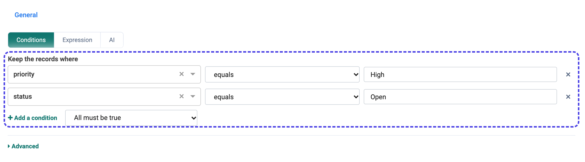

**Expression** - one line of Python-style logic over ``item``, for rules a row
of conditions cannot say::

   (item["priority"] == "High") and (item["status"] == "Open")

**AI** - describe the records to keep in plain words. A model reads each record
and keeps the ones that match. Use it when the rule is about meaning ("the
customer is waiting on money"), not about a field's value.

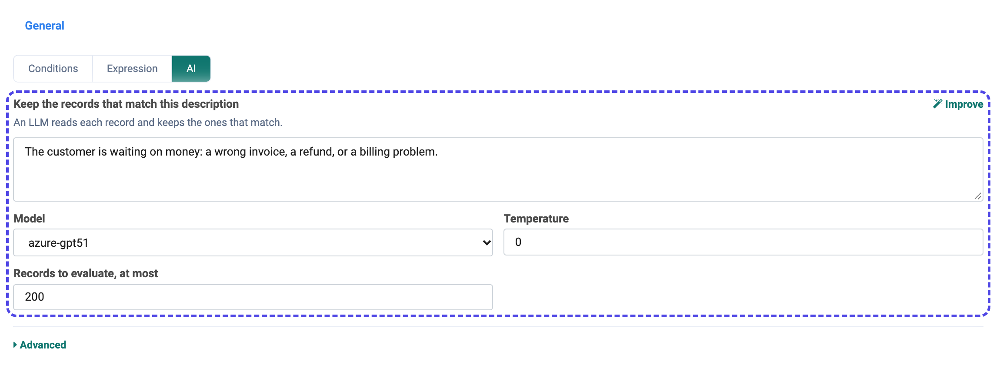

   **Improve** rewrites your description into a sharper one. **Records to evaluate, at most** caps the cost.

Sort
----

The first row decides the order; the rows below break ties. Each row is
**Low to high** or **High to low**.

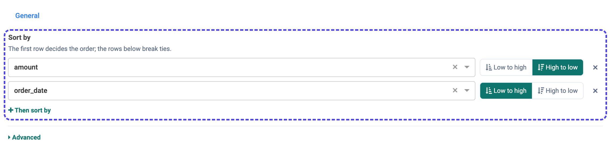

Limit
-----

Keeps the first **Max Items** records. Put it after a Sort for "the five biggest
orders", or before a Loop to keep a test run small.

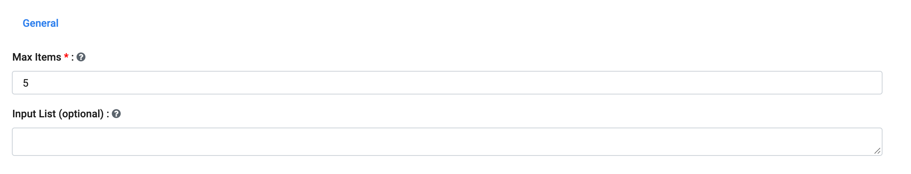

Set Fields
----------

Reshape each record in one place:

* **Add or change fields** - text as typed (``${...}`` references work), or a
  value starting with ``=`` that is worked out from each record, such as
  ``=amount * 1.18``.
* **Rename fields** - ``customer`` becomes ``client``.
* **Remove fields** - drop what the next system must not see, such as ``email``.
* **Keep only** - the opposite: name the fields to keep and drop everything
  else.

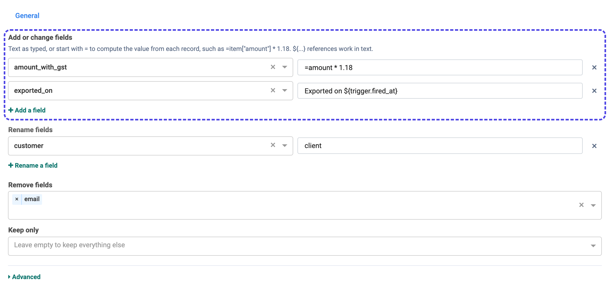

Remove Duplicates
-----------------

Records are duplicates when the fields you pick match - here, the same
``email``. Leave the box empty to compare whole records. Then choose **Keep the
first one** or **Keep the last one** of each group.

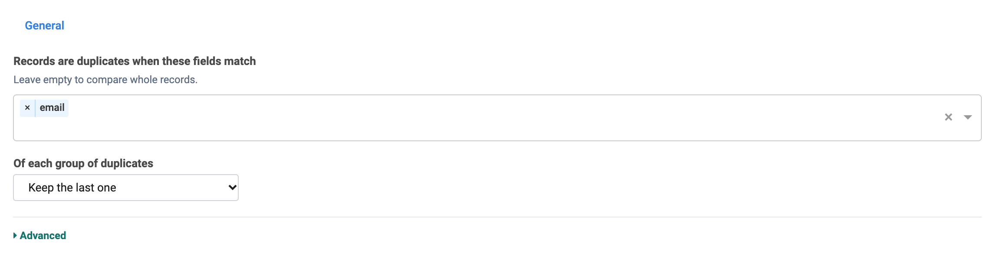

Summarize
---------

**Group by** gives one result row per value (leave it empty for one row over
everything). Each **Result** adds a column: **Count rows**, **Count values of**,
**Count distinct values of**, **Sum of**, **Average of**, **Smallest**,
**Largest**, **First value of**, **Last value of**, **List of values of**, or a
**Custom expression**.

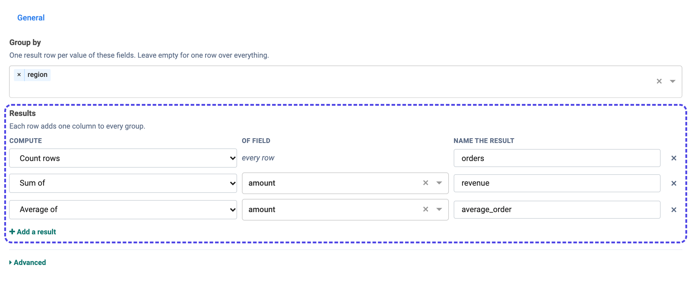

A Summarize with no group returns one record, so a later step can use
``${4.revenue}`` directly in a prompt or an email.

Split Out
---------

One record holds a list - an order's ``items``, a ticket's ``tags``. Split Out
makes one record per value. Lists, JSON arrays and text separated by a
character (``,``) all work. Tick **Keep the record's other fields** so each new
record still knows which order it came from.

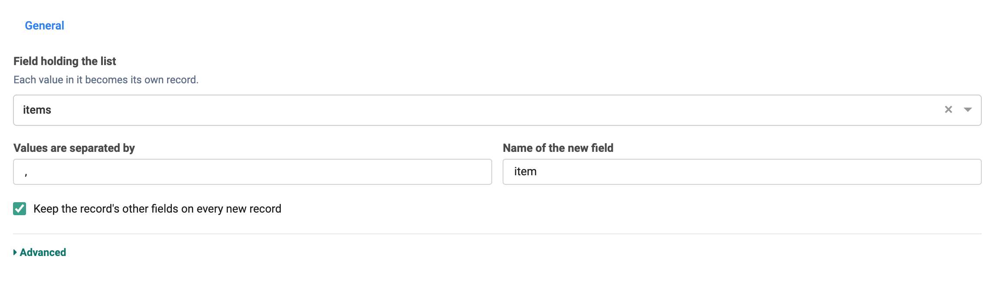

Merge
-----

Merge has **two inputs** and runs once both have arrived. Wire the first set
into the top port and the second into the bottom one.

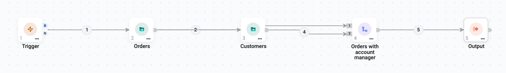

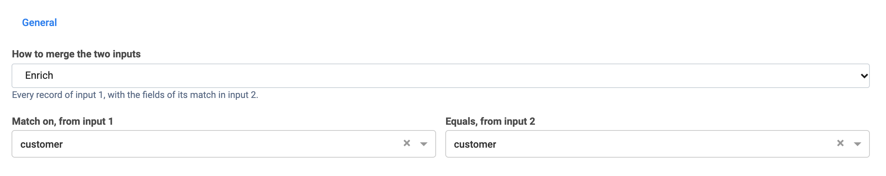

.. list-table::
   :header-rows: 1
   :widths: 24 76

   * - Mode
     - Result
   * - **Append**
     - Input 2's records under input 1's.
   * - **Combine**
     - Only the records found in both, with the fields of both.
   * - **Enrich**
     - Every record of input 1, plus the fields of its match in input 2.
   * - **Keep matches**
     - The records of input 1 that have a match in input 2.
   * - **Remove matches**
     - The records of input 1 that have *no* match - "which of these leads are
       not in the CRM yet?"

The left panel has a tab per input, so you can pick the match field from each.

Loop Over Items
---------------

Runs a few steps once for each record - draft a reply for each urgent ticket,
read each file in a folder. It has two outlets:

* **L** (loop) - each round's records go here. Wire the steps that should run
  per record, and wire the **last** of them back into the Loop node.
* **D** (done) - after the last round, everything the rounds produced comes out
  here. Wire what should happen afterwards.

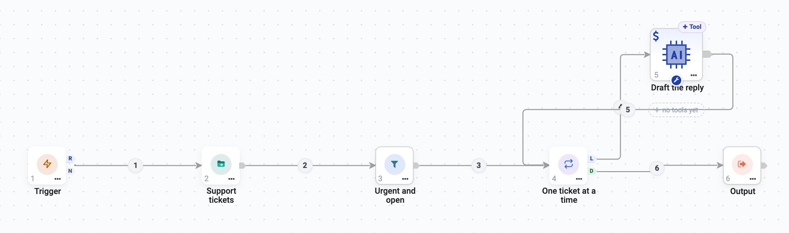

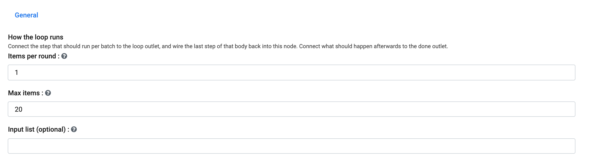

.. list-table::
   :header-rows: 1
   :widths: 30 70

   * - Setting
     - What it does
   * - **Items per round**
     - ``1`` for one record at a time; more to hand a small batch to each round.
   * - **Max items**
     - A safety cap. The default is 200 and the most is 1000 - a whole table
       belongs in a workflow.
   * - **Input list (optional)**
     - Loop over a list from an earlier step, such as ``${2.items}``, instead
       of the records wired in.

Inside the loop each round also gets ``index``, ``total``, ``remaining`` and
``is_last`` (see :ref:`passing-data-loop`).

.. tip::

   Put a **Limit** before the Loop while you build. Five records loop in
   seconds; five hundred calls to a model do not.
