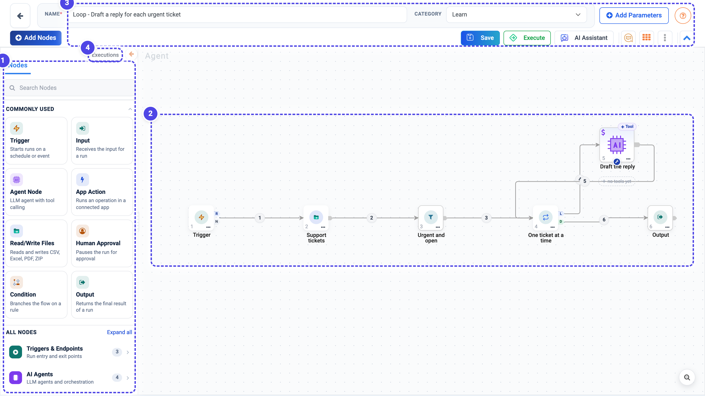
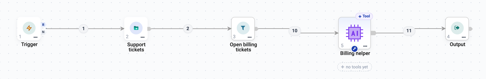

Agent Orchestration
===================

Agent Orchestration is the canvas. You use it when a process has structure of its
own - branches, approvals, several specialists, or steps that must happen in a
fixed order.

If a single well-instructed agent with a few tools would do, build it in
:doc:`/agentic-ai-guide/building-agents/agent-studio` instead. Use the canvas when you can say
*"and then, depending on X..."* about your process.

.. contents:: On this page
   :local:
   :depth: 1

Opening the canvas
------------------

From the **Agents** page, click **Create Agents** > **Agent Orchestration**.

.. list-table::
   :header-rows: 1
   :widths: 25 75

   * - Area
     - What it is for
   * - **1. Nodes** panel
     - Every node you can place: **Commonly used** tiles on top, then six groups.
       Searchable. The arrow at its top right folds it away for more canvas.
   * - **2. Canvas**
     - Your flow. Nodes are numbered in execution order; a small **$** marks a
       node whose settings use ``${...}`` values.
   * - **3. Toolbar**
     - Name, Category, Add Parameters, Add Nodes, Save, Execute, AI Assistant.
   * - **4. Executions**
     - Past runs of this agent.

The node palette
----------------

.. list-table::
   :header-rows: 1
   :widths: 22 42 36

   * - Group
     - Nodes
     - Purpose
   * - **Triggers & Endpoints**
     - Trigger, Input, Output
     - Where the run starts and finishes.
   * - **AI Agents**
     - Agent Node, Saved Agent, Supervisor, A2A Agent
     - The thinking parts.
   * - **Integrations**
     - App Action, Read/Write Files, Email Notification, Read Email, REST API
       Client, Workflow Execution, MCP Tool
     - Reaching apps, files, APIs, workflows and other agents.
   * - **Control Flow**
     - Human Approval, Human Input, Condition, Router, Guardrails
     - Branching, review and safety.
   * - **Data Transformation**
     - Filter, Sort, Limit, Set Fields, Merge, Loop Over Items, Summarize,
       Remove Duplicates, Split Out, Code
     - Shaping records between steps without a model call.
   * - **Documentation**
     - Sticky Note
     - Explaining the flow to whoever opens it next.

.. figure:: ../../_assets/agentic-ai-guide/orchestration/node-palette.png
   :alt: The Nodes panel with the Commonly used tiles and the six groups
   :width: 300px

Every node is described on :doc:`/agentic-ai-guide/node-reference`.

Building a flow
---------------

#. **Start with a Trigger.** Say how the run starts - by hand, on a schedule,
   or when something happens - and give the message a ready-made test value.
   See :doc:`/agentic-ai-guide/triggers-automation/triggers`.
#. **Add nodes** from the palette in the order the work happens - click a node
   to add it, or drag it where you want it.
#. **Connect them** by dragging from one node's output anchor to the next node's
   input.
#. **Double-click any node** to configure it. The **What arrives here** panel on
   its left shows the fields you can use - see
   :doc:`/agentic-ai-guide/agent-orchestration/passing-data`.
#. **Finish with Output.** Every path - including rejection paths - should reach
   one.
#. **Click Execute** to run, and **Save** to keep it.

.. tip::

   Add a **Sticky Note** under each stage explaining what it does and how to
   try it. It is the difference between a canvas a colleague can pick up and
   one they have to reverse-engineer.

Reusing an agent you already built
----------------------------------

You do not have to rebuild work. **Saved Agent**, under **AI Agents** in the
palette, adds a copy of any agent saved in this project - its instructions,
model, knowledge and tools come with it.

.. figure:: ../../_assets/agentic-ai-guide/orchestration/saved-agent-picker.png
   :alt: The Add a saved agent picker with a search box listing Billing helper
   :width: 316px

**Agent Node** in the palette always adds a new, empty agent.

This is the normal way to work: build and test a single agent in
:doc:`Agent Studio </agentic-ai-guide/quick-start/first-agent>` where it is easy to iterate,
then reuse it on the canvas once it behaves.

   The saved **Billing helper** agent, added to a process that reads the open billing tickets.

.. note::

   The node is a **copy**, not a live link. Editing the saved agent afterwards
   does not change orchestrations that already used it, and editing the node
   does not change the saved agent. That stops an edit in one place quietly
   breaking a process somewhere else - but a genuine fix has to be applied in
   both.

The Agent Node
--------------

An Agent Node is one LLM call. It carries its own model settings, its own
prompt and its own tools - a node's tools are not shared with its neighbours.

Double-click it and the configuration opens on six tabs, with the records that
reach it on the left.

.. figure:: ../../_assets/agentic-ai-guide/nodes/agent-llm.png
   :alt: Agent Node execution settings for temperature, token limit, timeout, tool rounds and output format
   :width: 100%

.. list-table::
   :header-rows: 1
   :widths: 22 78

   * - Tab
     - What you set there
   * - **LLM Configuration**
     - Connection, Temperature, Top P, Max Tokens, Timeout, **Max Tool
       Rounds**, and Output Format (``text``, or ``json`` with a schema).
   * - **Agent Instruction**
     - What this node does, plus its ``AGENTS.md`` source.
   * - **Workflow Configuration**
     - Saved workflows this node may run - see
       :doc:`/agentic-ai-guide/tools-integrations/workflows-as-tools`.
   * - **Context**
     - Additional standing context for this node.
   * - **Skills Registry**
     - Reusable ``.md`` rules from **this project's** registry - see
       :doc:`/agentic-ai-guide/building-agents/skills`.
   * - **MCP Registry**
     - Tools from MCP servers - see :doc:`/agentic-ai-guide/tools-integrations/mcp-servers`.

.. tip::

   **Max Tool Rounds** decides how many times the node may call a tool and
   think again before it must answer. Too low and an agent needing three
   lookups gives up after one; too high and a confused agent loops
   expensively. Three to eight suits most jobs.

Writing the instruction
~~~~~~~~~~~~~~~~~~~~~~~

Give each node **one job**, and - when something downstream has to branch on
the result - ask for ``json`` with a schema, so each field reaches the next node
on its own. Inside a loop, name the current record with ``${...}`` references:

.. figure:: ../../_assets/agentic-ai-guide/nodes/agent-instruction.png
   :alt: Agent Instruction that drafts a reply for ${4.fields.ticket_id} and returns JSON with ticket_id, customer and reply
   :width: 100%

The same idea works with plain text markers - here from a purchase-order
approver:

.. code-block:: text

   Call po_fetch ONCE using the po_id from your context. Read the tool
   result. Reply with EXACTLY four lines:
   Line 1: a one-sentence summary (po_id, vendor, amount, department).
   Line 2 (literal): 'po_found=' followed by 'true' or 'false'.
   Line 3 (literal): 'high_value=' followed by 'true' if po_amount >= 10000
   else 'false'.
   Line 4 (literal): 'has_contract=' followed by 'true' or 'false' from the
   tool result.
   DO NOT add other lines. The markers drive downstream routing.

That is the shipped Purchase Order Approver. The node calls one tool once, then
emits machine-readable markers; the Condition after it tests
``'high_value=true' in analysis``. Two nodes doing one clear thing each beats
one node asked to do both, because you can read the intermediate result and see
which half went wrong.

Adding tools to a node
~~~~~~~~~~~~~~~~~~~~~~

Use the **+ Tool** chip on the node, or **Add tools** in the Tools group. For
each tool you also decide **who supplies each argument** - the agent at call
time, or a fixed value you pin. See :doc:`/agentic-ai-guide/tools-integrations/tools-connectors`.

The Supervisor node
-------------------

A Supervisor is an agent whose job is delegation. Its LLM looks at the request
and delegates to one - or a few - of the agent nodes wired to it. **Only the
chosen specialists run.**

.. figure:: ../../_assets/agentic-ai-guide/orchestration/supervisor.png
   :alt: A Supervisor with four specialist Agent Nodes wired to its delegate port as dashed wires D1 to D4
   :width: 85%

Wiring it
~~~~~~~~~

Drag from the Supervisor's **delegate port** to each specialist. Those wires are
dashed and numbered **D1**, **D2** ..., and the chips under the node list who it
can call. The specialists' own outputs then continue to whatever runs after
them - here, the Output.

Configuration
~~~~~~~~~~~~~

.. list-table::
   :header-rows: 1
   :widths: 25 75

   * - Tab
     - Contains
   * - **LLM Configuration**
     - Connection, temperature, top P, max tokens.
   * - **Supervisor Instruction**
     - The instruction - what the Supervisor is coordinating, and what each
       specialist is good at.
   * - **Skills Registry**
     - Skills applied to the Supervisor itself. See
       :doc:`/agentic-ai-guide/building-agents/skills`.

.. important::

   The Supervisor can only delegate well if its prompt says what each specialist
   is **for**. Naming them is not enough - describe the cases each one handles.
   A Supervisor that picks badly is almost always a Supervisor that was never
   told the difference between its options.

Supervisor or Router?
~~~~~~~~~~~~~~~~~~~~~

Both send work to one of several destinations, and they are not
interchangeable.

.. list-table::
   :header-rows: 1
   :widths: 50 50

   * - Use a **Router**
     - Use a **Supervisor**
   * - Plain semantic N-way routing
     - Delegation that may rewrite the query for the specialist
   * - One route is taken
     - One *or a few* specialists may run
   * - The destinations are alternatives
     - The destinations are collaborators

If you only need to sort a request into one of several lanes, use a
:doc:`Router </agentic-ai-guide/agent-orchestration/control-flow>` - it is simpler and cheaper.
Reach for a Supervisor when the coordination itself needs judgement.

When a fixed path is better than either
~~~~~~~~~~~~~~~~~~~~~~~~~~~~~~~~~~~~~~~

If you already know the order the specialists should run in, wire them in that
order. A fixed process is easier to test, easier to audit, and cheaper to run
than one that re-decides its own shape on every request.

The A2A Agent node
------------------

**A2A Agent** (agent-to-agent) calls another agent as a step in this one. Use it
to reuse an agent you have already built and tested rather than copying its logic
into a new node.

Parameters
----------

**Add Parameters** in the toolbar defines values the whole flow can read -
thresholds, environment names, endpoints. Put your approval threshold here rather
than typing ``10000`` into a Condition, and you can change it in one place
instead of hunting through nodes.

Testing an orchestration
------------------------

Build and test **incrementally**. Place Input, one Agent Node and Output, and run
it. Confirm that works, then insert the next node. The alternative - laying out
twelve nodes and pressing Execute - tells you only that something, somewhere,
failed.

Use the **Executions** tab to inspect past runs: the inputs, the path taken, the
tool calls made, and any approvals.

Next: the nodes themselves
--------------------------

:doc:`/agentic-ai-guide/safety-guardrails/human-in-the-loop` covers approvals, and
:doc:`/agentic-ai-guide/agent-orchestration/control-flow` the branching nodes that decide which cases
reach them.
