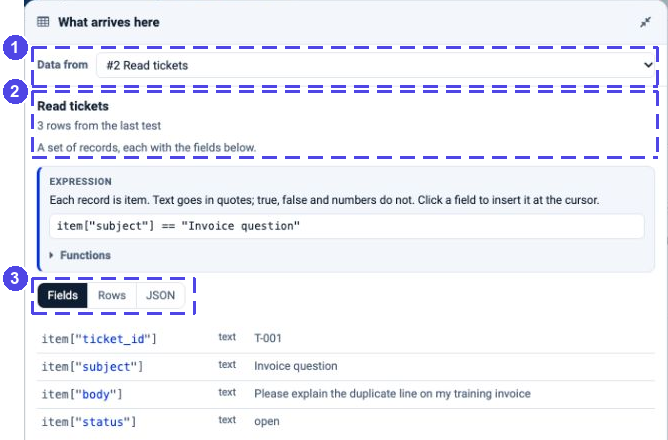
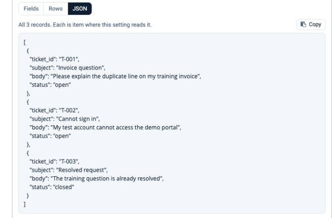

Passing Data Between Steps
==========================

Every step on the canvas hands records to the step after it. This page shows
how to see those records, and how to use a value from an earlier step in a
setting - without typing field names or ``${...}`` references by hand.

.. contents:: On this page
   :local:
   :depth: 1

What arrives here
-----------------

Open a step and inspect **What arrives here**. Use **Data from** to choose
the connected input or an earlier node. Here a Filter receives three
fictional tickets read from the tutorial's CSV file. **Enlarge** opens the
panel so its fields are easier to read:

   **1** Choose the source. **2** Check where the displayed data came from.
   **3** Switch between Fields, Rows and JSON. The example fields are written
   as ``item["field"]`` because this Filter is in Expression mode.

The line under the step's name says where the fields come from:

.. list-table::
   :header-rows: 1
   :widths: 36 64

   * - It says
     - Meaning
   * - **rows from the last run**
     - Real records from the last time the agent ran.
   * - **rows from the last test**
     - Records from **Load the fields** or **Fetch a sample** in an earlier
       step.
   * - **inferred from the upstream nodes**
     - Nothing has run yet; the fields are worked out from the steps before,
       such as an Agent Node's JSON schema or the fields a Set Fields adds.

Choose the view that answers your question:

* **Fields** - one line per field, with its type and a sample value.
* **Rows** - the records as a table.
* **JSON** - all records currently held by the panel, not just the first.
  Read the caption: a saved sample may contain fewer records than the
  dataset. **Copy** copies the displayed JSON.
* **Run output** - available when that node has a saved output from the
  agent's latest run. It shows the saved output structure, including nested
  objects and metadata, rather than just the record fields.

   These are the three records before filtering. The presence of the closed
   ticket here does not mean the Filter will keep it.

Click a long value to read it in full. In **Run output**, expand objects and
lists to inspect their contents; use **Show all** when more entries are
available. **Back to the dialog** returns from the enlarged view.

**A schema is not a result.** An inferred field tells you the expected shape,
not whether the current connection can read the table or the model will
return a valid value. Test the relevant read after changing its table,
columns or file, then inspect the downstream mappings again.

Selecting an earlier node only changes what the panel displays. It does not
connect a wire, execute that node or change which records arrive here.

**Run inputs**, at the bottom of the panel, holds the values every step can
read whatever is wired before it: the message (``userQuery``) and the named
values of the :doc:`Trigger </agentic-ai-guide/triggers-automation/triggers>`.

When testing a REST API Client, the request can use an Input-node sample or a
value from the latest run to fill a reference such as
``${inputs.access_token}``. A runtime-only token is sent with the request, but
is not displayed or saved in the test sample. Treat it as a real credential:
send it only to the intended trusted endpoint.

Click a field instead of typing it
----------------------------------

Click in a setting, then click a field in the panel. The field goes in at the
cursor, written the way *that* setting expects it. The blue box at the top of
the panel says which form the current setting uses, with an example you can
click.

In a Filter expression each record is ``item``, so a field is offered as
``item["status"]``. When a setting cannot read an earlier node directly, the
panel explains that it is **Read only**; inspecting a value does not insert
an unsupported expression. Use a Code node or a suitable Set Fields mapping
when earlier output needs to become part of the arriving record.

The same field is written differently depending on where it goes:

.. list-table::
   :header-rows: 1
   :widths: 34 36 30

   * - Setting
     - The field is written
     - Why
   * - Prompts, messages, file paths, app fields
     - ``${4.fields.total}`` for a field, ``${3.items}`` for an inline record set
     - Filled in when the step runs.
   * - Filter expression
     - ``item["priority"]``
     - Each record is ``item``.
   * - Set Fields value starting with ``=``
     - ``=item["amount"] * 1.18``
     - Worked out for every record.
   * - Code, Python
     - ``item["priority"]``, ``inputs["userQuery"]``
     - ``main`` receives dictionaries.
   * - Code, JavaScript
     - ``item.priority``
     - Plain objects.
   * - Condition
     - ``priority``
     - The rule reads the run by name.
   * - Agent instructions, AI Filter description
     - ``priority``
     - The records reach the model already.
   * - Field pickers (Sort by, Group by, Key)
     - ``priority``
     - Goes straight into the picker.

References: ``${step.field}``
-----------------------------

A reference is how a setting names a value from an earlier step. It is the
step's number on the canvas, a dot, and the field:

.. list-table::
   :header-rows: 1
   :widths: 34 66

   * - Reference
     - Reads
   * - ``${2.result_id}``
     - ``result_id`` from step 2 - for example the id of the spreadsheet step 2
       created.
   * - ``${10.analysis}``
     - The answer of the Agent Node numbered 10.
   * - ``${5.key}``
     - The ``key`` of the current record of Loop Over Items step 5.
   * - ``${3.items}``
     - Step 3's inline record list. Large dataset-backed outputs may keep
       only a sample in the run state; use the dataset-aware flow instead
       of assuming the full table is inline.
   * - ``${inputs.file_name}``
     - A named value from the Trigger or the REST request.
   * - ``${event.path}``
     - A field of the record that started an event Trigger.

A field reference reads one value, typically from the first record. It does
not apply the setting to every record in a larger result. Use the panel's
offered path and check the actual output structure: ``items`` is a record
list, ``fields`` holds first-record values, and ``rows`` can be a numeric
row count. Do not use ``${3.rows}`` as a universal reference to a record list.

An Agent Node's answer uses ``analysis``; a REST answer can use
``response_json`` or extracted records. The **Run output** tree helps you
choose the correct path instead of guessing it.

Under a setting that holds a reference, a green line reads it back in words, so
you can check it without counting steps:

.. figure:: ../../_assets/agentic-ai-guide/passing-data/uses-line.png
   :alt: Under the Spreadsheet setting holding ${2.result_id}, the line reads Uses result_id from node 2
   :width: 664px

.. note::

   The underlying placeholder resolver can leave an unmatched reference
   unchanged. App Actions check for these unresolved references and fail
   before calling the app. If a value remains ``${7.summary}``, check that
   step 7 ran on this branch and actually returned ``summary``. Do not
   remove the error check or treat the placeholder as a valid value.

.. _passing-data-loop:

Inside a loop
-------------

A step inside **Loop Over Items** receives one batch at a time. Set **Items
per round** to ``1`` when each customer or ticket needs its own lookup or
answer. The Loop also exposes ``index``, ``batch_number``, ``total``,
``remaining`` and ``is_last``. ``index`` is zero-based; do not present it as
a one-based ticket number without converting it.

Keep the original record's identifier when attaching a model's answer. The
**D** output is the collected result after the Loop finishes, not the last
Agent Node's answer. See the :doc:`ticket-triage walkthrough
</agentic-ai-guide/end-to-end-examples/ticket-triage>` for that complete pattern.

See what each step did
----------------------

After a run, the **Execution Timeline** under the result lists every step with a
one-line summary. Data steps count real rows - *Kept 6 of 24 rows* - and
**Show data** opens the records the step passed on.

.. figure:: ../../_assets/agentic-ai-guide/passing-data/run-timeline.png
   :alt: The Execute page after a run: the table of six urgent open tickets and the Execution Timeline with Trigger, Support tickets, Urgent and open (Kept 6 of 24 rows) and Output
   :width: 100%

Those same records then appear in every later step's **What arrives here** as
*rows from the last run*.
