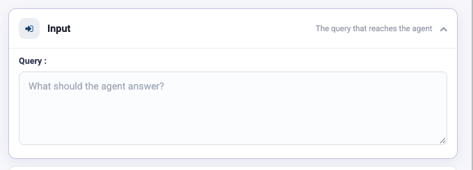
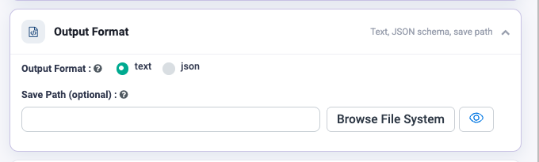
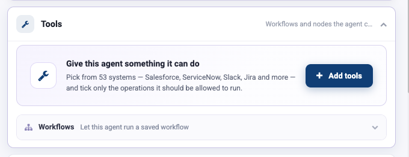
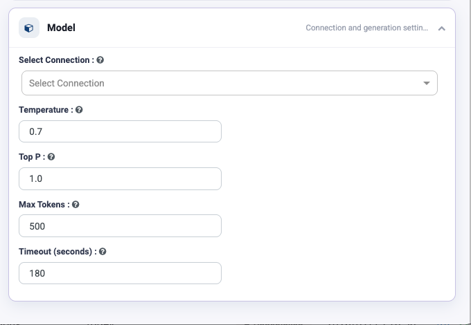

Agent Studio Reference
======================

Agent Studio is the form-based way to build a single agent. This page documents
every field on it, in the order the screen presents them.

If you have not built an agent yet, do
:doc:`/agentic-ai-guide/quickstart` first — it walks the same screen with a real
example.

The screen
----------

.. figure:: ../_assets/agentic-ai-guide/agent-studio/overview.png
   :alt: Agent Studio with both panels and the nine configuration groups labelled
   :width: 90%

   Left: who the agent is. Right: what it may do, in nine collapsible groups.

+----------------------------+-------------------------------------------------+
| Top bar                    | What it does                                    |
+============================+=================================================+
| **Name your agent**        | The name shown in the agents list. Required.    |
+----------------------------+-------------------------------------------------+
| **Cancel**                 | Discards the agent without saving.              |
+----------------------------+-------------------------------------------------+
| **Run**                    | Executes the agent with the current Input query |
|                            | so you can test before saving.                  |
+----------------------------+-------------------------------------------------+
| **Create Agent**           | Saves the agent into the project.               |
+----------------------------+-------------------------------------------------+

The left panel: behaviour
-------------------------

Description
~~~~~~~~~~~

A one-line summary shown in the agents list. Write it for the colleague who has
to work out, a year from now, whether this agent is the one they want.

Category
~~~~~~~~

Optional grouping label — ``Procurement``, ``IT Service Desk``, ``Legal``. It has
no effect on behaviour and every effect on whether anyone can find the agent
later.

Instructions
~~~~~~~~~~~~

The system prompt. It drives **every** LLM call the agent makes.

Keep it to a single clear statement of what the agent is and how it should
behave. Everything else — skills, MCP servers, knowledge, AGENTS.md — has its own
group, so it does not belong here.

* **Improve** rewrites your draft into a fuller prompt. Treat the result as a
  first draft to edit, not as finished text.
* The character count next to it is a useful smell test. Under about 100
  characters and you have probably not said enough to get consistent behaviour.

.. note::

   To split work across several specialist agents, do not describe all of them in
   one Instructions box. Use the **Supervisor** node on the orchestration canvas
   instead — see :doc:`/agentic-ai-guide/multi-agent-orchestration`.

The right panel: nine configuration groups
------------------------------------------

Groups are collapsed until you need them. The summary text on each closed header
tells you what it controls.

.. list-table::
   :header-rows: 1
   :widths: 22 38 40

   * - Group
     - Controls
     - Detailed page
   * - **Input**
     - The query that reaches the agent
     - below
   * - **Output Format**
     - Text, JSON schema, save path
     - below
   * - **Knowledge**
     - Grounding answers in your documents
     - :doc:`/agentic-ai-guide/rag-knowledge`
   * - **Tools**
     - Connectors, built-in tools and workflows the agent may call
     - :doc:`/agentic-ai-guide/tools-actions`
   * - **Skills**
     - Reusable ``.md`` instructions from the registry
     - :doc:`/agentic-ai-guide/skills`
   * - **MCP Servers**
     - Actions from connected MCP servers
     - :doc:`/agentic-ai-guide/mcp-servers`
   * - **Context**
     - ``AGENTS.md`` project instructions
     - :doc:`/agentic-ai-guide/context-agents-md`
   * - **Guardrails**
     - Checks applied to the query before the agent runs
     - :doc:`/agentic-ai-guide/security-guardrails`
   * - **Model**
     - Connection and generation settings
     - :doc:`/agentic-ai-guide/models-prompts`

Input
~~~~~

A single **Query** box: what the agent should answer.

When you click Run, this is the query used. When the agent is called for real —
from an app, a schedule, or the REST API — the caller supplies the query and this
value is the stand-in you tested with. Keep a realistic example here; it is the
fastest regression test you have.

Output Format
~~~~~~~~~~~~~

Controls the shape of the answer.

.. list-table::
   :header-rows: 1
   :widths: 25 75

   * - Setting
     - Use it when
   * - **Text**
     - A person reads the answer. The default.
   * - **JSON schema**
     - Something downstream parses the answer. Define the schema and the model is
       held to it.
   * - **Save path**
     - The result should be written to a file as well as returned.

.. tip::

   If an agent feeds another node, a workflow, or an API caller, use JSON schema.
   Parsing prose is where agent pipelines break.

Knowledge
~~~~~~~~~

Grounds the agent in your documents instead of the model's memory. Point it at a
document source or a vector index, and retrieved passages are placed in front of
the model before it answers.

Full configuration — sources, embedding model, chunk size, top-K and reranking —
is on :doc:`/agentic-ai-guide/rag-knowledge`.

Tools
~~~~~

Two things live here.

**Add tools** opens the picker: 53 connectors, 37 built-in tools, and the
connections already configured in your workspace. Each connector is one node that
expands into as many named operations as you tick.

**Workflows** lets the agent run a saved workflow as a tool — the way to give an
agent logic that is easier to express as a pipeline than as a prompt.

Both are covered on :doc:`/agentic-ai-guide/tools-actions` and
:doc:`/agentic-ai-guide/workflows-as-tools`.

Skills
~~~~~~

Reusable instruction files. **Upload Skills (.md)** saves a Markdown file to the
registry and attaches it in one step; **Fetch Skills** picks from what is already
there.

Use skills for rules that several agents share — a house style, a calculation
convention, a document-reading procedure.

The registry is **scoped to the project**: you see the skills uploaded here,
and no others. See :doc:`/agentic-ai-guide/skills`.

MCP Servers
~~~~~~~~~~~

Connect a Model Context Protocol server and choose which of its tools become this
agent's actions. See :doc:`/agentic-ai-guide/mcp-servers`.

Context
~~~~~~~

**AGENTS.md Source** has three settings:

.. list-table::
   :header-rows: 1
   :widths: 15 85

   * - Option
     - Meaning
   * - ``none``
     - No AGENTS.md is applied. The default.
   * - ``path``
     - Read the file from a path, so one file governs many agents.
   * - ``inline``
     - Paste the content directly onto this agent.

See :doc:`/agentic-ai-guide/context-agents-md` for what belongs in the file.

Guardrails
~~~~~~~~~~

Checks the query **before the agent sees it**. A blocked request never reaches
the model — the refusal goes back instead.

Click **Add guardrails** to configure them. See
:doc:`/agentic-ai-guide/security-guardrails`.

Model
~~~~~

.. list-table::
   :header-rows: 1
   :widths: 25 75

   * - Field
     - Notes
   * - **Select Connection**
     - Which LLM provider connection to use. Required.
   * - **Temperature**
     - ``0`` – ``1``. Default ``0.7``. Lower for extraction and classification,
       higher for drafting.
   * - **Top P**
     - Nucleus sampling. Default ``1.0``. Leave it alone and tune Temperature
       instead — moving both at once makes results hard to reason about.
   * - **Max Tokens**
     - Ceiling on the response length. Default ``500``, which is short: raise it
       for anything that drafts or summarises at length, or answers get cut off
       mid-sentence.
   * - **Timeout (seconds)**
     - How long a single call may take before it fails. Default ``180``.

Next: put the agent to work
---------------------------

Give the agent something real to do:
:doc:`/agentic-ai-guide/tools-actions`.
