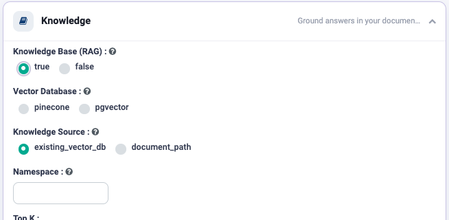
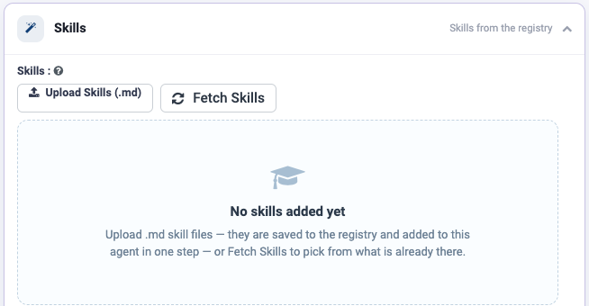
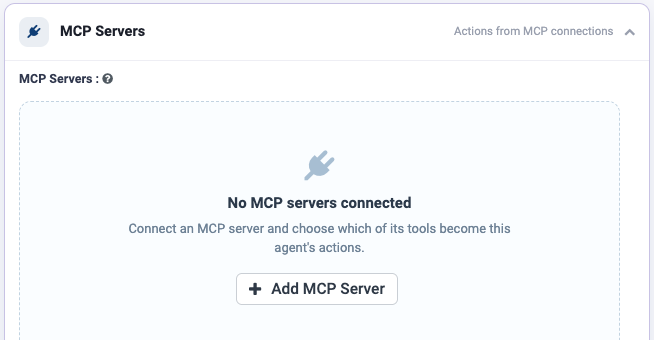
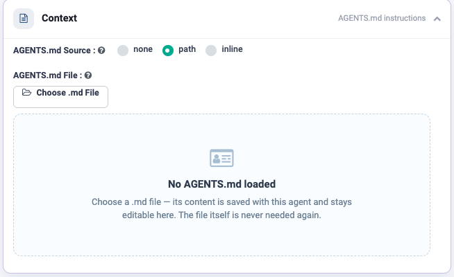
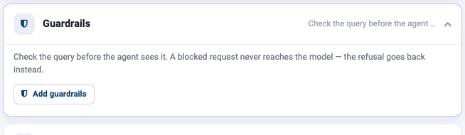
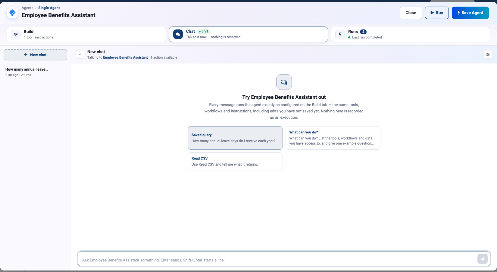
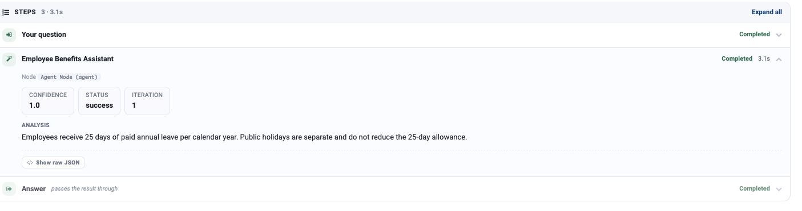

Agent Studio Reference
======================

Agent Studio is the form-based way to build a single agent. This page documents
every field on it, in the order the screen presents them.

If you have not built an agent yet, do
:doc:`/agentic-ai-guide/quickstart` first - it walks the same screen with a real
example.

The screen
----------

.. figure:: ../_assets/agentic-ai-guide/agent-studio/overview.png
   :alt: A new agent in Agent Studio with the Build, Chat and Runs tabs across the top
   :width: 100%

   A new agent. Left: who the agent is. Right: what it may do, in collapsible
   configuration groups.

Across the top are three tabs. You move between them as you work - build
something, try it, then run it for real.

.. list-table::
   :header-rows: 1
   :widths: 16 34 50

   * - Tab
     - Shows
     - Use it to
   * - **Build**
     - Instructions, tools, model
     - Configure the agent. Everything on this page below is on this tab. The
       caption keeps a running count, such as *1 tool · instructions*.
   * - **Chat**
     - *Talk to it now - nothing is recorded*
     - Try the agent in a conversation while you build. See
       :ref:`agent-studio-chat`.
   * - **Runs**
     - The count of real runs and how the last one ended
     - Execute the agent properly and read what it did. See
       :ref:`agent-studio-runs`.

+----------------------------+-------------------------------------------------+
| Top bar                    | What it does                                    |
+============================+=================================================+
| **Name your agent**        | The name shown in the agents list. Required.    |
+----------------------------+-------------------------------------------------+
| **Close**                  | Leaves Agent Studio. Unsaved changes are lost.  |
+----------------------------+-------------------------------------------------+
| **Run**                    | Executes the agent with the current Input query |
|                            | and opens the result on the **Runs** tab.       |
+----------------------------+-------------------------------------------------+
| **Create Agent** /         | Saves the agent into the project. The button    |
| **Save Agent**             | says *Create* the first time and *Save* after.  |
+----------------------------+-------------------------------------------------+

The left panel: behaviour
-------------------------

Description
~~~~~~~~~~~

A one-line summary shown in the agents list. Write it for the colleague who has
to work out, a year from now, whether this agent is the one they want.

Category
~~~~~~~~

Optional grouping label - ``Procurement``, ``IT Service Desk``, ``Legal``. It has
no effect on behaviour and every effect on whether anyone can find the agent
later.

Instructions
~~~~~~~~~~~~

The system prompt. It drives **every** LLM call the agent makes.

Keep it to a single clear statement of what the agent is and how it should
behave. Everything else - skills, MCP servers, knowledge, AGENTS.md - has its own
group, so it does not belong here.

* **Improve** rewrites your draft into a fuller prompt. Treat the result as a
  first draft to edit, not as finished text.
* The character count next to it is a useful smell test. Under about 100
  characters and you have probably not said enough to get consistent behaviour.

.. note::

   To split work across several specialist agents, do not describe all of them in
   one Instructions box. Use the **Supervisor** node on the orchestration canvas
   instead - see :doc:`/agentic-ai-guide/multi-agent-orchestration`.

The right panel: configuration groups
-------------------------------------

Groups are collapsed until you need them. The summary text on each closed header
tells you what it controls.

.. list-table::
   :header-rows: 1
   :widths: 22 38 40

   * - Group
     - Controls
     - Detailed page
   * - **Input**
     - The query that reaches the agent
     - below
   * - **Output Format**
     - Text, JSON schema, save path
     - below
   * - **Knowledge**
     - Grounding answers in your documents
     - :doc:`/agentic-ai-guide/rag-knowledge`
   * - **Tools**
     - Connectors, built-in tools and workflows the agent may call
     - :doc:`/agentic-ai-guide/tools-actions`
   * - **Skills**
     - Reusable ``.md`` instructions from the registry
     - :doc:`/agentic-ai-guide/skills`
   * - **MCP Servers**
     - Actions from connected MCP servers
     - :doc:`/agentic-ai-guide/mcp-servers`
   * - **Context**
     - ``AGENTS.md`` project instructions
     - :doc:`/agentic-ai-guide/context-agents-md`
   * - **Guardrails**
     - Checks applied to the query before the agent runs
     - :doc:`/agentic-ai-guide/security-guardrails`
   * - **Model**
     - Connection and generation settings
     - :doc:`/agentic-ai-guide/models-prompts`

Input
~~~~~

A single **Query** box: what the agent should answer.

When you click Run, this is the query used. When the agent is called for real -
from an app, a schedule, or the REST API - the caller supplies the query and this
value is the stand-in you tested with. Keep a realistic example here; it is the
fastest regression test you have.

.. figure:: ../_assets/agentic-ai-guide/agent-studio/input.png
   :alt: The Input group with the test query filled in
   :width: 654px

Output Format
~~~~~~~~~~~~~

Controls the shape of the answer.

.. list-table::
   :header-rows: 1
   :widths: 25 75

   * - Setting
     - Use it when
   * - **Text**
     - A person reads the answer. The default.
   * - **JSON schema**
     - Something downstream parses the answer. Define the schema and the model is
       held to it.
   * - **Save path**
     - The result should be written to a file as well as returned.

.. tip::

   If an agent feeds another node, a workflow, or an API caller, use JSON schema.
   Parsing prose is where agent pipelines break.

.. figure:: ../_assets/agentic-ai-guide/agent-studio/output-format.png
   :alt: The Output Format group with Text selected and a Save Path field
   :width: 654px

Knowledge
~~~~~~~~~

Grounds the agent in your documents instead of the model's memory. Point it at a
document source or a vector index, and retrieved passages are placed in front of
the model before it answers.

Set **Knowledge Base (RAG)** to ``true`` and the retrieval fields appear -
the vector database, whether to search an existing index or point at documents,
the namespace and how many passages to pull back.

Full configuration - sources, embedding model, chunk size, top-K and reranking -
is on :doc:`/agentic-ai-guide/rag-knowledge`.

Tools
~~~~~

Two things live here.

**Add tools** opens the picker: external connectors, the built-in tools that
ship with the platform, and the connections already configured in your
workspace. Each connector is one node that expands into as many named operations
as you tick.

**Workflows** lets the agent run a saved workflow as a tool - the way to give an
agent logic that is easier to express as a pipeline than as a prompt.

Both are covered on :doc:`/agentic-ai-guide/tools-actions` and
:doc:`/agentic-ai-guide/workflows-as-tools`.

.. figure:: ../_assets/agentic-ai-guide/agent-studio/tools.png
   :alt: The Tools group with a Read CSV tool attached and the Workflows row below it
   :width: 654px

Skills
~~~~~~

Reusable instruction files. **Upload Skills (.md)** saves a Markdown file to the
registry and attaches it in one step; **Fetch Skills** picks from what is already
there.

Use skills for rules that several agents share - a house style, a calculation
convention, a document-reading procedure.

The registry is **scoped to the project**: you see the skills uploaded here,
and no others.

See :doc:`/agentic-ai-guide/skills`.

MCP Servers
~~~~~~~~~~~

Connect a Model Context Protocol server and choose which of its tools become this
agent's actions. **Add MCP Server** opens the picker; the tools you tick become
this agent's actions.

See :doc:`/agentic-ai-guide/mcp-servers`.

Context
~~~~~~~

**AGENTS.md Source** has three settings:

.. list-table::
   :header-rows: 1
   :widths: 15 85

   * - Option
     - Meaning
   * - ``none``
     - No AGENTS.md is applied. The default.
   * - ``path``
     - Read the file from a path, so one file governs many agents.
   * - ``inline``
     - Paste the content directly onto this agent.

With **path** or **inline**, the file's content loads into the panel so you can
see exactly what the agent will read.

See :doc:`/agentic-ai-guide/context-agents-md` for what belongs in the file.

Guardrails
~~~~~~~~~~

Checks the query **before the agent sees it**. A blocked request never reaches
the model - the refusal goes back instead.

Click **Add guardrails** to configure the checks - PII, prompt injection,
banned words and length.

See :doc:`/agentic-ai-guide/security-guardrails`.

Model
~~~~~

.. list-table::
   :header-rows: 1
   :widths: 25 75

   * - Field
     - Notes
   * - **Select Connection**
     - Which LLM provider connection to use. Required.
   * - **Temperature**
     - ``0`` to ``1``. Default ``0.7``. Lower for extraction and classification,
       higher for drafting.
   * - **Top P**
     - Nucleus sampling. Default ``1.0``. Leave it alone and tune Temperature
       instead - moving both at once makes results hard to reason about.
   * - **Max Tokens**
     - Ceiling on the response length. Default ``500``, which is short: raise it
       for anything that drafts or summarises at length, or answers get cut off
       mid-sentence.
   * - **Timeout (seconds)**
     - How long a single call may take before it fails. Default ``180``.

.. figure:: ../_assets/agentic-ai-guide/agent-studio/model.png
   :alt: The Model group with a connection selected and the generation settings below it
   :width: 652px

.. _agent-studio-chat:

Chat: try it as you build
-------------------------

The **Chat** tab lets you talk to the agent while you are still building it.
Every message runs the agent exactly as it is set up on **Build** - the same
instructions, tools and model, including edits you have not saved yet.

.. important::

   **Nothing on the Chat tab is recorded.** It does not create an execution, it
   does not count towards the **Runs** tab, and it does not show up on
   **Agents → Executions**. It is a scratchpad for getting the agent right.

When you open it, the agent offers a few starting points: the **Saved query**
from the Input group, *What can you do?*, and one suggestion for each tool it
has.

Type a question and press **Enter**. Ask a follow-up, then ask something the
agent should refuse - that last test is the one people forget.

.. figure:: ../_assets/agentic-ai-guide/agent-studio/chat-conversation.png
   :alt: A three-turn conversation: an answer from the FAQ, a follow-up, and a polite refusal for an out-of-scope question
   :width: 100%

   Two answers from the FAQ and one refusal. Each reply shows its status,
   duration and token count.

Click **3 steps** under a reply to see what the agent did to produce it - here,
one call to ``read_csv``.

.. figure:: ../_assets/agentic-ai-guide/agent-studio/chat-steps.png
   :alt: A chat reply expanded to show the Input, Agent Node, read_csv call and Output steps
   :width: 100%

Each reply has three buttons on the right:

.. list-table::
   :header-rows: 1
   :widths: 30 70

   * - Button
     - What it does
   * - **Copy**
     - Copies the answer.
   * - **Ask again**
     - Re-runs the same question - useful after you change the instructions.
   * - **Run this as a real execution**
     - Sends the question as a proper run, which *is* recorded and appears on
       the **Runs** tab.

.. tip::

   A banner reading *No model connection is selected, so this agent cannot
   answer yet* means the **Model** group is empty. Click **Choose one** in the
   banner to fix it.

.. _agent-studio-runs:

Runs: execute it for real
-------------------------

Click **Run** in the top bar, or **Run this as a real execution** on a chat
reply, and the agent executes properly. The result opens on the **Runs** tab,
and the run is kept - it counts towards the number on the tab and appears on
**Agents → Executions**.

.. figure:: ../_assets/agentic-ai-guide/agent-studio/runs-result.png
   :alt: The Runs tab showing two completed runs, the query, the result and the tool the agent used
   :width: 100%

.. list-table::
   :header-rows: 1
   :widths: 26 74

   * - Part
     - What it tells you
   * - **Runs** list, left
     - Every run of this agent, newest first, with its outcome and duration.
   * - **Query** and **Run again**
     - The question that run used. Change it and click **Run again** to try
       another.
   * - Run summary
     - Status, run number, duration, how many actions it took, when and by whom.
   * - **Result**
     - The answer, and which tools produced it.
   * - **What it did**
     - Each tool call with its outcome and time.

The **Steps**, **Timeline** and **Logs** tabs go deeper. **Steps** shows each
stage of the run with the agent's confidence and status, and **Show raw JSON**
opens the full detail.

Chat or Run?
~~~~~~~~~~~~

.. list-table::
   :header-rows: 1
   :widths: 30 35 35

   * - 
     - Chat
     - Run
   * - Recorded?
     - No
     - Yes - Runs tab and Executions
   * - Good for
     - Trying questions quickly, testing refusals
     - Checking a result you will keep, sharing a run with a colleague

Next: put the agent to work
---------------------------

Give the agent something real to do:
:doc:`/agentic-ai-guide/tools-actions`.
