Build with the AI Assistant
===========================

The **AI Assistant** sits inside the Sparkflows editors. You describe what you
want in plain English, it builds it, and you look at the result before anything
lands on your screen.

It is the fastest way to get a first version of something. You are not handed a
black box: whatever it produces is an ordinary Sparkflows workflow, agent or
app that you can open, edit and run exactly as if you had built it by hand.

.. contents:: On this page
   :local:
   :depth: 1

What it can build
-----------------

.. list-table::
   :header-rows: 1
   :widths: 22 33 45

   * - You want
     - Open the assistant from
     - You get back
   * - A **data workflow**
     - A workflow on the Workflows page
     - A chain of ordinary processors — read, clean, aggregate, write
   * - An **agent**
     - An agent on the Agents page
     - An agent flow with Input, Agent, Condition, notification and Output nodes
   * - An **analytics app**
     - An application on the Applications page
     - A dashboard page with charts and grids over a database table

.. note::

   The assistant only ever *proposes*. Nothing replaces what is on your canvas
   until you press **Confirm** (workflows and agents) or **Accept** (apps).

Step 1: Set up the AI Assistant connection
------------------------------------------

A one-time administrator task. If it is already done for your instance, skip to
:ref:`ai-assistant-where`.

Go to **Administration → AI Assistant**. The page lists the assistants that are
configured. Click **Add AI Assistant** to create one.

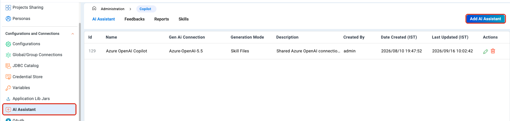

.. note::

   This step needs administrator access.

Fill in the dialog
~~~~~~~~~~~~~~~~~~

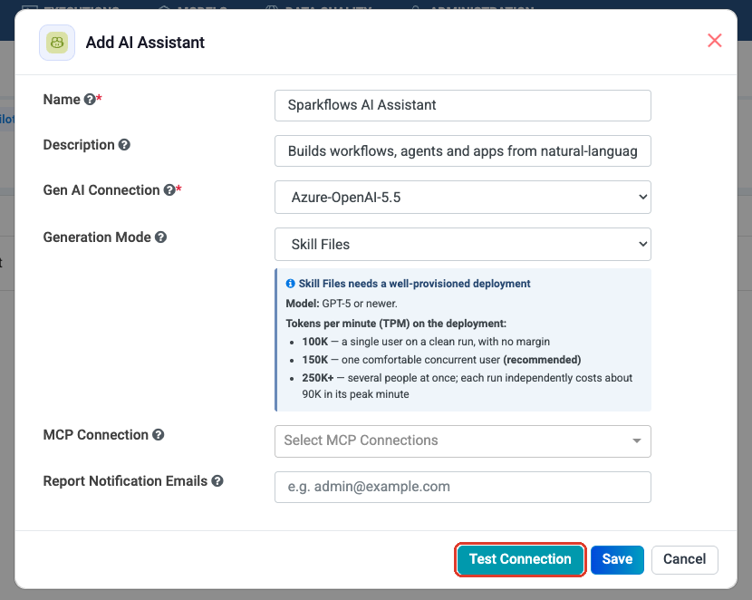

.. list-table::
   :header-rows: 1
   :widths: 26 74

   * - Field
     - What to enter
   * - **Name** *(required)*
     - What users see in the assistant panel, for example ``Azure OpenAI
       Copilot``. Pick something people will recognise.
   * - **Description**
     - A sentence on what this assistant is for. Useful once there is more
       than one.
   * - **Gen AI Connection** *(required)*
     - The model connection the assistant runs on. It must already exist — see
       :doc:`/agentic-ai-guide/connections`.
   * - **Generation Mode**
     - ``Default`` or ``Skill Files``. See below.
   * - **MCP Connection**
     - Optional. Lets the assistant reach an external system while it builds.
   * - **Report Notification Emails**
     - Optional. Where to send the reports users raise from the assistant panel.

Choose the Generation Mode
~~~~~~~~~~~~~~~~~~~~~~~~~~

**Skill Files** gives the assistant a detailed, Sparkflows-specific reference
while it builds, so it picks better processors and fills in more settings on
its own. It costs more tokens per run, so the dialog spells out what the model
deployment needs.

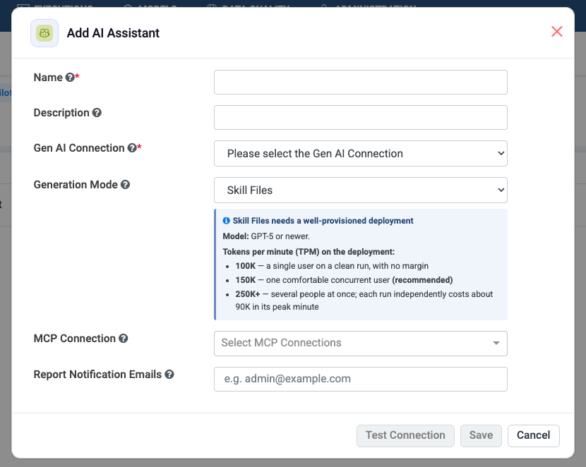

.. tip::

   Use **Skill Files** with a GPT-5-class deployment at 150K tokens per minute
   for one comfortable user. Use **Default** if your deployment is smaller —
   results are simpler, but it still works.

Connect an MCP server (optional)
~~~~~~~~~~~~~~~~~~~~~~~~~~~~~~~~

If you want the assistant to be able to reach an external system while it
builds, pick one of your MCP connections here.

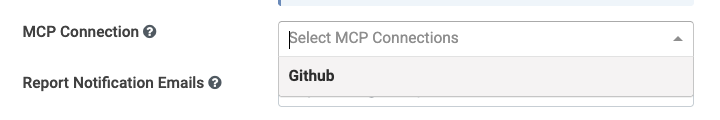

See :doc:`/agentic-ai-guide/mcp-servers` for how these connections are created.

Test it, then save
~~~~~~~~~~~~~~~~~~

Click **Test Connection** before saving. A green **Connected Successfully**
means the model connection works and the assistant is ready to use.

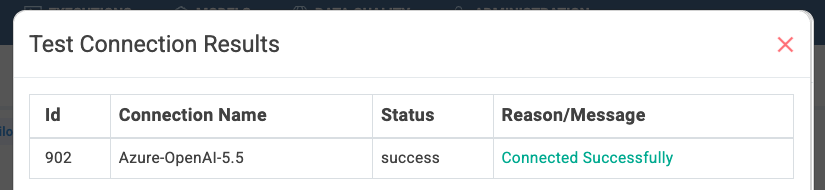

Then click **Save**. To change an assistant later, click the pencil in the
**Actions** column — the same dialog opens as **Update AI Assistant**.

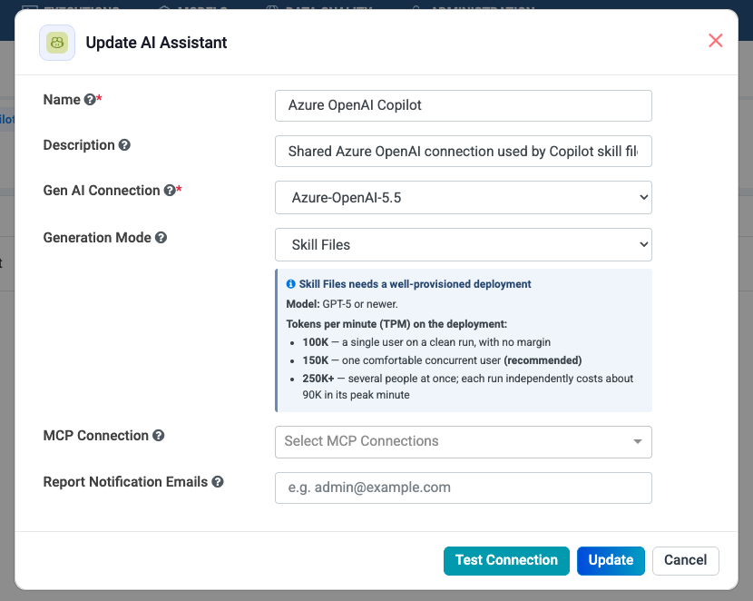

Where the skill files come from
~~~~~~~~~~~~~~~~~~~~~~~~~~~~~~~

The **Skills** tab on the same page shows the built-in skill bundles that ship
with Sparkflows — one per thing the assistant can build. You cannot edit or
delete these.

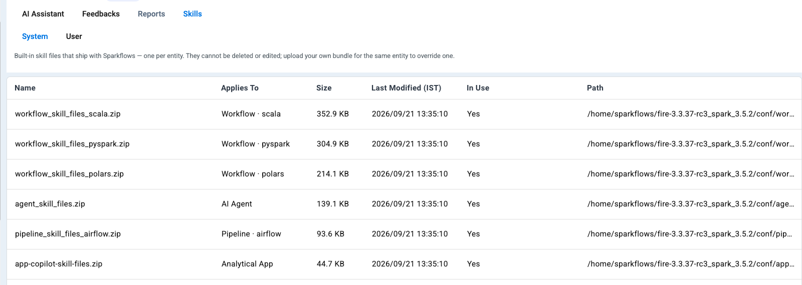

The **User** sub-tab is where you upload your own bundle. Each entity holds one
bundle at a time, and while yours is there it replaces the built-in one for
that entity everywhere. Delete it to go back to the built-in bundle.

.. note::

   These are the assistant's own skill bundles and are separate from the
   project skills your agents use at run time — see
   :doc:`/agentic-ai-guide/skills`.

.. _ai-assistant-where:

Step 2: Open the assistant and find the sample prompts
-------------------------------------------------------

Open any workflow, agent or application and click **AI Assistant** in the
toolbar. A chat panel opens down the right-hand side.

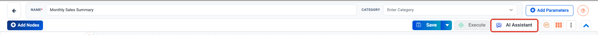

You do not have to invent a prompt. The **ⓘ** button in the panel header opens
**Sample Prompts** — a library of ready-made requests you can copy and adjust.

.. list-table::
   :header-rows: 1
   :widths: 24 76

   * - Icon
     - What it does
   * - Speech bubble
     - Switch between your chats for this item.
   * - **+**
     - Start a fresh chat. Use this when you change subject, so the assistant
       does not carry the old request forward.
   * - Clock
     - Your recent prompts.
   * - Tools
     - What the assistant is allowed to reach while it builds.
   * - **ⓘ**
     - **Sample Prompts.**
   * - **✕**
     - Close the panel.

The sample prompts are grouped by topic, and the list changes to match what you
are building.

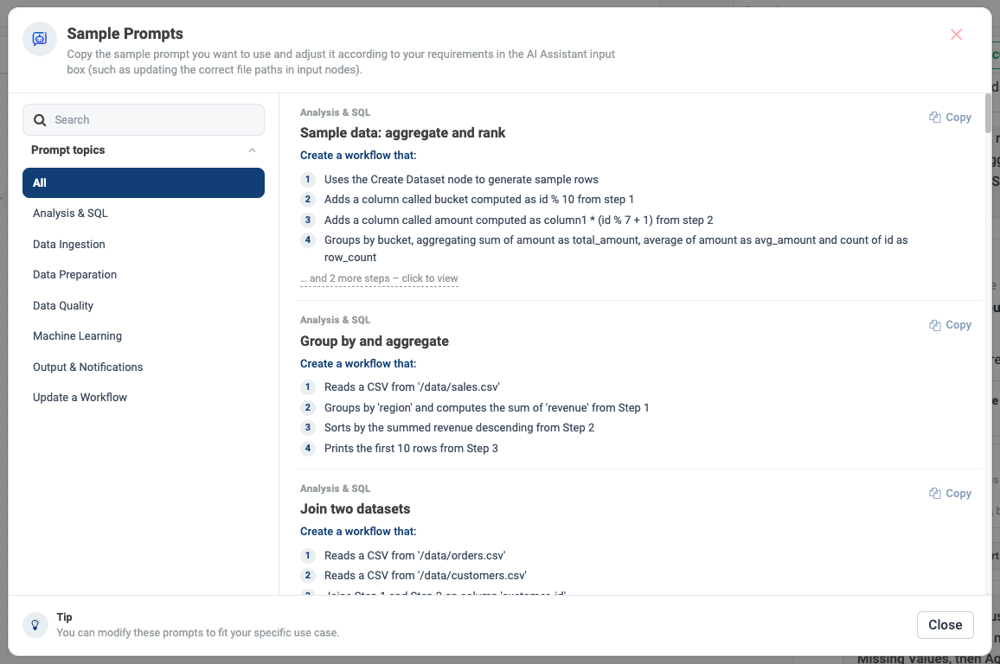

Click **… and N more steps – click to view** on a prompt to read all of it, and
**Copy full prompt** to put it on your clipboard.

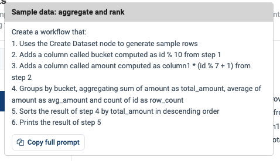

.. tip::

   Paste the sample into the input box and edit it — change the file path, the
   table name or the column names to match your data. The samples are written
   as a numbered list of steps, and that shape works well for your own prompts
   too.

Step 3: Build a data workflow
-----------------------------

Open a workflow, click **AI Assistant**, and paste a prompt. The example below
is the **Sample data: aggregate and rank** sample, used as-is — it works
anywhere because it generates its own rows instead of reading a file.

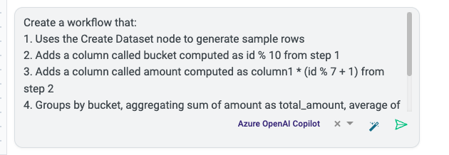

Click the send arrow. The assistant works through the request and shows you
what it did, step by step.

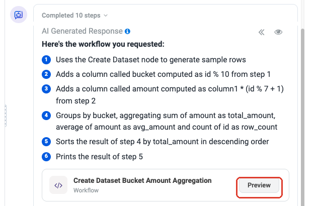

Click **Preview** to see the flow before it touches your canvas. Every box is
an ordinary Sparkflows processor — **Create Dataset**, **Add bucket**, **Add
amount**, **Aggregate by bucket**, **Sort by total_amount desc**, **Print
Result**.

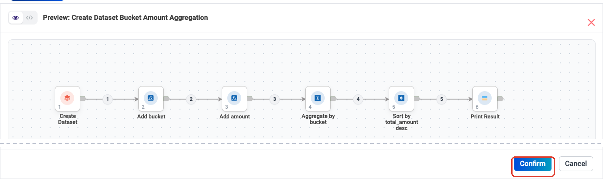

Click **Confirm**. Sparkflows warns you that this replaces whatever is on the
canvas.

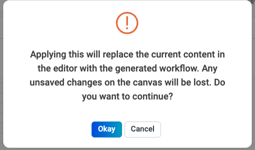

Click **Okay** and the workflow is yours. Open any node, change any setting,
add or remove steps, then **Save** and **Execute** as usual.

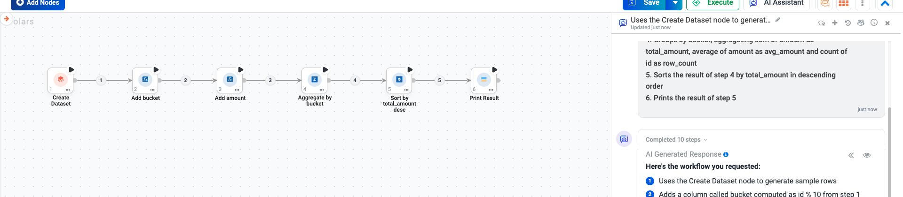

.. caution::

   When a prompt names a file, the assistant cannot know your path. It builds
   the node anyway and tells you what is missing — look for the **settings
   still need you** box in its reply, then fill those fields in before you run.

Step 4: Build an agent
----------------------

The same assistant is in the agent editor. Create an agent
(**Agents → Create Agents → Agent Orchestration**) and click **AI Assistant**.

The sample prompts change to agent topics — building an agent, order
operations, finance, human in the loop, IT service and more.

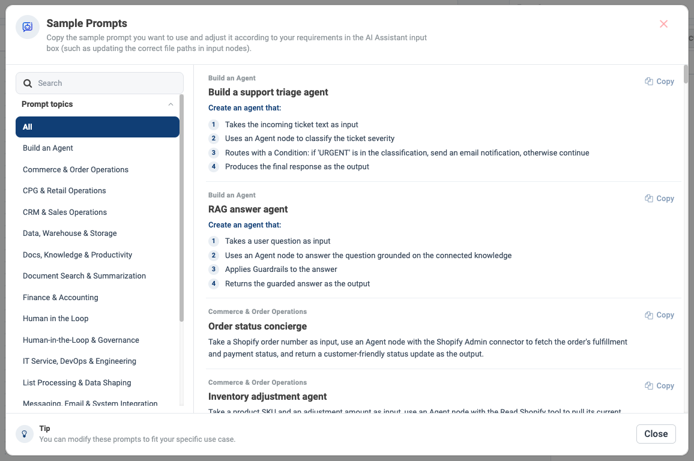

The example below is the **Build a support triage agent** sample, used as-is.

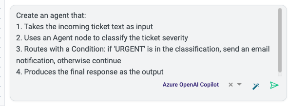

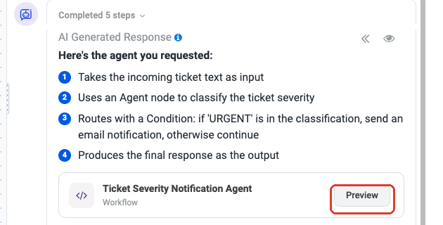

**Preview** shows the agent flow: an **Input**, an **Agent** node that
classifies the ticket, a **Condition** that splits urgent from routine, an
**Email Notification** on the urgent branch, and an **Output** on each path.

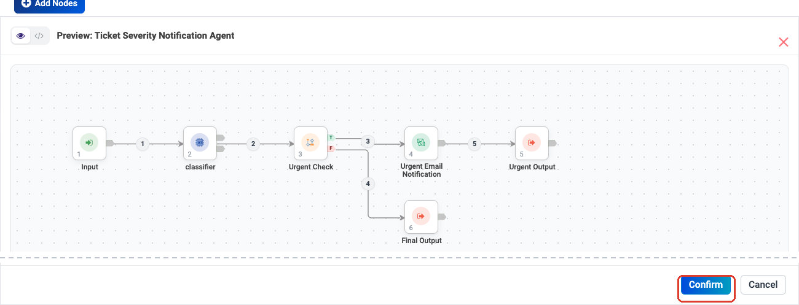

**Confirm** puts it on the canvas.

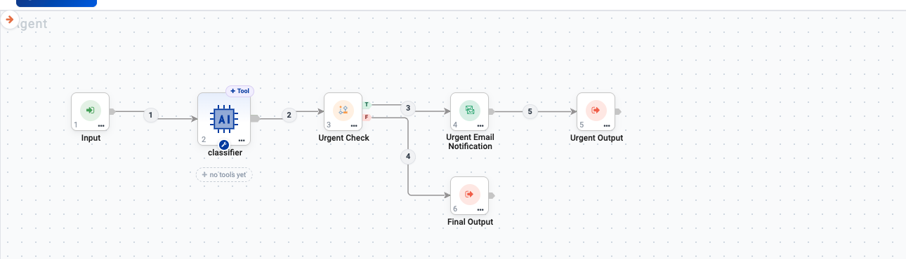

.. important::

   The assistant builds the *shape* of the agent. You still finish it:

   * pick the model on the Agent node — see
     :doc:`/agentic-ai-guide/models-prompts`;
   * add the tools it needs — the node shows **no tools yet** until you do, see
     :doc:`/agentic-ai-guide/tools-actions`;
   * check the condition and the notification settings — see
     :doc:`/agentic-ai-guide/control-flow`.

Step 5: Build an analytics app from a database table
----------------------------------------------------

Go to **Applications → Create Application**. Two things matter before you
prompt anything.

#. Give the app a **Name**.
#. Pick the database under **Select JDBC Connection** — for example a Postgres
   connection. This is what tells the assistant which tables it may read.

Then click **AI Assistant**.

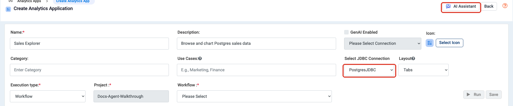

The sample prompts here are app-shaped, split into **Analytical Apps** and
**Dashboard Apps**.

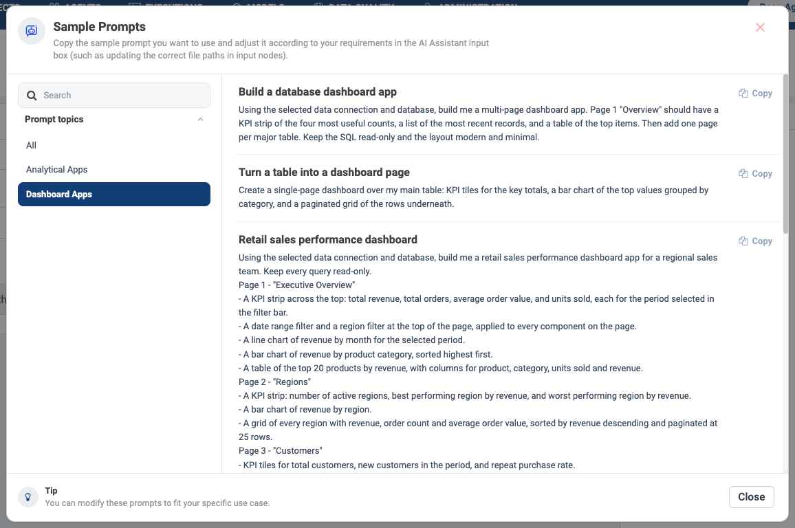

Take the **Turn a table into a dashboard page** sample and put your own table
name into it. The chosen connection is shown next to the send arrow, so you can
always see which database you are pointing at.

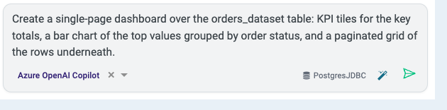

.. tip::

   If you do not know the table names, ask first — *"List the tables available
   in the selected connection."* The assistant reads the database and answers,
   and then you can name the table you want.

The assistant writes the queries, runs them against your database, and fixes
the ones that fail before it answers. When it is done you get **Apply** and
**Preview**.

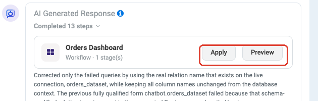

**Preview** runs the app on your real data so you can check it before keeping
it.

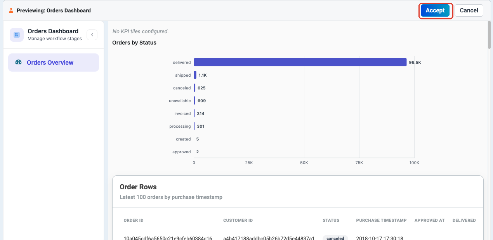

Click **Accept**. The app details, the layout and the **Stages** are filled in
for you. Review them, then click **Save**.

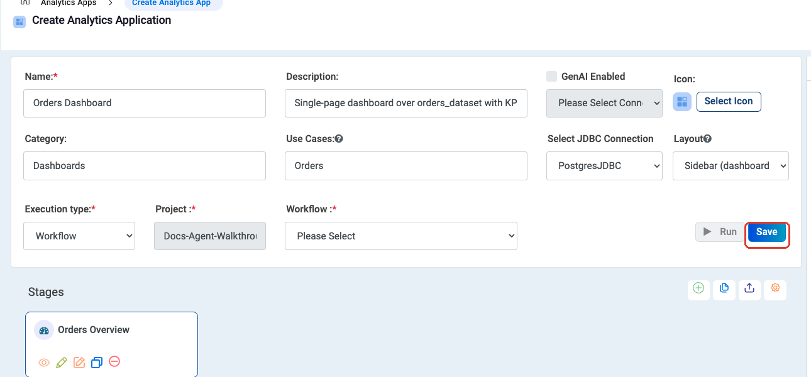

Writing prompts that work
-------------------------

.. list-table::
   :header-rows: 1
   :widths: 30 70

   * - Do this
     - Why
   * - Number your steps
     - The assistant follows the order you give and each step becomes a node.
   * - Name real things
     - Table names, column names, file paths. Guesses become settings you have
       to fix later.
   * - Say what the output is
     - "write to a CSV", "print the result", "return the answer as the output".
   * - Ask for built-in nodes
     - Saying *"one node per step, no custom code"* gives you a flow you can
       read and edit, instead of one node that does everything.
   * - Start a new chat per task
     - The **+** button. A fresh chat stops the assistant from carrying your
       previous request forward.

Before you ship it
------------------

The assistant gives you a first draft, not a finished product. Check these
before anyone else uses it.

.. list-table::
   :header-rows: 1
   :widths: 30 70

   * - Check
     - What to look for
   * - Settings it flagged
     - The **settings still need you** box in the reply lists exactly what is
       missing.
   * - File paths and tables
     - Open the read and write nodes and confirm they point where you meant.
   * - Models and tools on agents
     - An Agent node with no model cannot run; one with no tools can only talk.
   * - Guardrails
     - Anything customer-facing should go through
       :doc:`/agentic-ai-guide/security-guardrails`.
   * - A real run
     - Execute it once with representative input and read the output yourself.

Next: test and ship
-------------------

Once the generated workflow or agent looks right, go to
:doc:`/agentic-ai-guide/evaluate-agents` to test its behaviour properly, then
:doc:`/agentic-ai-guide/deploy-agents` to put it in front of users.
