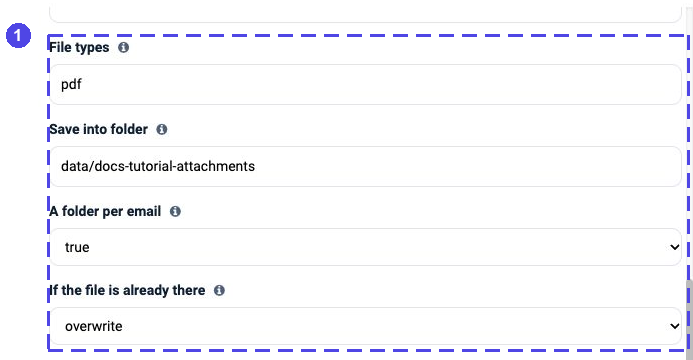
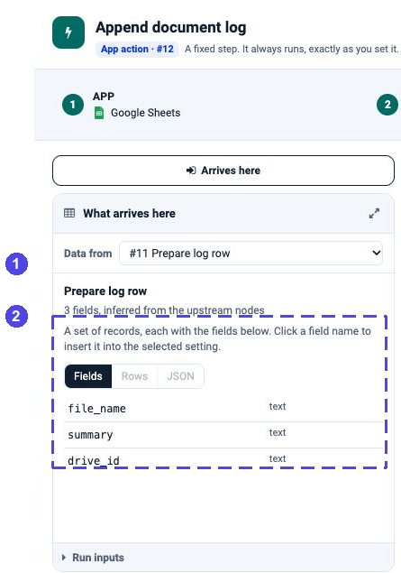

App Actions: Read and Write Your Business Apps
==============================================

An **App Action** is one fixed operation in a connected app: find open
tickets, append rows to a sheet, or update a database record. You choose the
app, action, connection and mappings. The action runs when the flow reaches
it; a language model does not choose its operation or arguments.

Use an App Action for the steps that must always happen. Give an
:doc:`Agent Node <agent-node>` a tool instead when choosing whether and how
to call it is part of the model's task.

**First time connecting an app?** Start with the short setup path on this
page; you do not need to study every connector. For a complete flow, choose
one of the :doc:`end-to-end-examples/index`.

.. figure:: ../_assets/agentic-ai-guide/app-actions/lookup-v5.png
   :alt: PostgreSQL App Action details with a customer key mapped from the current loop record
   :width: 680px

   A configured database lookup: choose the connection and table, then map
   the current customer's key. The flow runs this fixed action when it reaches
   the node. See **Databases** below for the available database operations.

.. contents:: On this page
   :local:
   :depth: 1

Choose the right kind of step
-----------------------------

.. list-table::
   :header-rows: 1
   :widths: 34 33 33

   * - You need to…
     - Use
     - Who decides?
   * - Read five rows or save an approved record every time this branch runs
     - **App Action** on the normal flow path
     - Your configuration and the flow's branches.
   * - Summarize text or classify a support request
     - **Agent Node**, initially without tools
     - The model generates an answer from your instructions and inputs.
   * - Let the model look up information when needed
     - A read-only tool available to an **Agent Node**
     - The model chooses a tool call within the permissions you expose.
   * - Allow a write only after a person reviews it
     - **Human Approval**, then an **App Action** on **Approved**
     - The reviewer decides; the fixed step carries out the approved operation.

**Deterministic means configured, not identical forever.** A mapping such as
``${4.fields.customer_id}`` reads the current run's value. A database or API
can return different data on the next run. If a mapped value came from an
Agent Node, validate it before using it in a write. A fixed action does not
make an upstream model's answer factual or safe.

**Start small:** Trigger → one read-only App Action → Output. Add a write
only after the returned fields make sense. You do not need a model connection
for this first flow.

Connect and verify once
-----------------------

#. Open **Administration → Global/Group Connections**, or the project's
   **Connections** page (:doc:`/agentic-ai-guide/connections`), and choose
   **Add Connection**.
#. Select the connection type below, enter credentials in that form (never in
   a prompt or flow note), then **Test Connection** and save.
#. Reuse the saved connection in each action that needs it. Authentication
   does not grant access to every mailbox, site, table or operation; your app
   administrator must grant those permissions separately.

.. list-table:: Start with the app family you need
   :header-rows: 1
   :widths: 34 31 35

   * - App family
     - Connection to select
     - A safe first action
   * - **Google Workspace** — Gmail, Calendar, Drive, Sheets and Docs
     - **Google**; enable only the APIs and read/write scopes needed for the
       chosen apps.
     - Gmail **List messages** with a small limit, or Google Drive **List
       files** in a training folder. The same connection can serve Gmail,
       Sheets, Docs, Calendar and Drive.
   * - **Microsoft 365** — Outlook Mail/Calendar, OneDrive, Teams and SharePoint
     - **Microsoft Graph** for Outlook, Calendar, OneDrive and Teams. SharePoint
       also accepts **SharePoint**.
     - Read a few emails or events first. Graph app credentials do not act as
       a signed-in person; ordinary Teams message posting needs delegated
       access, which the standard wizard does not supply.
   * - **Business apps** — Salesforce, Jira and Slack
     - The matching provider credentials. Slack has no dedicated connection
       type in this build; ask an administrator to provision a supported one.
     - List a few Salesforce records or search one Jira test project. Check
       provider permissions before attempting a write.
   * - **Databases** — PostgreSQL, MySQL and SQL Server
     - The matching database connection or a compatible **JDBC** connection.
     - List schemas or tables, then load at most five rows from a training
       table. The generic **SQL Database** app is not available yet.
   * - **Web** — Web Search, public pages and feeds
     - **Serper** for searches; no connection for public page and feed reads.
     - Start with one short search query. A public URL must also be reachable
       from the Sparkflows server.

**Build the action:** add **App Action** → choose the app → choose the
operation → select its saved connection → fill in the target and inputs.
For a read, click **Load the fields** and check the sample before wiring a
write. For an appending write, match the incoming field names to the sheet or
table columns. See the selected-step screenshots below; they show setup, not
proof that an external connection or write succeeded.

   **Gmail example:** choose a connection before testing or loading fields.
   Restrict the search and file types, choose a controlled folder, then decide
   whether repeated names are overwritten, kept or skipped. The screenshot is
   a configuration example; it has no connection selected and was not run.

   **Google Sheets example:** this crop shows the incoming record only. In
   the Details panel, select a connection, spreadsheet and tab whose header
   names match ``file_name``, ``summary`` and ``drive_id``. This saved example
   was not connected or executed.

Add an App Action in three steps
--------------------------------

Drop **App Action** onto the canvas. The drawer walks you through **App**,
**Action** and **Details**; the bar at the top shows what you picked, and you
can click any step to go back to it.

**1. Pick the app.** Each card says how many actions the app offers. Type in
**Search apps** to narrow the list.

.. figure:: ../_assets/agentic-ai-guide/app-actions/app-grid.png
   :alt: The top of the current App Action drawer, with Search apps and the first six available apps
   :width: 580px

   Search for your app or scroll for more. The number on a card is its action
   count, not the number of configured connections.

**2. Pick what it should do.** Actions are grouped by what they work on (rows,
spreadsheets, sheets) and each says in one line what it does. **reads** leaves
the app as it was; **changes data** writes to it.

.. figure:: ../_assets/agentic-ai-guide/app-actions/action-list.png
   :alt: Google Sheets actions grouped as Row, Spreadsheet and Sheet, each marked reads or changes data; Append is selected
   :width: 580px

**3. Fill in the details.** The right side holds the connection and the action's
own settings. The left side shows **What arrives here** - the fields of the
records reaching this step - so you can click a field instead of typing it.

Reading from an app
-------------------

A read returns records, and those records become the rows the next step
receives. Fill in what to read—a PostgreSQL table, a trusted ``Where`` filter
if needed, and a small limit—then press **Load the fields from PostgreSQL**.
For predictable database ordering, follow :doc:`database-connectors-setup`;
do not assume that a preview's row order is a guarantee.

.. figure:: ../_assets/agentic-ai-guide/app-actions/read-details.png
   :alt: PostgreSQL Read rows with table sf_training_orders, where status = 'open', order by amount desc, limit 5, and the returned fields id, customer_id, product and amount
   :width: 100%

   After Load the fields, What this step returns shows the real columns and a sample row.

Loading the fields is required before **Save action** is enabled. It is what
tells every later step which fields it will receive, so they can offer them in
their own **What arrives here** panel.

.. tip::

   Not sure what the app holds? Open **Explore <app>** on the left. It lists
   what is there - tables and their rows, folders, mailboxes - through the same
   connection, without leaving the canvas.

   .. figure:: ../_assets/agentic-ai-guide/app-actions/explore.png
      :alt: The Explore PostgreSQL tab listing the rows of the sf_training_orders table
      :width: 100%

**Advanced settings** holds what you rarely change: extra query parameters,
timeouts, and **Nested fields**. ``deep`` (the default) turns a nested value
such as Jira's ``fields.priority.name`` into a column of its own, which is what
a Filter or a prompt can name.

Writing to an app
-----------------

A write sends the records arriving on its input to the app. With **Rows to
write (JSON)** left empty, it uses the rows from the previous step. Leave
**Fields to set** empty when the column names already match; after a Filter, a
Loop or a database read, each arriving column is sent as the field of the same
name.

.. figure:: ../_assets/agentic-ai-guide/app-actions/write-details.png
   :alt: Cropped PostgreSQL Fields to set panel with no fields mapped
   :width: 100%

   When table columns already match, leave **Fields to set** empty. See the
   write-safety note below for when canvas previews and full runs execute it.

To shape the outgoing record, add **Fields to set**. The chips offer the fields
the app expects (for an email: **To**, **Cc**, **Bcc**, **Subject**, **Body**);
type a value, or click in the box and then click a field on the left to insert
a reference such as ``${10.analysis}``. To supply a complete record yourself,
use **Rows to write (JSON)** with one object or an array of objects. **What
will be sent** shows the exact request.

.. figure:: ../_assets/agentic-ai-guide/app-actions/fields-to-set.png
   :alt: Cropped Fields to set panel mapping To, Subject and Body, with the body referencing ${10.analysis}
   :width: 100%

   The body is the answer of the Agent Node that wrote the digest. Lists, long text and nested formats are shaped for the app automatically.

**Edit as JSON (advanced)** shows the same request as raw JSON, for the rare
case the mapper does not cover.

What a write hands on
~~~~~~~~~~~~~~~~~~~~~

Every row comes back with three fields beside it:

.. list-table::
   :header-rows: 1
   :widths: 30 70

   * - Field
     - Meaning
   * - ``result_status``
     - ``ok``, ``failed`` or ``skipped``.
   * - ``result_id``
     - The id the app gave the new or changed record - a message id, a sheet
       id, a row key. For the first returned record, use
       ``${<node>.fields.result_id}``, replacing ``<node>`` with the actual
       node number. Process the records themselves for multiple results.
   * - ``result_error``
     - Why the app refused the row, when it did.

**If a row is rejected** (under Advanced settings) decides what happens when the
app refuses one row: ``stop`` fails the run at the first rejection, ``continue``
writes the rest and marks the failed rows. Follow it with a
:doc:`Filter </agentic-ai-guide/data-steps>` on ``result_status`` to collect the
failures.

``stop`` does not undo earlier successful writes. A network error can also
leave you unsure whether the destination accepted the request. Inspect the
destination before retrying a create, append, send or upload.

.. figure:: ../_assets/agentic-ai-guide/app-actions/on-error.png
   :alt: The If a row is rejected setting, set to stop
   :width: 664px

Databases
---------

MySQL, PostgreSQL and SQL Server offer the same business actions:
**List rows**, **Get a row by key**, **Count rows**, **Describe a table**,
**Insert a row**, **Update a row by key**, **Insert or update a row**,
**Delete rows**, **List tables**, **List schemas**, and **Run a SQL statement**.

* **Run a SQL statement** can read or change data. The connector examines the
  statement to classify it; a leading ``WITH`` or ``SELECT`` alone does not
  prove that it is read-only. Use a read-only database account for exploration.
* Table and column identifiers are checked. Key-based row actions bind key
  values, and insert/update actions bind record values. **Where** and **SQL**
  are SQL text, not automatic parameter binding: never interpolate a user's
  message or a model-generated fragment into them.
* A database can also start the agent: see
  :doc:`/agentic-ai-guide/triggers`.

For connection types, schemas, keys, each action's inputs, result checks and
safe retry behavior, use :doc:`database-connectors-setup`.

.. raw:: html

   

See fixed App Actions in a complete workflow

.. figure:: ../_assets/agentic-ai-guide/app-actions/workflow-v5.png
   :alt: Actual meeting preparation canvas with a fixed customer lookup inside the Loop, one Agent Node for writing, and Google Docs creation and update after the Loop completes

   **1** The customer lookup is fixed; only the following writing step uses
   a model. **2** The document actions run after the Loop's **D** output, so
   they publish the collected pack, not a document for every meeting.
   This is the saved configuration, not proof of external execution.

.. raw:: html

   

Check a write before enabling it
--------------------------------

#. **Name the destination.** Confirm the mailbox, folder, sheet, object or
   table belongs to your test environment.
#. **Choose the record set.** Inspect **What arrives here**. Two arriving
   records can mean two writes; one summary record can mean one write.
#. **Map only the required fields.** Check **What will be sent**, including
   nested JSON, identifiers, dates and recipients. A request preview is not
   proof that the provider accepts it.
#. **Resolve references.** Check that the referenced node runs before this
   action, and that a one-record reference is not accidentally selecting only
   the first record of a larger result.
#. **Run one controlled test.** Use a draft instead of a send where possible.
   Read the result and verify the destination itself.
#. **Plan the second run.** Inserts, appends, document creation and sends can
   repeat. Prefer a stable-key update/upsert when appropriate, or add an
   explicit check before creating something again.

.. tip::

   A tool attached to an Agent Node is not a substitute for a required write
   step. If saving the reviewed result must happen, connect an App Action on
   the approved flow path. Conversely, do not connect a send before the
   approval that is supposed to protect it.

Limits worth knowing
--------------------

.. list-table::
   :header-rows: 1
   :widths: 40 60

   * - Where
     - Limit
   * - App Action records carried inline in the run state
     - Up to 500 rows in this build. Larger results use a dataset handle.
       This is not a guarantee of constant memory for every operation.
   * - A preview (Load the fields, Explore)
     - A small sample; it is a preview.
   * - A write while you configure it
     - Canvas previews skip data-changing actions by default. Turn on **Write
       when run from the canvas** to perform them during a canvas run. Full and
       scheduled runs perform configured changes; use a test destination when
       checking a write or send.

.. important::

   **Refresh Schema** and **Explore** are read-only. A canvas **Run** also
   skips configured writes by default and marks them ``result_status =
   skipped``. If you enable **Write when run from the canvas**, that canvas
   run makes the real change. A full or scheduled run performs configured
   changes regardless of this preview setting. Keep the option off unless you
   intentionally need to test a write, and use a test destination first.

For a large table or bulk processing, use a workflow designed for that
dataset and execution engine. Check which database/JDBC and other nodes
that engine supports. See :doc:`workflows-as-tools` for exposing a tested
workflow to an agent.

Next
----

:doc:`/agentic-ai-guide/passing-data` explains **What arrives here** and the
``${...}`` references in detail.

.. raw:: html

   

Need an administrator setup reference?

.. list-table:: Optional connector references
   :header-rows: 1
   :widths: 25 75

   * - When you need…
     - Open this reference
   * - Google OAuth APIs, scopes and refresh-token setup
     - :doc:`Google Workspace <google-connectors-setup>`
   * - Microsoft Graph app registration and permission notes
     - :doc:`Microsoft 365 <microsoft-connectors-setup>`
   * - Salesforce, Jira or Slack credentials and constraints
     - :doc:`Business apps <business-connectors-setup>`
   * - Database connection fields, keys and all eleven database actions
     - :doc:`Database actions <database-connectors-setup>`
   * - Required inputs for a particular app operation
     - :doc:`App Action lookup <app-action-catalogue>`

.. raw:: html

   

These technical references open only when needed and are not separate entries
under App Actions in the sidebar.
