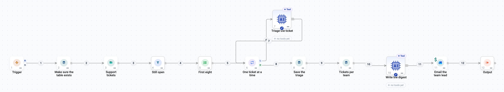

App Actions: Read and Write Your Business Apps
==============================================

An **App Action** is one fixed step in a connected app: find open tickets,
append rows to a sheet, insert rows into a table, send an email. No model
decides whether it runs or what it sends - it does exactly what you set, every
time the run reaches it.

Use an App Action for the steps that must always happen. Give an
:doc:`Agent Node <agent-studio>` a tool instead when the model should decide.

   A whole process from fixed steps and two Agent Nodes. Every database and Outlook step here is an App Action.

.. contents:: On this page
   :local:
   :depth: 1

The apps
--------

.. list-table::
   :header-rows: 1
   :widths: 30 70

   * - Group
     - Apps
   * - Microsoft 365
     - Outlook Mail, Outlook Calendar, SharePoint, OneDrive, Microsoft Teams
   * - Google Workspace
     - Gmail, Google Calendar, Google Drive, Google Sheets, Google Docs
   * - CRM, chat and tickets
     - Salesforce, Slack, Jira
   * - Databases
     - MySQL, PostgreSQL, SQL Server

Each app uses a connection you create once under the project's **Connections**
page (:doc:`/agentic-ai-guide/connections`). The databases also accept a generic
JDBC connection to the same database.

Add an App Action in three steps
--------------------------------

Drop **App Action** onto the canvas. The drawer walks you through **App**,
**Action** and **Details**; the bar at the top shows what you picked, and you
can click any step to go back to it.

**1. Pick the app.** Each card says how many actions the app offers. Type in
**Search apps** to narrow the list.

.. figure:: ../_assets/agentic-ai-guide/app-actions/app-grid.png
   :alt: The App Action drawer listing Salesforce, Microsoft Teams, Slack, OneDrive, Outlook Calendar, Outlook Mail, SharePoint, Gmail, Google Calendar, Google Docs, Google Drive, Google Sheets, Jira, MySQL, PostgreSQL and SQL Server
   :width: 580px

**2. Pick what it should do.** Actions are grouped by what they work on (rows,
spreadsheets, sheets) and each says in one line what it does. **reads** leaves
the app as it was; **changes data** writes to it.

.. figure:: ../_assets/agentic-ai-guide/app-actions/action-list.png
   :alt: Google Sheets actions grouped as Row, Spreadsheet and Sheet, each marked reads or changes data; Append is selected
   :width: 580px

**3. Fill in the details.** The right side holds the connection and the action's
own settings. The left side shows **What arrives here** - the fields of the
records reaching this step - so you can click a field instead of typing it.

Reading from an app
-------------------

A read returns records, and those records become the rows the next step
receives. Fill in what to read - here a PostgreSQL table, a ``Where`` filter, an
order and a limit - then press **Load the fields from PostgreSQL**.

.. figure:: ../_assets/agentic-ai-guide/app-actions/read-details.png
   :alt: PostgreSQL Read rows with table sf_training_orders, where status = 'open', order by amount desc, limit 5, and the returned fields id, customer_id, product and amount
   :width: 100%

   After Load the fields, What this step returns shows the real columns and a sample row.

Loading the fields is required before **Save action** is enabled. It is what
tells every later step which fields it will receive, so they can offer them in
their own **What arrives here** panel.

.. tip::

   Not sure what the app holds? Open **Explore <app>** on the left. It lists
   what is there - tables and their rows, folders, mailboxes - through the same
   connection, without leaving the canvas.

   .. figure:: ../_assets/agentic-ai-guide/app-actions/explore.png
      :alt: The Explore PostgreSQL tab listing the rows of the sf_training_orders table
      :width: 100%

**Advanced settings** holds what you rarely change: extra query parameters,
timeouts, and **Nested fields**. ``deep`` (the default) turns a nested value
such as Jira's ``fields.priority.name`` into a column of its own, which is what
a Filter or a prompt can name.

Writing to an app
-----------------

A write sends the records arriving on its input to the app. With **Fields to
set** left empty, every arriving row is written as it is - each column becomes
the field of the same name. That is the right choice after a Filter, a Loop or a
database read whose columns already match.

.. figure:: ../_assets/agentic-ai-guide/app-actions/write-details.png
   :alt: PostgreSQL Insert or update rows by key into sf_learn_triage, key column ticket_id, with no fields set so the arriving rows are written
   :width: 100%

To write one record that you compose yourself, add fields. The chips offer the
fields the app expects (for an email: **To**, **Cc**, **Bcc**, **Subject**,
**Body**); type a value, or click in the box and then click a field on the left
to insert a reference such as ``${10.analysis}``. **What will be sent** shows
the exact request.

.. figure:: ../_assets/agentic-ai-guide/app-actions/fields-to-set.png
   :alt: Outlook Mail Send a message with Fields to set to, subject and body; the body holds ${10.analysis} from the Agent Node that wrote the digest
   :width: 100%

   The body is the answer of the Agent Node that wrote the digest. Lists, long text and nested formats are shaped for the app automatically.

**Edit as JSON (advanced)** shows the same request as raw JSON, for the rare
case the mapper does not cover.

What a write hands on
~~~~~~~~~~~~~~~~~~~~~

Every row comes back with three fields beside it:

.. list-table::
   :header-rows: 1
   :widths: 30 70

   * - Field
     - Meaning
   * - ``result_status``
     - ``ok``, ``failed`` or ``skipped``.
   * - ``result_id``
     - The id the app gave the new or changed record - a message id, a sheet
       id, a row key. A later step reads it as ``${<node>.result_id}``.
   * - ``result_error``
     - Why the app refused the row, when it did.

**If a row is rejected** (under Advanced settings) decides what happens when the
app refuses one row: ``stop`` fails the run at the first rejection, ``continue``
writes the rest and marks the failed rows. Follow it with a
:doc:`Filter </agentic-ai-guide/data-steps>` on ``result_status`` to collect the
failures.

.. figure:: ../_assets/agentic-ai-guide/app-actions/on-error.png
   :alt: The If a row is rejected setting, set to stop
   :width: 664px

Databases
---------

MySQL, PostgreSQL and SQL Server offer the same business actions, labelled by
rows: **Read rows**, **Get one row by key**, **Count rows**, **Describe the
columns**, **Insert rows**, **Update rows by key**, **Insert or update rows by
key**, **Delete rows**, **List tables**, **List schemas**, and **Run SQL**.

* **Run SQL** with a ``SELECT`` (or ``WITH``, ``SHOW``, ``EXPLAIN``) is a read and
  returns the rows. Any other statement - ``CREATE TABLE``, ``DELETE`` - is a
  write.
* Table and column names are checked, and values are always sent as
  parameters, never pasted into the SQL.
* A database can also start the agent: see
  :doc:`/agentic-ai-guide/triggers`.

Limits worth knowing
--------------------

.. list-table::
   :header-rows: 1
   :widths: 40 60

   * - Where
     - Limit
   * - Rows an agent step keeps in memory
     - 500 rows; larger results are kept as a file and still flow on.
   * - A preview (Load the fields, Explore)
     - A small sample; it is a preview.
   * - A write while you configure it
     - Nothing is written until the agent runs.

For a whole table - tens of thousands of rows - use a workflow instead. The same
apps are available as nodes in workflows (:doc:`/agentic-ai-guide/workflows-as-tools`),
and an agent can run that workflow as one step.

Next
----

:doc:`/agentic-ai-guide/passing-data` explains **What arrives here** and the
``${...}`` references in detail.
