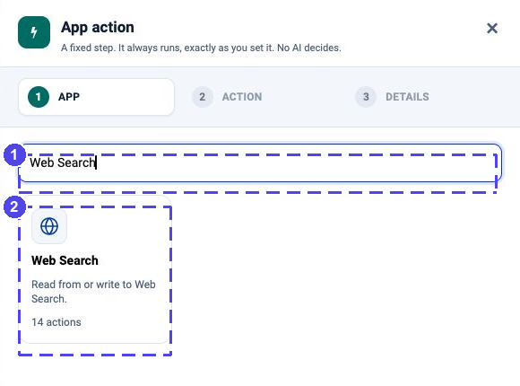

Connect an App and Try Your First Action
========================================

Choose the app you need, set up its connection once, then try a small read.
You do not need to configure every app to follow this guide.

**Already connected?** Go straight to :doc:`app-actions` to add a step, or
:doc:`end-to-end-examples/index` to build a complete process.

.. figure:: ../_assets/agentic-ai-guide/app-actions/app-grid.png
   :alt: App Action picker with Search apps and available app cards
   :width: 580px

   Start with one app. After choosing it, select an action and its saved
   connection; you do not need to set up the other apps.

Choose your setup guide
-----------------------

.. list-table:: Start with one connection
   :header-rows: 1
   :widths: 30 35 35

   * - Apps
     - Connection to select
     - Setup
   * - Gmail, Google Drive, Google Sheets, Google Docs, Google Calendar
     - **Google**
     - :doc:`google-connectors-setup`
   * - Outlook Mail, Outlook Calendar, OneDrive, Microsoft Teams
     - **Microsoft Graph**
     - :doc:`microsoft-connectors-setup`
   * - SharePoint
     - **Microsoft Graph** or **SharePoint**
     - :doc:`microsoft-connectors-setup`
   * - Salesforce, Jira, Slack
     - The appropriate app credentials; see the Slack limitation below
     - :doc:`business-connectors-setup`
   * - PostgreSQL, MySQL, SQL Server
     - **PostgreSQL**, **MySQL**, **SQL** or a compatible **JDBC** connection
     - :doc:`database-connectors-setup`
   * - Web Search
     - **Serper** for searches; no connection for public page and feed reads
     - :ref:`app-setup-web`

.. note::

   The app catalogue and the connection wizard are different lists. An app
   may have several actions but share one connection type with other apps.
   A tile labelled **Coming soon** is not usable yet. Do not substitute an
   unrelated connection just because the dropdown offers it.

Create the connection once
--------------------------

#. Ask your administrator for a test account and permission to create a
   connection. Use a test mailbox, folder, project or database first.
#. Open **Administration → Global/Group Connections**, or the project's
   **Connections** page for a project-scoped connection.
#. Click **Add Connection**, choose the type from the table, and give it a
   recognisable name, such as ``Outlook-training``.
#. Follow the selected setup guide. Enter secrets only into the connection
   form, never into prompts, sticky notes, screenshots or exported examples.
#. Use **Test Connection**, then save. A successful connection test checks
   authentication; the account still needs permission for the particular
   mailbox, table, site or operation you will use.

See :doc:`connections` for the wizard and the difference between Global,
Group and Project scope.

Try one read before a write
---------------------------

#. Open your project and choose **Create Agents → Agent Orchestration**.
#. Leave **Trigger** on a manual start while you build.
#. Add **App Action** and connect Trigger to it.
#. Choose the app and a read action, such as **List messages**, **List files**
   or **List rows**. Choose the saved connection and the target to read.
#. Set a small limit where available, then click **Load the fields**. Check
   the returned columns and a sample record before saving the action.
#. Connect **Output**, save the agent and run it. Inspect the records and the
   execution timeline before adding the next step.

.. figure:: ../_assets/agentic-ai-guide/app-actions/read-details.png
   :alt: An App Action read with connection and query settings alongside its returned fields
   :width: 100%

   First verify what one read returns. Later steps use these fields.

.. _app-setup-web:

Web pages, feeds and search
---------------------------

The **Web Search** app includes page reads, feeds, HTTP requests and searches.

   Add an App Action and search for Web Search; then choose the operation.

Search actions use a **Serper** connection holding your API key. Create that
connection in the wizard, then select it for a web, news, image or places
search. Start with a short query and inspect the returned results.

Public page and feed reads do not need the Serper key. They still depend on
the server being allowed to reach the address. Avoid private endpoints or
credentials in URLs. A successful page fetch does not establish that its
contents are accurate; treat web text as input data, not as instructions.

If the first read fails
-----------------------

.. list-table:: Diagnose the small test first
   :header-rows: 1
   :widths: 32 68

   * - What you see
     - What to check
   * - No connection in the dropdown
     - Connection type, project/group scope and your access to it.
   * - Authentication failed
     - Expired or revoked credentials; ask the connection owner to repair them.
   * - Access denied
     - Permission for this operation and this specific target. A working token
       does not grant access to every mailbox, channel or table.
   * - No records
     - Target ID, date range and filter. Try a known test record.
   * - Fields are missing downstream
     - Load the upstream fields again, save the read and reopen the next node.

Once the read works, continue with :doc:`app-actions`. Keep the full
:doc:`app-action-catalogue` for lookup, not as a checklist to learn by heart.

.. toctree::
   :hidden:

   google-connectors-setup
   microsoft-connectors-setup
   business-connectors-setup
   database-connectors-setup
   app-action-catalogue
