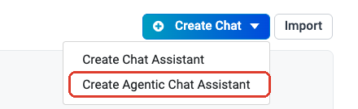
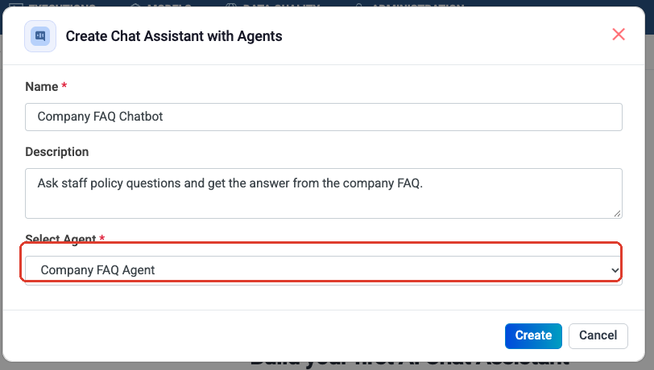
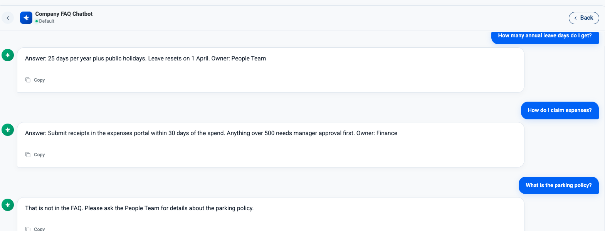

Step 3: Turn an Agent into a Chatbot
====================================

A saved agent is useful to you. A **chat assistant** makes it useful to
everyone else — colleagues get a chat window, not a builder screen.

It takes about a minute and needs nothing new: you point an assistant at the
agent you built in :doc:`/agentic-ai-guide/quickstart`.

.. contents:: On this page
   :local:
   :depth: 1

Use the right menu entry
------------------------

In the project sidebar click **Chat**, then open the **arrow next to Create
Chat Assistant** and choose **Create Agentic Chat Assistant**.

.. important::

   This is the entry point that matters, and it is easy to miss.

   * **Create Agentic Chat Assistant** — backed by one of your saved agents. It
     inherits that agent's instructions, model, knowledge and tools. **This is
     the one you want.**
   * **Create Chat Assistant** (the plain button) — a standalone chatbot that
     you configure separately with its own connection and vector database. It
     knows nothing about your agents.

Point it at your agent
----------------------

Fill in three fields.

.. list-table::
   :header-rows: 1
   :widths: 24 76

   * - Field
     - What to enter
   * - **Name**
     - What users see at the top of the chat.
   * - **Description**
     - What it is for. Worth writing — it is how people choose which assistant
       to open.
   * - **Select Agent**
     - The saved agent that answers. The dropdown lists every agent in the
       project *(boxed)*.

Click **Create**. The assistant appears on the Chat page.

Talk to it
----------

Open the assistant and type a question. Each answer comes from a real run of
the agent behind it — same instructions, same tools, same guardrails.

   The **Company FAQ Agent** from :doc:`/agentic-ai-guide/quickstart`, answering
   as a chatbot.

Read what that conversation proves:

.. list-table::
   :header-rows: 1
   :widths: 34 66

   * - Question
     - What it shows
   * - *How many annual leave days do I get?*
     - The agent read the CSV and answered in the exact shape its instructions
       asked for — an answer line and an owner.
   * - *How do I claim expenses?*
     - Same format on a different row. The format is reliable, not a fluke.
   * - *What is the parking policy?*
     - **Not in the FAQ.** It replied *"That is not in the FAQ. Please ask the
       People Team"* instead of inventing an answer.

That third answer is the one to care about. An agent that admits what it does
not know is the difference between a tool people trust and one they quietly
stop using — and you get it by writing the rule into the instructions, as the
quickstart does.

Topics
------

The left panel holds **topics** — separate conversation threads against the
same assistant. Use the **+** to start one per subject so history stays
readable.

What your users can trigger
---------------------------

.. caution::

   The assistant is only as safe as the agent behind it. Everything that agent
   is allowed to do, your users can now cause by asking. Before sharing one,
   re-read the agent's ticked tool operations and confirm you are happy with
   that. See :doc:`/agentic-ai-guide/security-guardrails`.

Which agents make good assistants
---------------------------------

.. list-table::
   :header-rows: 1
   :widths: 46 54

   * - Works well
     - Works badly
   * - Answering from documents or a database
     - Anything that writes to a system without an approval gate
   * - Looking records up by ID
     - Long multi-step processes with branches
   * - Summarising, drafting, explaining
     - Jobs that should run on a schedule, not on request

For a process with branches or approvals, build it on the canvas and expose
that instead — see :doc:`/agentic-ai-guide/multi-agent-orchestration`.

.. note::

   **A Human Input node works well in chat.** When the agent needs something
   from the person mid-run, the question appears in the conversation with the
   choices as buttons — see
   :doc:`/agentic-ai-guide/human-in-the-loop`.

   A **Human Approval** gate is different: it is answered from the run view on
   **Agents → Executions**, not from the chat window. Keep approval gates out of
   agents you expose as chat assistants.

Next: go deeper
---------------

:doc:`/agentic-ai-guide/multi-agent-orchestration` — reusing a saved agent as
one node in a larger process.
