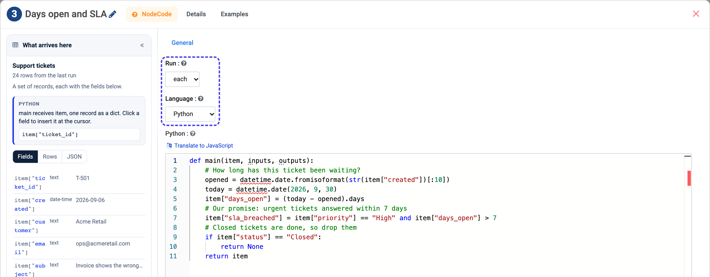
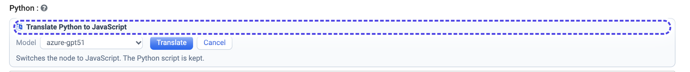
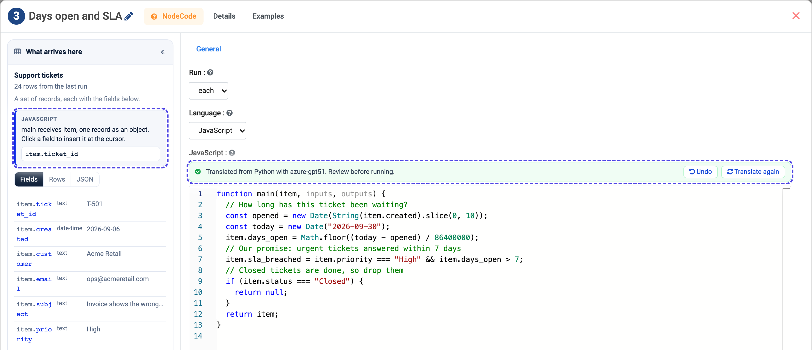

Code: Your Own Logic in Python or JavaScript
============================================

When no data step says what you need - a date calculation, a score, a custom
format - the **Code** step runs a short function you write, in Python or
JavaScript. It sits in the **Data Transformation** group.

.. contents:: On this page
   :local:
   :depth: 1

The settings
------------

.. list-table::
   :header-rows: 1
   :widths: 22 78

   * - Setting
     - Choice
   * - **Run**
     - ``each`` - your function is called once per record. ``all`` - it is
       called once with every record, for work that needs the whole set
       (ranking, totals, comparing rows).
   * - **Language**
     - **Python** or **JavaScript**. Each language keeps its own script, so
       switching back and forth loses nothing.

The left panel shows the fields in the form the language reads them -
``item["priority"]`` in Python, ``item.priority`` in JavaScript. Click a field
to insert it at the cursor in the editor.

Write a ``main`` function
-------------------------

The script is a function named ``main``. What it receives and returns depends on
**Run**:

.. code-block:: python

   # Run: each - one record at a time
   def main(item, inputs, outputs):
       item["days_open"] = (today - opened).days
       if item["status"] == "Closed":
           return None          # drop this record
       return item              # keep it, with the new fields

.. code-block:: python

   # Run: all - every record at once
   def main(items, inputs, outputs):
       items.sort(key=lambda r: r["amount"], reverse=True)
       for rank, r in enumerate(items, 1):
           r["rank"] = rank
       return items

.. code-block:: javascript

   // JavaScript, Run: each
   function main(item, inputs, outputs) {
     item.days_open = Math.floor((today - opened) / 86400000);
     return item.status === "Closed" ? null : item;
   }

.. list-table::
   :header-rows: 1
   :widths: 26 74

   * - Name
     - Holds
   * - ``item`` / ``items``
     - The current record, or all records.
   * - ``inputs``
     - The run's inputs: ``inputs["userQuery"]`` and the Trigger's named values.
   * - ``outputs``
     - What earlier steps produced, by step number.

**What you return** is what flows on: a record, a list of records, or ``None``
(``null`` in JavaScript) to drop the record. A function with no ``return``
passes the records on as it left them.

Python has ``json``, ``re``, ``math``, ``datetime`` and Polars (``pl``) ready to
use. JavaScript sees the same records as plain objects; dates and decimals
arrive as ISO text and numbers.

.. note::

   A Code step is time-limited and its rows are capped, like every agent step.
   It runs with the same trust as the Python node in workflows, so it is a
   place for logic, not for calling systems - use an
   :doc:`App Action </agentic-ai-guide/app-actions>` or a REST API Client for
   that.

Translate between Python and JavaScript
---------------------------------------

Wrote it in Python but your team reads JavaScript (or the other way round)?
Press **Translate to JavaScript** above the editor, pick a model connection,
and press **Translate**.

The step switches to the other language with the translation in its editor.
Your original script is kept, and **Undo** puts everything back.

   The translation keeps the ``main`` function, the comments and the results. Read it before you run it.

The translation is told about the places the two languages differ -
rounding, sorting, empty lists, date parsing - so both versions return the same
records. Nothing is translated unless you ask.

Next
----

The Code step sees the same **What arrives here** panel as every other step -
:doc:`/agentic-ai-guide/passing-data`.
