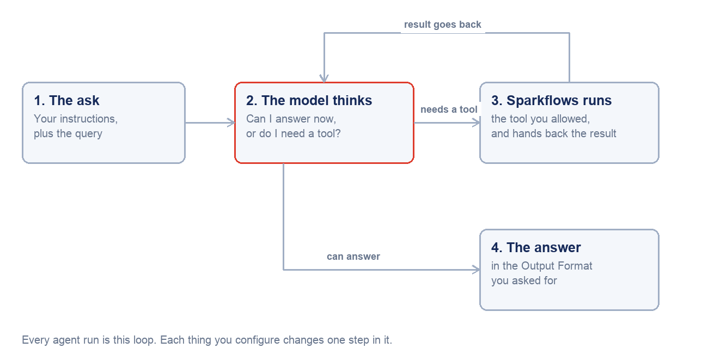

How Agents Work in Sparkflows
=============================

Read this page once before you build anything. It defines the five words that
every other page in this guide depends on, and it explains the one decision you
have to make at the start of every project: **Agent Studio or Agent
Orchestration?**

.. contents:: On this page
   :local:
   :depth: 1

The mental model
----------------

An agent in Sparkflows is a **language model that has been given a job, a set of
tools it is allowed to use, and somewhere to send the answer**. Nothing more
mysterious than that.

When an agent runs, one loop repeats until the job is done:

#. The model reads its **instructions** and the **query** it was given.
#. It decides whether it can answer now, or whether it needs a **tool**.
#. If it needs a tool, Sparkflows runs that tool and hands the result back.
#. The model reads the result and decides again.
#. When it has an answer, it writes it in the **output format** you asked for.

   Every agent run is this loop. Everything you configure changes one step in it.

This matters because it tells you where to look when an agent misbehaves:

.. list-table::
   :header-rows: 1
   :widths: 40 60

   * - Symptom
     - The step to look at
   * - Agent answers the wrong question
     - Instructions, or the Input query
   * - Agent invents facts
     - Knowledge — it had nothing real to read
   * - Agent knows the answer but cannot act
     - Tools — the operation was never ticked
   * - Agent calls the right tool with wrong arguments
     - Instructions, or the tool's own description
   * - Answer is right but unusable downstream
     - Output Format

The five words
--------------

**Agent**
   One unit of work you can run, schedule, or call over REST. In the agents list
   every row is an agent, whether it was built in Agent Studio or on the
   orchestration canvas.

**Node**
   One box on the orchestration canvas. An Agent Node is one LLM call with its
   own tools and prompt. A Condition is a branch. Human Approval is a pause.

**Tool**
   Something the agent is *allowed to do* — post a Slack message, read a JDBC
   table, create a ServiceNow incident, run one of your saved workflows. Tools
   are the difference between an agent that talks and an agent that works.

**Connection**
   The stored credential a tool uses. You create it once; every agent reuses it.
   Agents never hold credentials themselves.

**Run**
   One execution of an agent, with its inputs, its tool calls, its approvals, and
   its output — all recorded, all replayable from the Executions tab.

Agent Studio or Agent Orchestration?
------------------------------------

Both live behind the same **Create Agents** button, and both produce a row in the
same agents list. The difference is how much structure you need.

.. list-table::
   :header-rows: 1
   :widths: 50 50

   * - Agent Studio
     - Agent Orchestration
   * - A form. One agent, one prompt, one set of tools.
     - A canvas. Many nodes wired together.
   * - The model decides the order of its own tool calls.
     - **You** decide the order, and where the flow branches.
   * - No approvals, no branching, no fan-out.
     - Condition, Router, Human Approval, Supervisor, loops.
   * - Minutes to build.
     - The right tool when the process has rules of its own.

**Start in Agent Studio.** Most useful agents are one well-instructed model with
three or four tools. Move to Agent Orchestration the moment you can say one of
these sentences about your process:

* "*...and if the amount is over X, a person has to approve it.*"
* "*...and depending on the category, it should go down a different path.*"
* "*...and these three specialists each handle part of it.*"

Those three sentences are, in order, :doc:`Human Approval
</agentic-ai-guide/human-in-the-loop>`, :doc:`Condition and Router
</agentic-ai-guide/control-flow>`, and the :doc:`Supervisor
</agentic-ai-guide/multi-agent-orchestration>` node.

.. note::

   You are not locked in. An agent built in Agent Studio can be opened on the
   canvas later, and a workflow you already have can be attached to either one as
   a tool. Nothing you build in the simple path is wasted.

Where the pieces live
---------------------

Everything in this guide sits inside a **project**. Open a project and the left
sidebar gives you the four places that matter for agents:

.. list-table::
   :header-rows: 1
   :widths: 22 78

   * - Sidebar item
     - What it holds
   * - **Agents**
     - Your agents, their runs, their schedules, and their analytics.
   * - **Workflows**
     - Visual data pipelines. Any of them can become a tool an agent calls.
   * - **Datasets**
     - Tables and files the workflows and agents read.
   * - **Settings**
     - Project-level configuration, including who can see what.

Agents, Workflows and Datasets are the three you will use constantly.

Next: create a connection
-------------------------

Build one. :doc:`/agentic-ai-guide/quickstart` takes a blank Agent Studio form to
a working, tool-using agent in about ten minutes.
