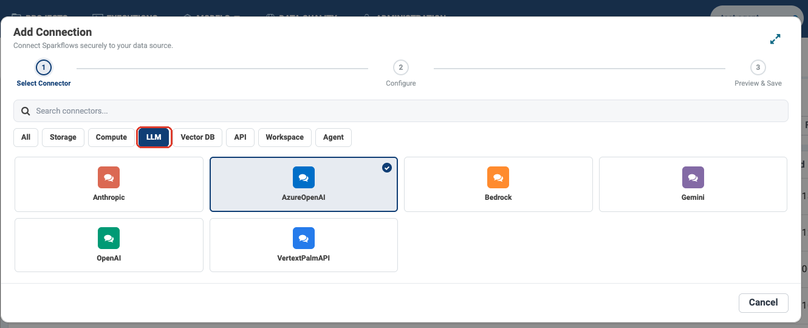
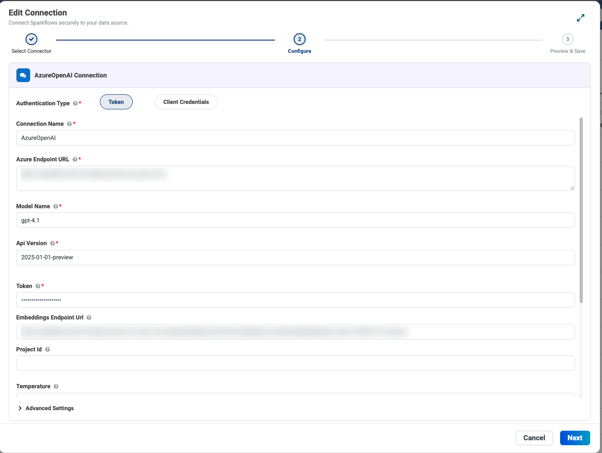
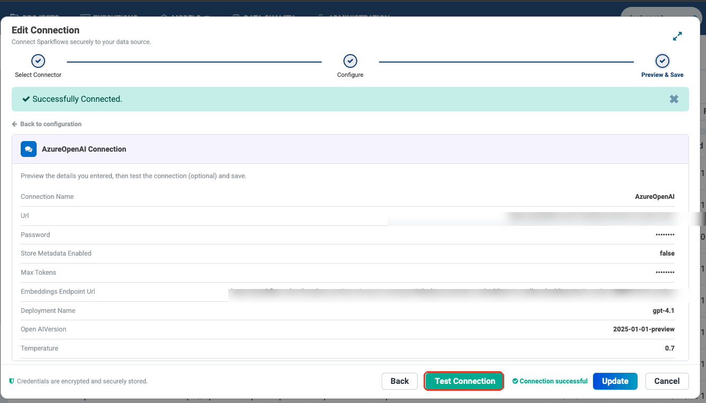

Step 1: Create a Connection
===========================

Before you can build an agent you need at least one thing: a **connection to a
language model**. A connection is a stored credential — agents reference it by
name, and the platform supplies the secret at run time.

That separation is the point. You can share an agent without sharing a
password, and rotate a password without touching a single agent.

.. note::

   Creating connections needs administrator access.

.. contents:: On this page
   :local:
   :depth: 1

Where connections live
----------------------

Go to **Administration** → **Global/Group Connections**. The list shows every
connection you can use, with its type (``azureOpenAI``, ``mysql``,
``postgresql``, ``mcp``, ``salesforce``, ``pinecone`` …) and the group it
belongs to.

Click **Add Connection** to start the three-step wizard.

Step 1: Pick the connector
--------------------------

Connectors are grouped by what they are for. For an agent's model, choose the
**LLM** category.

   The **LLM** filter (boxed) narrows the list to model providers — Anthropic,
   AzureOpenAI, Bedrock, Gemini, OpenAI and VertexPalmAPI.

The other categories are for the rest of what agents reach:

.. list-table::
   :header-rows: 1
   :widths: 22 78

   * - Category
     - Use it for
   * - **LLM**
     - The model that powers every agent. **Start here.**
   * - **Storage**
     - Databases and file stores an agent reads or writes.
   * - **Vector DB**
     - Pinecone, FAISS, Milvus, Weaviate — needed for
       :doc:`Knowledge / RAG </agentic-ai-guide/rag-knowledge>`.
   * - **API**
     - HTTP endpoints.
   * - **Agent**
     - MCP servers and agent-to-agent connections.
   * - **Compute**
     - External compute for workflows an agent runs.

Step 2: Fill in the details
---------------------------

Each connector asks for what it needs. An Azure OpenAI connection looks like
this:

   Endpoint URLs are blurred here; yours will show your own resource.

.. list-table::
   :header-rows: 1
   :widths: 26 74

   * - Field
     - What to enter
   * - **Authentication Type**
     - ``Token`` for an API key, or ``Client Credentials`` for app-based auth.
   * - **Connection Name**
     - What builders will see in the agent's model dropdown. Make it
       recognisable — ``AzureOpenAI-gpt4.1`` beats ``conn2``.
   * - **Azure Endpoint URL**
     - Your Azure OpenAI resource URL.
   * - **Model Name**
     - The deployment, e.g. ``gpt-4.1``.
   * - **Api Version**
     - e.g. ``2025-01-01-preview``.
   * - **Token**
     - The API key. Stored encrypted; it is never shown again.
   * - **Embeddings Endpoint Url**
     - Only needed if this connection will also produce embeddings for
       :doc:`Knowledge </agentic-ai-guide/rag-knowledge>`.

Step 3: Test, then save
-----------------------

The last step shows everything back to you before you commit it.

   Click **Test Connection** (boxed) before saving. A green *Successfully
   Connected* means the credential works.

.. important::

   Always test. A connection that saves cleanly but was never tested will fail
   later inside an agent run, where the error is much harder to read — you will
   be looking at a failed agent, not a failed credential.

Secrets are shown as ``••••••`` in the preview and the footer confirms
*credentials are encrypted and securely stored*.

Who can use it: connection scope
--------------------------------

.. list-table::
   :header-rows: 1
   :widths: 18 82

   * - Scope
     - Who can use it
   * - **Global**
     - Everyone in the workspace.
   * - **Group**
     - Members of that group.
   * - **Project**
     - The project owner, and groups the project is shared with.

.. tip::

   Put the shared LLM connection at **Global** or **Group** scope so every
   builder can select it. Keep credentials for production systems of record at
   **Project** scope, so only the right team can point an agent at them.

Which connections agents need
-----------------------------

.. list-table::
   :header-rows: 1
   :widths: 26 34 40

   * - Type
     - Needed for
     - Detailed setup
   * - **LLM**
     - Every agent — the **Model** field.
     - :doc:`/user-guide/connection/gen-ai-connection/index`
   * - **Storage**
     - ``Read JDBC``, Snowflake, Salesforce, SharePoint tools.
     - :doc:`/user-guide/connection/storage-connection/index`
   * - **Vector Database**
     - Knowledge and RAG.
     - :doc:`/user-guide/connection/vector-database-connection/index`
   * - **Compute**
     - Workflows that run on external compute.
     - :doc:`/user-guide/connection/compute-connection/index`

The full reference for every connector type is
:doc:`/user-guide/connection/index`.

What not to do
--------------

.. caution::

   Never put a credential, API key or token into an agent's **Instructions**,
   into a **skill**, or into **AGENTS.md**. All three are prompt text: they are
   sent to the model provider on every call, they appear in run traces, and
   anyone who can open the agent can read them.

   Credentials belong in a connection. Nowhere else.

Next: build your first agent
----------------------------

You have a model connection. Now build something with it:
:doc:`/agentic-ai-guide/quickstart`.
