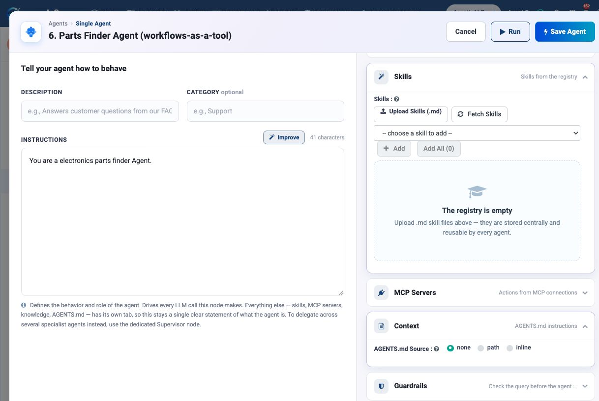
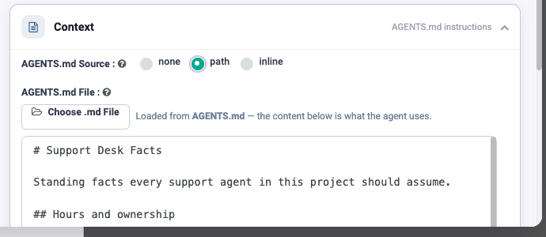
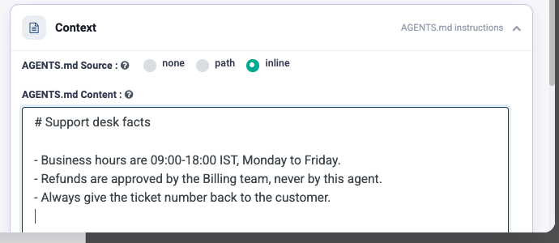

Context & AGENTS.md
===================

``AGENTS.md`` is a single Markdown file of standing context applied to an agent —
the background facts that are true no matter what the agent is being asked to do.

Configure it in the **Context** group in Agent Studio.

The three sources
-----------------

.. list-table::
   :header-rows: 1
   :widths: 15 40 45

   * - Option
     - What it does
     - Use when
   * - ``none``
     - No AGENTS.md is applied. The default.
     - The agent needs no shared background.
   * - ``path``
     - Reads the file from a path.
     - **Most cases.** One file governs many agents; edit it once.
   * - ``inline``
     - The content is pasted onto this agent.
     - The context is genuinely specific to this one agent.

.. tip::

   Prefer ``path``. The whole value of AGENTS.md is that many agents share one
   source of truth; ``inline`` copies recreate the drift you were trying to
   avoid.

Configure the shared file
-------------------------

#. Write one Markdown file named ``AGENTS.md`` holding your standing
   organisation facts and rules.
#. In the agent's **Context** group, set **AGENTS.md Source** to ``path``.
#. Click **Choose .md File** and pick the file. Sparkflows loads it and shows
   you exactly what the agent will read.
#. Save the agent, and repeat for each agent that needs the same background.

Use ``inline`` only for a short exception that belongs to one agent. Use
``none`` when an agent must not receive shared context.

.. important::

   AGENTS.md supplies context; it does not grant permissions. The agent's
   **Tools**, **MCP Servers**, and **Guardrails** still decide what it can do.

Where the setting lives
-----------------------

The same setting appears in two places, under two different names — worth
knowing, because people hunt for it:

.. list-table::
   :header-rows: 1
   :widths: 34 66

   * - Building in
     - Look under
   * - **Agent Studio**
     - the **Context** group
   * - **Agent Orchestration** (an Agent Node)
     - the **Agent Instruction** tab, below the instructions box

Using ``path``: point at a file
-------------------------------

Choose **path** and an **AGENTS.md File** field appears with a **Choose .md
File** button. Pick your Markdown file; the panel confirms it loaded and shows
the content below, so you can see what the agent is actually being given.

This is the option to prefer. One file, one place to edit, many agents.

Using ``inline``: paste it in
-----------------------------

Choose **inline** and an **AGENTS.md Content** editor appears. Type or paste
the Markdown directly onto this agent.

Use it when the context is genuinely specific to this one agent, or when you
are still working out what the shared file should say. Once two agents need
the same text, move it to a file and switch both to ``path``.

What belongs in AGENTS.md
-------------------------

Standing facts about your organisation and its systems:

.. code-block:: markdown

   # Context for agents in this workspace

   ## Who we are
   Acme Ltd, a UK insurance broker. Customers are businesses, not consumers.

   ## Systems
   - Policies live in Salesforce. Salesforce is the source of truth.
   - Claims live in ServiceNow.
   - Finance reports come from Snowflake.

   ## Conventions
   - Fiscal year starts 1 April.
   - All amounts are GBP unless the record says otherwise.
   - "Customer" means the business; "contact" means a person there.

   ## Never
   - Never quote a premium. Always route pricing questions to a human.
   - Never share another customer's data, even in aggregate.

What does **not** belong:

* Task instructions — those go in the agent's Instructions.
* Reusable procedures — those are :doc:`/agentic-ai-guide/skills`.
* Anything secret. This is prompt text, not a credential store; secrets belong
  in :doc:`/agentic-ai-guide/connections`.

Why it matters
--------------

Most agent mistakes that look like reasoning failures are missing context. An
agent that quotes a premium was never told not to. An agent that reports the
wrong quarter did not know the fiscal year starts in April. An agent that reads a
stale system did not know which one is authoritative.

Those facts are the same for every agent you will ever build in that workspace.
Writing them once, in one file, is the cheapest quality improvement available.

.. note::

   Keep it short. AGENTS.md is prepended to the model's context on every call, so
   it costs tokens on every run. A page of sharp facts beats ten pages of
   background nobody needed.

Next: reusable skills
---------------------

:doc:`/agentic-ai-guide/rag-knowledge` covers grounding agents in documents,
which is the right tool when the context is too large to paste.
