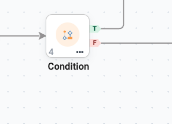
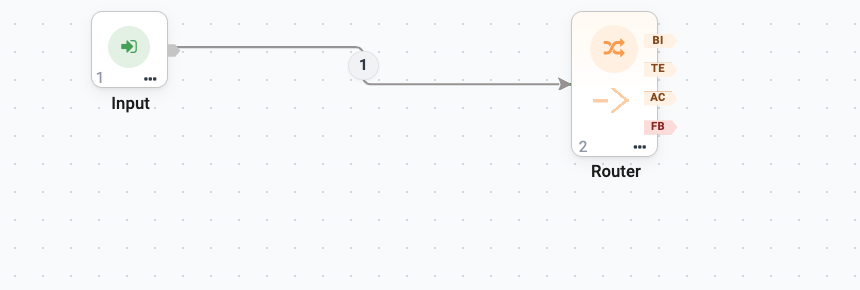

Control Flow: Condition, Router & Guardrails
============================================

Three nodes in the **Control** group decide where a run goes next. They are what
turn a straight line of agents into a process.

The first thing to know is which of them calls a model and which does not,
because that decides both the cost and the predictability of your flow.

.. list-table::
   :header-rows: 1
   :widths: 18 16 18 48

   * - Node
     - Anchors
     - LLM call?
     - Use it for
   * - **Condition**
     - **T** / **F**
     - No - deterministic
     - A rule: a threshold, a status, a keyword.
   * - **Router**
     - One per route, plus **fallback**
     - Yes - semantic
     - Sorting by meaning, when no plain rule exists.
   * - **Guardrails**
     - **A** / **B**
     - No - rule-based
     - Blocking unsafe or malformed text.

.. contents:: On this page
   :local:
   :depth: 1

Condition
---------

The Condition node sends the run down the **True (T)** or **False (F)** branch
based on a single expression evaluated against the running state. It makes no
LLM call, so the decision is deterministic - the right tool whenever a plain
rule decides the path.

.. important::

   **Both anchors must be wired.** A Condition with an unconnected branch leaves
   half your cases with nowhere to go.

Writing the expression
~~~~~~~~~~~~~~~~~~~~~~

The **Condition** field takes a **Python-subset expression**, not a sentence.

Field names from upstream node outputs and inputs are available as bare
identifiers. Nested values are reached with attribute or subscript access:

.. code-block:: python

   amount >= 1000
   status == 'approved'
   'URGENT' in classifier.analysis
   fields['tier'] == 'gold'
   confidence >= 0.85 or iteration >= 3

Arithmetic and comparisons (``==``, ``!=``, ``>``, ``>=``, and so on) are
allowed.

.. list-table::
   :header-rows: 1
   :widths: 45 55

   * - Expression
     - What it does
   * - ``amount >= 1000``
     - A numeric threshold. ``2500`` → True, ``300`` → False.
   * - ``status == 'approved'``
     - Exact status match. Anything else goes False.
   * - ``'URGENT' in classifier.analysis``
     - Keyword in an upstream agent's answer - a common way to escalate.
   * - ``confidence >= 0.85 or iteration >= 3``
     - A typical loop-exit guard: confident enough, **or** tried enough times.

Two real examples
~~~~~~~~~~~~~~~~~

Both of these come from agents that ship with the product.

**Purchase Order Approver.** An upstream Agent Node is told to end its answer
with literal markers - ``po_found=``, ``high_value=``, ``has_contract=`` - and
its instructions finish with *"The markers drive downstream routing."* The
Condition then reads:

.. code-block:: python

   'high_value=true' in analysis

**IT Support with Escalation.** A grounded-answer agent reports how well the
knowledge base covered the question, and the Condition checks:

.. code-block:: python

   'COVERAGE: FULL' in analysis

The pattern is the same both times, and it is the most reliable way to branch
on something an LLM produced:

#. Tell the Agent Node to emit a **literal marker** in a fixed format.
#. Test for that marker with ``in analysis``.

``analysis`` is the upstream node's output as ``key=value`` lines; ``fields``
is the same thing as a dictionary. Both an Agent Node and a
:doc:`Workflow Execution </agentic-ai-guide/workflows-as-tools>` node publish
them, which is why a Condition reads the same either way.

.. tip::

   Testing for a marker beats testing for prose. ``'high_value=true' in
   analysis`` keeps working when the model rewords its summary; ``'expensive'
   in analysis`` does not.

.. figure:: ../_assets/agentic-ai-guide/control-flow/condition-config.png
   :alt: The Condition node's configuration with the expression 'high_value=true' in analysis
   :width: 95%

   The Condition from the shipped Purchase Order Approver. One field, one
   expression.

Errors route False
~~~~~~~~~~~~~~~~~~

.. caution::

   If the expression raises **any** error - for example a referenced field does
   not exist - the run goes down the **False** branch rather than failing
   the run.

   This is convenient and dangerous in equal measure. A typo in a field name
   does not stop the run; it produces one that always takes the False path. If a
   Condition seems never to fire, check the field name first - the node's entry
   in the run detail records the error alongside the branch it took, so you can
   tell "the rule was not met" apart from "the expression could not be
   evaluated". See :doc:`/agentic-ai-guide/monitor-govern`.

Making the field exist
~~~~~~~~~~~~~~~~~~~~~~

A Condition can only test what an upstream node actually produced. If the
preceding Agent Node was asked for prose, there may be no ``amount`` to compare.

Set that node's **Output Format** to a JSON schema so the field is always
present and always named the same thing. See
:doc:`/agentic-ai-guide/agent-studio`.

.. tip::

   Run the upstream agent at a low **temperature** when a Condition depends on
   its output. At ``0.7``, identical inputs can produce a field one day and omit
   it the next - and by the rule above, the omission silently routes False.

Router
------

Where a Condition evaluates a rule, the Router is an **LLM-driven semantic
router**. It reads the incoming query, scores it against each route's
description and example queries, and forwards execution down the matching route.

Use it when the question is "which of these is this about?" and no plain
expression can answer it.

   A Router configured with three routes. Each route adds its own output
   anchor - ``BI`` Billing, ``TE`` Technical, ``AC`` Account - and ``FB``
   (fallback) is always there. A freshly placed Router has **FB** only; the
   named anchors appear as you add routes.

Configuration
~~~~~~~~~~~~~

Open the node and go to the **Routes** tab. Each row is one route: a short
**Route Name**, and a **Description** of the cases that belong to it.

.. figure:: ../_assets/agentic-ai-guide/control-flow/router-config.png
   :alt: The Routes tab with three routes: Billing, Technical and Account
   :width: 95%

   Three routes for a support desk. The description is what the model matches
   the incoming question against, so it describes *cases*, not categories.

.. list-table::
   :header-rows: 1
   :widths: 28 72

   * - Tab / field
     - Notes
   * - **Connection**
     - The LLM used to do the matching.
   * - **Routes** → *Route name*
     - The name of each route. Output anchors are generated from this list.
   * - **Routes** → *Route description*
     - What belongs on this route. This is what the model matches against, so
       write it as a description of the cases, not a label.
   * - **Routes** → *Route examples*
     - Example queries for the route. The single most effective way to improve
       routing accuracy.
   * - **Fallback** → *Fallback description*
     - Used when no route is a good match.
   * - **Execution**
     - Temperature, max tokens, timeout for the routing call.

.. note::

   The **fallback** anchor is always present - you do not create it. Wire it.
   Real inputs stop fitting your categories sooner than you expect, and a
   fallback that leads nowhere turns an unusual question into a silent dead end.

Condition or Router?
~~~~~~~~~~~~~~~~~~~~

.. list-table::
   :header-rows: 1
   :widths: 50 50

   * - Use Condition
     - Use Router
   * - ``amount >= 10000``
     - "Is this about billing, or about a technical fault?"
   * - ``status == 'closed'``
     - "Which of our six teams owns this?"
   * - Free, instant, identical every time
     - Costs a model call, and can differ between runs

Prefer Condition whenever a rule exists. It is cheaper, faster and auditable.

Guardrails node
---------------

The Guardrails node runs **deterministic, rule-based** safety checks on
incoming text and routes down **Allowed (A)** when the text is clean or
**Blocked (B)** when a rule trips. It makes no LLM call, so it is fast and free.

.. list-table::
   :header-rows: 1
   :widths: 28 72

   * - Field
     - What it checks
   * - **Mode**
     - How the checks are applied.
   * - **Check PII**
     - Personally identifiable information in the text.
   * - **Check injection**
     - Prompt-injection attempts.
   * - **Check banned words**
     - Matches against your **Banned words** list.
   * - **Max length**
     - Rejects text over a size limit.
   * - **Refusal message**
     - What is returned when a rule trips.

Where to place it
~~~~~~~~~~~~~~~~~

Drop it **before** an Agent to guard the input, **after** an Agent to guard the
output, or both.

.. tip::

   A common and effective pattern: wire the **Blocked (B)** anchor back to a
   **Human Input** node, giving the person a chance to revise and retry rather
   than simply being refused.

.. important::

   Guardrails fail **open**. If a check cannot run, the text goes down
   **Allowed** and the reason is recorded on the run rather than the run being
   stopped. That is deliberate - a guardrail must never dead-end a flow - but it
   means guardrails are a filter, not a gate. Anything that genuinely must not
   happen without a person belongs behind a
   :doc:`Human Approval </agentic-ai-guide/human-in-the-loop>` node.

This node is distinct from the **Guardrails group** in Agent Studio, which
checks the query before the agent ever sees it. See
:doc:`/agentic-ai-guide/security-guardrails`.

Putting them together
---------------------

The Purchase Order Approver example uses the simplest useful arrangement:

.. code-block:: text

   Input
     → Agent Node   (validate the PO)
     → Agent Node   (validate the vendor)
     → Condition    amount >= 10000
         ├─ T  → Human Approval → Agent Node (post to ERP) → Output
         └─ F  → Agent Node (post to ERP) → Output

Read it aloud and it is just the business rule: *check the order, check the
vendor, and if it is big, ask a manager first.* That is the standard to aim for -
someone who has never opened Sparkflows should be able to read your canvas and
describe the process.

Next: every node in detail
--------------------------

:doc:`/agentic-ai-guide/multi-agent-orchestration` covers the canvas itself and
the Supervisor node.
