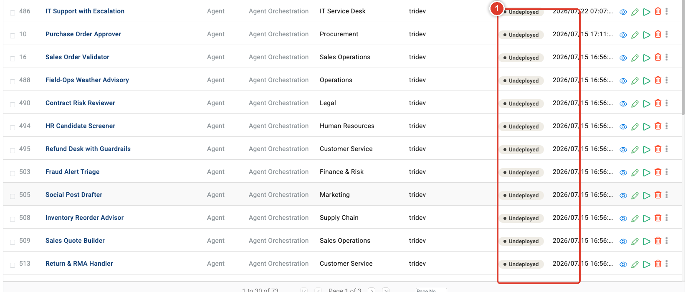

Deploy Agents
=============

A saved agent is not yet doing anything for anyone. Deploying means choosing how
it gets invoked.

The four ways to run an agent
-----------------------------

.. list-table::
   :header-rows: 1
   :widths: 24 38 38

   * - Method
     - Use when
     - Covered in
   * - **REST API**
     - Another system triggers the agent
     - :doc:`/agentic-ai-guide/developer-api`
   * - **Chat assistant**
     - People use it directly
     - :doc:`/agentic-ai-guide/chat`
   * - **Schedule**
     - It should run on a timetable
     - below
   * - **Inside another flow**
     - It is one step of a bigger process
     - :doc:`/agentic-ai-guide/multi-agent-orchestration`

Deployment status
-----------------

Every row in the Agents list carries a deployment status. An agent shown as
**Undeployed** can still be run by hand from the UI; deploying is what makes it
available to callers outside it.

Scheduling
----------

To run an agent on a timetable with nobody watching, see
:doc:`/agentic-ai-guide/schedule-agents`.

Moving between environments
---------------------------

**Export** and **Import** on the Agents page move agents between projects and
environments.

What travels with the agent and what does not:

.. list-table::
   :header-rows: 1
   :widths: 40 60

   * - Travels
     - Does not travel
   * - Instructions, tool selections, node layout, parameters
     - Connection credentials — these must exist in the target environment
   * - Output formats and schemas
     - Knowledge indexes — these must be built there
   * - Skills attached by reference
     - Anything scoped to the source project only

After importing, check the model connection and every tool connection before
running. A missing credential is the usual cause of an imported agent failing
its first run.

Before you deploy
-----------------

.. list-table::
   :header-rows: 1
   :widths: 8 92

   * - ✓
     - Check
   * - ☐
     - It passes your test set, not just one happy-path query.
   * - ☐
     - Someone other than the author has run it.
   * - ☐
     - Consequential actions are behind an approval gate.
   * - ☐
     - Every ticked operation is justified.
   * - ☐
     - Failures reach a human who can act.
   * - ☐
     - You know how to turn it off.

Next: keep it running
---------------------

:doc:`/agentic-ai-guide/monitor-govern`.
