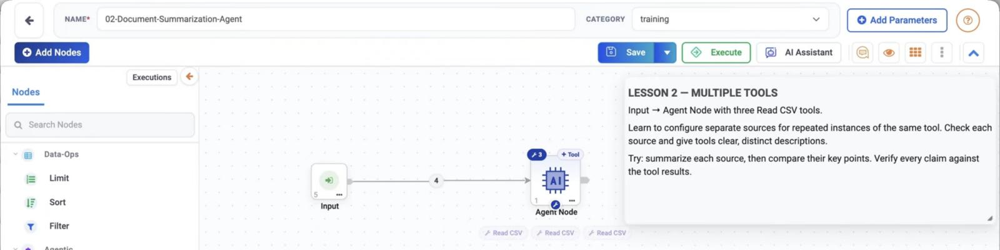
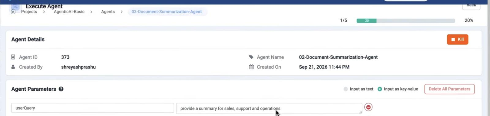
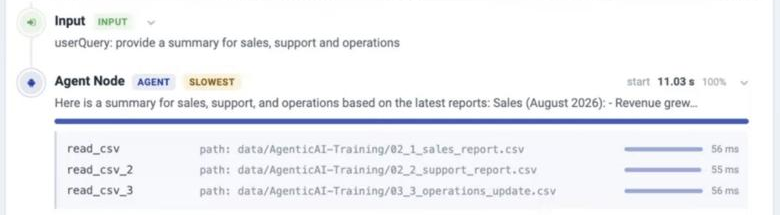
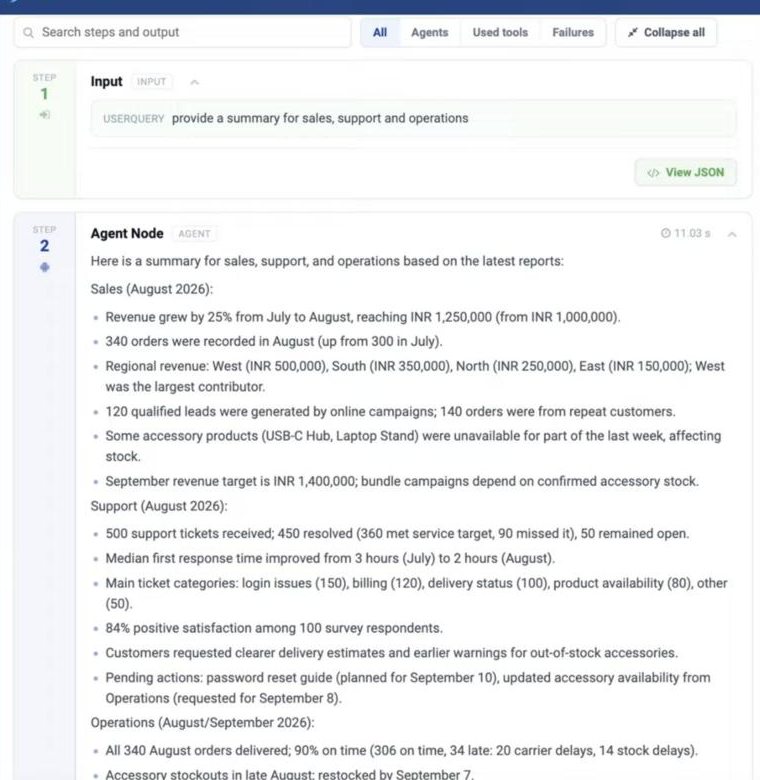

.. rst-class:: agentic-tutorial

Document Summarization Agent
============================

.. container:: tutorial-intro

   Build one agent that reads a sales report, a support report and an
   operations update, summarizes each one and combines them into a single
   cross-source answer. One Agent Node does the work, using three
   ``Read CSV`` tools.

.. container:: tutorial-start

   **Expected practice result:** one summary with a **Sales**, a **Support**
   and an **Operations** section, built from all three files. The run shows
   three tool calls: ``read_csv``, ``read_csv_2`` and ``read_csv_3``. Nothing
   is written or sent anywhere.

Prepare the reports
-------------------

Download the three practice files. They contain fictional figures for
August 2026:

* :download:`02_1_sales_report.csv <samples/02_1_sales_report.csv>`: revenue,
  orders, regional totals and the September target
* :download:`02_2_support_report.csv <samples/02_2_support_report.csv>`: ticket
  volume, resolution, response time and open actions
* :download:`03_3_operations_update.csv <samples/03_3_operations_update.csv>`:
  delivery performance, stock and carrier follow-ups

You need:

.. list-table:: Prepare only what this tutorial uses
   :header-rows: 1
   :widths: 30 70

   * - Item
     - What to prepare
   * - Project
     - A training project, for example ``AgenticAI-Basic``.
   * - Files
     - Upload the three CSVs to ``data/AgenticAI-Training/``. See
       :doc:`/user-guide/quick-start/2-upload-data-files`.
   * - LLM connection
     - An approved :doc:`LLM connection </agentic-ai-guide/quick-start/model-connections>`,
       for example ``AZURE_FOUNDRY-4.1`` (GPT-4.1).

Build the flow
--------------

Open your project's **Agents** page and choose
**Create Agents → Agent Orchestration**. Name the agent
**02-Document-Summarization-Agent**. From **Add Nodes**, add:

**Input → Agent Node**

Then add three ``Read CSV`` tools to the Agent Node. These are tools, not
steps: the model decides when to call each one.

   The Input node feeds the Agent Node. The three **Read CSV** chips under the
   Agent Node are its tools; the **3** badge shows how many are attached.

1. Pass in the request
----------------------

Open **Input** and add one parameter:

* **Key:** ``userQuery``
* **Value:** ``provide a summary for sales, support and operations``

You can change the value each time you run the agent.

2. Add one tool per report
--------------------------

On the Agent Node, click **+ Tool**, choose **Built In → Read CSV**, then
choose **Fixed settings**. Click **Browse File System**, pick the sales file
and save. Repeat for the other two files.

.. list-table:: Read CSV tools
   :header-rows: 1
   :widths: 22 42 36

   * - Tool
     - File
     - Description
   * - ``read_csv``
     - ``data/AgenticAI-Training/02_1_sales_report.csv``
     - ``Reads the August sales report``
   * - ``read_csv_2``
     - ``data/AgenticAI-Training/02_2_support_report.csv``
     - ``Reads the August support report``
   * - ``read_csv_3``
     - ``data/AgenticAI-Training/03_3_operations_update.csv``
     - ``Reads the operations update``

Give each tool a clear, distinct description. The model sees three tools of
the same type, so the description is the only way it can tell them apart.
See :doc:`/agentic-ai-guide/tools-integrations/tools-connectors`.

3. Configure the model
----------------------

Open the Agent Node. On the **LLM Configuration** tab, set:

.. list-table:: LLM settings
   :header-rows: 1
   :widths: 40 60

   * - Setting
     - Value
   * - **Select Connection**
     - Your LLM connection, for example ``AZURE_FOUNDRY-4.1``
   * - **Temperature**
     - ``0``
   * - **Top P**
     - ``1.0``
   * - **Max Tokens**
     - ``500``
   * - **Timeout (seconds)**
     - ``180``
   * - **Max Tool Rounds**
     - ``8``
   * - **Output Format**
     - **text**

**Temperature 0** keeps the summary close to the source figures. **Max Tool
Rounds 8** leaves room for the three reads.

4. Write the instructions
-------------------------

Open the **Agent Instruction** tab and enter:

.. code-block:: text

   You are a document summarization agent.
   Read all three sources with the Read CSV tools before writing anything:
   - the sales report
   - the support report
   - the operations update
   Summarize each one under its own heading: Sales, Support, Operations.
   Then compare their key points and finish with a short list of priorities.
   Verify every claim against the tool results. Do not invent figures.

Save the Agent Node, then save the agent.

5. Run the agent
----------------

Click **Execute**. On the **Execute Agent** screen, check that
**Agent Parameters** shows ``userQuery`` with your request, then click
**Execute**.

   The run starts with the ``userQuery`` value from the Input node.

The **Execution Timeline** shows each step as it completes. Expand the Agent
Node to see its tool calls:

   One call per report. Each line shows the file the tool read.

.. container:: tutorial-checkpoint

   **Checkpoint:** the timeline shows **three** tool calls, one for each file.
   If one is missing, check that tool's file path and description before
   changing the instructions.

6. Read the result
------------------

The Agent Node's output combines all three reports into one summary:

   **Sales** covers revenue and order trends. **Support** covers ticket
   volume and resolution. **Operations** covers delivery performance and
   accessory restocking.

.. container:: tutorial-checkpoint

   **Final check:** compare a few figures with the files.

   * Sales: August revenue **INR 1,250,000**, up **25%** from July; **340**
     orders.
   * Support: **500** tickets received, **450** resolved, **50** open.
   * Operations: **306** of **340** orders on time (**90%**).

   Every figure in the summary should appear in one of the three files.

If the summary looks wrong
--------------------------

.. dropdown:: The summary covers only one or two reports

   The agent did not call every tool. Check that each tool has a distinct
   description, that the instructions name all three reports, and that
   **Max Tool Rounds** is at least ``3``.

.. dropdown:: A tool call fails or returns no rows

   The file path is wrong or the file is missing. Open the tool and use
   **Browse File System** to pick the file again. Check the folder name,
   ``data/AgenticAI-Training/``, and the exact filename.

.. dropdown:: The summary contains figures that are not in the files

   Set **Temperature** to ``0`` and keep the line *Verify every claim against
   the tool results* in the instructions. Compare the summary with the tool
   results in the timeline.

.. dropdown:: The summary stops mid-sentence

   **Max Tokens** is too low for your reports. Raise it, for example to
   ``1000``, and run again.

Next, try it with your own reports: replace the three files, update each
tool's description, and keep one tool per source.
