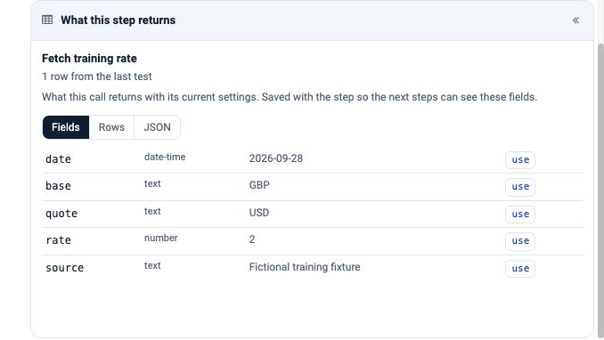
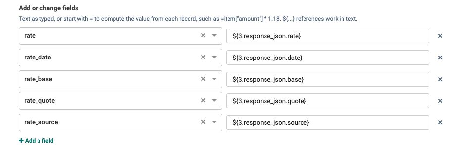
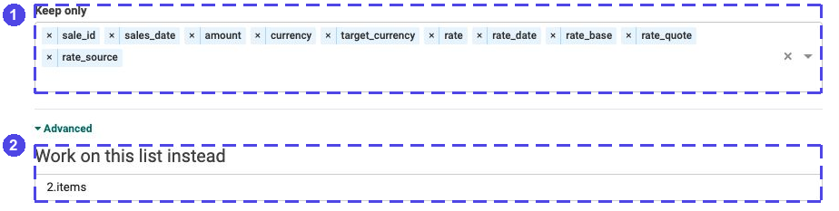
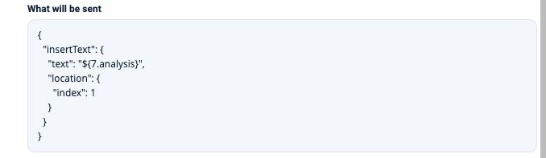
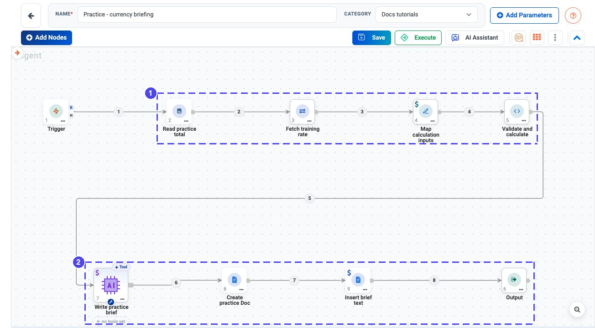

.. rst-class:: agentic-tutorial

Write a Sales and Exchange-Rate Brief
======================================

.. container:: tutorial-intro

   Read one practice sales total, fetch a rate, check the inputs in Code
   and turn the checked result into a short Google Doc.

.. container:: tutorial-start

   **The numbers are fictional.** This exercise uses ``100 GBP`` and a
   made-up rate of ``2 USD per GBP`` dated **28 September 2026**. It does
   not fetch today's market rate or recommend a financial decision.

   **You will learn:** an HTTP read, references to two earlier steps,
   validation before AI, and creating a document before inserting its text.

Prepare the two small inputs
----------------------------

Use a training project with a PostgreSQL test connection and an approved
LLM connection. Add a Google connection only when you reach the publishing
step. Connection instructions are in :doc:`../database-connectors-setup`
and :doc:`../google-connectors-setup`.

.. dropdown:: Prepare the practice sales table

   Ask your administrator to create this **new test table** and insert
   its one fictional row. Do not run this against a production table.

   .. code-block:: sql

      CREATE TABLE public.docs_tutorial_currency_sales (
          sale_id text PRIMARY KEY,
          sales_date varchar(10) NOT NULL,
          amount double precision NOT NULL,
          currency varchar(3) NOT NULL,
          target_currency varchar(3) NOT NULL
      );
      INSERT INTO public.docs_tutorial_currency_sales
          (sale_id, sales_date, amount, currency, target_currency)
      VALUES ('FX-1', '2026-09-28', 100, 'GBP', 'USD');

   The date is deliberately stored as an ISO date string for this small
   exercise. The Code step expects exactly one row for this date.

.. dropdown:: Serve the fictional rate on the engine machine

   Download :download:`rate.json <samples/rate.json>` into a new folder
   named ``docs-rate-fixture`` on the machine running the Agent engine.
   The folder should contain only this public, fictional fixture.

   .. literalinclude:: samples/rate.json
      :language: json

   With Python 3 available, run this from the folder's parent directory:

   .. code-block:: console

      python3 -m http.server 8890 --bind 127.0.0.1 --directory docs-rate-fixture

   Leave the terminal open during testing. If the port is occupied, choose
   an unused port and use that same port in the request URL below.
   Stop this temporary server with ``Ctrl+C`` when you finish.

   **A remote engine is not your browser's computer.** ``127.0.0.1`` points
   to the machine making the request. For a hosted or containerised engine,
   ask your administrator to serve this same fixture at an approved URL
   reachable from that engine; use that URL instead. No API key is required
   for this fixture.

1. Read the sales total
-----------------------

Create an Agent Orchestration named ``Practice - currency briefing``.
Start with **Trigger → App Action → REST API Client → Set Fields → Code →
Output**. Add these six nodes in that order so their IDs match the examples.
Keep the Trigger manual; do not add a schedule.

In node **2**, choose **PostgreSQL → List rows**. Name it
``Read practice total`` and select your PostgreSQL test connection.

.. list-table:: Read settings
   :header-rows: 1
   :widths: 28 72

   * - Setting
     - Value
   * - Table / Schema
     - ``docs_tutorial_currency_sales`` / ``public``
   * - Where
     - ``sales_date = '2026-09-28'``
   * - Order by
     - ``sale_id asc``
   * - Columns to return
     - ``sale_id,sales_date,amount,currency,target_currency``
   * - Limit
     - ``10``

Choose **Load the fields** and check the sample. Save the action only after
it shows the single ``FX-1`` row, ``100``, ``GBP`` and ``USD``. Keeping the
limit above one lets the validation catch accidental duplicate inputs.

2. Fetch and inspect the practice rate
--------------------------------------

Search the node list for **REST API Client**. Its configuration dialog is
called **REST API call**. In node **3**, set:

* **Step name:** ``Fetch training rate``.
* **Request:** ``GET``; **URL:** ``http://127.0.0.1:8890/rate.json``
  (or the approved engine-reachable fixture URL).
* Leave **Headers (optional)** and **Rows from (optional)** empty.

Choose **Test this step**. This sends the HTTP request; it does not run the
whole workflow. Confirm the returned date, direction, rate and source,
then choose **Save step**.

.. figure:: ../../_assets/agentic-ai-guide/tutorials/finance-briefing/request.png
   :alt: Actual REST API call form with GET selected and the local rate.json URL; Rows from is blank.

   **1** Read the fixture with GET. **2** Keep the whole JSON answer rather
   than selecting a nested list.

   A real read-only test of the fictional fixture. The direction is
   **GBP → USD**, not the reverse. An HTTP success alone does not establish
   that a rate has the correct date or direction.

3. Bring the sales and rate fields together
--------------------------------------------

Name node **4** ``Map calculation inputs``. In **Advanced → Work on this
list instead**, enter ``2.items``. This keeps the original sales record;
without it, the immediately preceding rate response would become the input.

Under **Add or change fields**, add these five rows:

.. list-table:: Rate fields added to the sales record
   :header-rows: 1
   :widths: 30 70

   * - Field
     - Value
   * - ``rate``
     - ``${3.response_json.rate}``
   * - ``rate_date``
     - ``${3.response_json.date}``
   * - ``rate_base``
     - ``${3.response_json.base}``
   * - ``rate_quote``
     - ``${3.response_json.quote}``
   * - ``rate_source``
     - ``${3.response_json.source}``

   Each value names the rate step explicitly. The Code step will check
   these values before any document is created.

In **Keep only**, retain ``sale_id``, ``sales_date``, ``amount``, ``currency``,
``target_currency`` and all five rate fields. Leave rename and remove rules
empty. Save the node.

   **1** Keep the source facts alongside the rate. **2** Work on the sales
   list from node 2, not the HTTP answer.

4. Validate and calculate before calling AI
-------------------------------------------

Name node **5** ``Validate and calculate``. Set **Run = all**,
**Language = Python**, **Time limit (seconds) = 60** and **Rows handed to
the script = 10**. Leave **Input List (optional)** blank.
Replace the starter function with the supplied function below.

.. dropdown:: Copy the validation and calculation function

   .. literalinclude:: samples/calculate-practice-currency.py
      :language: python

   :download:`Download the same function <samples/calculate-practice-currency.py>`.
   The Code node already provides ``math``. This function is for this
   specific fixture: one row, GBP → USD and the fixed training date.

The function rejects missing or mismatched dates, reversed currencies,
an unexpected source, extra rows and non-positive or non-finite numbers.
It converts numeric text to numbers, multiplies ``amount × rate`` and adds
``converted_amount``. The Agent will explain this result, not calculate it.

In **Output (6)**, add one mapping: **Name this output = calculation**;
select **Validate and calculate (5)** as its source. Save the workflow and
run this **six-node preview only**. Do not add Google Docs yet.

.. container:: tutorial-checkpoint

   **Check before publishing:** the returned calculation must contain
   ``amount: 100``, ``rate: 2``, ``converted_amount: 200``, both dates
   ``2026-09-28`` and GBP → USD. Try a missing rate or the wrong date in a
   separate fixture copy: the Code step must fail rather than invent a value.

This is a two-decimal display calculation for training, not an accounting
implementation. A production process needs its own validated rate source,
date policy, decimal arithmetic and rounding rules.

5. Explain the result and publish one test document
----------------------------------------------------

After the preview passes, insert nodes **7**, **8** and **9** between Code
and Output. The completed path is **5 → 7 → 8 → 9 → 6**; remove the old
direct wire from **5 → 6**. Keep the first five nodes unchanged.

**Agent Node (7) — Write practice brief.** Select your approved LLM
connection, use text output and no tools. Use these instructions:

.. code-block:: text

   Write a short internal training brief using only this checked record: ${5.items}
   Title it Practice currency brief - 28 September 2026.
   State the original amount and currency, target currency, rate and its direction,
   rate date, source and converted_amount. Preserve these values exactly.
   Explain the multiplication in one sentence; do not recalculate or change the total.
   End with: Fictional training rate - not market data or financial advice.
   Do not invent market news, recommendations or missing facts. Do not call tools.

**App Action (8) — Create practice Doc.** Choose **Google Docs → Create a
document**, select your Google test connection, and set **Title** to
``Practice currency brief - 2026-09-28`` under **Fields to set**.
Check **What will be sent** and save the action.

**App Action (9) — Insert brief text.** Choose **Google Docs → Update a
document** and the same Google connection. Set **Document** to
``${8.fields.result_id}``: this is the new document's ID, not its title.
Under **Fields to set**, choose **Edit as JSON (advanced)** and paste this
small object exactly. It keeps the text and its insertion location together.

.. code-block:: json

   {
     "insertText": {
       "text": "${7.analysis}",
       "location": {"index": 1}
     }
   }

Check the preview and save. The ``1`` is a number, not quoted text.
The document comes from node 8; the brief text still comes from node 7.
Do not leave this mapping empty or send the created-document metadata as text.

   The update contains the brief and its insertion location. This is a
   configuration preview, not evidence that a Google Doc has been written.

In both Google actions, leave **Advanced settings → If a row is rejected**
set to ``stop``. In **Output (6)**,
keep ``calculation`` from node 5 and add ``document`` from node 8 and
``update`` from node 9. This lets you compare the original calculation with
the created document and the write result.

6. Check the completed workflow and result
------------------------------------------

   The actual configured practice workflow. Read each row left to right:
   **1** collect and validate the inputs; **2** explain the checked result
   and create/update one document. Google connections must be selected
   before running; this canvas is not a successful-run screenshot.

.. dropdown:: Close-ups of the calculation and publishing steps

   .. figure:: ../../_assets/agentic-ai-guide/tutorials/finance-briefing/workflow-calculation.png
      :alt: Native-resolution close-up of the actual sales read, HTTP request, Set Fields and Code nodes.

      Read both sources, map them into one record, then validate and
      calculate. No AI or Google write happens in these four steps.

   .. figure:: ../../_assets/agentic-ai-guide/tutorials/finance-briefing/workflow-publish.png
      :alt: Native-resolution close-up of Agent 7, Google Docs create 8 and update 9 on the real canvas.

      Create the document first, then insert the Agent's text. Output
      follows in the overview; it is still node 6 because it was added
      for the earlier calculation preview.

Run the completed flow only when the test connections, input checks and
destination account are ready. **This run calls an LLM and writes a Google
Doc.** It does not send email or change document-sharing permissions.

.. list-table:: What to verify
   :header-rows: 1
   :widths: 30 70

   * - Check
     - Expected result
   * - Calculation
     - ``100 GBP × 2 USD per GBP = 200 USD``; both dates are 28 September 2026.
   * - Create and update
     - Both report success; the created document has a non-empty ID.
   * - Document content
     - The title, amount, rate direction, date, source and converted amount
       match ``calculation``; the fictional-data statement is present.
   * - Invalid input
     - Missing rate, another date, reversed currencies, zero/two sales rows
       or an invalid number must stop before the Agent and Google actions.

**Do not blindly rerun a failed publish.** Creating a document twice makes
two documents; inserting the same text twice can duplicate it. If creation
succeeded but the update failed, inspect that document and the execution
result before deciding what to retry. The test request preview shown above
was executed; the model and Google write steps were not.
