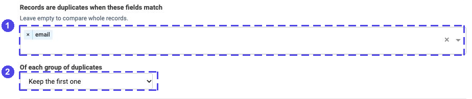
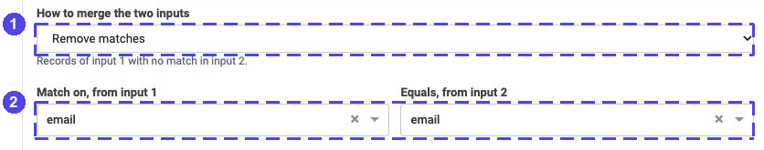
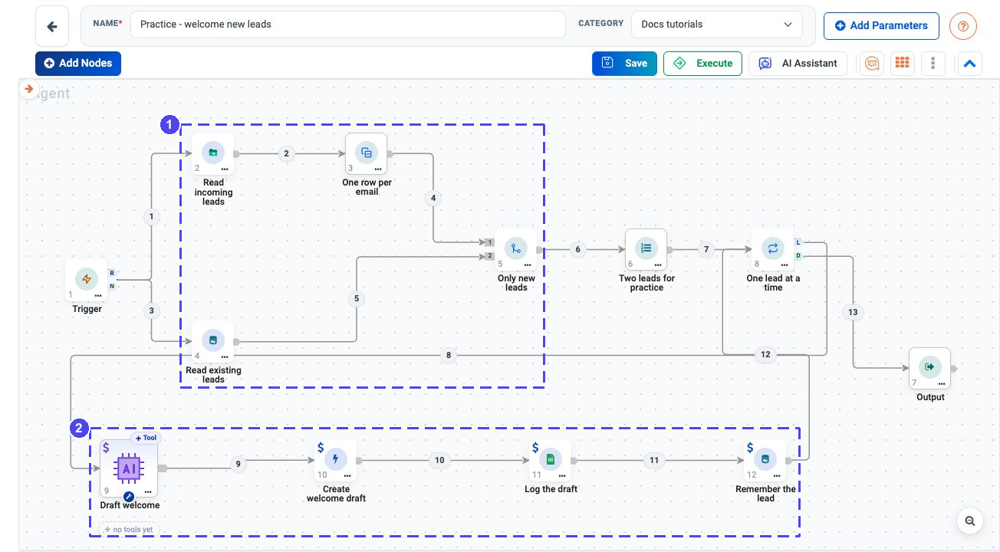
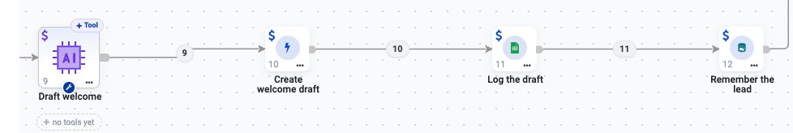
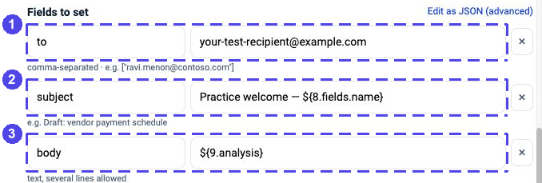
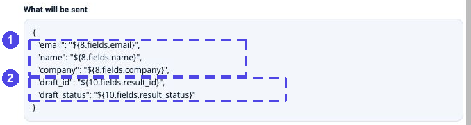
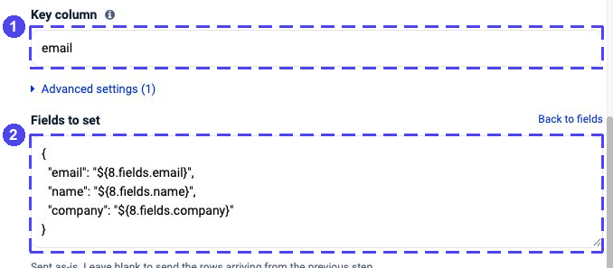

.. rst-class:: agentic-tutorial

Welcome New Leads Without Reprocessing Existing Ones
====================================================

.. container:: tutorial-intro

   Compare incoming leads with a practice CRM table. Keep only new addresses,
   draft a welcome for each, log the draft and remember the lead in MySQL.
   The model writes the welcome; it does not decide who is new.

.. container:: tutorial-start

   **Prove the comparison first.** The first run reads data and returns two
   new leads. Add Outlook, Google Sheets and the CRM write only after that
   result is correct. No email is sent automatically.

   **You will learn:** remove duplicates, compare two sources using Merge's
   numbered inputs, and preserve the original lead while later steps produce
   different results.

Prepare a small, safe test
--------------------------

Download :download:`leads.csv <samples/leads.csv>` and place it where the
engine can read it, for example ``data/docs-tutorial-leads/leads.csv``.
See :doc:`../files` if your engine runs on another computer.

The file has four rows: ``new-a@example.com`` twice,
``existing@example.com`` once and ``new-b@example.com`` once. These are
fictional source identifiers, **not recipients of your practice drafts**.
The expected comparison result is exactly ``new-a@example.com`` and
``new-b@example.com``.

.. list-table:: Set up only what this example uses
   :header-rows: 1
   :widths: 28 72

   * - Item
     - What to prepare
   * - MySQL
     - A test connection with a new ``docs_tutorial_leads`` table containing
       only the existing practice contact. Use the same connection for both
       CRM actions. See :doc:`../database-connectors-setup`.
   * - Google Sheets
     - A test spreadsheet with a tab named ``LeadLog`` and the five headers
       ``email``, ``name``, ``company``, ``draft_id``, ``draft_status``.
       Connect the account that can edit it; see :doc:`../app-setup`.
   * - Outlook Mail
     - A permitted test mailbox and a recipient address you control.
       See :doc:`../microsoft-connectors-setup`.
   * - AI model
     - An approved :doc:`LLM connection <../connections>`. This example uses
       only fictional contacts, never live customer data.

.. dropdown:: Create and seed the practice CRM table

   Ask your administrator to run this once in the test database. If that
   table name is already used, choose a new name and use it in both CRM
   actions. Do not empty or replace an existing table.

   .. code-block:: sql

      CREATE TABLE docs_tutorial_leads (
          email VARCHAR(255) PRIMARY KEY,
          name VARCHAR(255) NOT NULL,
          company VARCHAR(255) NOT NULL
      );
      INSERT INTO docs_tutorial_leads (email, name, company)
      VALUES ('existing@example.com', 'Existing Training Contact',
              'Example Company B');

   The sample uses lowercase, whitespace-free addresses. Apply the same
   normalization policy to both sources before using other data: a spelling
   or whitespace difference can make the same person appear new.

1. Build the comparison before adding writes
--------------------------------------------

Choose **Agents → Create Agents → Agent Orchestration**. Name the flow
**Practice - welcome new leads**. Use **Add Nodes** to add these seven nodes
in order; rename each to the name in the middle column.

.. list-table:: Preview nodes
   :header-rows: 1
   :widths: 10 45 45

   * - Order
     - Name to use
     - Node type
   * - 1
     - Trigger
     - Trigger
   * - 2
     - Read incoming leads
     - Read/Write Files
   * - 3
     - One row per email
     - Remove Duplicates
   * - 4
     - Read existing leads
     - App Action
   * - 5
     - Only new leads
     - Merge
   * - 6
     - Two leads for practice
     - Limit
   * - 7
     - Output
     - Output

Open **Trigger**, choose **Manually** and save. Connect two paths from it:

* **Trigger → Read incoming leads → One row per email → Merge input 1**.
* **Trigger → Read existing leads → Merge input 2**.

Then connect **Only new leads → Two leads for practice → Output**.
Both sources must run; Merge waits for both numbered inputs.

2. Read the sources and remove repeated emails
----------------------------------------------

In **Read incoming leads**, choose **Read files → CSV or TSV**. Set the path
to ``data/docs-tutorial-leads/leads.csv``, **Separator** to comma and
**First row is the header** on. Click **Test this step** and check four rows
with ``email``, ``name`` and ``company``, then choose **Save step**. This
reads the file; it does not run the later app actions.

Open **One row per email**. Under **Records are duplicates when these fields
match**, enter ``email`` and press Enter. Under **Of each group of duplicates**,
choose **Keep the first one**. Save.

   **1** compares email addresses, not complete rows. **2** keeps the first
   record for each address. The four CSV rows become three distinct leads.

Open **Read existing leads**, choose **MySQL → List rows**, then select the
test connection. Set **Table** to ``docs_tutorial_leads``, **Columns to return**
to ``email``, **Order by** to ``email asc`` and **Limit** to ``10``. Leave
**Where** blank; use the connection's database unless your administrator
requires an explicit schema.

Click **Load the fields from MySQL**. Check that the result contains only
``existing@example.com``, then choose **Save action**. Loading performs a
real read; it does not write to the table.

.. important::

   Ten rows is enough only for this tiny practice table. If the CRM read is
   truncated, an existing lead omitted from that read will appear new.
   Before using a real CRM, compare against its complete relevant key set
   or perform the comparison in a database query. Limit the **new leads
   after comparison**, not the existing keys needed to make it correct.

3. Keep only genuinely new leads
--------------------------------

Open **Only new leads** and set:

* **How to merge the two inputs:** ``Remove matches``.
* **Match on, from input 1:** ``email``.
* **Equals, from input 2:** ``email``.

   **1** selects the records missing from input 2. **2** matches the
   same email key on both sides. Check the input tabs: incoming leads belong
   to **1**, existing CRM leads to **2**. Reversing them changes the question.

Save. In **Two leads for practice**, set **Max Items** to ``2``. In **Output**,
add **Name this output = new_leads** and **Take it from which node = Two
leads for practice**. Save the node and flow, then run manually.

.. container:: tutorial-checkpoint

   **Preview checkpoint:** exactly two records, for ``new-a@example.com`` and
   ``new-b@example.com``, each with its original ``name`` and ``company``.
   The repeated address appears once; the existing CRM address is absent.
   Stop here if any check fails.

4. Add the per-lead processing path
-----------------------------------

Add these five nodes in order: **One lead at a time (Loop Over Items)**,
**Draft welcome (Agent Node)**, **Create welcome draft (App Action)**,
**Log the draft (App Action)** and **Remember the lead (App Action)**.

Replace **Two leads for practice → Output** with **Two leads for practice →
One lead at a time**. Connect the Loop's **L** outlet through **Draft welcome
→ Create welcome draft → Log the draft → Remember the lead**, then back
into **One lead at a time**. Connect **D** to **Output**.

   The actual practice canvas. **1** compares the sources; **2** repeats the
   draft, log and CRM steps for each new lead. **D** returns the collected
   results after the Loop ends. This is a configuration, not a successful
   execution: choose your test connections and replace destination placeholders.

.. dropdown:: See the two Merge inputs more closely

   .. figure:: ../../_assets/agentic-ai-guide/tutorials/lead-onboarding/workflow-compare.png
      :alt: Actual canvas close-up shows incoming leads connected to Merge inlet 1 and existing CRM leads connected to inlet 2
      :width: 677px

      The comparison portion of the completed flow. The tiny **1** and **2**
      beside Merge identify its input ports; the grey numbers on the wires
      are connection numbers. The lower horizontal wire belongs to the Loop
      added in this step, not to the comparison.

   Read this lower row from left to right. The final CRM step returns to
   Loop **8**, while **D** goes separately to Output **7** in the overview.

Set **Items per round = 1** and **Max items = 2** in the Loop. The references
below use its node ID **8** and the Agent's ID **9**. Check your canvas numbers
and substitute yours if different; renaming a node does not change its ID.

In **Draft welcome**, select the approved LLM connection, choose **Output
Format = text**, and use these **Agent Instructions**. Do not add tools.

.. code-block:: text

   Write a short welcome draft for this fictional practice contact.
   Name: ${8.fields.name}
   Company: ${8.fields.company}
   Use only these supplied facts. Say hello and invite the contact to reply
   with what they would like to learn. Do not invent an offer, product need,
   prior relationship, deadline or meeting. Keep it under 70 words.
   Finish with: "Practice draft — review before sending."
   Return only the email body. Do not send anything.

5. Create the draft and log its result
--------------------------------------

Open **Create welcome draft → Outlook Mail → Create a draft email**. Choose
the test connection and **Mailbox**. Under **Fields to set**, add:

.. list-table:: Welcome draft fields
   :header-rows: 1
   :widths: 30 70

   * - Field
     - Value
   * - ``to``
     - Your own test recipient address, **not** the CSV email
   * - ``subject``
     - ``Practice welcome — ${8.fields.name}``
   * - ``body``
     - ``${9.analysis}``

   **1** is a placeholder for your own test recipient. **2** takes the name
   from Loop **8**; **3** takes the welcome text from Agent **9**. This action
   creates a draft, not a sent message.

Choose **Save action**. Creating a draft changes the mailbox when the flow
runs, but does not send the email. Do not select a send action.

Open **Log the draft → Google Sheets → Append rows**. Select the test
connection, enter your **Spreadsheet** URL or ID, and set **Range** to
``LeadLog``. Keep **Use the first row as column names = match** so object keys map to the five
headers you prepared. Under **Fields to set**, add these fields:

.. list-table:: Draft log mappings
   :header-rows: 1
   :widths: 30 70

   * - Field
     - Value
   * - ``email``
     - ``${8.fields.email}``
   * - ``name``
     - ``${8.fields.name}``
   * - ``company``
     - ``${8.fields.company}``
   * - ``draft_id``
     - ``${10.fields.result_id}``
   * - ``draft_status``
     - ``${10.fields.result_status}``

Here **10** is **Create welcome draft**. Use the field picker or enter the
references exactly. The lead fields come from the Loop; the draft ID and
status come from Outlook.

.. dropdown:: If the field selector does not list your log columns

   Under **Fields to set**, choose **Edit as JSON (advanced)** and paste
   this object. It is the same mapping as the table, not an extra step.
   Keep the quotation marks and replace node numbers only if yours differ.

   .. code-block:: json

      {
        "email": "${8.fields.email}",
        "name": "${8.fields.name}",
        "company": "${8.fields.company}",
        "draft_id": "${10.fields.result_id}",
        "draft_status": "${10.fields.result_status}"
      }

Check **What will be sent**, then **Save action**. A missing connection must
be selected before Save is enabled.

   The actual **What will be sent** preview. **1** preserves the source
   lead. **2** records the draft action's result. These are references,
   not fixed values copied from a previous run or execution results.

6. Remember the lead after drafting and logging succeed
--------------------------------------------------------

Open **Remember the lead → MySQL → Insert or update a row**. Use the same
test connection and ``docs_tutorial_leads`` table as the read. Set **Key
column** to ``email``. Add these explicit **Fields to set**:

* ``email`` = ``${8.fields.email}``
* ``name`` = ``${8.fields.name}``
* ``company`` = ``${8.fields.company}``

If the fields are not offered, choose **Edit as JSON (advanced)** and use:

.. code-block:: json

   {
     "email": "${8.fields.email}",
     "name": "${8.fields.name}",
     "company": "${8.fields.company}"
   }

Do not leave the mapping empty: the previous step returns Google Sheets
results, not the original CRM record. Save the action. For all three app
writes, keep the error behavior in **Advanced settings** set to stop on
failure, rather than continuing with a failed result.

   **1** matches the CRM record by email. **2** writes the original lead,
   not the Sheet's status fields. The write is configured, not executed.

In **Output**, replace the preview mapping with **Name this output =
processed** and **Take it from which node = One lead at a time**. Save the
node and flow. Before executing, check the test database, mailbox, recipient
and spreadsheet: this stage creates drafts and writes to two other apps.

Check the complete result
--------------------------

After your manual run, verify the actual destinations as well as the flow:

* **Outlook:** two new drafts addressed to your test recipient, with the
  correct fictional names and no invented claims. Nothing was sent.
* **LeadLog:** two appended rows, one per new email, each with a non-empty
  draft ID and a successful draft status. Compare the IDs with Outlook.
* **MySQL:** three rows total — the original existing contact and the two
  new leads. The original names and companies are retained.
* **Repeat comparison:** a fully successful rerun returns no new leads, so
  the Loop body must create no additional drafts or log entries.

.. container:: tutorial-checkpoint

   **Not a cross-app transaction.** If a draft succeeds but the log or CRM
   write fails, retrying the whole flow can create another draft. Inspect
   completed steps before retrying. For production, track a stable processing
   key and completed stages, and prevent overlapping runs; this tutorial
   alone does not provide exactly-once processing.

.. dropdown:: If the comparison or results are unexpected

   **Three leads instead of two:** check the CRM read includes the existing
   address, that both Merge keys are ``email``, and that input 1 is the
   deduplicated incoming list. Check case and whitespace in both sources.

   **Only one input arrives:** connect both reads from Trigger and check
   their execution results. Merge cannot compare a source that never ran.

   **Blank name, company or email:** use the Loop's actual node number in
   every ``fields`` reference. The Agent's text does not replace that record.

   **Missing draft ID in the log:** inspect the Outlook action result and
   use its ``result_id`` field, not the Agent's ``analysis``. Do not mark a
   lead processed after a failed draft action.

   **CRM rejects a row:** check the table and ``email`` key, and write only
   its three columns. Do not send Sheet metadata to MySQL.

   **More leads are waiting:** the two-lead limit is deliberate practice
   protection. Review the new-lead count before raising it; do not confuse
   a successful small batch with processing the whole source.

Build on this lead flow
-----------------------

Use :doc:`../data-steps` for more Merge modes, or :doc:`refund-approval` to
put a human review before an action. Keep this exercise manual until its
comparison, error handling and retry behavior are understood.
