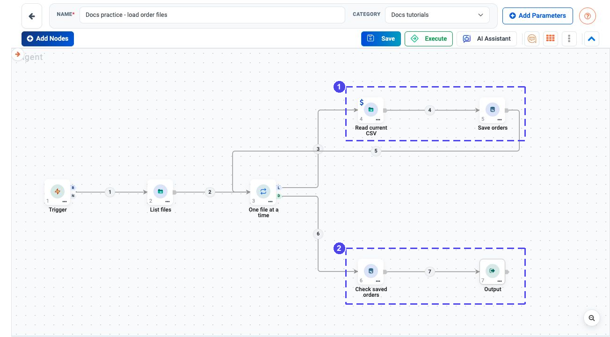
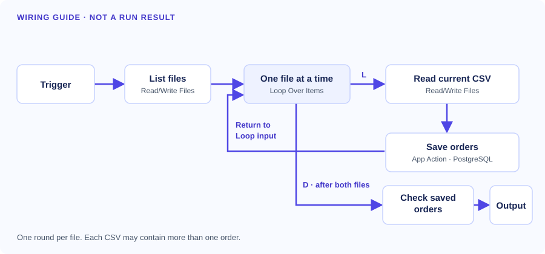
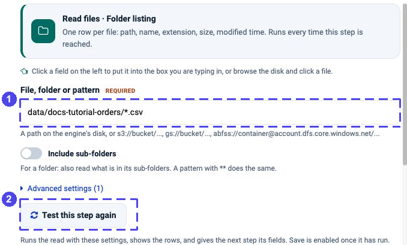
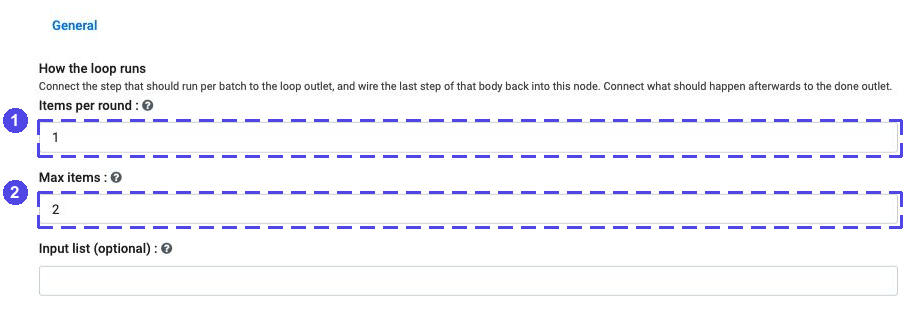
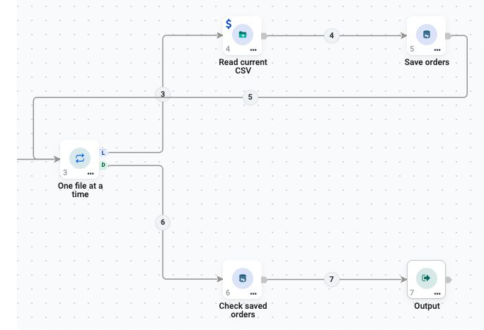
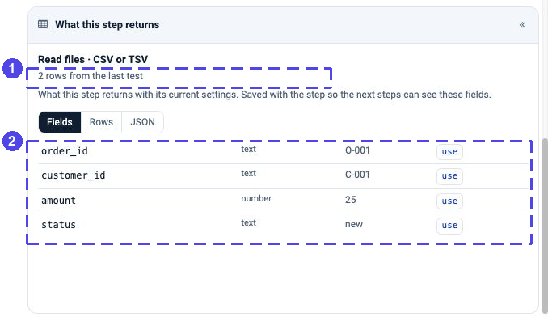
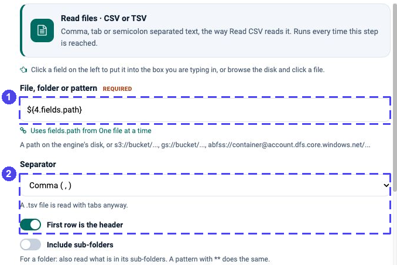
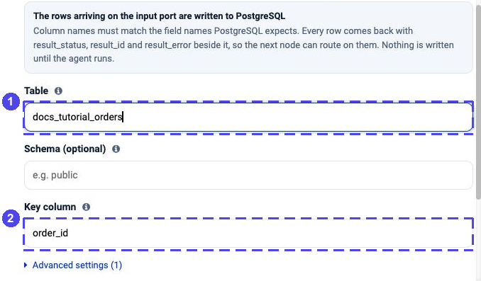
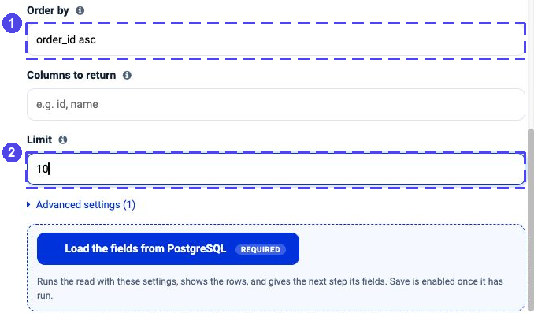

.. rst-class:: agentic-tutorial

Load Order Files into a Database
================================

.. container:: tutorial-intro

   Turn two small CSV files into three saved orders. You will read a folder,
   process one file at a time and check the database at the end. This is a
   good first canvas flow: you do not need an AI model.

.. container:: tutorial-start

   **What you will learn:** read files, connect a loop and save records without
   adding duplicate order IDs when you run the same files again.

   **What success looks like:** three orders, totalling **80.00**, in your
   practice table. This tutorial does not send email or change real orders.

Prepare your practice files and table
-------------------------------------

Use a practice project and a **PostgreSQL test connection**. If you do not
have one, follow :doc:`../database-connectors-setup` or ask your administrator.
Do not select a production connection.

#. Download :download:`orders-a.csv <samples/orders-a.csv>` and
   :download:`orders-b.csv <samples/orders-b.csv>`.
#. Put both files in a folder the **execution engine** can read. This
   walkthrough uses ``data/docs-tutorial-orders/``. A folder on your laptop
   is not automatically available to a remote engine; use
   :doc:`the file setup guide <../files>` if your engine is elsewhere.
#. Prepare an empty practice table called ``public.docs_tutorial_orders``
   with these columns. The unique order key is important: it is what stops
   the repeated order from becoming a second database row.

.. list-table:: Practice table
   :header-rows: 1
   :widths: 30 35 35

   * - Column
     - Type
     - Example
   * - ``order_id``
     - Text, primary key
     - ``O-001``
   * - ``customer_id``
     - Text
     - ``C-001``
   * - ``amount``
     - Numeric, two decimal places
     - ``25.00``
   * - ``status``
     - Text
     - ``new``

.. dropdown:: Table setup SQL — for you or your administrator

   Run this only against the test database. It creates a new table; if the
   name is already in use, choose another practice table rather than deleting
   an existing one. Use that same name in both database nodes below.

   .. code-block:: sql

      CREATE TABLE public.docs_tutorial_orders (
          order_id TEXT PRIMARY KEY,
          customer_id TEXT,
          amount NUMERIC(12, 2),
          status TEXT
      );

The flow you will build
-----------------------

Open your project, choose **Agents → Create Agents → Agent Orchestration**
and name the flow **Docs practice - load order files**. Use **Add Nodes** to add
the node types below. Double-click a node to open its settings.

There are seven nodes. Rename them as shown so the field picker is easy to
understand. **List files** and **Read current CSV** are both Read/Write Files
nodes; **Save orders** and **Check saved orders** are App Action nodes.

   The actual configured tutorial workflow in Sparkflows. **1** reads and
   saves each file, then returns to the Loop. **2** checks the saved orders
   after the Loop finishes. This is a saved configuration, not a completed
   execution; prepare your files, table and test connection before running.

Use the real canvas above to find the nodes in the app. The supplementary
map below explains the same connections without the editor controls.

   Follow the indigo arrows. The return wire goes into the Loop; the final
   database check starts from its separate D outlet.

**L means “repeat these steps.” D means “continue when all files are done.”**
The wire from **Save orders** must go back to the **Loop node**, not directly
to **Read current CSV**. The diagram describes the wiring; it is not a
screenshot of an executed flow.

1. Find the two practice files
------------------------------

Open **List files**, then choose **Read files → Folder listing**.

#. In **File, folder or pattern**, enter
   ``data/docs-tutorial-orders/*.csv``. Replace the folder part if your
   administrator gave you another path. ``*.csv`` means “only CSV files.”
#. Leave **Include sub-folders** off. Keep reports and unrelated files outside
   this practice folder.
#. Click **Test this step**. In **What this step returns**, check that there
   are **2 rows**, one per file, and that each has a ``path`` field.
#. Click **Save step** and connect **Trigger → List files → One file at a time**.

   **1** limits the selection to the practice CSVs. **2** previews the file
   list without writing to the database.

.. container:: tutorial-checkpoint

   **Checkpoint:** two rows here means two files, not two orders. The next
   file-reading step will open each file and return its order records.

2. Handle one file at a time
----------------------------

Open **One file at a time** and set **Items per round** to ``1`` and
**Max items** to ``2``. Leave **Input list (optional)** empty: the list already
arrives through the wire from **List files**. Save the settings.

   **1** handles one file in each round. **2** keeps this first test small.

Connect the Loop's **L** outlet to **Read current CSV**.

   Close-up of the same actual workflow, without enlarging its pixels.
   Trace **L** upward through the two repeated steps and back to the Loop's
   input. **D** follows the lower path to the final database check.

3. Read the current file
------------------------

Open **Read current CSV**, then choose **Read files → CSV or TSV**.
Start with one fixed file so you can check its columns before adding a
dynamic reference.

#. Set **File, folder or pattern** to
   ``data/docs-tutorial-orders/orders-a.csv``.
#. Set **Separator** to **Comma (,)** and turn **First row is the header** on.
   Leave **Include sub-folders** off.
#. Turn **Add the file name as a column (_file)** off. The database table has
   four columns; an extra ``_file`` field does not belong in it.
#. Click **Test this step**. Check for two rows and the four fields shown below.

   **1** confirms the two-row file preview. **2** shows the four fields,
   including ``amount`` as a number. This is a file preview, not a database result.

Now replace the fixed filename with the **current Loop record's path**:
click the path box, then use the ``${}`` picker beside **path** from
**One file at a time** in the left-hand data panel. Do not pick the entire
folder-list result or leave ``orders-a.csv`` hard-coded; otherwise each round
would read the same file.

   **1** reads the Loop's current path. The reference number in your flow may
   differ from ``4``; use the picker rather than copying it. **2** keeps the
   separator and header settings from the successful file preview.

Save the step. A dynamic path needs a Loop record at run time; the fixed-file
preview was only to check the file format.

4. Save each order once
-----------------------

Open **Save orders**. Choose **PostgreSQL → Insert or update a row**, then
select your test connection. This action is also called an *upsert*: it adds
a missing order, or updates the order with the same key if it already exists.

.. list-table:: Set these fields
   :header-rows: 1
   :widths: 35 65

   * - Setting
     - Value
   * - **Table**
     - ``docs_tutorial_orders``
   * - **Schema (optional)**
     - ``public``; use your administrator's schema if different
   * - **Key column**
     - ``order_id``
   * - **Fields to set**
     - Leave empty to use the four arriving CSV fields

   **1** names the practice table. **2** identifies an order uniquely. The
   schema is optional in the drawer; enter ``public`` for this walkthrough.
   This screenshot shows configuration, not an executed database write.

Save the step. Connect **Read current CSV → Save orders**, then connect
**Save orders back to One file at a time**. Do not connect the write directly
to Output: the flow still has another file to process.

5. Read back the saved orders
-----------------------------

Connect the Loop's **D** outlet to **Check saved orders**, then connect that
node to **Output**. Open **Check saved orders** and choose
**PostgreSQL → List rows** with the same test connection.

Set **Table** to ``docs_tutorial_orders``, **Schema (optional)** to ``public``,
**Order by** to ``order_id asc`` and **Limit** to ``10``. Leave **Where** and
**Columns to return** empty for this dedicated practice table.

   **1** makes the result easy to compare. **2** limits the preview size.
   **Load the fields from PostgreSQL** is a read-only schema/data check; an
   empty table before the first run is expected.

Click **Load the fields from PostgreSQL** before saving this read action.
The button validates the read and enables **Save action**. If it fails,
check that the practice table exists and your connection can read it.

Save the step, then open **Output**. Add one row: set **Name this output** to
``orders`` and **Take it from which node** to **Check saved orders**. Save it.
This gives the final result a clear ``orders`` field rather than collecting
other nodes' results automatically. Reading the table is deliberate:
write-status messages are not the same thing as the saved order records.

6. Run and check your result
----------------------------

Save the flow and start a manual run only after checking the database
connection and table name. This run **writes to the practice table**.
Inspect the execution timeline and the final Output.

.. list-table:: Expected result with the supplied files and an initially empty table
   :header-rows: 1
   :widths: 25 25 25 25

   * - order_id
     - customer_id
     - amount
     - status
   * - O-001
     - C-001
     - 25.00
     - new
   * - O-002
     - C-002
     - 40.00
     - new
   * - O-003
     - C-003
     - 15.00
     - new

.. container:: tutorial-checkpoint

   **Success:** the Loop handles two files; Output's ``orders`` has three unique orders;
   the amounts add up to **80.00**. Run the same files again: you should still
   have three rows, not six. ``O-002`` appears in both files with the same values.

If your result is different
---------------------------

.. dropdown:: No files, or only one file, is found

   Check the engine's folder path, read permissions and the ``*.csv`` pattern.
   Test **List files** again. Both downloaded CSVs must be in that folder;
   do not put them only in the browser's Downloads folder.

.. dropdown:: Both loop rounds read the same file

   Open **Read current CSV** and replace the fixed filename with **path** from
   **One file at a time**. The helper beneath the box should name the Loop.

.. dropdown:: The write complains about a missing or unknown column

   Check the CSV header, turn off **Add the file name as a column (_file)**,
   and compare the four arriving fields with the practice table. Check that
   ``order_id`` is the table's primary key and the action's **Key column**.

.. dropdown:: The final output contains status messages instead of orders

   Check the **D → Check saved orders → Output** wiring. Output must receive
   the result of **List rows**, not the earlier write-status records.

Next: make it your own
----------------------

Keep the first version manual. Before using real files, decide how to handle
invalid records, corrected orders and retries. A failed write must not be
reported as a successful load. Add scheduling or file-triggering only after
the manual result is correct; do not delete or archive inputs until the
saved records have been verified.

For a next step, try :doc:`revenue-report` to turn saved records into a report.
For the wiring rules, see :doc:`../data-steps`.
