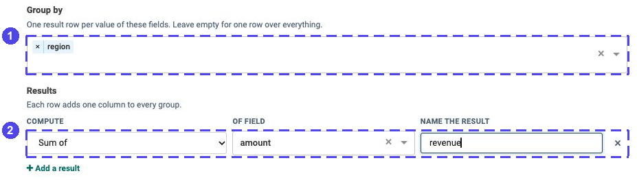
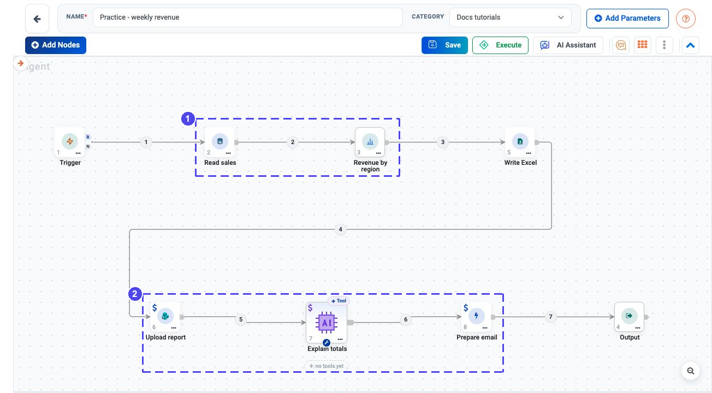
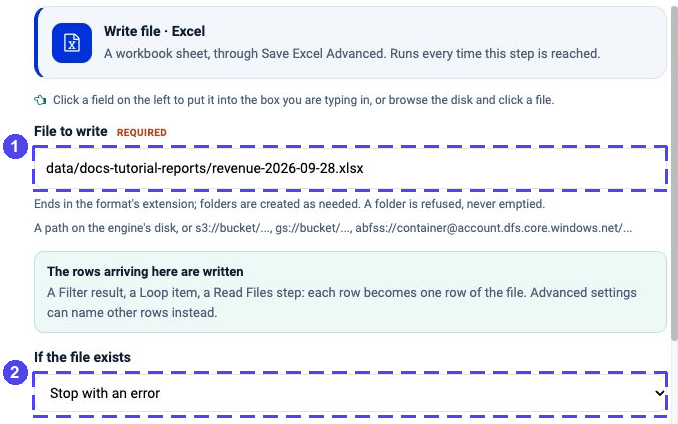
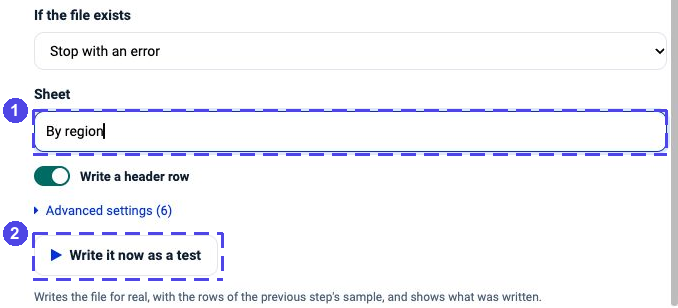
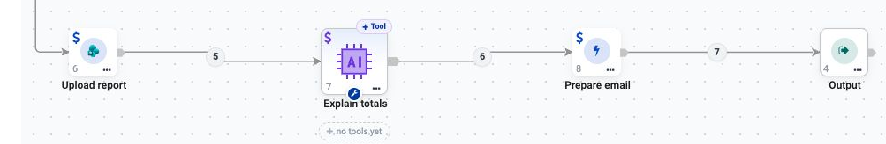
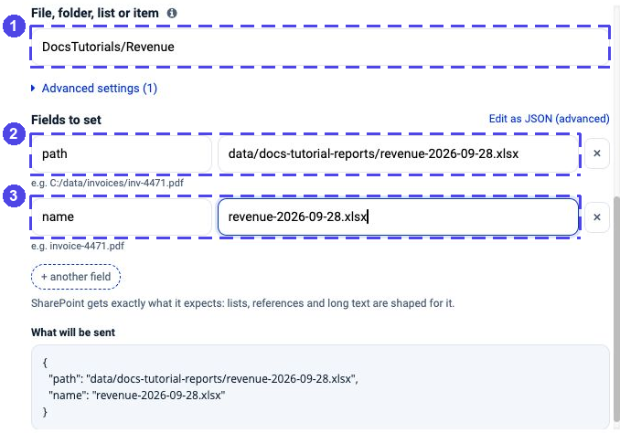
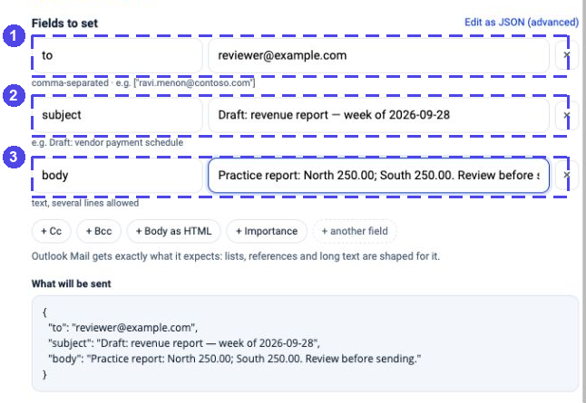

.. rst-class:: agentic-tutorial

Build a Weekly Revenue Report
=============================

.. container:: tutorial-intro

   Calculate revenue by region, save it as an Excel file, upload the file to
   a practice SharePoint folder and prepare an email draft for review.
   The Summarize node does the arithmetic; AI only explains the results.

.. container:: tutorial-start

   **Build it in two stages.** First, prove that the totals are correct.
   Then add the file, upload and draft steps. You do not need to debug every
   app at once.

   **Expected practice result:** North **250.00**, South **250.00**, one Excel
   workbook and one email draft. Nothing is sent to recipients automatically.

Prepare the report inputs
-------------------------

Use :download:`sales.csv <samples/sales.csv>`, which contains four fictional
orders dated September 28–October 1, 2026. For this example the reporting week
is **September 28–October 4, 2026**. Treat all amounts as the same currency;
the sample does not include a currency conversion.

You need these connections and locations:

.. list-table:: Prepare only what this tutorial uses
   :header-rows: 1
   :widths: 30 70

   * - Item
     - What to prepare
   * - PostgreSQL
     - A test connection and a practice table ``public.docs_tutorial_sales``
       containing the four CSV rows. See :doc:`../database-connectors-setup`.
   * - Export folder
     - An engine-writable folder, here ``data/docs-tutorial-reports/``.
       SharePoint uploads need a file on the engine's disk.
   * - SharePoint
     - A test site and an existing ``DocsTutorials/Revenue`` folder in that
       site's **default document library**, with upload permission.
   * - Outlook Mail
     - A test mailbox with permission to create drafts, plus an address you
       control for the draft's recipient. See :doc:`../microsoft-connectors-setup`.
   * - AI model
     - An approved :doc:`LLM connection <../connections>` for writing the
       short explanation. Only the two regional totals need to go to it.

.. dropdown:: Practice database setup — optional SQL for your administrator

   This creates and populates a new practice table. Run it only in the test
   database, once. If the name is already used, choose a new one and use it
   in the read step too. Do not rerun the inserts into a populated table.

   .. code-block:: sql

      CREATE TABLE public.docs_tutorial_sales (
          order_id TEXT PRIMARY KEY,
          order_date DATE,
          region TEXT,
          amount NUMERIC(12, 2)
      );
      INSERT INTO public.docs_tutorial_sales VALUES
          ('S-001', '2026-09-28', 'North', 100.00),
          ('S-002', '2026-09-29', 'North', 150.00),
          ('S-003', '2026-09-30', 'South', 200.00),
          ('S-004', '2026-10-01', 'South', 50.00);

Start with the calculation
--------------------------

Open your project's **Agents** page and choose
**Create Agents → Agent Orchestration**. Name the flow
**Practice - weekly revenue**. From **Add Nodes**, add and rename these nodes:

**Trigger → Read sales (App Action) → Revenue by region (Summarize) → Output**.

These are ordinary sequential wires; this example does not need a Loop.
Open **Trigger**, choose **Manually**, and save it. Leave scheduling for
after you have verified the complete report.

1. Read the practice week
-------------------------

Open **Read sales** and choose **PostgreSQL → List rows**. Select the test
connection, then set:

.. list-table:: Sales read settings
   :header-rows: 1
   :widths: 33 67

   * - Setting
     - Value
   * - **Table**
     - ``docs_tutorial_sales``
   * - **Schema (optional)**
     - ``public``
   * - **Where**
     - ``order_date >= '2026-09-28' AND order_date < '2026-10-05'``
   * - **Order by**
     - ``order_id asc``
   * - **Columns to return**
     - ``order_id,order_date,region,amount``
   * - **Limit**
     - ``10`` for the four-row practice dataset

Click **Load the fields from PostgreSQL**, check for **four rows**, then
**Save action**. Confirm ``amount`` is numeric, not text with a currency
symbol. The end date is exclusive, so the filter includes all of October 4.

.. note::

   The limit of ten is only for practice. A production report must include
   **every** sale in its reporting period. Do not publish totals from a
   truncated preview; use a suitably configured read or a database/workflow
   aggregation for the full dataset.

2. Calculate one total per region
---------------------------------

Open **Revenue by region**. Under **Group by**, choose ``region``. If the
field list is not populated yet, type ``region`` and press Enter.
Under **Results**, configure one row:

* **Compute:** ``Sum of``
* **Of field:** ``amount``
* **Name the result:** ``revenue``

   **1** creates one row for each region. **2** adds the amounts and names
   the resulting column ``revenue``. No model performs this calculation.

Save the settings. Open **Output**, add one row named ``totals``, and set
**Take it from which node** to **Revenue by region**. Save and run this short
flow manually. It only reads and calculates; publishing comes later.

.. container:: tutorial-checkpoint

   **Checkpoint:** Output's ``totals`` contains two records:
   ``North → 250.00`` and ``South → 250.00``. Their sum is **500.00**.
   If it differs, check the four source rows and date filter before continuing.

Finish the report flow
----------------------

After the totals match, insert the following nodes between
**Revenue by region** and **Output**. Remove the earlier direct wire to Output
so there is one continuous path:

.. list-table:: Connect the nodes in this order
   :header-rows: 1
   :widths: 28 30 42

   * - Node name
     - Node type
     - What moves to the next step
   * - Revenue by region
     - Summarize
     - Two rows: ``region`` and ``revenue``
   * - Write Excel
     - Read/Write Files
     - The saved file's ``path`` and write status
   * - Upload report
     - App Action: SharePoint
     - The upload result, not the revenue rows
   * - Explain totals
     - Agent Node
     - A short explanation of the earlier totals
   * - Prepare email
     - App Action: Outlook Mail
     - The created draft's result
   * - Output
     - Output
     - Named totals, file, upload and draft results

   The actual configured workflow. **1** reads and calculates the totals.
   **2** uploads the workbook, explains those totals and prepares a draft.
   Follow the wire from **Write Excel** down to **Upload report**: the second
   row is a continuation, not a parallel branch. No write has been executed
   for this screenshot.

3. Write a workbook
-------------------

Open **Write Excel** and choose **Write a file → Excel**. Set **File to write**
to ``data/docs-tutorial-reports/revenue-2026-09-28.xlsx``. The rows arriving
from **Revenue by region** become rows in the workbook.

Set **If the file exists** to **Stop with an error** for the first test. Set
**Sheet** to ``By region`` and keep **Write a header row** on.

   **1** names the workbook on the engine. **2** prevents an accidental
   overwrite while you are learning.

   **1** names the worksheet. **2**, **Write it now as a test**, really writes
   a file; it is not a read-only preview. You can save the step and let the
   manual flow run create the file instead.

4. Upload the workbook to SharePoint
------------------------------------

   The publishing steps on the real canvas. The Agent must reference
   **Revenue by region** explicitly, because the preceding node returns
   upload metadata rather than the original totals.

Open **Upload report** and choose **SharePoint → Upload a file**. Select the
test SharePoint connection. Set **Site** to your test site's URL, or leave it
blank only if the saved connection already specifies the correct site.

In **File, folder, list or item**, enter ``DocsTutorials/Revenue``. This is
the **destination folder relative to the site's default library**, not the
local file path and not a document-library ID.

Under **Fields to set**, click **+ File on the engine** and **+ Name in
SharePoint**:

* ``path``: use the saved ``path`` from **Write Excel**, selected with the
  field picker. For this first fixed-date run it resolves to
  ``data/docs-tutorial-reports/revenue-2026-09-28.xlsx``.
* ``name``: ``revenue-2026-09-28.xlsx`` — the filename in SharePoint.

   **1** is the destination folder. **2** is the file on the engine. **3**
   is its SharePoint name. The screenshot uses the fixed practice path to
   make the mapping clear; use the previous step's path for a changing filename.

Save the action. No file is uploaded just by saving these settings.
Running this action **replaces a same-named file** in the target folder.
Use a dedicated practice folder and a new name if a file already exists.

5. Explain the calculated numbers
---------------------------------

Open **Explain totals**, select your approved model connection and configure
the Agent Node's instructions. Use **text** output. No external tools are
needed for this explanation.

Use this instruction, then insert the complete records from **Revenue by
region** using the upstream data picker where indicated:

.. code-block:: text

   Write a short internal revenue summary for September 28–October 4, 2026.
   Use only the supplied regional totals. Include each region and its value.
   Do not recalculate or change the numbers. Do not invent causes, trends,
   currency symbols or a comparison with another week.
   End with: "Review the attached report location before distribution."

   Regional totals: ${3.items}

The example assumes **Revenue by region** has node number **3**. Check its
number on your canvas and replace ``3`` if yours differs. ``items`` means the
complete small list of regional records, not just the first region's value.
The **upload result is not the totals**: reference the earlier Summarize node
explicitly; do not add a second incoming wire to the Agent Node.

6. Prepare a draft, not a sent email
------------------------------------

Open **Prepare email** and choose **Outlook Mail → Create a draft email**.
Select the test connection and the permitted **Mailbox**. Under
**Fields to set**, add **To**, **Subject** and **Body**:

* ``to``: an address you control, not a customer mailing list.
* ``subject``: ``Draft: revenue report — week of 2026-09-28``.
* ``body``: the text result from **Explain totals**, selected from its fields.
  Add the report location only from a verified upload result; never ask the
  model to invent a SharePoint URL.

   **1** is the recipient, **2** the subject and **3** the body. These fixed
   sample values illustrate the fields; in your flow, map the Agent's text
   into ``body``. ``reviewer@example.com`` is a placeholder, not a real recipient.

Save the action. Do not add a **Send** action. Creating a draft still changes
the mailbox when the flow runs, so keep this in the approved test mailbox.

7. Return results you can verify
--------------------------------

Open **Output** and use four named rows:

.. list-table:: Output mapping
   :header-rows: 1
   :widths: 35 65

   * - Name this output
     - Take it from which node
   * - ``totals``
     - Revenue by region
   * - ``file``
     - Write Excel
   * - ``upload``
     - Upload report
   * - ``draft``
     - Prepare email

Save the flow. Before running, confirm the test connection, mailbox, folder
and filenames. The completed run writes a local workbook, uploads a file
and creates a draft. The configuration screenshots above do not claim that
these writes have already succeeded in your environment.

.. container:: tutorial-checkpoint

   **Final check:** the workbook's **By region** sheet contains North
   **250.00** and South **250.00**. Open the uploaded copy and confirm the
   same rows. Open the draft in the test mailbox and check its figures,
   recipient and report location. It must still be a **draft**.

When something does not match
-----------------------------

.. dropdown:: The totals are wrong or the report has only one region

   Check the read step first: four rows, the exact reporting dates, numeric
   amounts and both region names. Then check **Group by = region** and
   **Sum of amount**, not Count rows or a sum of an unrelated field.

.. dropdown:: SharePoint cannot find the file or folder

   ``path`` must identify a real file on the engine. The target field must
   identify an existing folder in the chosen site's default library. Check
   the two paths separately; they belong to different systems.

.. dropdown:: The summary is missing numbers or describes file metadata

   The Agent is probably reading the upload's result rather than the earlier
   Summarize records. Replace the prompt reference with the complete
   **Revenue by region** result and run a small test again.

.. dropdown:: A rerun stops at the file step or creates another draft

   **Stop with an error** deliberately protects an existing local workbook.
   For another practice run, choose a fresh filename and SharePoint name.
   Draft creation is not automatically deduplicated; each successful call
   can create another draft. Do not keep retrying the whole flow blindly.

Add a weekly schedule only after these checks pass. Confirm its time zone,
replace the fixed reporting dates with a tested period calculation, and
decide how to handle existing files and drafts. Scheduling alone does not
change a hard-coded date filter or make repeated writes safe.
