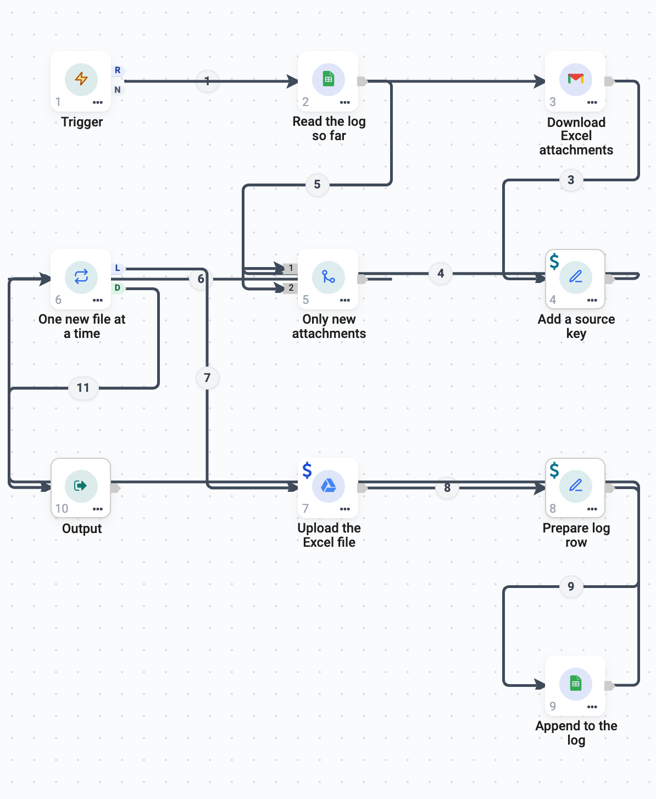
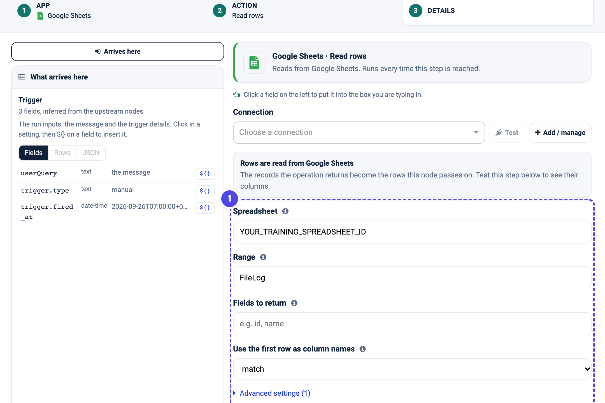
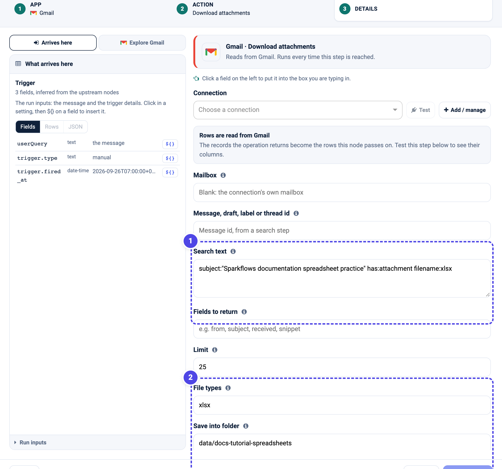
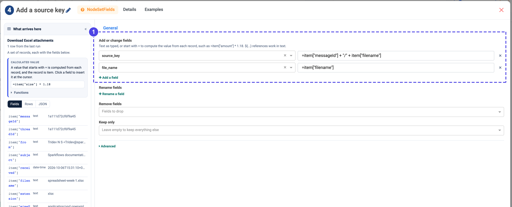
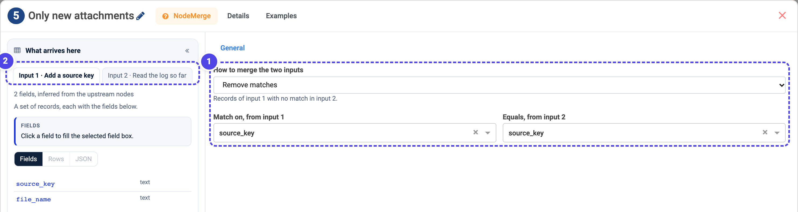
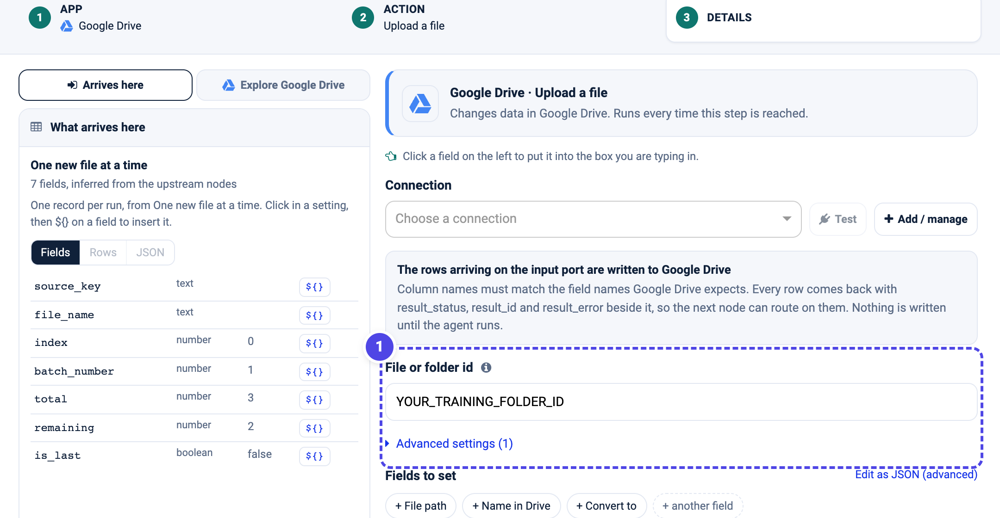
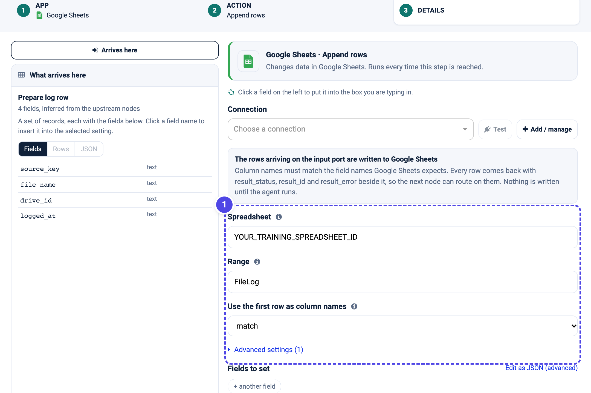

.. rst-class:: agentic-tutorial

Save Excel Attachments to Drive, Without Duplicates (Google)
============================================================

.. container:: tutorial-intro

   Read Excel attachments from a test mailbox, save each new file to Google
   Drive and add one row to a Google Sheet that tracks what you have kept. The
   flow remembers what it has already logged: when a second email arrives, an
   attachment you have seen before is skipped, and only genuinely new files are
   uploaded and logged.

.. container:: tutorial-start

   **The idea in one line.** Read the log first, compare it with the incoming
   attachments on a stable key, and keep only the attachments that are not in
   the log yet. A **Merge** node does the comparison; no custom code is needed.

   **What you will learn:** read a running log, build a stable key for each
   file, use **Merge - Remove matches** to drop duplicates, and append only the
   new rows.

   Prefer Microsoft 365? The same flow with Outlook, OneDrive and a SharePoint
   list is in :doc:`spreadsheet-dedup-microsoft`.

Prepare the practice inputs
---------------------------

Set up :doc:`../google-connectors-setup` with read access to Gmail, and read and
write access to Drive and Sheets. Download the two practice workbooks and keep
them for the two test emails:

* :download:`spreadsheet-week-1.xlsx <samples/spreadsheet-week-1.xlsx>`
* :download:`spreadsheet-week-2.xlsx <samples/spreadsheet-week-2.xlsx>`

Create a **training** Drive folder and note its folder ID. Create a Google Sheet
with a tab named ``FileLog`` whose first row is ``source_key``, ``file_name``,
``drive_id`` and ``logged_at``; note the spreadsheet ID. Choose an
engine-writable folder for the downloaded files, such as
``data/docs-tutorial-spreadsheets`` - a folder on the machine the engine runs
on, not in your browser or in Drive. Keep all of these separate from anything
real.

Send **one** test email first, with ``spreadsheet-week-1.xlsx`` attached and a
unique subject such as ``Sparkflows documentation spreadsheet practice``. You
will send the second email later, to watch the duplicate check work.

.. list-table:: Build these ten nodes
   :header-rows: 1
   :widths: 8 46 46

   * - Order
     - Name to use
     - Node type
   * - 1
     - Trigger
     - Trigger
   * - 2
     - Read the log so far
     - App Action (Google Sheets)
   * - 3
     - Download Excel attachments
     - App Action (Gmail)
   * - 4
     - Add a source key
     - Set Fields
   * - 5
     - Only new attachments
     - Merge
   * - 6
     - One new file at a time
     - Loop Over Items
   * - 7
     - Upload the Excel file
     - App Action (Google Drive)
   * - 8
     - Prepare log row
     - Set Fields
   * - 9
     - Append to the log
     - App Action (Google Sheets)
   * - 10
     - Output
     - Output

Wire the **Trigger** to both **Read the log so far** and **Download Excel
attachments**. Send **Download → Add a source key**, then into the Merge's
**input 1**; send **Read the log so far** into the Merge's **input 2**. From the
Merge, go **Only new attachments → One new file at a time**. From the Loop's
**L** outlet run **Upload the Excel file → Prepare log row → Append to the log**,
then wire **Append to the log back into the Loop**. Connect the Loop's **D**
outlet to **Output**.

log before returning
   :width: 900px

   The actual configured flow. The log and the attachments meet at **Only new
   attachments**; only files with no match in the log continue into the loop.
   This is a configuration screenshot, not evidence of a completed run.

1. Read the log so far
----------------------

Open **Read the log so far** and choose **Google Sheets → List rows**. Select
your connection, set **Spreadsheet** to your Sheet's ID, **Range** to ``FileLog``
and **Use the first row as column names** to **match**. Click **Load the fields**
once so the step knows its columns; an empty result is normal before the first
run.

   **1** points at the tracking sheet and tab. These rows are the memory of what
   has already been saved; the duplicate check compares against them.

2. Download the Excel attachments
---------------------------------

Open **Download Excel attachments** and choose **Gmail → Download attachments**.
Set **Search text** to your practice subject, for example
``subject:"Sparkflows documentation spreadsheet practice" has:attachment filename:xlsx``.
Set **File types** to ``xlsx`` and **Save into folder** to your engine folder.

   **1** restricts the search to your practice emails. **2** keeps only ``.xlsx``
   files and saves them to the engine folder. This is the action's configuration
   form, not proof that files were downloaded.

3. Give every attachment a stable key
-------------------------------------

The duplicate check needs one value that identifies a file the same way on every
run. Open **Add a source key** (Set Fields) and under **Add or change fields**
add ``source_key`` as ``=item["messageId"] + "/" + item["filename"]`` and
``file_name`` as ``=item["filename"]``. A value that starts with ``=`` is
computed from each record on its own, so every attachment gets its own key.

   **1** builds a stable ``source_key`` for each attachment from its message id
   and file name.
   The same email and file always produce the same key, which is what lets a
   later run recognise it.

.. note::

   Use a key that stays the same across runs and is unique per file. The message
   id plus the filename is a good default. The filename alone is enough only if
   filenames are never reused.

   Build the key with ``=`` and ``item[...]``, not with ``${3.fields...}``. A
   ``${...}`` reference fills in one value - the first attachment's - for every
   row, so all attachments would share one key and the duplicate check would
   compare the wrong files.

4. Keep only the new attachments
--------------------------------

This is the duplicate check. Open **Only new attachments** (Merge). Set **How to
merge the two inputs** to **Remove matches**, and set both **Match on, from input
1** and **Equals, from input 2** to ``source_key``.

   **1** keeps the records of input 1 that have **no match** in input 2. **2**
   shows the two inputs: input 1 is the attachments, input 2 is the log. An
   attachment whose ``source_key`` is already in the log is dropped here, so the
   steps after it never run for a file you have already saved.

.. important::

   Input 1 must be the attachments and input 2 the log. **Remove matches** keeps
   input 1's rows that are absent from input 2 - the files you have not logged
   yet. Swap the inputs and you would keep the opposite set.

5. Upload each new file and log it
----------------------------------

**One new file at a time** (Loop Over Items) runs the next three steps once per
new attachment. Set **Items per round** to ``1``.

Open **Upload the Excel file** and choose **Google Drive → Upload a file**.
Select the connection and set **File or folder id** to your training folder's ID.
The arriving record is uploaded; the action returns the new file's Drive ID as
``result_id``.

   **1** is your training folder's ID. Only new files reach this step, so you
   never upload the same attachment twice.

**Prepare log row** (Set Fields) adds ``drive_id`` as ``${7.fields.result_id}``
and ``logged_at`` as ``${trigger.fired_at}``, and keeps exactly ``source_key``,
``file_name``, ``drive_id`` and ``logged_at``.

Open **Append to the log** and choose **Google Sheets → Append rows**. Use the
same spreadsheet, the ``FileLog`` tab and header matching, and leave **Fields to
set** empty to write the arriving row. Wire this step back into **One new file at
a time**.

   **1** records the new file in the log, including its ``source_key``. That is
   what the next run reads back in step 1, so the duplicate check keeps working.

Finish by wiring the Loop's **D** outlet to **Output**.

.. container:: tutorial-checkpoint

   **Checkpoint - first email.** Run manually. Expect one new file in Drive and
   one new row in ``FileLog`` with a filled ``source_key``. The ``FileLog`` tab
   is both the output and the memory for next time.

6. Watch the duplicate check work
---------------------------------

Now send the **second** test email, with ``spreadsheet-week-2.xlsx`` and the same
subject, and - to prove the point - leave the **first** email in place too. Run
the agent again.

.. container:: tutorial-checkpoint

   **Checkpoint - second run.** The agent reads two attachments but the log
   already lists week 1, so **Only new attachments** passes only week 2. You get
   **one** new Drive file and **one** new ``FileLog`` row. Week 1 is not uploaded
   or logged again. Run a third time with no new email and nothing is added at
   all.

.. dropdown:: If a result is missing or unexpected

   **It re-logs the same file:** the ``source_key`` is not stable, or the log is
   not being read. Check that **Add a source key** builds the same value each run
   and that **Read the log so far** points at the ``FileLog`` tab with header
   matching.

   **It logs nothing, even new files:** the inputs to Merge may be swapped. Input
   1 must be the attachments and input 2 the log. Confirm the two tabs in the
   node's left panel read **Input 1 · Add a source key** and **Input 2 · Read the
   log so far**.

   **A blank Drive ID in the log:** the upload node's number may differ from
   ``7``. Use your actual node ID in ``${<id>.fields.result_id}``.

   **Keys drift between runs:** avoid timestamps or counters in ``source_key``.
   Use values that are fixed for the file, such as the message id and filename.

Continue learning
-----------------

:doc:`spreadsheet-dedup-microsoft` is the same flow for Outlook, OneDrive and a
SharePoint list. :doc:`email-attachments` adds an AI summary to each file, and
:doc:`ticket-triage` uses the loop with structured output.
