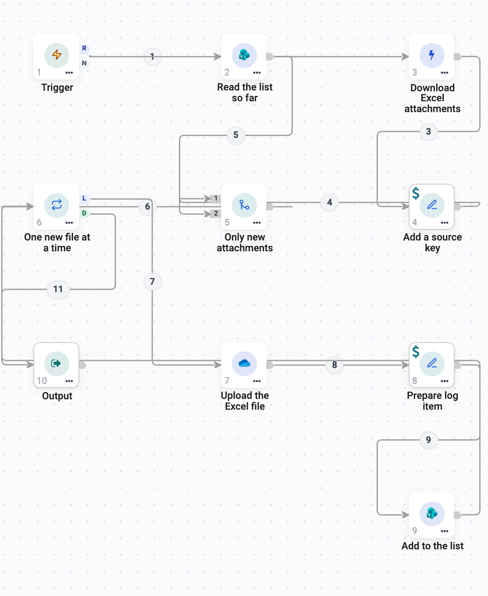
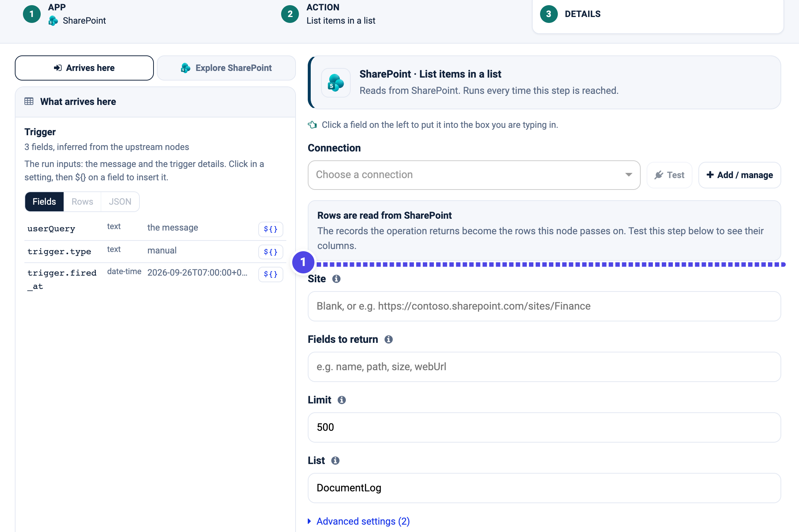
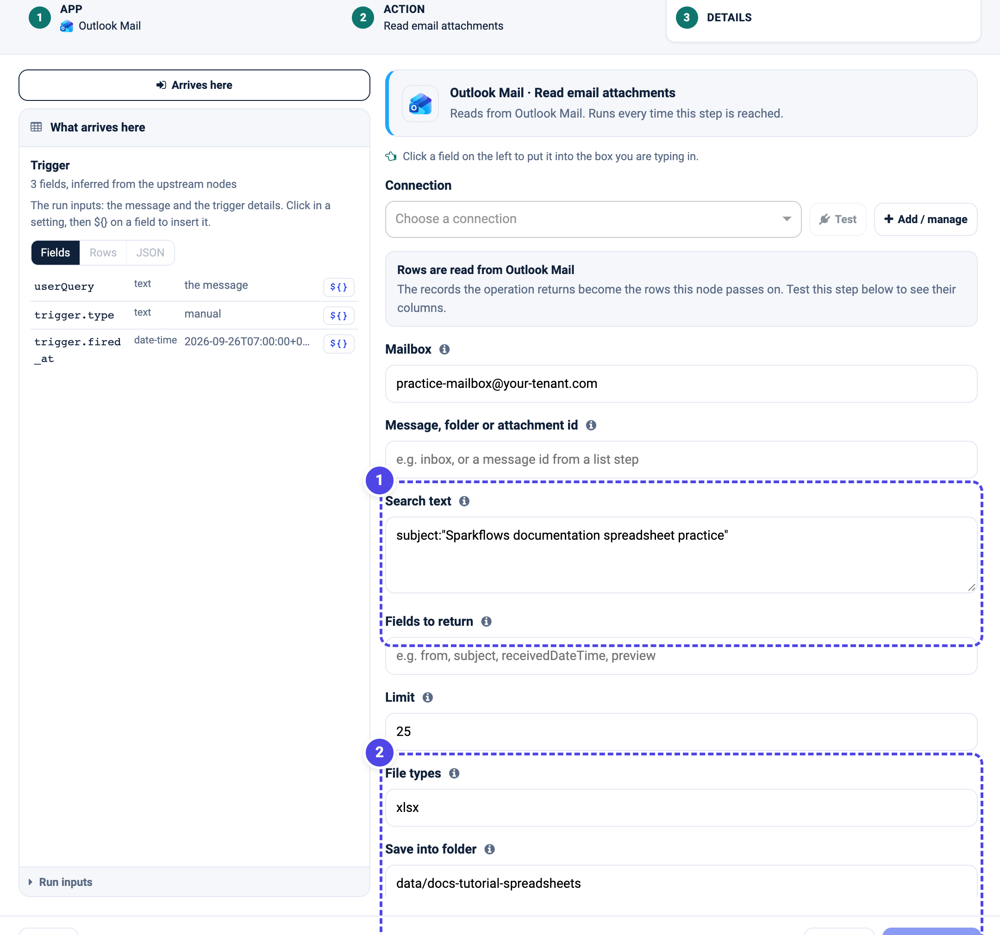
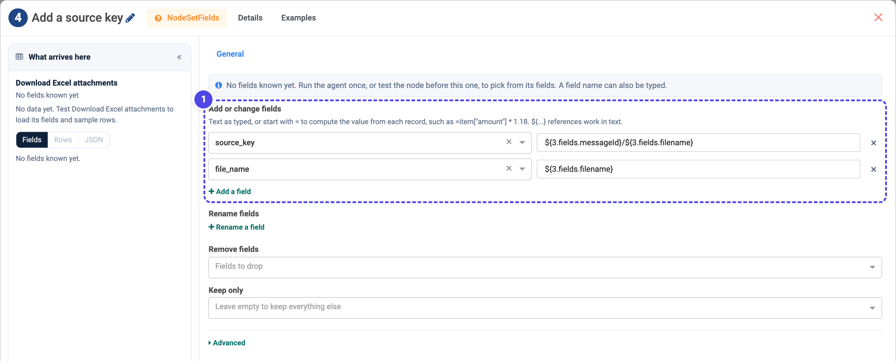
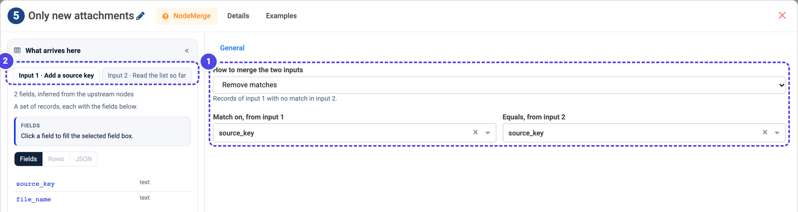
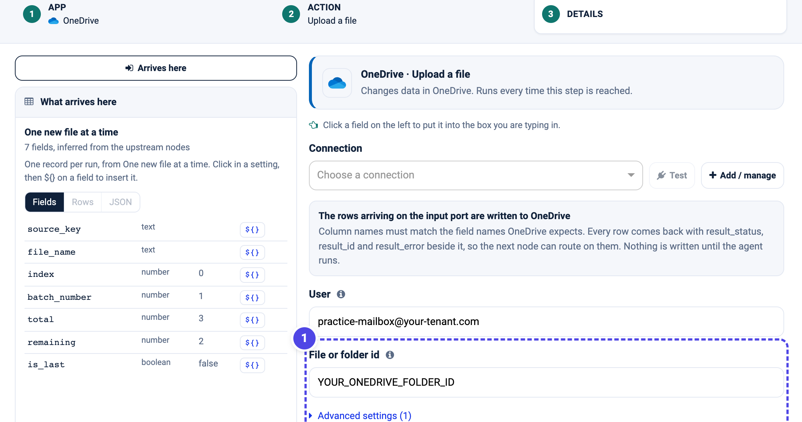
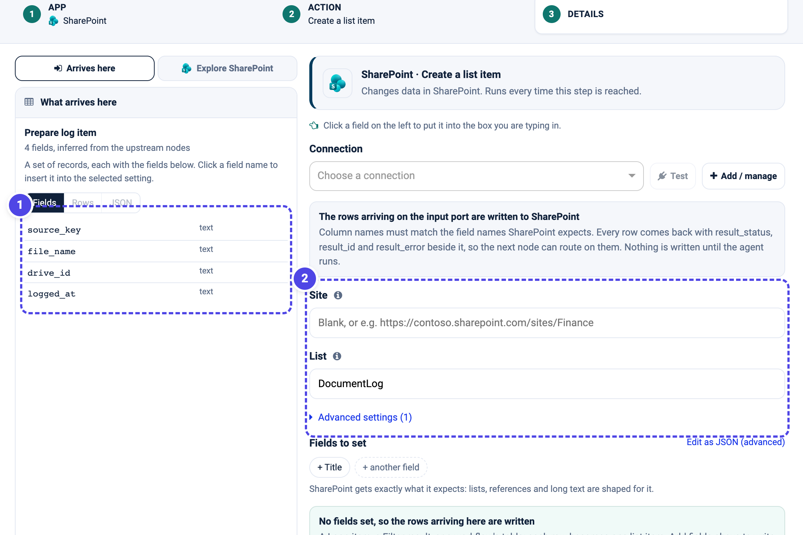

.. rst-class:: agentic-tutorial

Save Excel Attachments to OneDrive, Without Duplicates (Microsoft)
==================================================================

.. container:: tutorial-intro

   Read Excel attachments from a test Outlook mailbox, save each new file to
   OneDrive and add one item to a SharePoint list that tracks what you have kept.
   The flow remembers what it has logged: when a second email arrives, an
   attachment you have seen before is skipped, and only genuinely new files are
   uploaded and recorded.

.. container:: tutorial-start

   **The idea in one line.** Read the list first, compare it with the incoming
   attachments on a stable key, and keep only the attachments that are not in
   the list yet. A **Merge** node does the comparison; no custom code is needed.

   **What you will learn:** read a running list, build a stable key for each
   file, use **Merge - Remove matches** to drop duplicates, and add only the new
   items.

   Prefer Google Workspace? The same flow with Gmail, Drive and a Google Sheet is
   in :doc:`spreadsheet-dedup-google`.

Prepare the practice inputs
---------------------------

Set up :doc:`../microsoft-connectors-setup` with read access to Outlook, and
read and write access to OneDrive and SharePoint. Download the two practice
workbooks for the two test emails:

* :download:`spreadsheet-week-1.xlsx <samples/spreadsheet-week-1.xlsx>`
* :download:`spreadsheet-week-2.xlsx <samples/spreadsheet-week-2.xlsx>`

Note the OneDrive folder ID you will upload into. Create a SharePoint list named
``DocumentLog`` with the columns ``source_key``, ``file_name``, ``drive_id`` and
``logged_at`` (single-line text is fine). Choose an engine-writable folder for
the downloaded files, such as ``data/docs-tutorial-spreadsheets`` - a folder on
the machine the engine runs on, not in your browser or in OneDrive. Keep all of
these separate from anything real.

Send **one** test email first, with ``spreadsheet-week-1.xlsx`` attached and a
unique subject such as ``Sparkflows documentation spreadsheet practice``. You
will send the second email later, to watch the duplicate check work.

.. list-table:: Build these ten nodes
   :header-rows: 1
   :widths: 8 46 46

   * - Order
     - Name to use
     - Node type
   * - 1
     - Trigger
     - Trigger
   * - 2
     - Read the list so far
     - App Action (SharePoint)
   * - 3
     - Download Excel attachments
     - App Action (Outlook Mail)
   * - 4
     - Add a source key
     - Set Fields
   * - 5
     - Only new attachments
     - Merge
   * - 6
     - One new file at a time
     - Loop Over Items
   * - 7
     - Upload the Excel file
     - App Action (OneDrive)
   * - 8
     - Prepare log item
     - Set Fields
   * - 9
     - Add to the list
     - App Action (SharePoint)
   * - 10
     - Output
     - Output

Wire the **Trigger** to both **Read the list so far** and **Download Excel
attachments**. Send **Download → Add a source key**, then into the Merge's
**input 1**; send **Read the list so far** into the Merge's **input 2**. From the
Merge, go **Only new attachments → One new file at a time**. From the Loop's
**L** outlet run **Upload the Excel file → Prepare log item → Add to the list**,
then wire **Add to the list back into the Loop**. Connect the Loop's **D** outlet
to **Output**.

 adds it to the list before returning
   :width: 900px

   The actual configured flow. The list and the attachments meet at **Only new
   attachments**; only files with no match in the list continue into the loop.
   This is a configuration screenshot, not evidence of a completed run.

1. Read the list so far
-----------------------

Open **Read the list so far** and choose **SharePoint → List items in a list**.
Select your connection, set **Site** to your SharePoint site (blank uses the
connection's default) and **List** to ``DocumentLog``. Click **Load the fields**
once so the step knows its columns; an empty result is normal before the first
run.

   **1** points at the tracking list. These items are the memory of what has
   already been saved; the duplicate check compares against them.

2. Download the Excel attachments
---------------------------------

Open **Download Excel attachments** and choose **Outlook Mail → Read email
attachments**. Set **Mailbox** to the test address, **Search text** to your
practice subject, **File types** to ``xlsx`` and **Save into folder** to your
engine folder.

   **1** restricts the search to your practice emails. **2** keeps only ``.xlsx``
   files and saves them to the engine folder. This is the action's configuration
   form, not proof that files were downloaded.

3. Give every attachment a stable key
-------------------------------------

The duplicate check needs one value that identifies a file the same way on every
run. Open **Add a source key** (Set Fields) and under **Add or change fields**
add ``source_key`` as ``${3.fields.messageId}/${3.fields.filename}`` and
``file_name`` as ``${3.fields.filename}``.

   **1** builds a stable ``source_key`` from the message id and the file name.
   The same email and file always produce the same key, which is what lets a
   later run recognise it.

.. note::

   Use a key that stays the same across runs and is unique per file. The message
   id plus the filename is a good default. The filename alone is enough only if
   filenames are never reused.

4. Keep only the new attachments
--------------------------------

This is the duplicate check. Open **Only new attachments** (Merge). Set **How to
merge the two inputs** to **Remove matches**, and set both **Match on, from input
1** and **Equals, from input 2** to ``source_key``.

   **1** keeps the records of input 1 that have **no match** in input 2. **2**
   shows the two inputs: input 1 is the attachments, input 2 is the list. An
   attachment whose ``source_key`` is already in the list is dropped here, so the
   steps after it never run for a file you have already saved.

.. important::

   Input 1 must be the attachments and input 2 the list. **Remove matches** keeps
   input 1's rows that are absent from input 2 - the files you have not logged
   yet. Swap the inputs and you would keep the opposite set.

5. Upload each new file and log it
----------------------------------

**One new file at a time** (Loop Over Items) runs the next three steps once per
new attachment. Set **Items per round** to ``1``.

Open **Upload the Excel file** and choose **OneDrive → Upload a file**. Select the
connection, set **User** to the test mailbox and **File or folder id** to your
OneDrive folder's ID. The arriving record is uploaded; the action returns the new
file's ID as ``result_id``.

   **1** is your OneDrive folder's ID. Only new files reach this step, so you
   never upload the same attachment twice.

**Prepare log item** (Set Fields) adds ``drive_id`` as ``${7.fields.result_id}``
and ``logged_at`` as ``${trigger.fired_at}``, and keeps exactly ``source_key``,
``file_name``, ``drive_id`` and ``logged_at``.

Open **Add to the list** and choose **SharePoint → Create a list item**. Use the
same site and the ``DocumentLog`` list, and leave **Fields to set** empty to
write the arriving row as one item. Wire this step back into **One new file at a
time**.

   **1** is the item arriving from Prepare log item. **2** names the site and the
   ``DocumentLog`` list. This records the new file, including its ``source_key``,
   which the next run reads back in step 1.

Finish by wiring the Loop's **D** outlet to **Output**.

.. container:: tutorial-checkpoint

   **Checkpoint - first email.** Run manually. Expect one new file in OneDrive
   and one new item in ``DocumentLog`` with a filled ``source_key``. The list is
   both the output and the memory for next time.

6. Watch the duplicate check work
---------------------------------

Now send the **second** test email, with ``spreadsheet-week-2.xlsx`` and the same
subject, and leave the **first** email in place too. Run the agent again.

.. container:: tutorial-checkpoint

   **Checkpoint - second run.** The agent reads two attachments but the list
   already holds week 1, so **Only new attachments** passes only week 2. You get
   **one** new OneDrive file and **one** new list item. Week 1 is not uploaded or
   recorded again. Run a third time with no new email and nothing is added.

.. dropdown:: If a result is missing or unexpected

   **It re-logs the same file:** the ``source_key`` is not stable, or the list is
   not being read. Check that **Add a source key** builds the same value each run
   and that **Read the list so far** points at the ``DocumentLog`` list.

   **It logs nothing, even new files:** the inputs to Merge may be swapped. Input
   1 must be the attachments and input 2 the list. Confirm the two tabs in the
   node's left panel read **Input 1 · Add a source key** and **Input 2 · Read the
   list so far**.

   **A blank Drive ID in the list:** the upload node's number may differ from
   ``7``. Use your actual node ID in ``${<id>.fields.result_id}``.

   **A SharePoint write is refused:** list item creation needs write permission
   on the site, which the standard connection wizard may not grant. Check the
   action's error and your SharePoint permissions.

Continue learning
-----------------

:doc:`spreadsheet-dedup-google` is the same flow for Gmail, Drive and a Google
Sheet. :doc:`email-attachments` adds an AI summary to each file, and
:doc:`ticket-triage` uses the loop with structured output.
