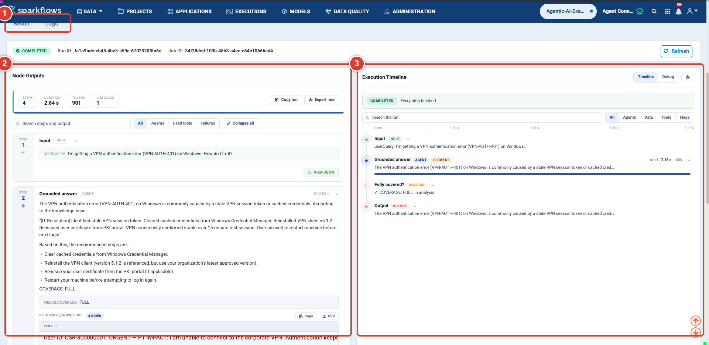
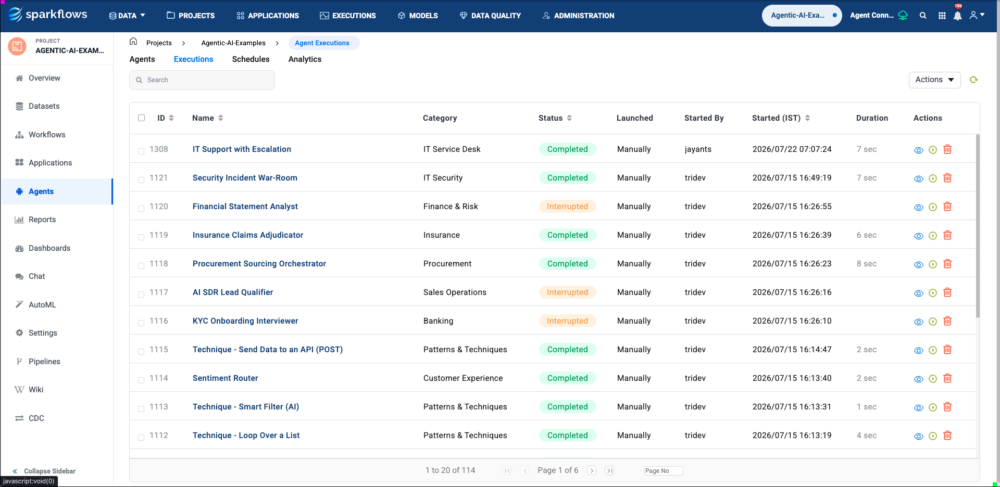

Evaluate Agents
===============

An agent that produces plausible output is not the same as an agent that
produces correct output. This page is about telling the difference before your
users have to.

Running an agent
----------------

.. list-table::
   :header-rows: 1
   :widths: 30 70

   * - Where
     - How
   * - **Agent Studio**
     - **Run** in the top bar, using the query in the Input group.
   * - **Orchestration canvas**
     - **Execute** in the toolbar, using the Input node's parameters.
   * - **Agents list**
     - The run action on the agent's row.

Keep a realistic query saved in the Input group. It costs nothing and gives you
the same starting point every time you change something.

Reading a run
-------------

Check these in order. The order matters — a formatting problem is irrelevant if
the agent never called the tool.

.. list-table::
   :header-rows: 1
   :widths: 8 30 62

   * - #
     - Question
     - If the answer is no
   * - 1
     - Did it call the tools it should have?
     - The instructions did not tell it to, or the operation is not ticked.
   * - 2
     - Did the tool calls succeed?
     - Check the connection, and whether arguments were missing.
   * - 3
     - Did it use what the tools returned?
     - Tell it explicitly to answer only from tool results.
   * - 4
     - Is the output in the right shape?
     - Set an **Output Format** JSON schema rather than asking in prose.
   * - 5
     - Is the content actually right?
     - Now you have a real quality question — see below.

The Executions tab
------------------

The **Executions** tab on the Agents page lists past runs with their status,
timings and who ran them. Open one to see its inputs, the path it took, the tool
calls it made, and any approvals.

This is also where you diagnose an orchestration that took the wrong branch:
the recorded path shows which side of each Condition the run went down.

The Analytics tab
-----------------

**Analytics** aggregates across runs — volumes, success and failure rates,
trends over time. Use it to notice that something changed, then use Executions
to find out what.

Building a real test set
------------------------

One query is a smoke test, not an evaluation. Before you ship anything people
depend on, assemble ten to twenty cases:

.. list-table::
   :header-rows: 1
   :widths: 30 70

   * - Include
     - Because
   * - Typical cases
     - Most traffic looks like this.
   * - Edge cases
     - The empty result, the huge document, the ambiguous request.
   * - Cases that should fail
     - An ID that does not exist. The agent must say so, not invent.
   * - Cases that should escalate
     - If you have an approval gate, confirm it actually fires.
   * - Previously-broken cases
     - Every bug you fix becomes a permanent test.

Run all of them after any change to instructions, tools, or the model. Agents
regress in ways that are invisible if you only check the case you were working
on.

.. tip::

   Set **Temperature** to a low value while evaluating. At ``0.7`` you cannot
   tell whether a difference between two runs came from your edit or from
   sampling.

What "good enough" means
------------------------

Decide the bar before you measure, and make it about consequences:

* **For a summariser**, a wrong nuance is survivable. Aim for useful.
* **For anything feeding a Condition**, the extracted value must be right every
  time, because a wrong value routes the whole case wrongly.
* **For anything that writes to a system**, correctness is not enough — put a
  :doc:`human approval gate </agentic-ai-guide/human-in-the-loop>` in front of
  it and measure how often reviewers disagree with the agent. That
  disagreement rate is the most honest quality metric you have.

Next: ship it
-------------

:doc:`/agentic-ai-guide/deploy-agents`.
