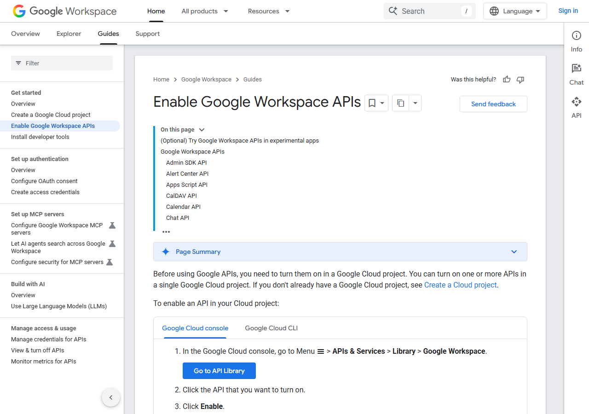
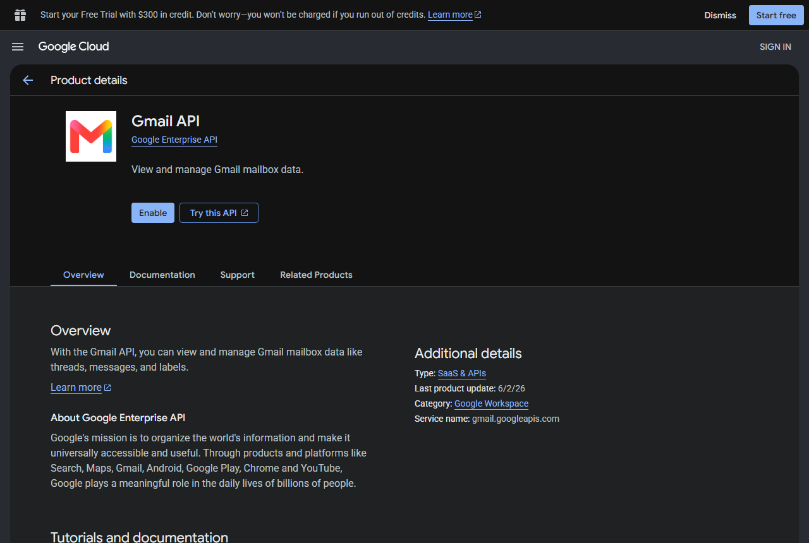
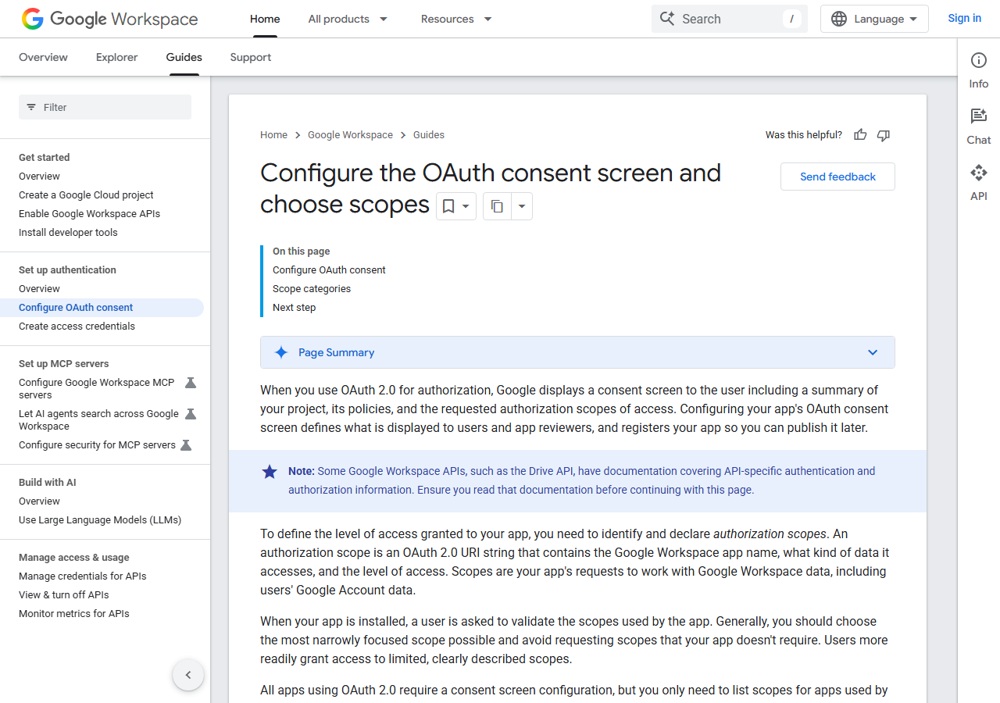
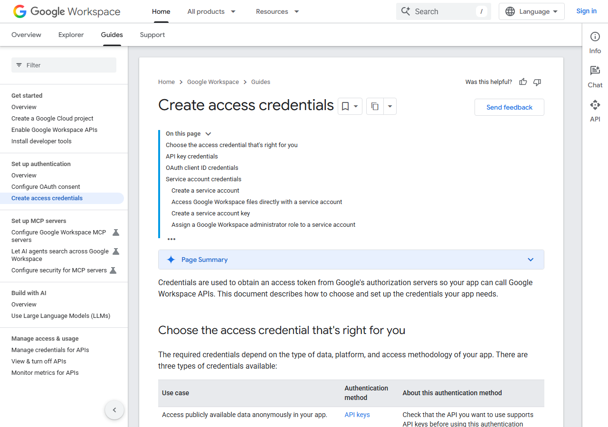
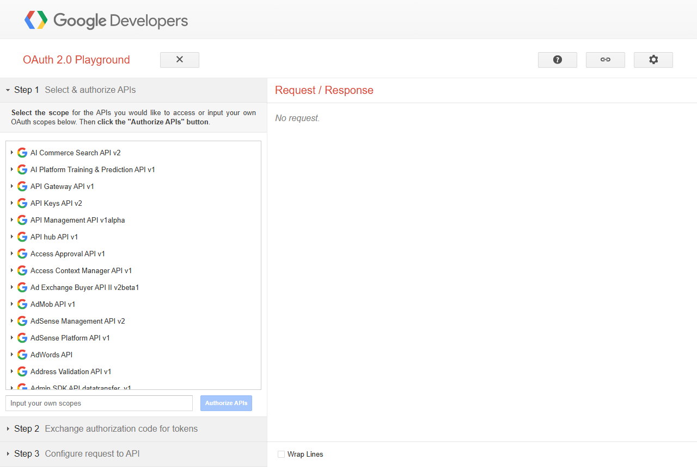

:orphan:

Set Up the Google Connectors
============================

Connect Sparkflows to **Gmail, Google Sheets, Google Docs, Google Calendar and
Google Drive**, and grant only the permissions you actually need. Each of the
five can be given read-only access or read-and-write access independently.

Steps 1 to 3 are done once. Step 4 is where you choose your permissions - read
it before you create the credentials, because the permissions are chosen at
that point.

.. contents:: On this page
   :local:
   :depth: 1

1. What you need before you start
---------------------------------

.. list-table::
   :header-rows: 1
   :widths: 30 70

   * - Requirement
     - Detail
   * - A Google account
     - The Workspace or Gmail account whose data the agent will work with.
   * - Access to Google Cloud Console
     - ``console.cloud.google.com`` - free, no billing required for these APIs.
   * - Permission to create credentials
     - If your Google Workspace is managed by an administrator, you may need
       their approval.
   * - About 20 minutes
     - One-off. Adding more connectors later only means adding more scopes.

2. Create a project and enable the APIs
---------------------------------------

A Google Cloud project holds your credentials. One project serves all five
connectors.

Create the project
~~~~~~~~~~~~~~~~~~

#. Go to ``console.cloud.google.com`` and sign in.
#. Open the project menu at the top of the page and choose **New Project**.
#. Give it a name you will recognise later, such as *Sparkflows Connectors*,
   and click **Create**.

Enable one API per connector
~~~~~~~~~~~~~~~~~~~~~~~~~~~~

Enable only the APIs for the connectors you intend to use.

.. list-table::
   :header-rows: 1
   :widths: 40 60

   * - Connector
     - API to enable
   * - Gmail
     - Gmail API
   * - Google Sheets
     - Google Sheets API
   * - Google Docs
     - Google Docs API
   * - Google Calendar
     - Google Calendar API
   * - Google Drive
     - Google Drive API

In the console, go to **APIs & Services > Library**, search for each API by
name, open it and click **Enable**.

   Google's guide to enabling Workspace APIs.

   An API's page in the Library, with the **Enable** button.

3. Configure the OAuth consent screen
-------------------------------------

The consent screen is what the account owner sees when they approve access. It
must be configured before credentials can be created.

#. Go to **APIs & Services > OAuth consent screen**.
#. Choose **Internal** if everyone using it is in your Google Workspace
   organisation, otherwise choose **External**.
#. Fill in the app name and support email.
#. On the **Data Access** (or **Scopes**) step, add the scopes from step 4.
   This is the step that decides read-only versus read-and-write.

   Configuring the OAuth consent screen.

.. _google-scopes:

4. Choose your permissions
--------------------------

Google calls these permissions **scopes**. Each connector below lists two
options. Pick **one line per connector** - the read-only scope or the
read-and-write scope. You never need both for the same connector, because the
write scope already includes reading.

If you are unsure, start with read-only. You can add write access later by
repeating :ref:`google-refresh-token` with the extra scope.

Gmail
~~~~~

.. list-table::
   :header-rows: 1
   :widths: 16 44 40

   * - Access
     - Scope to add
     - What the agent can do
   * - Read only
     - ``https://www.googleapis.com/auth/gmail.readonly``
     - Read a message, list messages, search, read a thread, list labels, read
       a draft.
   * - Read + write
     - ``https://www.googleapis.com/auth/gmail.modify``
       ``https://www.googleapis.com/auth/gmail.send``
     - Everything above, plus: send a message, create and send a draft, add or
       remove labels, move to trash.

.. note::

   Use both write scopes together. ``modify`` covers labels, drafts and trash;
   ``send`` is needed to actually send. Permanently deleting a message (not just
   trashing it) needs the full ``https://mail.google.com/`` scope instead.

Google Sheets
~~~~~~~~~~~~~

.. list-table::
   :header-rows: 1
   :widths: 16 44 40

   * - Access
     - Scope to add
     - What the agent can do
   * - Read only
     - ``https://www.googleapis.com/auth/spreadsheets.readonly``
     - Read rows from a tab, list the tabs in a spreadsheet, read spreadsheet
       details.
   * - Read + write
     - ``https://www.googleapis.com/auth/spreadsheets``
     - Everything above, plus: append rows, update a row, clear a range, add or
       delete a tab, create a spreadsheet.

To refer to a spreadsheet by **name** rather than by id, also add the Drive
metadata scope - see :ref:`google-names`.

Google Docs
~~~~~~~~~~~

.. list-table::
   :header-rows: 1
   :widths: 16 44 40

   * - Access
     - Scope to add
     - What the agent can do
   * - Read only
     - ``https://www.googleapis.com/auth/documents.readonly``
     - Read a document, read a document as plain text.
   * - Read + write
     - ``https://www.googleapis.com/auth/documents``
     - Everything above, plus: create a document, insert or replace text in
       one.

To refer to a document by **name** rather than by id, also add the Drive
metadata scope - see :ref:`google-names`.

Google Calendar
~~~~~~~~~~~~~~~

.. list-table::
   :header-rows: 1
   :widths: 16 44 40

   * - Access
     - Scope to add
     - What the agent can do
   * - Read only
     - ``https://www.googleapis.com/auth/calendar.readonly``
     - List calendars, read a calendar, read an event, list events in a date
       range, find free and busy time.
   * - Read + write
     - ``https://www.googleapis.com/auth/calendar``
     - Everything above, plus: create an event, update an event, delete an
       event, quick-add from plain text.

Creating an event with attendees emails them automatically, and a Google Meet
link can be added at the same time. Both are covered by the write scope.

Google Drive
~~~~~~~~~~~~

.. list-table::
   :header-rows: 1
   :widths: 16 44 40

   * - Access
     - Scope to add
     - What the agent can do
   * - Read only
     - ``https://www.googleapis.com/auth/drive.readonly``
     - Search for files, list files, list a folder's contents, read file
       details, download a file, see who has access.
   * - Read + write
     - ``https://www.googleapis.com/auth/drive``
     - Everything above, plus: create a file or folder, rename or move a file,
       copy a file, delete a file, share a file with someone.

.. warning::

   Drive is the broadest of the five. Grant the write scope only if the agent
   genuinely needs to create, move, share or delete files.

All five connectors at once
~~~~~~~~~~~~~~~~~~~~~~~~~~~

The read-and-write set - the combination Sparkflows tests against:

.. code-block:: text

   https://mail.google.com/
   https://www.googleapis.com/auth/calendar
   https://www.googleapis.com/auth/documents
   https://www.googleapis.com/auth/drive
   https://www.googleapis.com/auth/spreadsheets

All five read-only:

.. code-block:: text

   https://www.googleapis.com/auth/gmail.readonly
   https://www.googleapis.com/auth/calendar.readonly
   https://www.googleapis.com/auth/documents.readonly
   https://www.googleapis.com/auth/drive.readonly
   https://www.googleapis.com/auth/spreadsheets.readonly

.. _google-names:

Referring to files by name
~~~~~~~~~~~~~~~~~~~~~~~~~~

Sparkflows lets you name a spreadsheet or document instead of pasting its long
id - *Q4 Tracker* rather than ``1b0UhQFo_0eRnbPvi``. Looking that name up asks
Google Drive, so it needs one extra scope even if you are not otherwise using
the Drive connector:

.. code-block:: text

   https://www.googleapis.com/auth/drive.metadata.readonly

This scope only reads file names and ids - it cannot open file contents.
Without it, names will not resolve and you must paste ids instead; ids always
work.

.. list-table::
   :widths: 50 50

   * - .. figure:: ../_assets/agentic-ai-guide/google-setup/gmail-scopes.png
          :alt: Google's published list of Gmail API scopes
          :width: 100%

          Google's published scope list for Gmail.

     - .. figure:: ../_assets/agentic-ai-guide/google-setup/drive-scopes.png
          :alt: Google's published list of Drive API scopes
          :width: 100%

          Google's published scope list for Drive.

5. Create credentials and get a refresh token
---------------------------------------------

Sparkflows needs three values: a **Client ID**, a **Client Secret** and a
**Refresh Token**.

Create the OAuth client
~~~~~~~~~~~~~~~~~~~~~~~

#. Go to **APIs & Services > Credentials > Create Credentials > OAuth client
   ID**.
#. Choose **Web application** as the application type.
#. Under **Authorised redirect URIs** add
   ``https://developers.google.com/oauthplayground``.
#. Click **Create**, then copy the Client ID and Client Secret somewhere safe.

   Google's guide to creating access credentials.

.. _google-refresh-token:

Get the refresh token
~~~~~~~~~~~~~~~~~~~~~

The refresh token is what lets Sparkflows keep working without anyone signing
in again.

#. Open ``developers.google.com/oauthplayground``.
#. Click the settings gear, tick **Use your own OAuth credentials**, and paste
   the Client ID and Client Secret from the previous step.
#. In the **Input your own scopes** box on the left, paste the scopes you chose
   in :ref:`google-scopes`, separated by spaces. Click **Authorize APIs**.
#. Sign in as the account whose data the agent will use, and approve the
   consent screen.
#. In **Step 2**, click **Exchange authorization code for tokens** and copy the
   **Refresh Token**.

   The OAuth Playground: the scopes box on the left, the token exchange in Step 2.

6. Add the connection in Sparkflows
-----------------------------------

#. Go to **Administration > Global/Group Connections** (or the project's
   **Connections** page) and click **Add Connection**.
#. Choose the **Tools** category, then **Google**. One Google connection serves
   Gmail, Sheets, Docs, Calendar and Drive.

   .. figure:: ../_assets/agentic-ai-guide/google-setup/sf-tools-google.png
      :alt: The Add Connection wizard filtered to Tools, showing the Google connector
      :width: 85%

#. Give the connection a name, then fill in the three values.

   .. figure:: ../_assets/agentic-ai-guide/google-setup/sf-google-form.png
      :alt: The Google Connection form with Credential Store, Connection Name, Client Id, Refresh Token, Client Secret and Description
      :width: 85%

   .. list-table::
      :header-rows: 1
      :widths: 30 70

      * - Field
        - Value
      * - **Client Id**
        - The Client ID from step 5.
      * - **Client Secret**
        - The Client Secret from step 5.
      * - **Refresh Token**
        - The Refresh Token from the OAuth Playground.

   To keep the secrets out of the connection itself, pick a **Credential Store**
   and enter ``$secret_key`` references instead.

#. Click **Next**, test the connection, then **Save**.

One connection can be reused by every agent in the project. You only need more
than one if you are connecting different Google accounts.

7. Use the connection in an agent
---------------------------------

There are two ways, and the connection works for both:

* **As a fixed step** - add an :doc:`App Action </agentic-ai-guide/app-actions>`,
  pick Gmail, Google Sheets, Google Docs, Google Calendar or Google Drive, then
  the connection.
* **As a tool the model decides to use** - in Agent Studio or an Agent Node,
  add the Google connector as a tool, select the connection, and tick only the
  operations the agent may perform (:doc:`/agentic-ai-guide/tools-actions`).

Save the agent and test it with a simple request, such as *read my Interview
Notes document*.

The two controls work together. **Google scopes** decide what the connection
is physically able to do; the **ticked operations** decide what this particular
agent may do with it. A read-only scope means an agent cannot write, even if a
write operation is ticked.

8. Troubleshooting
------------------

.. list-table::
   :header-rows: 1
   :widths: 40 60

   * - What you see
     - What it means
   * - *Request had insufficient authentication scopes*
     - The scope for that operation was not granted. Add it in step 4 and
       repeat :ref:`google-refresh-token` to get a new refresh token.
   * - *Looking a spreadsheet up by name needs a Google Drive scope*
     - Add the scope in :ref:`google-names`, or paste the file id instead of
       its name.
   * - ``invalid_grant`` when the connection is tested
     - The refresh token has been revoked or was created with a different
       Client ID. Repeat :ref:`google-refresh-token`.
   * - *403 Access Denied* on a specific file
     - The signed-in account does not have access to that file in Google
       itself. Share the file with that account.
   * - *Two documents are named X*
     - Two files share a name. Sparkflows will not guess - rename one, or use
       the file id.

.. important::

   Changing scopes always requires a **new refresh token**. Adding a scope in
   Google Cloud does not update a token that was already issued.
