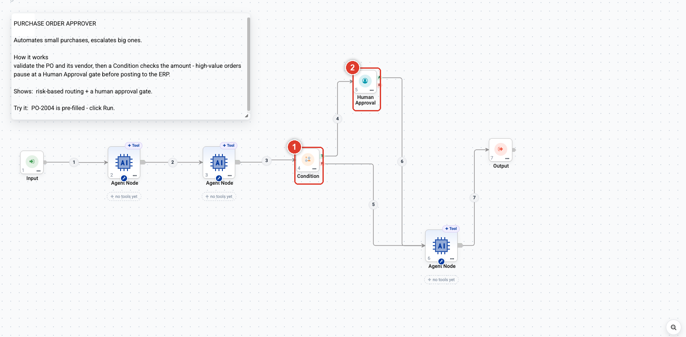
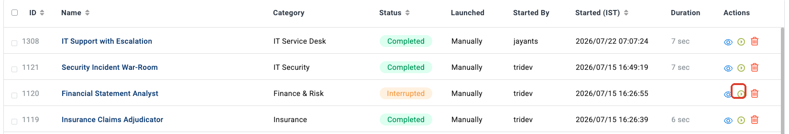
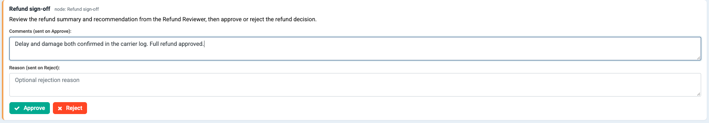
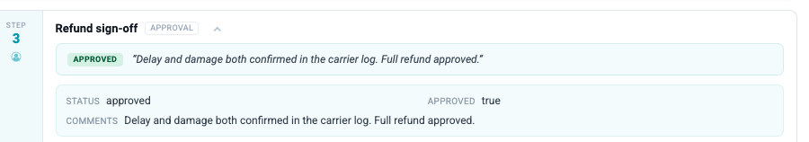

Human-in-the-Loop
=================

Some decisions should not be automatic. Human-in-the-loop nodes let an agentic
workflow **pause**, put a real decision in front of a real person, and then
carry on down a different path depending on what they chose.

Sparkflows gives you two nodes for this, both in the **Control** group:

.. list-table::
   :header-rows: 1
   :widths: 22 20 58

   * - Node
     - Anchors
     - Use it when
   * - **Human Approval**
     - **A** / **R**
     - A person must approve or reject before the run continues.
   * - **Human Input**
     - single
     - The run needs the person to *say something* before it can continue.

.. contents:: On this page
   :local:
   :depth: 1

Human Approval
--------------

The Human Approval node is a human-in-the-loop gate. When execution reaches it
the graph **pauses** and the engine returns ``status='pending'`` to the caller.
The run resumes only when the caller invokes the engine again, passing back an
``approval_result``. Based on the decision the graph continues down either the
**Approved (A)** or the **Rejected (R)** anchor.

.. important::

   **Both anchors should be wired.** A rejected run whose R branch leads nowhere
   simply stops, and nobody is told why.

The shape of an approval flow
-----------------------------

An approval gate is only useful if the decision in front of it is already made.
The pattern that works has three parts:

#. **Do the analysis first**, while nobody is waiting.
#. **Branch on risk** with a :doc:`Condition </agentic-ai-guide/control-flow>`,
   so only the cases that need a human reach the gate.
#. **Gate only that branch.**

   The **Purchase Order Approver** example. Two Agent Nodes validate the PO and
   its vendor, a Condition checks the amount, and only high-value orders stop at
   the approval gate before posting to the ERP.

.. caution::

   Do not put an approval gate in front of everything. An approval that fires on
   every run is a queue, not a control — people start approving without reading,
   and you have added latency while removing nothing. Gate the exceptions.

Adding the node
---------------

#. Open your agent on the **Agent Orchestration** canvas.
#. In the **Nodes** palette, open the **Control** group.
#. Drag **Human Approval** onto the canvas.

   .. figure:: ../_assets/agentic-ai-guide/hitl/palette-control.png
      :alt: Control group of the node palette with Human Approval highlighted
      :width: 302px

#. Connect the branch that needs sign-off into its input.
#. Wire both outputs:

   .. list-table::
      :header-rows: 1
      :widths: 20 80

      * - Anchor
        - Wire it to
      * - **Approved (A)**
        - The action that should only happen after sign-off — send the email,
          place the order, post the transaction.
      * - **Rejected (R)**
        - The fallback — log the decision, notify the requester, or route to an
          edit/retry step.

   .. figure:: ../_assets/agentic-ai-guide/hitl/approval-anchors.png
      :alt: Human Approval node showing the A and R output anchors
      :width: 290px

Configuration
-------------

Double-click the node.

.. figure:: ../_assets/agentic-ai-guide/hitl/approval-config.png
   :alt: Human Approval configuration dialog with Title and Prompt to Approver
   :width: 85%

.. list-table::
   :header-rows: 1
   :widths: 25 75

   * - Field
     - What to put in it
   * - **Title** *(required)*
     - Short heading shown to the approver when the graph pauses. Keep it
       action-oriented — ``Approve purchase order``, ``Confirm customer
       refund``.
   * - **Prompt to Approver**
     - The longer message. Explain what the upstream node produced and exactly
       what decision is being asked for. Reference the values the reviewer needs
       — an amount, a draft, a validator's assessment — so the person can decide
       without leaving the screen.

.. important::

   The prompt is shown to the reviewer **exactly as you type it**. It is not a
   template — a ``${...}`` placeholder would be shown literally, not replaced
   with a value. (Placeholders like that *are* substituted on the REST API
   Client, MCP Tool and Workflow Execution nodes, which is where people
   usually meet them.)

   You do not need them here. The reviewer opens the run, so every upstream
   step's output is already on the screen next to the decision. Your job in the
   prompt is to say **which** step to read:

   .. code-block:: text

      Read the Refund Reviewer summary above, then approve or reject.
      Approval issues the refund; rejection returns the case to the queue.

Writing the approver prompt
---------------------------

This field is the whole control. A reviewer who does not understand what they
are approving will approve everything.

A good prompt answers three questions. The Purchase Order Approver example
answers all three:

   *This purchase order is at or above the $10,000 manager-approval threshold.
   Review the vendor validation summary and approve or reject. Approval lets the
   run post the PO to D365; rejection cancels the run without touching the ERP.*

.. list-table::
   :header-rows: 1
   :widths: 30 70

   * - The question
     - How that example answers it
   * - **Why am I seeing this?**
     - "at or above the $10,000 manager-approval threshold"
   * - **What should I check?**
     - "Review the vendor validation summary"
   * - **What happens next?**
     - "Approval lets the run post the PO to D365; rejection cancels the run
       without touching the ERP"

.. tip::

   Name the **system that will be changed**, as that example names D365. The
   difference between "approve this" and "approve posting this to D365" is the
   difference between a rubber stamp and a decision.

What the reviewer actually does
-------------------------------

An approval is answered from the **run**, not from the builder. This is the
whole flow, from the reviewer's side.

**Step 1 — Find the waiting run.** On **Agents → Executions**, a run sitting at
a gate shows the status **Interrupted**. It stays there until somebody answers
it, and it survives a restart.

**Step 2 — Open it.** An Interrupted row has three actions. The middle one is
**Resume Paused Run** *(boxed above)* — on a finished run the same position says
**Rerun** instead, so the icon tells you whether a run is waiting for you.
Either **Resume Paused Run** or **View Execution** takes you to the same place.

The run opens with an **approval panel** at the top, carrying the node's title,
the prompt you wrote, and two boxes — one for comments that travel with an
approval, one for the reason that travels with a rejection.

Everything the reviewer needs to judge is on the same page: scroll down and the
**Node Outputs** panel shows what each earlier step produced, including the
agent's own recommendation.

**Step 3 — Answer it.** Type a comment or a reason, then click **Approve** or
**Reject**. The run resumes immediately from where it stopped — it does not
start again — and continues down the **Approved (A)** or **Rejected (R)**
branch.

**Step 4 — The decision is part of the record.** The approval step keeps the
outcome and the comment, so months later the run still says who decided what,
and why.

.. note::

   Reviewing happens in the run view. A :doc:`chat assistant
   </agentic-ai-guide/chat>` is a conversational front door, not a review queue
   — send reviewers to **Agents → Executions**, or notify them with an
   :doc:`Email Notification </agentic-ai-guide/node-reference>` node that links
   to the run.

How pause and resume actually work
----------------------------------

Worth understanding before you build anything that depends on it.

.. list-table::
   :header-rows: 1
   :widths: 30 70

   * - Behaviour
     - Detail
   * - **Pausing**
     - On reaching the node the run reports ``status='pending'`` and records
       ``pending_approval``.
   * - **Durability**
     - The paused state is persisted, so a waiting approval **survives a
       restart**.
   * - **Resuming**
     - The run resumes when the caller re-invokes the engine with an
       ``approval_result`` for that run's **Job ID**. There is no session id to
       configure.

Bypassing the pause for testing
-------------------------------

For automated end-to-end tests, set ``auto_approve = true`` as an Input variable
(or ``autoApprove`` on the node). Every request is then approved without
waiting, and execution always flows down the Approved anchor.

.. caution::

   ``auto_approve`` disables the control entirely. Use it in tests. Make sure it
   is not set in anything you deploy — an approval gate that auto-approves looks
   identical to one that works, right up until it matters.

Deciding what needs approval
----------------------------

Put a Condition before the gate and branch on an explicit expression:

.. code-block:: python

   amount >= 10000

Thresholds that work in practice:

.. list-table::
   :header-rows: 1
   :widths: 30 70

   * - Domain
     - A rule worth gating on
   * - Procurement
     - Order value above a monetary threshold
   * - Customer service
     - Refunds above an amount, or any goodwill credit
   * - HR
     - Any rejection, or any offer outside the approved band
   * - Legal
     - Any clause the review flagged as non-standard
   * - Finance
     - Anything scored as high risk, or any new payee

Worked examples
---------------

**Purchase order over threshold.** A validator flags a PO above the auto-approval
limit. Title: *Approve high-value purchase order*. On approve, execution flows
down A to the "place order" step; on reject, down R to "notify requester".

**Approve an AI-drafted email.** An Agent Node drafts customer outreach. Title:
*Send this outreach email?*

.. list-table::
   :header-rows: 1
   :widths: 20 25 55

   * - Decision
     - Anchor taken
     - Downstream action
   * - Approve
     - Approved (A)
     - An Email Notification node sends the draft
   * - Reject
     - Rejected (R)
     - Routes back to the Agent to redraft

That second pattern — reject loops back to redraft — is worth copying. It turns
a rejection into an improvement rather than a dead end.

Human Input
-----------

**Human Input** is the conversational pause. It parks the run, shows the person
whatever the upstream step emitted as its response message, and captures the raw
reply into ``user_input``.

.. note::

   Human Input **carries no configuration at all** and does no interpretation.
   It does not extract fields, validate, or decide business actions.
   Understanding the reply — a part request, a yes/no, a selection, a
   confirmation — is the **agent's job on the next turn**.

So the quality of a Human Input step is decided by the node that speaks *before*
it and the agent that reads the answer *after* it. Make the upstream message say
exactly what is needed and in what form, and give the downstream agent explicit
instructions for interpreting the reply.

It also pairs naturally with a blocked Guardrails check: wire **Blocked (B)**
back to a Human Input node and the person gets to revise and retry.

Checklist before you ship an approval flow
------------------------------------------

.. list-table::
   :header-rows: 1
   :widths: 8 92

   * - ✓
     - Check
   * - ☐
     - The analysis happens **before** the gate.
   * - ☐
     - A Condition limits the gate to cases that genuinely need it.
   * - ☐
     - The **Title** is scannable in a list of twenty.
   * - ☐
     - The prompt says why, what to check, and what each choice causes.
   * - ☐
     - The **R** branch leads somewhere that tells someone.
   * - ☐
     - ``auto_approve`` is **not** set.
   * - ☐
     - You have run it once as the reviewer and read your own prompt cold.

Next: approvals in production
-----------------------------

:doc:`/agentic-ai-guide/control-flow` covers the Condition and Router nodes that
decide which cases reach your gate.
