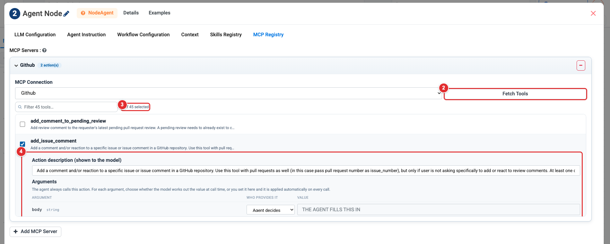

MCP Servers
===========

Model Context Protocol (MCP) is an open standard for exposing tools to AI
agents. Connect an MCP server to Sparkflows and its tools become actions your
agents can take — no connector required.

This page uses a real **GitHub** MCP connection, which exposes 45 tools, as the
worked example.

.. contents:: On this page
   :local:
   :depth: 1

When to use MCP
---------------

.. list-table::
   :header-rows: 1
   :widths: 40 60

   * - Situation
     - Use
   * - The system is one of the 53 connectors
     - The connector — already configured and governed
   * - The system has an MCP server
     - **MCP**
   * - Your team already exposes internal tooling over MCP
     - **MCP**
   * - The system has only an HTTP API
     - ``REST API Client``, or a workflow

Where to configure it
---------------------

.. list-table::
   :header-rows: 1
   :widths: 35 65

   * - Building in
     - Go to
   * - **Agent Studio**
     - The **MCP Servers** group
   * - **Agent Orchestration**
     - Any Agent Node → **MCP Registry** tab
   * - A fixed step in a flow
     - The **MCP Tool** node (Integrations group)

Step 1: Connect the server
--------------------------

#. Open **MCP Servers** (or the **MCP Registry** tab) and click **Add MCP
   Server**.
#. Pick the server from **MCP Connection**. The list shows the MCP connections
   configured in your workspace — here, ``Github``.
#. Click **Fetch Tools**.

.. list-table::
   :header-rows: 1
   :widths: 8 92

   * - #
     - What it is
   * - 1
     - **MCP Connection** — which server to talk to.
   * - 2
     - **Fetch Tools** — asks the server what it can do. Nothing appears until
       you click it.
   * - 3
     - The selection counter — ``2 of 45 selected``. GitHub alone offers 45
       tools; the counter is your reminder that you are choosing, not
       accepting.
   * - 4
     - An expanded tool, showing the description the model sees and the
       arguments it takes.

Step 2: Choose the tools
------------------------

Fetching gives you the full list with a filter box — ``add_comment_to_pending_review``,
``add_issue_comment``, ``create_branch``, ``create_or_update_file`` and forty
more. Tick only the ones this agent needs.

.. important::

   45 tools is not a shopping list. An agent given every GitHub tool can delete
   branches and rewrite files; an agent given ``add_issue_comment`` can comment
   on an issue. Tick the smallest set that does the job — the header chip
   (``Github  2 action(s)``) tells you at a glance how much power you handed
   over.

Step 3: Decide who fills in each argument
-----------------------------------------

This is the part most people miss, and it is the most useful control on the
page.

Expand a ticked tool and you get its **Action description (shown to the model)**
and its **Arguments** table. For every argument you choose **who provides it**:

.. figure:: ../_assets/agentic-ai-guide/tools/agent-decides.png
   :alt: Prompt asking whether the agent decides a tool's settings or you fix them
   :width: 320px

.. list-table::
   :header-rows: 1
   :widths: 22 78

   * - Setting
     - Meaning
   * - **Agent decides**
     - The model works out the value at call time. The value box shows *"THE
       AGENT FILLS THIS IN"*.
   * - **I set it**
     - You type the value here and it is applied automatically on **every**
       call. The model cannot change it.

As the panel puts it: *the agent always calls this action; for each argument,
choose whether the model works out the value at call time, or you set it here
and it is applied automatically on every call.*

How to choose
~~~~~~~~~~~~~

.. list-table::
   :header-rows: 1
   :widths: 45 55

   * - Use **I set it** for
     - Use **Agent decides** for
   * - The repository or organisation name
     - The issue number being discussed
   * - A fixed label, branch prefix or reviewer
     - The body text of a comment
   * - Anything that must never vary
     - Anything that depends on the request

.. tip::

   Pinning an argument with **I set it** is a genuine safety control, not just a
   convenience. An agent that can comment on issues in *one* repository because
   you pinned ``owner`` and ``repo`` cannot wander into another one, however
   confused it becomes.

Editing the action description
------------------------------

The **Action description (shown to the model)** is prefilled from the server but
you can edit it, and you should when the model keeps choosing wrongly. It is the
only thing the model reads when deciding whether this tool fits.

If two tools sound alike, say so plainly in the description, or disambiguate in
the agent's Instructions:

.. code-block:: text

   Use add_issue_comment to comment on an issue or pull request.
   Use add_reply_to_pull_request_comment only when replying to an
   existing review comment.

The MCP Tool node
-----------------

On the orchestration canvas, the **MCP Tool** node (Integrations group) calls an
MCP tool at a fixed point in the flow, rather than leaving the decision to the
model. Use it when the call must always happen.

Troubleshooting
---------------

.. list-table::
   :header-rows: 1
   :widths: 35 65

   * - Symptom
     - Cause to check first
   * - No tools appear
     - You have not clicked **Fetch Tools**, or the connection cannot reach the
       server.
   * - The agent never calls the tool
     - The Instructions do not mention it. Name the tool explicitly.
   * - The agent calls it with the wrong repository
     - Pin ``owner`` and ``repo`` with **I set it**.
   * - Calls fail with missing arguments
     - Add: *"If a tool call fails because an argument is missing, call it again
       with all required arguments."*

Next: other kinds of tool
-------------------------

:doc:`/agentic-ai-guide/skills` covers reusable instruction files that several
agents can share.
