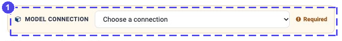
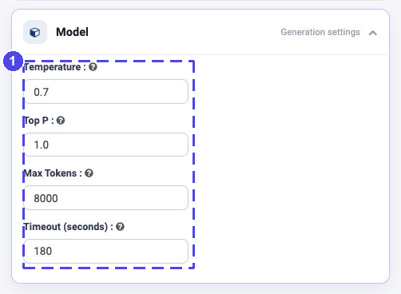

Models & Prompts
================

Two things decide how an agent behaves: the **model** it runs on, and the
**instructions** you give it. This page covers both.

Choosing a model connection
---------------------------

In Agent Studio, choose **Model Connection** above the instructions. On the
canvas, open an Agent Node's **LLM Config** tab and pick a **Connection**.
Connections are created once by an
administrator - see :doc:`/user-guide/connection/gen-ai-connection/index`.

Generation settings
-------------------

Open Studio's **Model** group for these settings. The values below are the
new-agent defaults in this build; an existing agent keeps its saved values.

.. list-table::
   :header-rows: 1
   :widths: 22 20 58

   * - Setting
     - Default
     - What it does
   * - **Temperature**
     - ``0.7``
     - Controls variation when supported by the selected model. Lower values
       can make wording steadier; they do not guarantee correctness or identical runs.
   * - **Top P**
     - ``1.0``
     - Nucleus sampling. Adjust temperature instead; changing both at once makes
       results hard to reason about.
   * - **Max Tokens**
     - ``8000``
     - Requested ceiling on response length. Choose a limit suited to the task;
       the provider and model may impose their own constraints.
   * - **Timeout (seconds)**
     - ``180``
     - How long one call may take before it fails.

Picking a temperature
~~~~~~~~~~~~~~~~~~~~~

.. list-table::
   :header-rows: 1
   :widths: 20 30 50

   * - Value
     - Use for
     - Why
   * - ``0 – 0.2``
     - Extraction, classification, routing, anything a Condition branches on
     - Reduce variation; validate the structured result before branching
   * - ``0.3 – 0.7``
     - Summarising, explaining, answering questions
     - Some variation in wording is fine
   * - ``0.8 – 1.0``
     - Drafting, brainstorming, generating options
     - Variety is the point

.. important::

   If a **Condition** node branches on something an agent produced, run that
   agent at a low temperature. Otherwise identical inputs can take different
   paths on different days, and that bug is miserable to reproduce.

Writing instructions
--------------------

Instructions are the system prompt. They drive every LLM call the agent makes.

The four-part shape
~~~~~~~~~~~~~~~~~~~

Almost every instruction that works has these four parts, in this order:

.. code-block:: text

   1. WHO IT IS
      You review supplier contracts for a UK insurance broker.

   2. WHAT TO DO
      Given a contract, identify every clause that differs from our
      standard terms, and rate each difference as low, medium or high risk.

   3. WHAT THE ANSWER LOOKS LIKE
      Reply with one row per difference:
      Clause | Our standard | This contract | Risk | Why

   4. WHAT TO DO WHEN THINGS GO WRONG
      If the document is not a contract, say so and stop. If a clause is
      ambiguous, rate it medium and say why. Never guess at missing text.

Part 4 is the one people skip and the one that prevents most bad output. An agent
invents an answer because nothing ever told it that "I don't know" is a
permitted response.

Rules that earn their place
~~~~~~~~~~~~~~~~~~~~~~~~~~~

.. list-table::
   :header-rows: 1
   :widths: 45 55

   * - Write this
     - Instead of this
   * - ``Always fetch the record before answering.``
     - ``Use tools when appropriate.``
   * - ``Reply with exactly three lines, labelled Issue, Impact, Priority.``
     - ``Be concise.``
   * - ``If the ID does not exist, say so and stop.``
     - ``Be accurate.``
   * - ``Never calculate a total yourself; call the workflow.``
     - ``Use the workflow for calculations.``

The pattern: **name the behaviour, not the virtue.** "Be accurate" is not an
instruction a model can act on. "If the ID does not exist, say so and stop" is.

The Improve button
~~~~~~~~~~~~~~~~~~

**Improve**, above the Instructions box, expands a rough draft into a fuller
prompt. It is a good way to get from three words to a first draft - then edit it
down. Generated prompts tend towards generic politeness, and the specific rules
are the ones doing the work.

What does not belong in Instructions
------------------------------------

.. list-table::
   :header-rows: 1
   :widths: 40 60

   * - Not this
     - Put it here
   * - Rules several agents share
     - :doc:`/agentic-ai-guide/skills`
   * - Standing facts about the business
     - :doc:`/agentic-ai-guide/context-agents-md`
   * - Long reference material
     - :doc:`/agentic-ai-guide/rag-knowledge`
   * - Credentials or API keys
     - :doc:`/agentic-ai-guide/connections` - **never** in prompt text
   * - A description of five different jobs
     - Separate agents, coordinated by a
       :doc:`Supervisor </agentic-ai-guide/multi-agent-orchestration>`

Iterating
---------

Change **one thing at a time** and re-run the same query. Keep a realistic query
in the Input box as your regression test. When you change instructions and the
agent gets better at one thing and worse at another, you want to know which edit
did it - and that is only possible if you made one.

Next: shared instructions
-------------------------

:doc:`/agentic-ai-guide/evaluate-agents` covers judging whether the output is
actually good enough.
