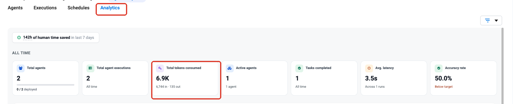
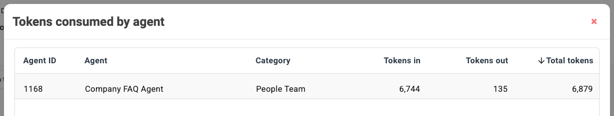
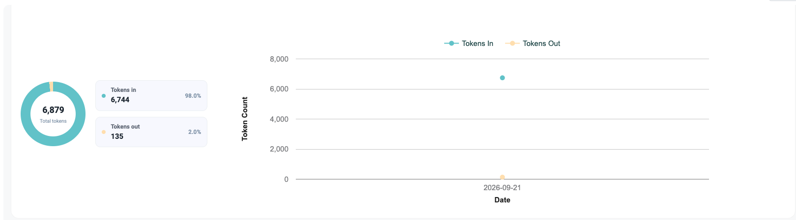
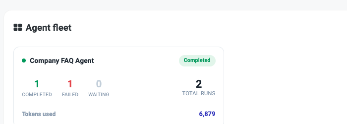
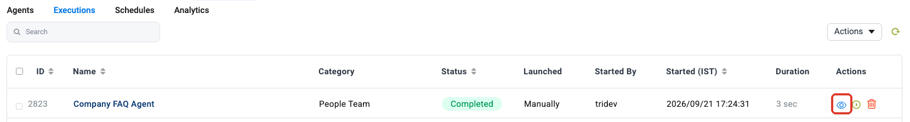
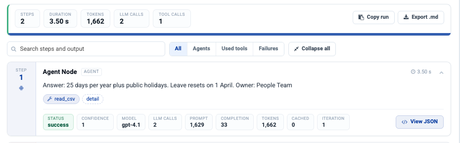
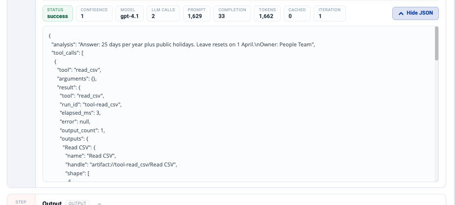
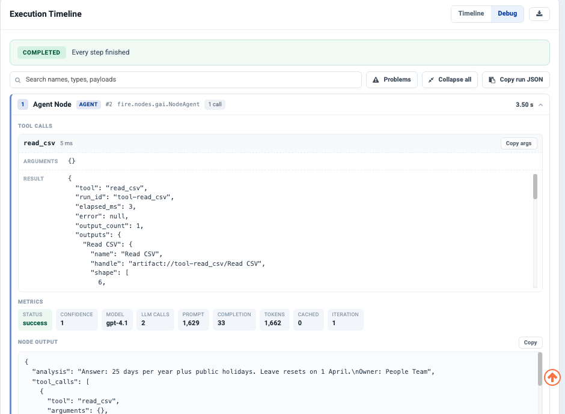

Monitor & Govern
================

Agents change behaviour without anyone editing them — a model is updated, a
connected system changes its data, the questions people ask drift. Monitoring is
how you notice.

.. contents:: On this page
   :local:
   :depth: 1

Where to look
-------------

Everything on this page lives under **Agents** in the project sidebar, on four
tabs.

.. list-table::
   :header-rows: 1
   :widths: 20 80

   * - Tab
     - What it answers
   * - **Agents**
     - What exists, and whether it is deployed.
   * - **Executions**
     - What ran, when, and whether it worked.
   * - **Schedules**
     - What runs unattended — see :doc:`/agentic-ai-guide/schedule-agents`.
   * - **Analytics**
     - How much it is all being used, and what it is costing in tokens.

What to watch
-------------

.. list-table::
   :header-rows: 1
   :widths: 26 34 40

   * - Signal
     - Where
     - What a change means
   * - Run volume
     - Analytics
     - Adoption, or a caller stuck in a loop
   * - Failure rate
     - Analytics, Executions
     - A connection expired, or a system changed
   * - Run duration
     - Executions
     - More tool calls per run — often a prompt regression
   * - Approval rate
     - Approval history
     - The agent's judgement drifting from your reviewers'
   * - Rejections
     - Approval history
     - The most valuable signal you have — see below

Approvals as a quality metric
-----------------------------

Every rejection at a :doc:`Human Approval </agentic-ai-guide/human-in-the-loop>`
gate is a labelled example of the agent being wrong, produced for free by
someone qualified to judge.

Track the rejection rate over time:

* **Rising** — something changed. Find out what before it reaches the cases
  that are not gated.
* **Near zero for a long time** — either the agent is genuinely reliable, or
  reviewers have stopped reading. Both are worth knowing, and they need
  different responses.
* **Clustered** — if rejections concentrate on one category, that is a rule the
  agent has not been told.

.. tip::

   Read a sample of rejected cases every month and ask what instruction would
   have prevented each one. That is the highest-value maintenance activity
   there is, and it takes an hour.

Check what a run cost in tokens
-------------------------------

Token consumption is the running cost of an agent, and it is visible at three
levels of detail.

**Across the project — the Analytics tab.** **Total tokens consumed** is the
headline; the split underneath is input versus output.

Click the **Total tokens consumed** card to break the number down by agent.

Further down the same page, **Token usage** charts input and output tokens over
time, so you can see a cost trend rather than a single number.

**Per agent — the Agent fleet card.** Each agent carries its own run counts and
**Tokens used**.

.. tip::

   Tokens in almost always dwarf tokens out. If input tokens climb without the
   work changing, look at what you are putting *into* the prompt — knowledge
   chunks, skills and ``AGENTS.md`` all ride along on every call.

Read a single run
-----------------

**Step 1 — Open the run.** On the **Executions** tab, click the eye icon on the
run you want.

**Step 2 — Read the totals, then the steps.** The strip at the top of **Node
Outputs** gives the whole run: steps, duration, tokens, LLM calls and tool
calls. Every step then carries its own row — model, LLM calls, prompt tokens,
completion tokens, total tokens, cached tokens and iteration.

.. list-table::
   :header-rows: 1
   :widths: 26 74

   * - Metric
     - What it tells you
   * - **PROMPT**
     - Tokens sent to the model — instructions, context, knowledge and history.
   * - **COMPLETION**
     - Tokens the model wrote back.
   * - **TOKENS**
     - The two added together. This is what you are billed on.
   * - **CACHED**
     - Prompt tokens served from cache. Higher is cheaper.
   * - **LLM CALLS** / **ITERATION**
     - How many times the step went back to the model. A step that iterates
       more than you expected is usually a tool-calling loop.

**Step 3 — Open the raw JSON when the summary is not enough.** Click **View
JSON** on any step to see exactly what it produced — the tool it called, the
arguments it passed, and what came back.

**Step 4 — Use Debug for the whole run at once.** The **Execution Timeline**
panel has a **Timeline** and a **Debug** view. Debug expands every node into its
tool calls, arguments, results, metrics and node output, with **Copy run JSON**
to take the lot away.

.. tip::

   **Problems** filters the timeline to just the steps that went wrong — the
   fastest way into a run that failed.

Traces answer "why did it do that?" — the only question that matters when an
agent surprises you.

.. note::

   Traces contain the data the agent handled. Give the Executions view the same
   access treatment as the underlying systems.

Governance
----------

.. list-table::
   :header-rows: 1
   :widths: 30 70

   * - Control
     - Where it lives
   * - Who can build agents
     - Project and group membership
   * - Which systems an agent can reach
     - :doc:`Connection scope </agentic-ai-guide/connections>`
   * - What an agent may do in a system
     - :doc:`Ticked operations </agentic-ai-guide/tools-actions>`
   * - Which actions need a person
     - :doc:`Human Approval </agentic-ai-guide/human-in-the-loop>`
   * - What questions get through
     - :doc:`Guardrails </agentic-ai-guide/security-guardrails>`
   * - What happened, and when
     - Executions and audit logs

A monthly review worth doing
----------------------------

.. list-table::
   :header-rows: 1
   :widths: 8 92

   * - ✓
     - Check
   * - ☐
     - Failure rate against last month.
   * - ☐
     - A sample of rejected approvals, and what rule would have prevented them.
   * - ☐
     - Agents nobody has run in 90 days — retire them.
   * - ☐
     - Ticked operations on your highest-traffic agents, re-justified.
   * - ☐
     - Scheduled agents: is each one still succeeding, and does anyone read it?

Next: the controls themselves
-----------------------------

:doc:`/agentic-ai-guide/security-guardrails` for the controls themselves.
