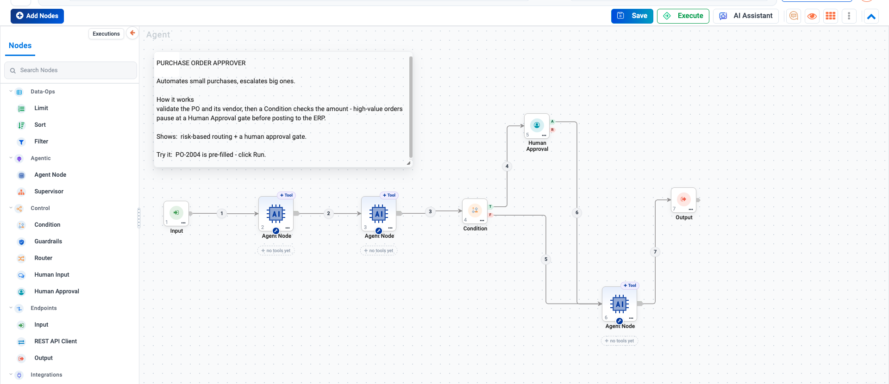
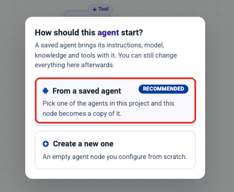
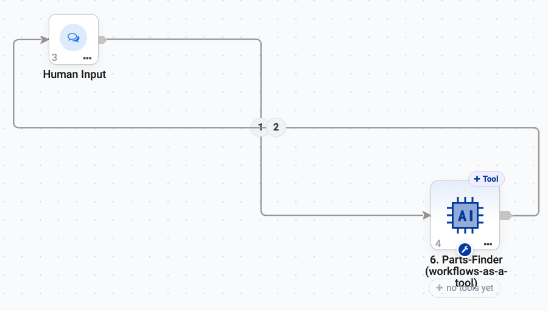

Agent Orchestration
===================

Agent Orchestration is the canvas. You use it when a process has structure of its
own - branches, approvals, several specialists, or steps that must happen in a
fixed order.

If a single well-instructed agent with a few tools would do, build it in
:doc:`/agentic-ai-guide/agent-studio` instead. Use the canvas when you can say
*"and then, depending on X..."* about your process.

.. contents:: On this page
   :local:
   :depth: 1

Opening the canvas
------------------

From the **Agents** page, click **Create Agents** → **Agent Orchestration**.

.. list-table::
   :header-rows: 1
   :widths: 25 75

   * - Area
     - What it is for
   * - **Nodes** palette (left)
     - Every node you can place, grouped by purpose. Searchable.
   * - **Canvas** (centre)
     - Your flow. Nodes are numbered in execution order.
   * - **Toolbar** (top)
     - Name, Category, Add Parameters, Add Nodes, Save, Execute, AI Assistant.
   * - **Executions** tab
     - Past runs of this agent.

The node palette
----------------

.. list-table::
   :header-rows: 1
   :widths: 20 30 50

   * - Group
     - Nodes
     - Purpose
   * - **Data-Ops**
     - Limit, Sort, Filter
     - Shape data between steps without an LLM call.
   * - **Agentic**
     - Agent Node, Supervisor
     - The thinking parts.
   * - **Control**
     - Condition, Guardrails, Router, Human Input, Human Approval
     - Branching, gating, and pauses for people.
   * - **Endpoints**
     - Input, REST API Client, Output
     - Where the run starts, calls out, and finishes.
   * - **Integrations**
     - A2A Agent, Email Notification, Read Email, MCP Tool, Workflow Execution
     - Reaching other systems, other agents, and your own workflows.
   * - **Documentation**
     - Sticky Note
     - Explaining the flow to whoever opens it next.

.. figure:: ../_assets/agentic-ai-guide/orchestration/node-palette.png
   :alt: The node palette with all six groups expanded
   :width: 302px

Building a flow
---------------

#. **Start with Input.** Define the parameters the run receives - for the
   Purchase Order Approver that is a single ``po_id``, pre-filled with
   ``PO-2004`` so the example can be run immediately.

   .. figure:: ../_assets/agentic-ai-guide/nodes/input.png
      :alt: Input node configuration with a named parameter and test value
      :width: 100%

#. **Drag nodes from the palette** onto the canvas in the order the work happens.
#. **Connect them** by dragging from one node's output anchor to the next node's
   input.
#. **Double-click any node** to configure it.
#. **Finish with Output.** Every path - including rejection paths - should reach
   one.
#. **Click Execute** to run, and **Save** to keep it.

.. tip::

   Add a **Sticky Note** explaining what the agent does and how to try it. Every
   shipped example agent has one, and it is the difference between a canvas a
   colleague can pick up and one they have to reverse-engineer.

Reusing an agent you already built
----------------------------------

You do not have to rebuild work. When you drop an **Agent Node** onto the
canvas, Sparkflows asks where it should come from:

.. list-table::
   :header-rows: 1
   :widths: 28 72

   * - Choice
     - What happens
   * - **From a saved agent** *(recommended)*
     - Pick any agent in the project and this node becomes a **copy** of it -
       its instructions, model, knowledge and tools come with it. You can still
       change anything afterwards.
   * - **Create a new one**
     - An empty Agent Node you configure from scratch.

This is the normal way to work: build and test a single agent in
:doc:`Agent Studio </agentic-ai-guide/quickstart>` where it is easy to iterate,
then reuse it on the canvas once it behaves.

   The shipped **Parts Finder Orchestrator** example. The right-hand node is
   the saved agent *6. Parts-Finder (workflows-as-a-tool)*, reused as-is; the
   **Human Input** node lets the person answer follow-up questions, and the run
   loops between the two until the part is found.

.. note::

   The node is a **copy**, not a live link. Editing the saved agent afterwards
   does not change orchestrations that already used it, and editing the node
   does not change the saved agent. That is usually what you want - it stops an
   edit in one place quietly breaking a process somewhere else - but it does
   mean a genuine fix has to be applied in both.

The Agent Node
--------------

An Agent Node is one LLM call. It carries its own model settings, its own
prompt and its own tools - a node's tools are not shared with its neighbours.

Double-click it and the configuration opens on six tabs.

.. figure:: ../_assets/agentic-ai-guide/orchestration/agent-node-llm.png
   :alt: Agent Node LLM Configuration tab with its settings labelled
   :width: 95%

.. list-table::
   :header-rows: 1
   :widths: 22 78

   * - Tab
     - What you set there
   * - **LLM Configuration**
     - Connection, Temperature, Top P, Max Tokens, Timeout, **Max Tool
       Rounds**, Output Format and an optional Save Path.
   * - **Agent Instruction**
     - What this node does, plus its ``AGENTS.md`` source.
   * - **Workflow Configuration**
     - Saved workflows this node may run - see
       :doc:`/agentic-ai-guide/workflows-as-tools`.
   * - **Context**
     - Additional standing context for this node.
   * - **Skills Registry**
     - Reusable ``.md`` rules from **this project's** registry - see
       :doc:`/agentic-ai-guide/skills`.
   * - **MCP Registry**
     - Tools from MCP servers - see :doc:`/agentic-ai-guide/mcp-servers`.

.. tip::

   **Max Tool Rounds** decides how many times the node may call a tool and
   think again before it must answer. Too low and an agent needing three
   lookups gives up after one; too high and a confused agent loops
   expensively. Three to eight suits most jobs.

Writing the instruction
~~~~~~~~~~~~~~~~~~~~~~~

Give each node **one job**, and - when something downstream has to branch on
the result - make it emit a marker the next node can test.

.. figure:: ../_assets/agentic-ai-guide/orchestration/agent-node-instruction.png
   :alt: Agent Instruction tab showing a marker-emitting prompt
   :width: 95%

.. code-block:: text

   Call po_fetch ONCE using the po_id from your context. Read the tool
   result. Reply with EXACTLY four lines:
   Line 1: a one-sentence summary (po_id, vendor, amount, department).
   Line 2 (literal): 'po_found=' followed by 'true' or 'false'.
   Line 3 (literal): 'high_value=' followed by 'true' if po_amount >= 10000
   else 'false'.
   Line 4 (literal): 'has_contract=' followed by 'true' or 'false' from the
   tool result.
   DO NOT add other lines. The markers drive downstream routing.

That is the shipped Purchase Order Approver. The node calls one tool once, then
emits machine-readable markers; the Condition after it tests
``'high_value=true' in analysis``. Two nodes doing one clear thing each beats
one node asked to do both, because you can read the intermediate result and see
which half went wrong.

Adding tools to a node
~~~~~~~~~~~~~~~~~~~~~~

Use the **+ Tool** chip on the node, or **Add tools** in the Tools group. For
each tool you also decide **who supplies each argument** - the agent at call
time, or a fixed value you pin. See :doc:`/agentic-ai-guide/tools-actions`.

The Supervisor node
-------------------

A Supervisor is an agent whose job is delegation. Its LLM looks at the request
and delegates to one - or a few - of the downstream agent nodes it is connected
to. **Only the chosen specialists run.**

.. figure:: ../_assets/agentic-ai-guide/orchestration/supervisor.png
   :alt: Supervisor node with specialist agents attached to its lower port
   :width: 70%

Wiring it
~~~~~~~~~

The Supervisor has two output ports, and the distinction matters:

.. list-table::
   :header-rows: 1
   :widths: 25 75

   * - Port
     - Connect
   * - **agents** (lower port)
     - The specialist Agent Nodes it is allowed to route to.
   * - **out** (main output)
     - Whatever runs *after* the specialists have done their work.

Configuration
~~~~~~~~~~~~~

.. list-table::
   :header-rows: 1
   :widths: 25 75

   * - Tab
     - Contains
   * - **LLM Config**
     - Connection, temperature, top P, max tokens.
   * - **Prompt**
     - The system prompt - what the Supervisor is coordinating, and what each
       specialist is good at.
   * - **Skills Registry**
     - Skills applied to the Supervisor itself. See
       :doc:`/agentic-ai-guide/skills`.

.. important::

   The Supervisor can only delegate well if its prompt says what each specialist
   is **for**. Naming them is not enough - describe the cases each one handles.
   A Supervisor that picks badly is almost always a Supervisor that was never
   told the difference between its options.

Supervisor or Router?
~~~~~~~~~~~~~~~~~~~~~

Both send work to one of several destinations, and they are not
interchangeable.

.. list-table::
   :header-rows: 1
   :widths: 50 50

   * - Use a **Router**
     - Use a **Supervisor**
   * - Plain semantic N-way routing
     - Delegation that may rewrite the query for the specialist
   * - One route is taken
     - One *or a few* specialists may run
   * - The destinations are alternatives
     - The destinations are collaborators

If you only need to sort a request into one of several lanes, use a
:doc:`Router </agentic-ai-guide/control-flow>` - it is simpler and cheaper.
Reach for a Supervisor when the coordination itself needs judgement.

When a fixed path is better than either
~~~~~~~~~~~~~~~~~~~~~~~~~~~~~~~~~~~~~~~

If you already know the order the specialists should run in, wire them in that
order. A fixed process is easier to test, easier to audit, and cheaper to run
than one that re-decides its own shape on every request.

The A2A Agent node
------------------

**A2A Agent** (agent-to-agent) calls another agent as a step in this one. Use it
to reuse an agent you have already built and tested rather than copying its logic
into a new node.

Parameters
----------

**Add Parameters** in the toolbar defines values the whole flow can read -
thresholds, environment names, endpoints. Put your approval threshold here rather
than typing ``10000`` into a Condition, and you can change it in one place
instead of hunting through nodes.

Testing an orchestration
------------------------

Build and test **incrementally**. Place Input, one Agent Node and Output, and run
it. Confirm that works, then insert the next node. The alternative - laying out
twelve nodes and pressing Execute - tells you only that something, somewhere,
failed.

Use the **Executions** tab to inspect past runs: the inputs, the path taken, the
tool calls made, and any approvals.

Next: the nodes themselves
--------------------------

:doc:`/agentic-ai-guide/human-in-the-loop` covers approvals, and
:doc:`/agentic-ai-guide/control-flow` the branching nodes that decide which cases
reach them.
