Node Reference
==============

Every node you can place on the Agent Orchestration canvas: what it is for, what
its configuration looks like, and the one thing people usually get wrong about
it.

The groups below are in the order you meet them when you build a flow - where
the run starts and ends, then the thinking, then the branching, then the systems
it reaches, then the small utilities.

.. tip::

   Open any node and you will find **Details** and **Examples** tabs next to its
   name. The product ships its own reference for every node - worth reading when
   a field is not obvious.

.. contents:: On this page
   :local:
   :depth: 2

The palette
-----------

Every node below lives in the **Nodes** panel on the left of the canvas, grouped
the same way this page is.

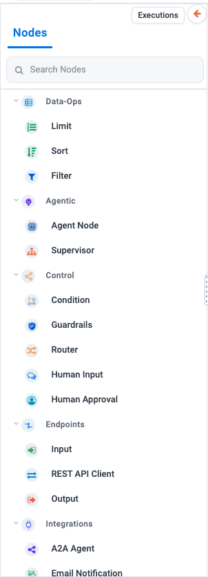

Endpoints
---------

Every flow starts at an Input and ends at an Output. Add these first.

Input
~~~~~

**What it is.** Where the run starts, and where you say what the agent is given.

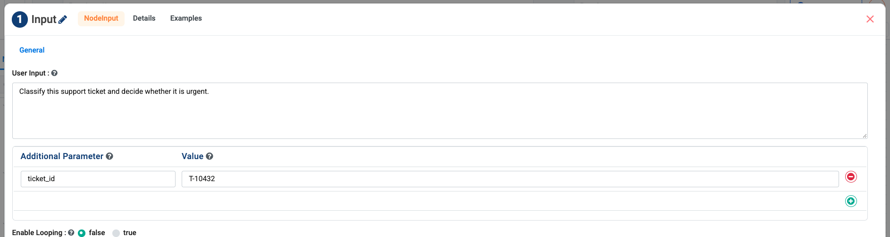

.. list-table::
   :header-rows: 1
   :widths: 26 74

   * - Setting
     - What to put in it
   * - **User Input**
     - The question or instruction the run starts from. Fill it in even for
       agents that will be called by API - it is what makes the agent runnable
       in one click.
   * - **Additional Parameter / Value**
     - Named inputs the rest of the flow can read, such as ``ticket_id``. The
       value you type here is the test value.
   * - **Enable Looping**
     - Run the whole flow once per item in a list instead of once in total.

**Usually gets wrong:** leaving the test values empty. An agent a colleague can
try in one click gets used; one they have to work out first does not.

Output
~~~~~~

**What it is.** Ends the flow and returns the result.

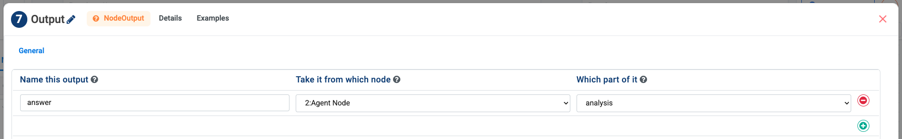

Leave it empty and the agent's answer is returned automatically. Add rows only
when you want specific, named outputs:

.. list-table::
   :header-rows: 1
   :widths: 30 70

   * - Column
     - What it means
   * - **Name this output**
     - What the caller sees the value as.
   * - **Take it from which node**
     - Which upstream node produced it.
   * - **Which part of it**
     - ``analysis`` (the answer), ``tool_calls``, ``confidence``, ``status`` or
       ``iteration``.

**Usually gets wrong:** naming an output and then picking the wrong part -
``tool_calls`` where ``analysis`` was meant. Run it once and read what comes
back.

REST API Client
~~~~~~~~~~~~~~~

**What it is.** Makes an HTTP request from inside the flow and publishes the
response for the nodes after it.

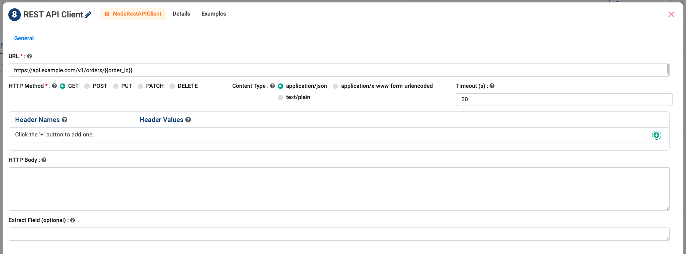

.. list-table::
   :header-rows: 1
   :widths: 26 74

   * - Setting
     - What to put in it
   * - **URL** *(required)*
     - The endpoint. Values from the run can be substituted into it.
   * - **HTTP Method**
     - ``GET``, ``POST``, ``PUT``, ``PATCH`` or ``DELETE``.
   * - **Content Type**
     - ``application/json``, form-encoded or plain text.
   * - **Header Names / Values**
     - One row per header - this is where an API key header goes.
   * - **HTTP Body**
     - The request body, for the methods that take one.
   * - **Extract Field**
     - Pull one field out of the response instead of passing the whole thing on.
   * - **Timeout (s)**
     - How long to wait. Default 30.

**Use it when** a system has an API but no connector. If a connector exists,
use that instead - see :doc:`/agentic-ai-guide/tools-actions`.

Agentic
-------

These are the nodes that call a model.

Agent Node
~~~~~~~~~~

**What it is.** One LLM call. It reads its instructions, may call tools, and
produces an answer. This is the node you will use most.

Its configuration is split across six tabs.

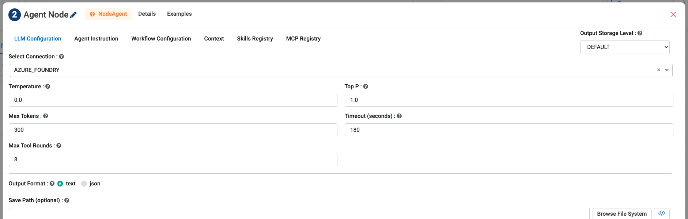

.. list-table::
   :header-rows: 1
   :widths: 26 74

   * - Tab
     - What lives there
   * - **LLM Configuration**
     - The model connection and generation settings - **Temperature**,
       **Top P**, **Max Tokens**, **Timeout**, **Max Tool Rounds**, **Output
       Format** and an optional **Save Path**.
   * - **Agent Instruction**
     - What this node is for, in plain words.
   * - **Workflow Configuration**
     - Saved workflows this node may run as tools -
       :doc:`/agentic-ai-guide/workflows-as-tools`.
   * - **Context**
     - Knowledge and retrieval - :doc:`/agentic-ai-guide/rag-knowledge`.
   * - **Skills Registry**
     - Reusable instruction files - :doc:`/agentic-ai-guide/skills`.
   * - **MCP Registry**
     - Tools from MCP servers - :doc:`/agentic-ai-guide/mcp-servers`.

.. tip::

   **Max Tool Rounds** is the setting people forget. Too low and an agent that
   needs three lookups gives up after one; too high and a confused agent loops
   expensively. Three to eight suits most jobs.

**Agent Instruction** is where you say what this node does. The example below is
from the shipped Purchase Order Approver, and it is worth copying the shape:

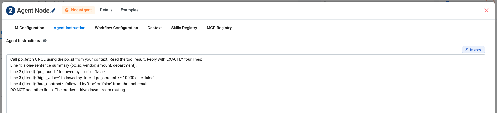

.. code-block:: text

   Call po_fetch ONCE using the po_id from your context. Read the tool
   result. Reply with EXACTLY four lines:
   Line 1: a one-sentence summary (po_id, vendor, amount, department).
   Line 2 (literal): 'po_found=' followed by 'true' or 'false'.
   Line 3 (literal): 'high_value=' followed by 'true' if po_amount >= 10000
   else 'false'.
   Line 4 (literal): 'has_contract=' followed by 'true' or 'false' from the
   tool result.
   DO NOT add other lines. The markers drive downstream routing.

Notice what it does: it calls one tool, once, and then emits **machine-readable
markers**. That last line explains why - a downstream
:doc:`Condition </agentic-ai-guide/control-flow>` tests
``'high_value=true' in analysis``. This is the contract that makes an
orchestration reliable.

**Usually gets wrong:** asking one Agent Node to do three jobs. Split them. You
can then read the middle result and see which half failed.

Supervisor
~~~~~~~~~~

**What it is.** An agent whose job is delegation. Its model reads the request and
delegates to one - or a few - of the Agent Nodes attached to it. Only the chosen
specialists run.

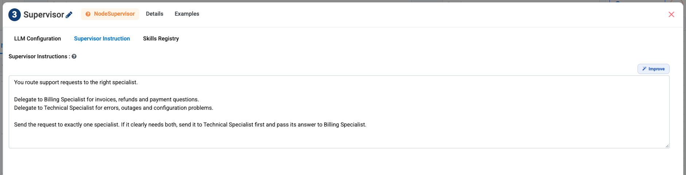

The **Supervisor Instruction** is the whole job. Name each specialist and say
*when* it should be chosen - the Supervisor can only choose well if it knows what
each one handles.

On the canvas the specialists attach to the port on the underside of the node:

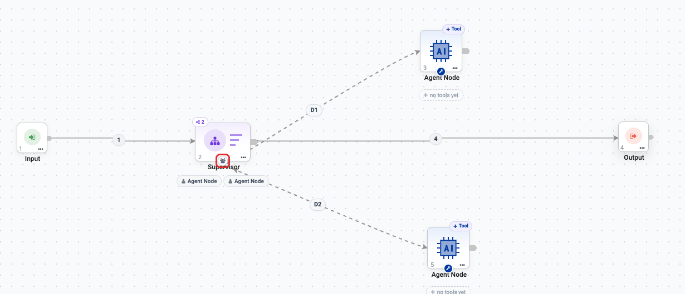

**Usually gets wrong:** a prompt that names the specialists without describing
them. Use a :doc:`Router </agentic-ai-guide/control-flow>` instead when you only
need plain N-way routing and no delegation.

A2A Agent
~~~~~~~~~

**What it is.** Delegates a task to an agent that lives **outside** Sparkflows,
over the Agent-to-Agent protocol.

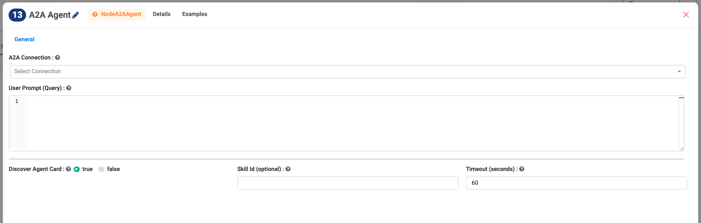

.. list-table::
   :header-rows: 1
   :widths: 26 74

   * - Setting
     - What to put in it
   * - **A2A Connection**
     - The saved connection for the remote agent.
   * - **User Prompt (Query)**
     - The task to send.
   * - **Discover Agent Card**
     - Leave ``true`` and the node reads the remote agent's own description of
       its name, skills and capabilities.
   * - **Skill Id**
     - Optional. Ask for one named skill instead of letting the remote agent
       decide.
   * - **Timeout (seconds)**
     - How long to wait for the remote agent.

Control
-------

These decide where a run goes next. Full worked examples are on
:doc:`/agentic-ai-guide/control-flow`.

Condition
~~~~~~~~~

**What it is.** A deterministic branch. Routes down **T** or **F** based on one
expression. No model call.

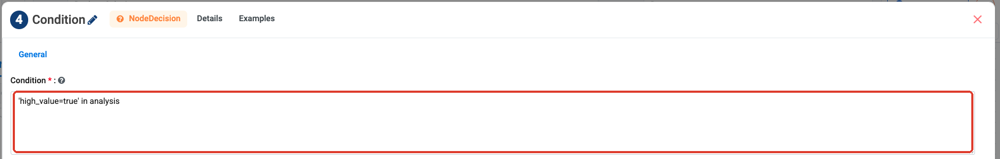

**Usually gets wrong:** a mistyped field name. A Condition that errors routes
**False**, so a typo looks like a rule that never fires - the run detail records
the error next to the branch it took.

Router
~~~~~~

**What it is.** A model-driven semantic router. It reads the incoming query,
scores it against each route's description and example queries, and forwards it
down the matching route. A **fallback** route is always present.

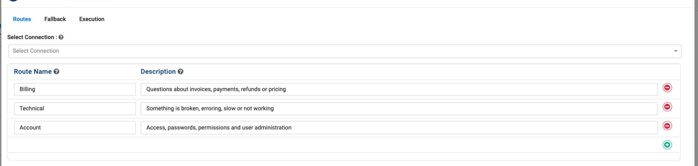

**Use it when** no plain expression can answer "which of these is this about?".

**Usually gets wrong:** route descriptions written as labels. Describe the
*cases* that belong on the route and give example queries - that is what the
model matches against.

Guardrails
~~~~~~~~~~

**What it is.** Rule-based safety checks - PII, prompt injection, banned words,
length. Routes **Allowed (A)** or **Blocked (B)**. No model call, so it is fast
and free.

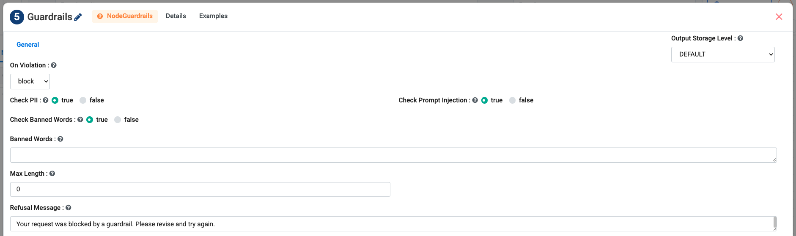

.. list-table::
   :header-rows: 1
   :widths: 26 74

   * - Setting
     - What to put in it
   * - **On Violation**
     - ``block`` stops the text, ``redact`` masks it and continues, ``flag``
       lets it through and records it.
   * - **Check PII**
     - Look for personal data - card numbers, emails, phone numbers.
   * - **Check Prompt Injection**
     - Look for attempts to override the agent's instructions.
   * - **Check Banned Words** / **Banned Words**
     - Turn on your own list, and the list itself.
   * - **Max Length**
     - Reject text over this size. ``0`` means no limit.
   * - **Refusal Message**
     - What is returned when a rule trips.

**Use it** before an Agent to guard the input, after one to guard the output, or
both. A neat pattern is to wire **B** back to a Human Input node so the person
can revise and retry.

Human Approval
~~~~~~~~~~~~~~

**What it is.** A gate. The run pauses, a person approves or rejects, and the
flow continues down **A** or **R**.

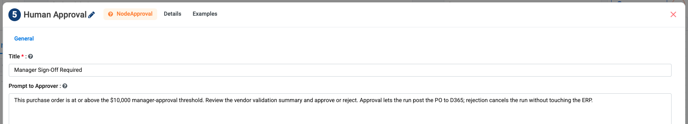

Covered in full on :doc:`/agentic-ai-guide/human-in-the-loop`.

**Usually gets wrong:** leaving the **R** branch unwired, so a rejected run
stops with nowhere to go.

Human Input
~~~~~~~~~~~

**What it is.** A conversational pause. It shows the person whatever the upstream
step produced and captures their raw reply.

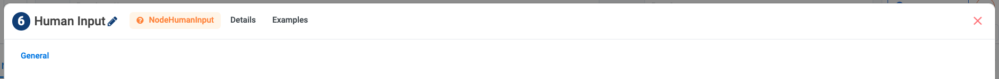

**It has no configuration at all** - and it does no interpretation either.
Understanding the reply is the next agent's job.

Integrations
------------

These reach systems outside the flow.

Workflow Execution
~~~~~~~~~~~~~~~~~~

**What it is.** Runs one saved workflow as a step in the flow, **without a model
call**.

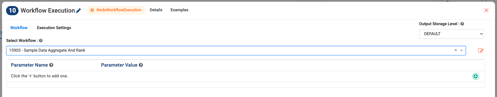

Pick the workflow, then pass values into its parameters. Its first output row is
published the same way an agent's answer is, so a downstream Condition reads it
identically. See :doc:`/agentic-ai-guide/workflows-as-tools`.

MCP Tool
~~~~~~~~

**What it is.** Calls one named tool from a connected MCP server at a fixed point
in the flow.

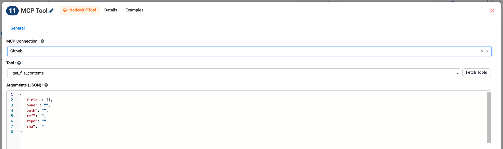

Choose the **MCP Connection**, click **Fetch Tools**, then pick the **Tool**.
Selecting one fills in an argument template you can edit. Leave the tool empty
and the server's tools are listed at run time instead. See
:doc:`/agentic-ai-guide/mcp-servers`.

Email Notification
~~~~~~~~~~~~~~~~~~

**What it is.** Sends an email from anywhere in the flow.

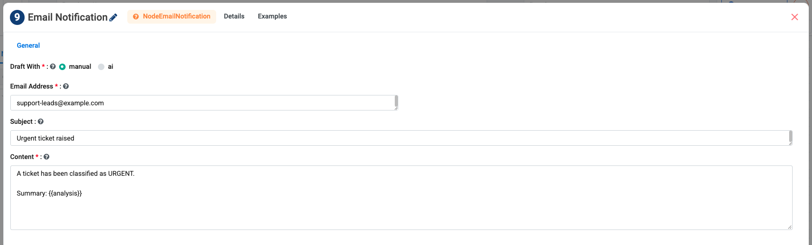

**Draft With** decides who writes it: ``manual`` uses the Subject and Content you
type; ``ai`` has the model draft the message.

**Use it** on the **Approved** branch of an approval, or to tell someone a
scheduled run failed - see :doc:`/agentic-ai-guide/schedule-agents`.

Read Email
~~~~~~~~~~

**What it is.** Reads mail from an Outlook or Gmail mailbox and hands the
messages to the rest of the flow.

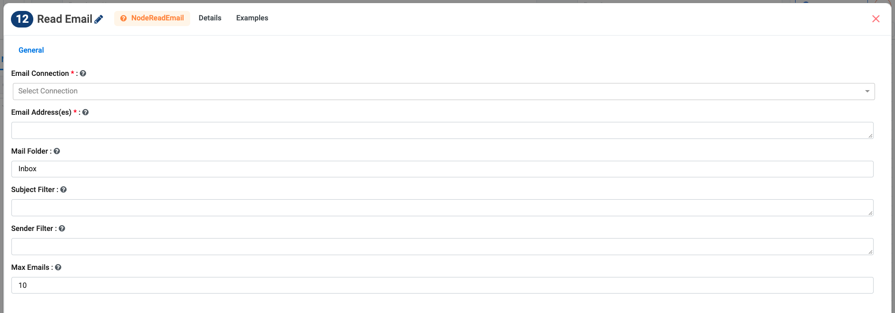

.. list-table::
   :header-rows: 1
   :widths: 26 74

   * - Setting
     - What to put in it
   * - **Email Connection** *(required)*
     - The mailbox connection.
   * - **Email Address(es)** *(required)*
     - Which mailbox to read.
   * - **Mail Folder**
     - Defaults to ``Inbox``.
   * - **Subject Filter** / **Sender Filter**
     - Narrow what is read.
   * - **Max Emails**
     - A cap per run. Keep it small while you are testing.

Data-Ops
--------

These shape data between steps without a model call - cheap, exact, and worth
using instead of asking a model to do the same thing.

Filter
~~~~~~

**What it is.** Keeps only the records that match.

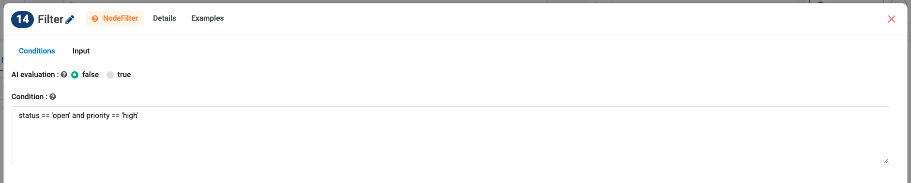

Write a plain expression in **Condition**. Switch **AI evaluation** to ``true``
only when the test is a judgement a rule cannot express - it costs a model call
per record.

Sort
~~~~

**What it is.** Orders records by one or more fields.

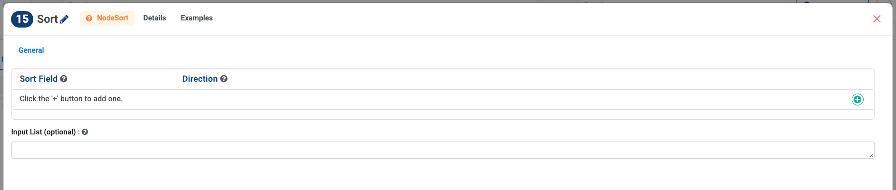

Add a row per field and choose its direction. The first row is the primary key;
later rows break ties.

Limit
~~~~~

**What it is.** Keeps the first N records.

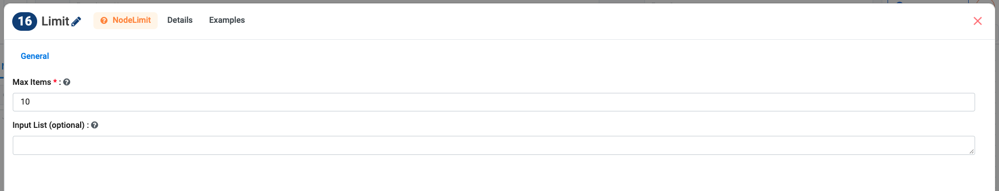

Useful directly after a Sort - "the ten oldest open tickets" is a Sort followed
by a Limit, and it costs nothing.

Documentation
-------------

Sticky Note
~~~~~~~~~~~

**What it is.** A note on the canvas. It has no dialog - you type straight into
it.

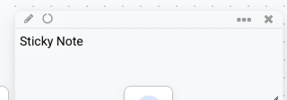

Every shipped example agent has one, and it is the difference between a canvas a
colleague can pick up and one they have to reverse-engineer. Say what the agent
does, how it works, and how to try it:

.. code-block:: text

   PURCHASE ORDER APPROVER
   Automates small purchases, escalates big ones.

   How it works
   validate the PO and its vendor, then a Condition checks the amount -
   high-value orders pause at a Human Approval gate before posting to the ERP.

   Shows: risk-based routing + a human approval gate.
   Try it: PO-2004 is pre-filled - click Run.

Next: put nodes together
------------------------

:doc:`/agentic-ai-guide/multi-agent-orchestration` shows how these fit together
on the canvas.
