Node Guide: Choose, Configure and Connect
=========================================

Start with what you want the next step to do. You do not need to learn every
node before building your first flow. Use the chooser below, then read only
the section for the node you need.

Already know the node you need? :ref:`Browse the node groups <node-guide-groups>`.
Otherwise, choose your next task below.

Which node do I need?
---------------------

.. list-table:: Choose by the task, not by the node name
   :header-rows: 1
   :widths: 45 25 30

   * - I want to...
     - Choose
     - Start here
   * - Start by hand, on a schedule or on an event
     - **Trigger**
     - :doc:`triggers`
   * - Read or change something in an app
     - **App Action**
     - :doc:`app-actions`
   * - Read a file or save records to a file
     - **Read/Write Files**
     - :doc:`files`
   * - Understand, classify or write text
     - **Agent Node**
     - :doc:`models-prompts`
   * - Keep only matching records
     - **Filter**
     - :doc:`data-steps`
   * - Choose a path using an exact rule
     - **Condition**
     - :doc:`control-flow`
   * - Choose a path using the meaning of a request
     - **Router**
     - :doc:`control-flow`
   * - Repeat several steps for every record
     - **Loop Over Items**
     - :doc:`data-steps`
   * - Combine two sets of records
     - **Merge**
     - :doc:`data-steps`
   * - Ask a person before continuing
     - **Human Approval**
     - :doc:`human-in-the-loop`
   * - Run an existing pipeline at a fixed point
     - **Workflow Execution**
     - :doc:`workflows-as-tools`
   * - Return the result to the caller
     - **Output**
     - The Output section below

.. tip::

   **Filter keeps records; Condition chooses a path.** Use Filter for the open
   tickets in a list. Use Condition to decide whether one refund needs approval.
   An **App Action** always performs the configured operation when reached;
   an Agent Node's **tool** is something the model may choose to call.

Configure one step at a time
----------------------------

#. **Add and name it.** Use a short action name such as *Read open tickets*,
   rather than leaving several nodes called *App Action*.
#. **Connect the input.** Wire the preceding step to it before configuring
   fields. This gives **What arrives here** the context it needs.
#. **Fill in the essentials.** Choose the connection, operation and target.
   For an Agent Node, choose the model and write the instructions. Leave
   optional advanced settings alone until you have a reason to change them.
#. **Check the data.** For an App Action read, use **Load the fields** and
   inspect a sample. Click fields in **What arrives here** instead of guessing
   their names. See :doc:`passing-data`.
#. **Connect the next step.** For a branch or a loop, choose the correct outlet
   rather than drawing every wire from the same place.
#. **Save and try a small input.** Inspect the step's result, not only the
   final answer. Use a test project, a small limit and non-production targets.

Before running a write, check the destination and the mapped fields. A preview
of a read is not proof that a later email, database write or file upload will
succeed. Check that write's returned status when you test it.

Wiring patterns to remember
----------------------------

* **Straight line:** Trigger → read → transform → Output.
* **Branch:** Condition **T** and **F** each lead to a deliberate next step.
  Test one input for each path.
* **Loop:** **L** leads into the repeated steps. The last repeated step connects
  back to Loop Over Items. **D** leads to what runs after all rounds finish.
* **Two inputs:** use Merge when the next step needs records combined from two
  sources. Two wires into an Agent Node are not a substitute for a join.

.. figure:: ../_assets/agentic-ai-guide/data-steps/loop-canvas.png
   :alt: A loop whose L outlet feeds the repeated step, whose return wire goes back to the loop, and whose D outlet leads to Output
   :width: 100%

   Follow the loop's return wire first, then its done wire. Only the steps
   inside the return path repeat.

.. _node-guide-groups:

Find a node by group
--------------------

* `Triggers & Endpoints <#triggers-endpoints>`__: start a run or return its result.
* `AI Agents <#ai-agents>`__: use a model or coordinate agents.
* `Integrations <#integrations>`__: apps, files, email and workflows.
* `Control Flow <#control-flow>`__: branches, approvals and guardrails.
* `Data Transformation <#data-transformation>`__: filter, shape, combine and loop.
* `Documentation <#documentation>`__: explain the canvas with notes.

The palette
-----------

The **Nodes** panel on the left of the canvas starts with the eight nodes most
agents use - **Commonly used** - followed by every node in six groups. Click a
group to open it, or type in **Search Nodes**; the search matches the start of
any word. Click a node or drag it onto the canvas to add it.

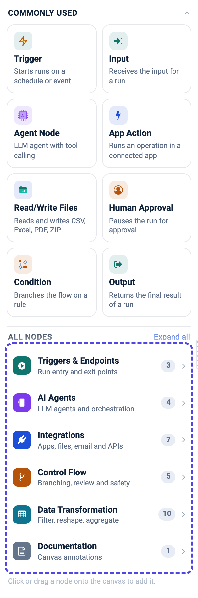

Every node dialog has the same layout: the settings on the right, and **What
arrives here** on the left - the fields of the records reaching the node, which
you click instead of typing. See :doc:`/agentic-ai-guide/passing-data`.

.. tip::

   Use a node's **Details** and **Examples** tabs for its built-in reference
   when a setting is unfamiliar. Start with the required fields before
   changing advanced options.

Triggers & Endpoints
--------------------

Where a run starts and where it ends.

Trigger
~~~~~~~

**What it is.** The first step of a run. It says how the run starts - by hand,
on a schedule, when something happens in an app, when a file arrives, or when
another system calls - and sets the message and the values every later step
reads.

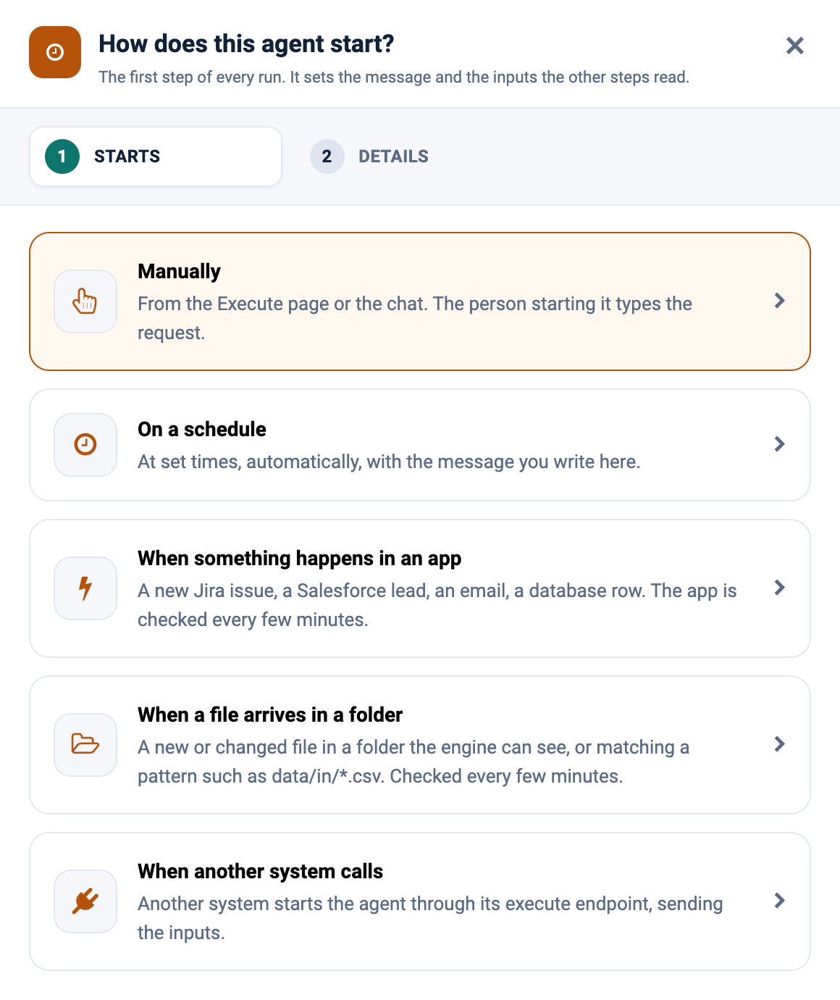

Covered in full on :doc:`/agentic-ai-guide/triggers`.

**Usually gets wrong:** leaving an event trigger's **N** (nothing new) outlet
wired to steps that expect records. Leave it unwired and quiet checks simply end.

Input
~~~~~

**What it is.** The original way to start a run: a query and named values.
New agents start with a **Trigger**, which does the same and more; Input remains
for agents built with it and for **Enable Looping**.

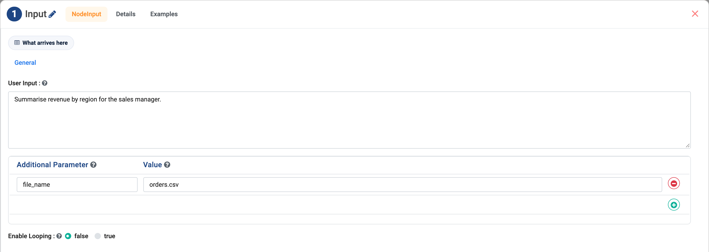

.. list-table::
   :header-rows: 1
   :widths: 26 74

   * - Setting
     - What to put in it
   * - **User Input**
     - The question or instruction the run starts from. Fill it in even for
       agents that will be called by API - it is what makes the agent runnable
       in one click.
   * - **Additional Parameter / Value**
     - Named inputs the rest of the flow can read, such as ``file_name``. The
       value you type here is the test value.
   * - **Enable Looping**
     - Run the whole flow once per item in a list instead of once in total.

**Usually gets wrong:** leaving the test values empty. An agent a colleague can
try in one click gets used; one they have to work out first does not.

Output
~~~~~~

**What it is.** Ends the flow and returns the result.

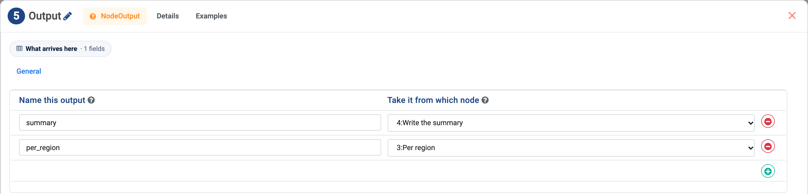

Leave it empty to collect upstream nodes' primary results automatically, keyed
by their stable node identifiers. This is not limited to the immediately
preceding step. Add rows when you want specific, named outputs:
**Name this output** is what the caller sees, **Take it from
which node** is the step that produced it. Choose the data or Agent node whose
result you need, rather than an entry-point node such as Trigger.

**Usually gets wrong:** returning the wrong step. Run the agent once and read
the result on the Execute page.

AI Agents
---------

The nodes that call a model.

Agent Node
~~~~~~~~~~

**What it is.** One agent step. It reads its instructions and the records that
arrive, may call tools, and produces an answer. This is the node you will use
most. Tool use can involve several model calls; one node does not necessarily
mean one LLM request.

Its configuration is split across six tabs.

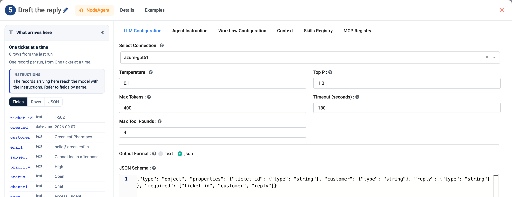

.. list-table::
   :header-rows: 1
   :widths: 26 74

   * - Tab
     - What lives there
   * - **LLM Configuration**
     - The model connection and generation settings - **Temperature**,
       **Top P**, **Max Tokens**, **Timeout**, **Max Tool Rounds**, and the
       **Output Format**: ``text``, or ``json`` with a **JSON Schema**.
   * - **Agent Instruction**
     - What this node is for, in plain words, plus its description and
       AGENTS.md source.
   * - **Workflow Configuration**
     - Saved workflows this node may run as tools -
       :doc:`/agentic-ai-guide/workflows-as-tools`.
   * - **Context**
     - Knowledge and retrieval - :doc:`/agentic-ai-guide/rag-knowledge`.
   * - **Skills Registry**
     - Reusable instruction files - :doc:`/agentic-ai-guide/skills`.
   * - **MCP Registry**
     - Tools from MCP servers - :doc:`/agentic-ai-guide/mcp-servers`.

The **+ Tool** badge on the node on the canvas attaches tools - connectors,
built-in tools, workflows - straight to it (:doc:`/agentic-ai-guide/tools-actions`).

**Agent Instruction** is where you say what this node does. Inside a loop, the
instruction can name the current record with ``${...}`` references - here the
ticket of this round:

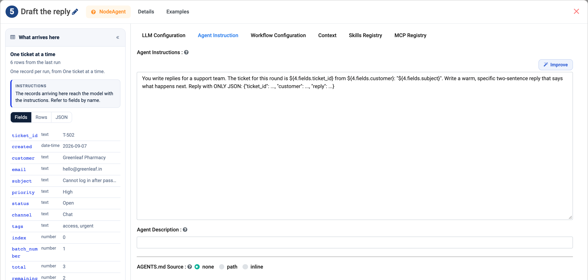

.. tip::

   Ask for ``json`` with a schema whenever a later step uses the answer. Each
   field of the schema then arrives in the next step as a field of its own -
   ``${5.reply}`` - instead of one block of text.

**Max Tool Rounds** is the setting people forget. Too low and an agent that
needs three lookups gives up after one; too high and a confused agent loops
expensively. Three to eight suits most jobs.

**Usually gets wrong:** asking one Agent Node to do three jobs. Split them. You
can then read the middle result and see which half failed.

Saved Agent
~~~~~~~~~~~

**What it is.** A copy of an agent already saved in this project - its
instructions, model, knowledge and tools - placed on the canvas as a new Agent
Node. Build a good specialist once, then reuse it in every process that needs
it.

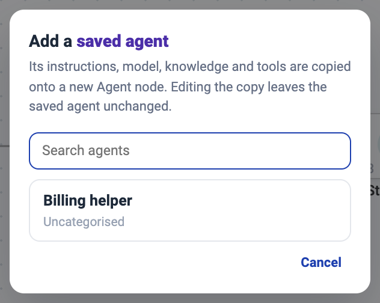

Click **Saved Agent** in the palette, search, and pick the agent. Editing the
copy on the canvas leaves the saved agent unchanged.

Supervisor
~~~~~~~~~~

**What it is.** An agent whose job is delegation. Its model reads the request and
hands it to one - or a few - of the Agent Nodes wired to it. Only the chosen
specialists run.

On the canvas the specialists hang off the Supervisor's delegate port (the dashed
**D1**, **D2** ... wires), and the chips under the node list who it can call:

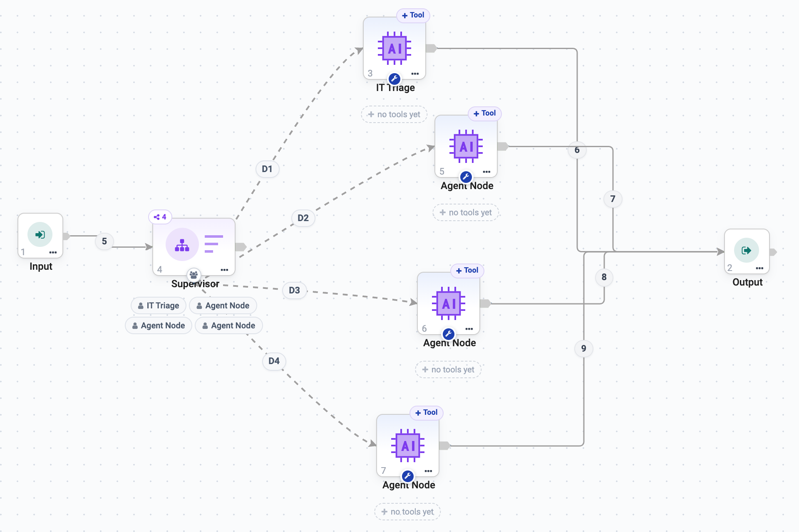

The **Supervisor Instruction** is the whole job. Name each specialist and say
*when* it should be chosen:

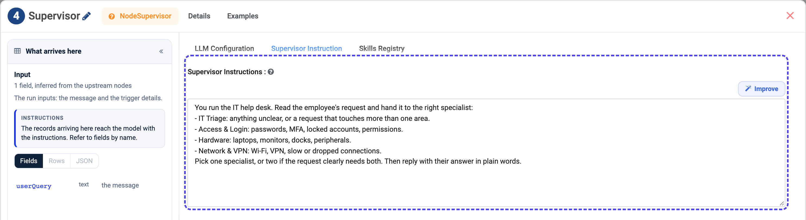

**Usually gets wrong:** a prompt that names the specialists without describing
them. Use a :doc:`Router </agentic-ai-guide/control-flow>` instead when you only
need plain N-way routing and no delegation.

A2A Agent
~~~~~~~~~

**What it is.** Delegates a task to an agent that lives **outside** Sparkflows,
over the Agent-to-Agent protocol.

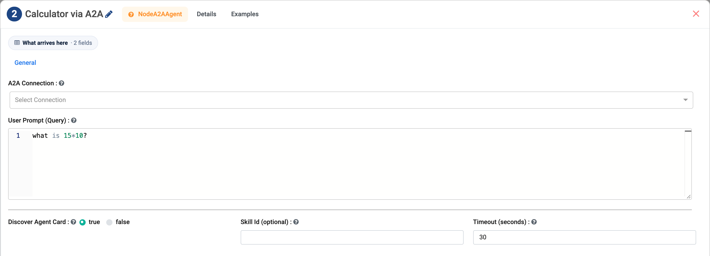

.. list-table::
   :header-rows: 1
   :widths: 26 74

   * - Setting
     - What to put in it
   * - **A2A Connection**
     - The saved connection for the remote agent.
   * - **User Prompt (Query)**
     - The task to send.
   * - **Discover Agent Card**
     - Leave ``true`` and the node reads the remote agent's own description of
       its name, skills and capabilities.
   * - **Skill Id**
     - Optional. Ask for one named skill instead of letting the remote agent
       decide.
   * - **Timeout (seconds)**
     - How long to wait for the remote agent.

Integrations
------------

The nodes that reach systems outside the flow.

App Action
~~~~~~~~~~

**What it is.** One fixed operation in a connected app - Salesforce, Outlook,
SharePoint, OneDrive, Teams, Slack, Gmail, Google Sheets, Docs, Drive, Calendar,
Jira, MySQL, PostgreSQL or SQL Server. It opens a drawer of its own: pick the
app, the action, then the details.

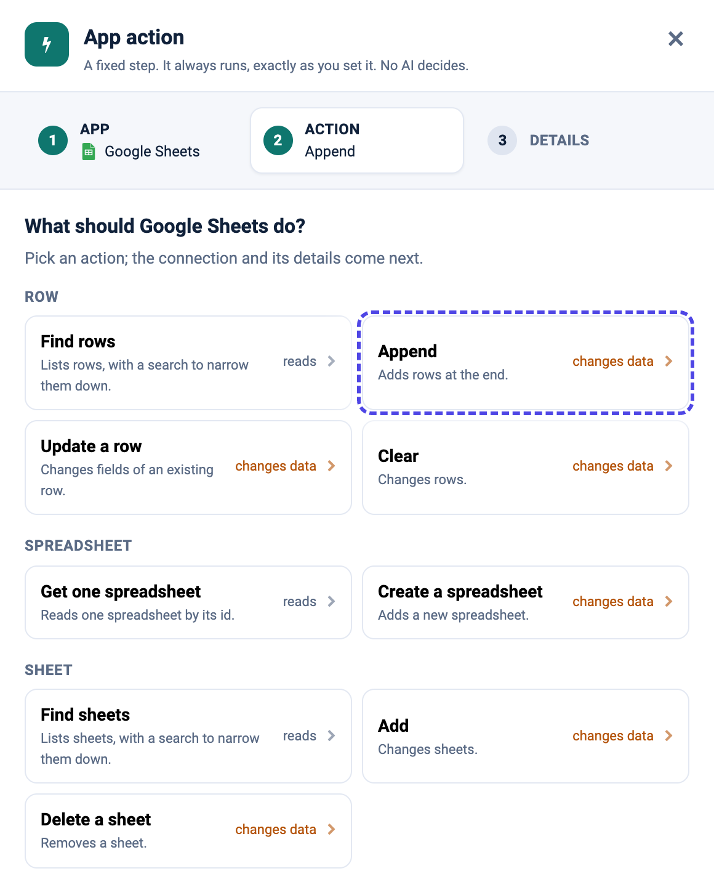

Covered in full on :doc:`/agentic-ai-guide/app-actions`.

**Common mistake:** assuming that a model must choose every operation. Use
an App Action for required reads and writes. For a sensitive send or write,
put Human Approval before the action; a model's tool choice is not human
approval. Use an agent tool when the model should decide whether a permitted
lookup is useful.

Read/Write Files
~~~~~~~~~~~~~~~~

**What it is.** Reads files into records or writes records into a file - CSV,
Excel, JSON, Parquet, PDFs and Word, images, zips - on disk or in S3, Google
Cloud Storage or Azure.

.. figure:: ../_assets/agentic-ai-guide/files/read-or-write.png
   :alt: The Read/Write Files drawer asking Read files or Write a file
   :width: 480px

Covered in full on :doc:`/agentic-ai-guide/files`.

Email Notification
~~~~~~~~~~~~~~~~~~

**What it is.** Sends an email from anywhere in the flow.

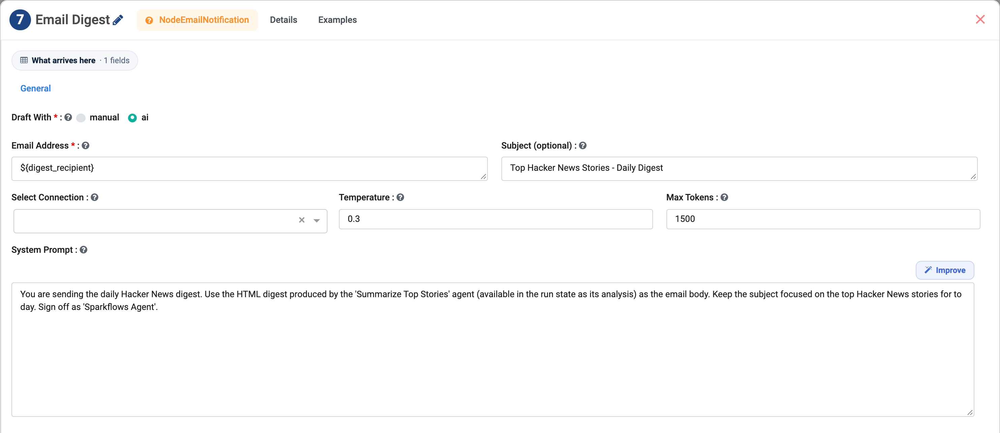

**Draft With** decides who writes it: ``manual`` uses the Subject and Content you
type; ``ai`` has the model draft the message from the **System Prompt** and what
arrives. The address may be a reference such as ``${digest_recipient}``.

**Use it** on the **Approved** branch of an approval, or to tell someone a
scheduled run failed - see :doc:`/agentic-ai-guide/schedule-agents`. To send
from a specific Outlook or Gmail mailbox, with attachments or replies, use an
App Action instead.

Read Email
~~~~~~~~~~

**What it is.** Reads mail from an Outlook or Gmail mailbox and hands the
messages to the rest of the flow.

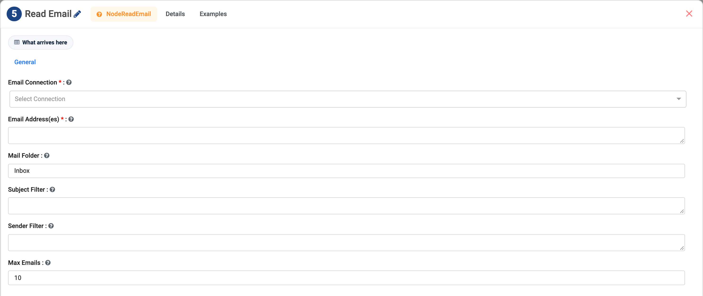

.. list-table::
   :header-rows: 1
   :widths: 26 74

   * - Setting
     - What to put in it
   * - **Email Connection** *(required)*
     - The mailbox connection.
   * - **Email Address(es)** *(required)*
     - Which mailbox to read.
   * - **Mail Folder**
     - Defaults to ``Inbox``.
   * - **Subject Filter** / **Sender Filter**
     - Narrow what is read.
   * - **Max Emails**
     - A cap per run. Keep it small while you are testing.

REST API Client
~~~~~~~~~~~~~~~

**What it is.** Sends an HTTP request from a fixed point in the flow. The
request settings stay explicit; a model does not choose the URL or method.

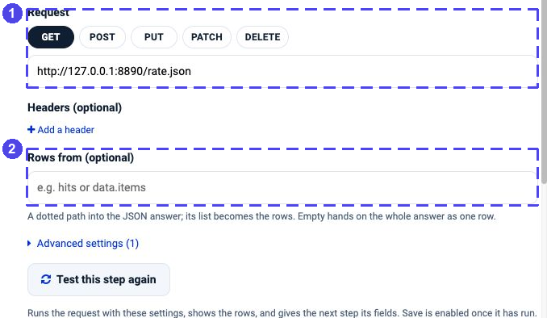

   The URL is a practice endpoint in the app's request field, not a browser
   address bar. Use an endpoint reachable from the machine running the Agent
   engine.

.. list-table::
   :header-rows: 1
   :widths: 26 74

   * - Setting
     - What to put in it
   * - **URL** *(required)*
     - The endpoint. ``${...}`` references can be part of it.
   * - **HTTP Method**
     - ``GET``, ``POST``, ``PUT``, ``PATCH`` or ``DELETE``.
   * - **Content Type**
     - ``application/json``, form-encoded or plain text.
   * - **Header Names / Values**
     - One row per header - this is where an API key header goes.
   * - **HTTP Body**
     - The request body, for the methods that take one.
   * - **Rows from (optional)**
     - A dotted path into the JSON response. If it points to a list, each list
       item becomes a row; leave it empty to pass the whole response as one row.
   * - **Timeout (s)**
     - Under **Advanced settings**; how long to wait. Default 30 seconds.

**Test a GET before saving.** The test sends that HTTP request, shows the
response rows and makes their fields available to later steps. It does not run
the whole flow. A reference such as ``${inputs.access_token}`` can use a sample
from the Input node or a value from the agent's latest run. A runtime-only
secret is sent to the endpoint but is not shown or saved in the test sample.
The test sample also masks credential-like values in the response.

Only **GET** requests are sent by the pre-save test. For ``POST``, ``PUT``,
``PATCH`` or ``DELETE``, save the step and verify its fields after a deliberate
run against a test system; these methods can change data. A request that needs
a value available only at runtime can also be saved without a test. Its fields
become available after the first run.

**Use it when** a system has an API but no app. If an app exists, use an App
Action - it handles sign-in and paging for you.

Workflow Execution
~~~~~~~~~~~~~~~~~~

**What it is.** Runs one saved workflow as a step in the flow, **without a model
call**.

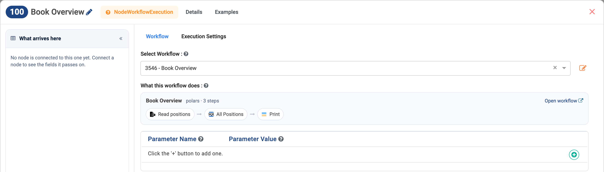

Pick the workflow; **What this workflow does** shows its steps in the order
they run, with **Open workflow** to look inside. Then pass values into its
parameters. Its first output row is published the same way an agent's answer
is, so a downstream Condition reads it identically. See
:doc:`/agentic-ai-guide/workflows-as-tools`.

MCP Tool
~~~~~~~~

**What it is.** Calls one named tool from a connected MCP server at a fixed point
in the flow.

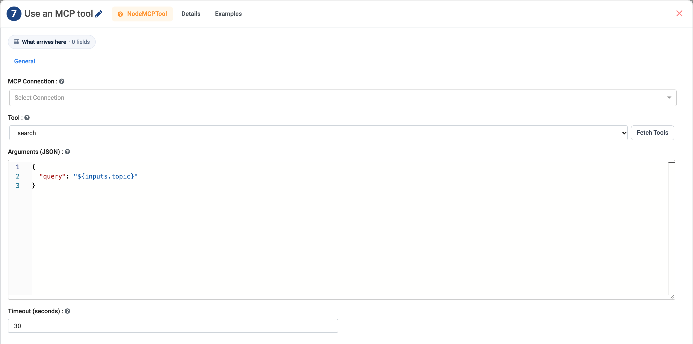

Choose the **MCP Connection**, click **Fetch Tools**, then pick the **Tool**.
Selecting one fills in an argument template you can edit; arguments can hold
references such as ``${inputs.topic}``. See :doc:`/agentic-ai-guide/mcp-servers`.

Control Flow
------------

These decide where a run goes next. Full worked examples are on
:doc:`/agentic-ai-guide/control-flow` and :doc:`/agentic-ai-guide/human-in-the-loop`.

Human Approval
~~~~~~~~~~~~~~

**What it is.** A gate. The run pauses, a person approves or rejects, and the
flow continues down **A** or **R**.

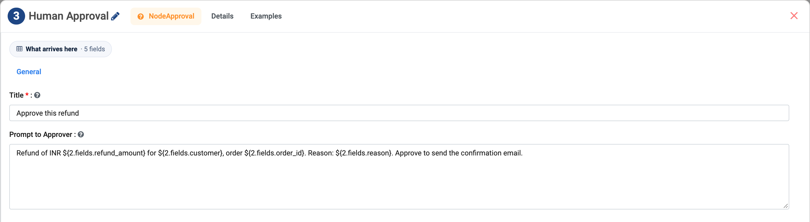

The **Prompt to Approver** can show the facts the reviewer needs with
references - ``${2.fields.refund_amount}`` - so they decide without opening the
run.

**Usually gets wrong:** leaving the **R** branch unwired, so a rejected run
stops with nowhere to go.

Human Input
~~~~~~~~~~~

**What it is.** A conversational pause. It shows the person whatever the upstream
step produced and captures their raw reply.

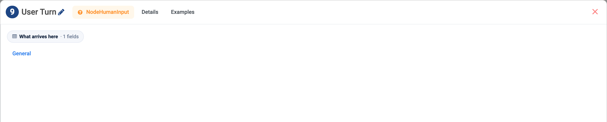

**It has no configuration at all** - and it does no interpretation either.
Understanding the reply is the next agent's job.

Condition
~~~~~~~~~

**What it is.** A deterministic branch. Routes down **T** or **F**. No model
call.

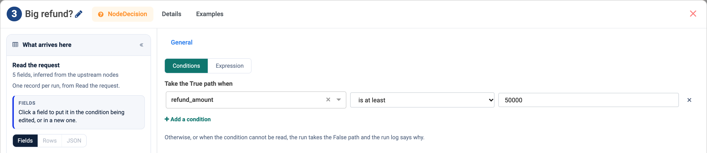

**Conditions** builds the rule from a field, a comparison and a value - pick the
field from the panel. **Expression** takes one line such as
``refund_amount >= 50000 and status == "open"``.

**Usually gets wrong:** a field that does not exist. When the rule cannot be
read the run takes **F**, and the run log says why - check it before assuming
the rule never matches.

Router
~~~~~~

**What it is.** A model-driven router. It reads the incoming request, compares
it with each route's description, and sends it down the matching route. A
**Fallback** route catches the rest.

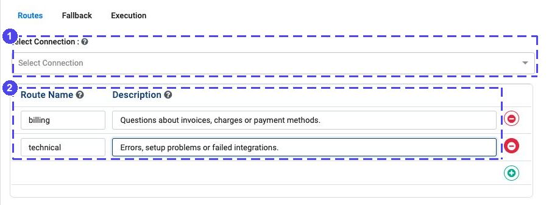

**Use it when** no plain rule can answer "which of these is this about?".

**Usually gets wrong:** route descriptions written as labels. Describe the
*cases* that belong on the route - that is what the model matches against.

Guardrails
~~~~~~~~~~

**What it is.** Rule-based safety checks - PII, prompt injection, banned words,
length. Routes **Allowed (A)** or **Blocked (B)**. No model call, so it is fast
and free.

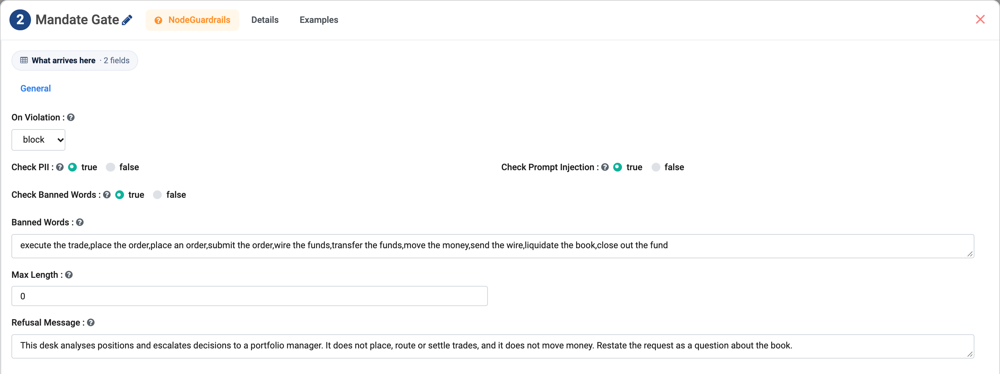

.. list-table::
   :header-rows: 1
   :widths: 26 74

   * - Setting
     - What to put in it
   * - **On Violation**
     - ``block`` stops the text, ``redact`` masks it and continues, ``flag``
       lets it through and records it.
   * - **Check PII**
     - Look for personal data - card numbers, emails, phone numbers.
   * - **Check Prompt Injection**
     - Look for attempts to override the agent's instructions.
   * - **Check Banned Words** / **Banned Words**
     - Turn on your own list, and the list itself.
   * - **Max Length**
     - Reject text over this size. ``0`` means no limit.
   * - **Refusal Message**
     - What is returned when a rule trips.

**Use it** before an Agent to guard the input, after one to guard the output, or
both. See :doc:`/agentic-ai-guide/security-guardrails`.

Data Transformation
-------------------

Steps that shape records between the others. Most use fixed rules and do not
call a model. **Filter in AI mode is the exception:** it asks a model which
records match your description.

.. list-table::
   :header-rows: 1
   :widths: 28 72

   * - Node
     - What it does
   * - **Filter**
     - Keeps the records that match - by conditions, an expression, or a
       description the model judges.
   * - **Sort**
     - Orders records by one or more fields.
   * - **Limit**
     - Keeps the first N records.
   * - **Set Fields**
     - Adds, computes, renames or removes fields.
   * - **Merge**
     - Joins or appends two inputs, or finds what is new.
   * - **Loop Over Items**
     - Runs steps once for each record.
   * - **Summarize**
     - Counts, totals and averages per group.
   * - **Remove Duplicates**
     - One record per key.
   * - **Split Out**
     - One record per value of a list field.
   * - **Code**
     - Your own Python or JavaScript function.

All ten are covered on :doc:`/agentic-ai-guide/data-steps` and
:doc:`/agentic-ai-guide/code-node`.

Documentation
-------------

Sticky Note
~~~~~~~~~~~

**What it is.** A note on the canvas. It has no dialog - you type straight into
it.

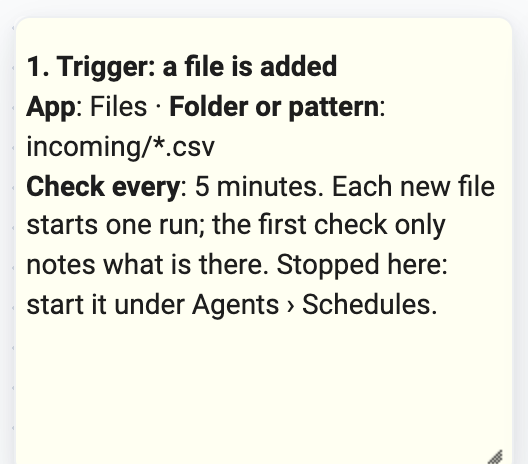

A note under each step is the difference between a canvas a colleague can pick
up and one they have to reverse-engineer. Say what the agent does, how it works,
and how to try it.

Next: put nodes together
------------------------

:doc:`/agentic-ai-guide/multi-agent-orchestration` shows how these fit together
on the canvas.
