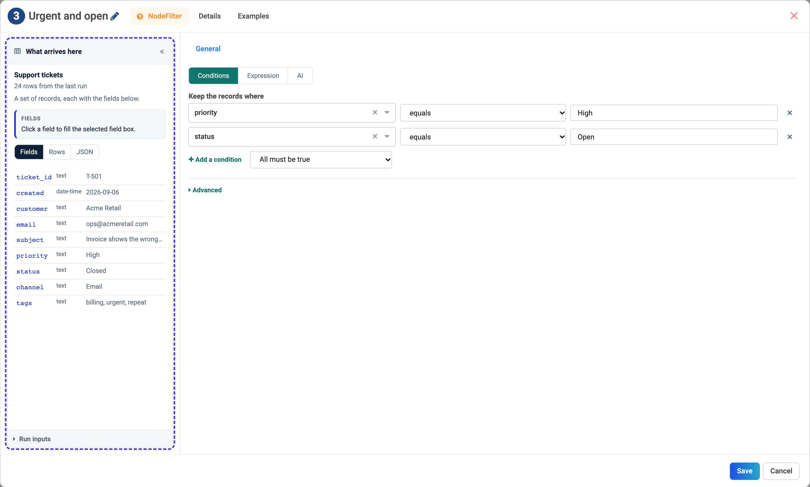
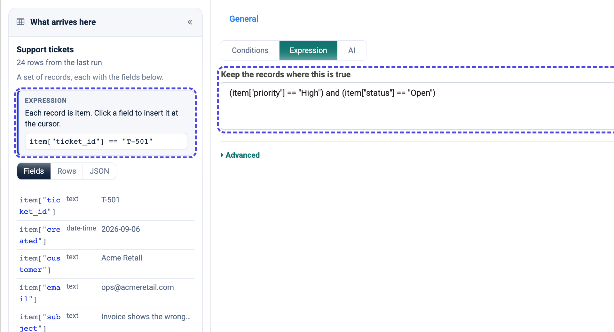
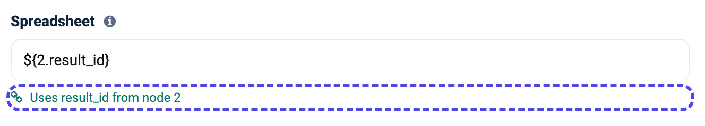
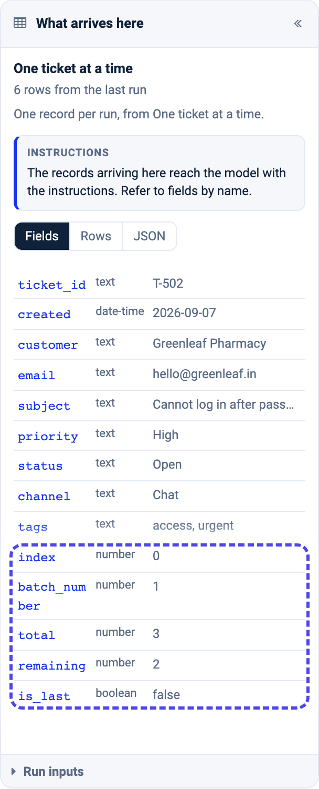
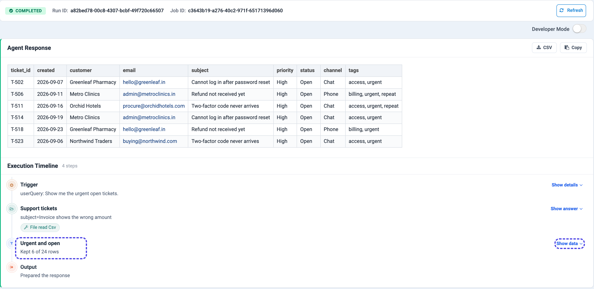

Passing Data Between Steps
==========================

Every step on the canvas hands records to the step after it. This page shows
how to see those records, and how to use a value from an earlier step in a
setting - without typing field names or ``${...}`` references by hand.

.. contents:: On this page
   :local:
   :depth: 1

What arrives here
-----------------

Open any step and the left column, **What arrives here**, lists the fields of
the records that reach it. Here a Filter receives the support tickets read from
a CSV file:

   The panel names the step the data comes from (Support tickets), how many rows it had, and every field with its type and a sample value.

The line under the step's name says where the fields come from:

.. list-table::
   :header-rows: 1
   :widths: 36 64

   * - It says
     - Meaning
   * - **rows from the last run**
     - Real records from the last time the agent ran.
   * - **rows from the last test**
     - Records from **Load the fields** or **Fetch a sample** in an earlier
       step.
   * - **inferred from the upstream nodes**
     - Nothing has run yet; the fields are worked out from the steps before,
       such as an Agent Node's JSON schema or the fields a Set Fields adds.

Three views of the same records:

* **Fields** - one line per field, with its type and a sample value.
* **Rows** - the records as a table.
* **JSON** - the first record exactly as the step will see it.

.. list-table::
   :widths: 50 50

   * - .. figure:: ../_assets/agentic-ai-guide/passing-data/panel-rows.png
          :alt: The Rows view of What arrives here as a table of tickets
          :width: 300px

          Rows

     - .. figure:: ../_assets/agentic-ai-guide/passing-data/panel-json.png
          :alt: The JSON view of What arrives here showing the first ticket record
          :width: 300px

          JSON

**Run inputs**, at the bottom of the panel, holds the values every step can
read whatever is wired before it: the message (``userQuery``) and the named
values of the :doc:`Trigger </agentic-ai-guide/triggers>`.

Click a field instead of typing it
----------------------------------

Click in a setting, then click a field in the panel. The field goes in at the
cursor, written the way *that* setting expects it. The blue box at the top of
the panel says which form the current setting uses, with an example you can
click.

   In a Filter expression each record is ``item``, so every field is offered as ``item["priority"]``.

The same field is written differently depending on where it goes:

.. list-table::
   :header-rows: 1
   :widths: 34 36 30

   * - Setting
     - The field is written
     - Why
   * - Prompts, messages, file paths, app fields
     - ``${4.total}`` for one record, ``${3.rows}`` for a set
     - Filled in when the step runs.
   * - Filter expression
     - ``item["priority"]``
     - Each record is ``item``.
   * - Set Fields value starting with ``=``
     - ``=item["amount"] * 1.18``
     - Worked out for every record.
   * - Code, Python
     - ``item["priority"]``, ``inputs["userQuery"]``
     - ``main`` receives dictionaries.
   * - Code, JavaScript
     - ``item.priority``
     - Plain objects.
   * - Condition
     - ``priority``
     - The rule reads the run by name.
   * - Agent instructions, AI Filter description
     - ``priority``
     - The records reach the model already.
   * - Field pickers (Sort by, Group by, Key)
     - ``priority``
     - Goes straight into the picker.

References: ``${step.field}``
-----------------------------

A reference is how a setting names a value from an earlier step. It is the
step's number on the canvas, a dot, and the field:

.. list-table::
   :header-rows: 1
   :widths: 34 66

   * - Reference
     - Reads
   * - ``${2.result_id}``
     - ``result_id`` from step 2 - for example the id of the spreadsheet step 2
       created.
   * - ``${10.analysis}``
     - The answer of the Agent Node numbered 10.
   * - ``${5.key}``
     - The ``key`` of the current record of Loop Over Items step 5.
   * - ``${3.rows}``
     - Every record of step 3, as JSON.
   * - ``${inputs.file_name}``
     - A named value from the Trigger or the REST request.
   * - ``${event.path}``
     - A field of the record that started an event Trigger.

The panel offers the ``${}`` button only where one record flows - after a Loop,
an Agent Node, a ``get``, or a one-row Summarize - because a single value is
what the reference fills in.

Under a setting that holds a reference, a green line reads it back in words, so
you can check it without counting steps:

.. note::

   A reference that does not match anything stays exactly as typed. If an email
   arrives saying ``${7.summary}``, that step had no ``summary`` field - open the
   step and pick the field from the panel instead.

.. _passing-data-loop:

Inside a loop
-------------

A step inside **Loop Over Items** receives one record at a time. Besides the
record's own fields it gets ``index``, ``batch_number``, ``total``,
``remaining`` and ``is_last``, so a prompt can say "ticket ${4.index} of
${4.total}".

See what each step did
----------------------

After a run, the **Execution Timeline** under the result lists every step with a
one-line summary. Data steps count real rows - *Kept 6 of 24 rows* - and
**Show data** opens the records the step passed on.

Those same records then appear in every later step's **What arrives here** as
*rows from the last run*.
