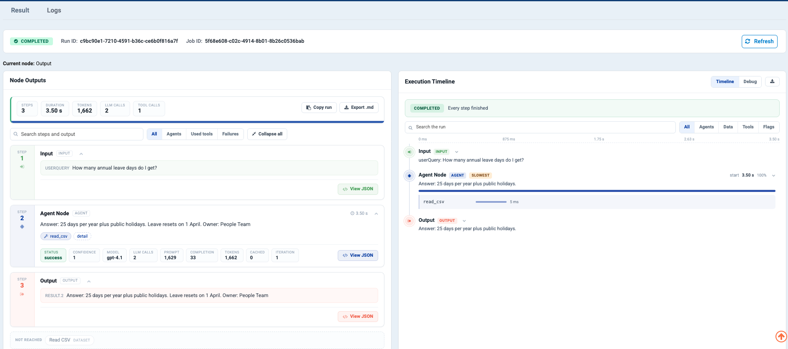

Step 2: Your First Agent
========================

This builds a working agent in **Agent Studio** — the form-based way to make a
single agent. No canvas, no wiring. About ten minutes.

Before you start
----------------

Three things need to exist. If you are brand new, do them in this order — each
takes a minute or two.

.. list-table::
   :header-rows: 1
   :widths: 8 30 62

   * - #
     - You need
     - How to get it
   * - 1
     - A **project** to work in
     - :doc:`/user-guide/quick-start/1-create-application`. A project is the
       folder that holds your agents, workflows and data.
   * - 2
     - An **LLM connection**
     - :doc:`/agentic-ai-guide/connections`. Every agent needs a model.
   * - 3
     - A **file** for the agent to read
     - :doc:`/user-guide/quick-start/2-upload-data-files`. For this walkthrough,
       upload a small CSV of FAQ questions and answers.

.. note::

   Only step 2 is truly specific to agents. If a colleague has already set up
   the workspace, you may find all three are done and you can start below.

.. contents:: On this page
   :local:
   :depth: 1

Open the Agents page
--------------------

Open your **project** from the **Projects** menu in the top bar, then click
**Agents** in the left sidebar.

In an empty project you get four ways to start:

.. figure:: ../_assets/agentic-ai-guide/quickstart/01-agents-empty.png
   :alt: Agents page in an empty project offering Single agent, Agent orchestration, Import agent and Trashed agents
   :width: 90%

.. list-table::
   :header-rows: 1
   :widths: 26 74

   * - Option
     - What it does
   * - **Single agent** *(boxed)*
     - Configure one agent in a dialog, no canvas. **Start here.**
   * - **Agent orchestration**
     - Wire several agents together on a canvas.
   * - **Import agent**
     - Bring in an agent exported from another project or environment.
   * - **Trashed agents**
     - Recover something you deleted.

In a project that already has agents, the same choices live behind the
**Create Agents** button at the top right.

.. figure:: ../_assets/agentic-ai-guide/quickstart/02-create-agents-menu.png
   :alt: The Create Agents button opened, showing Agent Studio and Agent Orchestration
   :width: 55%

   **1** Create Agents · **2** Agent Studio, for a single agent ·
   **3** Agent Orchestration, for a canvas.

The Agent Studio screen
-----------------------

Click **Single agent** and Agent Studio opens as two panels.

.. figure:: ../_assets/agentic-ai-guide/quickstart/03-studio-empty.png
   :alt: Agent Studio with the behaviour panel on the left and the configuration panel on the right
   :width: 90%

   **Left:** who the agent is. **Right:** what it is allowed to do, in nine
   collapsible groups.

Name it and tell it what it does
--------------------------------

#. Type a name at the top — ``Company FAQ Agent``.
#. **Description**: *Answers staff questions from our FAQ sheet.*
#. **Category** is optional, and it is what groups agents in the list once you
   have fifty of them.
#. Replace the default **Instructions**:

   .. code-block:: text

      You answer staff questions about company policy.

      Always read the FAQ file before answering. Quote the FAQ wording
      where you can.

      If the FAQ does not cover the question, say "That is not in the
      FAQ" and suggest who to ask. Never guess.

.. figure:: ../_assets/agentic-ai-guide/quickstart/04-instructions.png
   :alt: Agent Studio with a name, instructions and a test query filled in
   :width: 85%

   The shipped *Parts Finder* example filled in the same way: a name, a
   one-line instruction, and a real query in the **Input** group ready for
   **Run**.

Why this wording and not the default *"You are a helpful AI agent"*:

* It says **what the agent is**, not what it should be like.
* It says **always read the file** — otherwise the model will answer from
  memory and sound perfectly confident doing it.
* It says what to do when it **does not know**. Agents invent answers mostly
  because nobody told them "I don't know" was allowed.

.. tip::

   The **Improve** button above the box expands a rough draft into a fuller
   prompt. Use it to get from three words to a first draft, then cut it back —
   generated prompts drift towards generic politeness, and the specific rules
   are what actually change behaviour.

Give it a tool
--------------

An agent with no tools can only talk. Open the **Tools** group and click
**Add tools**.

.. figure:: ../_assets/agentic-ai-guide/quickstart/06-tool-picker.png
   :alt: The Add a tool picker with the three tool sources boxed
   :width: 90%

The boxed rail is where tools come from:

.. list-table::
   :header-rows: 1
   :widths: 24 12 64

   * - Source
     - Count
     - What it is
   * - **Connectors**
     - 53
     - External systems — Salesforce, ServiceNow, Slack, Jira, GitHub…
   * - **Built In**
     - 37
     - Tools that ship with the platform — ``Read CSV``, ``Read JDBC``,
       ``REST API Client``, ``Web Scraper``…
   * - **Your connections**
     - varies
     - Connections already configured in your workspace.

For this agent:

#. Click **Built In** in the left rail.
#. Find **Read CSV** and click it.
#. Choose the FAQ file you uploaded in *Before you start*.
#. Click **Add to agent**.

Sparkflows then asks **who fills in the tool's settings**:

.. list-table::
   :header-rows: 1
   :widths: 24 76

   * - Choice
     - Use it when
   * - **Agent decides**
     - The value changes per request — a ticket number, a search phrase.
   * - **Fixed settings**
     - The value must never change. A file path is exactly this case, so
       choose **Fixed settings** here.

Enter the path to your FAQ file and click **Save**.

.. figure:: ../_assets/agentic-ai-guide/quickstart/05-tool-settings.png
   :alt: Read CSV settings with a fixed file path
   :width: 95%

   ``Read CSV`` with its path fixed. The agent can read this file and no other.

The tool now appears under the **Tools** group, with a toggle to switch between
the two modes later.

.. figure:: ../_assets/agentic-ai-guide/quickstart/06-tool-added.png
   :alt: The Tools group with Read CSV attached and Fixed selected
   :width: 675px

.. tip::

   Give the tool a description that says **which** file it reads — *"Reads the
   staff FAQ sheet"*, not *"Reads a CSV"*. The model chooses its tools by
   reading those descriptions, and a vague one is the most common reason an
   agent ignores a tool. See
   :doc:`/agentic-ai-guide/tools-actions`.

Choose the model
----------------

Open the **Model** group and pick the **Connection** you made in
:doc:`/agentic-ai-guide/connections`.

Leave **Temperature** at ``0.7`` for now. For answering from a document, ``0.2``
gives steadier results — see :doc:`/agentic-ai-guide/models-prompts`.

.. figure:: ../_assets/agentic-ai-guide/quickstart/07-model.png
   :alt: The Model group with the AZURE_FOUNDRY connection selected
   :width: 660px

Run it
------

Click **Run** in the top bar. The run page opens and executes.

   A real run of this agent. **COMPLETED**, 3 steps, one tool call.

Read it left to right:

.. list-table::
   :header-rows: 1
   :widths: 22 78

   * - Panel
     - What it tells you
   * - **Node Outputs**
     - Every step. Step 1 is the question, step 2 is the agent — note the
       ``read_csv`` chip with ``STATUS success``, which proves it actually read
       the file — and step 3 is the answer.
   * - **Execution Timeline**
     - The same run as a sequence, with timings. Useful when a run is slow and
       you want to know which step ate the time.

The answer came back as *"Answer: 25 days per year plus public holidays. Leave
resets on 1 April. Owner: People Team"* — the exact shape the instructions
asked for.

Check three things, in this order:

.. list-table::
   :header-rows: 1
   :widths: 8 40 52

   * - #
     - Question
     - If the answer is no
   * - 1
     - Is there a tool chip with ``STATUS success``?
     - It answered from memory. Add *"Always read the FAQ file before
       answering."*
   * - 2
     - Does the answer match the FAQ wording?
     - Add *"Quote the FAQ wording."*
   * - 3
     - Does it admit when the FAQ has no answer?
     - Ask something the FAQ does not cover and see. Tighten the refusal rule.

.. caution::

   **If the run fails with a formatting error, or the Execute button is
   missing, check the Model group first.** An agent saved without a
   **Connection** selected fails in ways that look like a bug in your prompt.
   It is the most common setup mistake, and the error message does not point
   at it.

Save it
-------

Click **Create Agent**. It now appears in the Agents list.

.. figure:: ../_assets/agentic-ai-guide/quickstart/09-saved.png
   :alt: The saved agent in the agents list
   :width: 90%

What you just built
-------------------

On the canvas, that same agent is two boxes: an **Input** and an **Agent Node**
with one tool attached.

.. figure:: ../_assets/agentic-ai-guide/quickstart/10-faq-agent-canvas.png
   :alt: The Company FAQ agent shown on the canvas: Input feeding an Agent Node with a Read CSV tool
   :width: 70%

   The ``Read CSV`` chip under the node is the tool you added.

That matters because a saved agent is not a dead end. You can now:

.. list-table::
   :header-rows: 1
   :widths: 40 60

   * - Use it as
     - See
   * - A chatbot people can talk to
     - :doc:`/agentic-ai-guide/chat`
   * - One node inside a bigger process
     - :doc:`/agentic-ai-guide/multi-agent-orchestration`
   * - An API other systems call
     - :doc:`/agentic-ai-guide/deploy-agents`

Next: share it with colleagues
------------------------------

Turn it into something people can actually use: :doc:`/agentic-ai-guide/chat`.
