Step 2: Your First Agent
========================

This builds a working agent in **Agent Studio** - the form-based way to make a
single agent. No canvas, no wiring. About ten minutes.

Before you start
----------------

Three things need to exist. If you are brand new, do them in this order - each
takes a minute or two.

.. list-table::
   :header-rows: 1
   :widths: 8 30 62

   * - #
     - You need
     - How to get it
   * - 1
     - A **project** to work in
     - :doc:`/user-guide/quick-start/1-create-application`. A project is the
       folder that holds your agents, workflows and data.
   * - 2
     - An **LLM connection**
     - :doc:`/agentic-ai-guide/connections`. Every agent needs a model.
   * - 3
     - A **file** for the agent to read
     - :doc:`/user-guide/quick-start/2-upload-data-files`. For this walkthrough,
       upload a small CSV of FAQ questions and answers.

.. note::

   Only the LLM connection is specific to agents. If a colleague has already
   set up the workspace, all three may be done and you can start below.

.. contents:: On this page
   :local:
   :depth: 1

Open the Agents page
--------------------

Open your **project** from the **Projects** menu in the top bar, then click
**Agents** in the left sidebar.

In an empty project you get four ways to start:

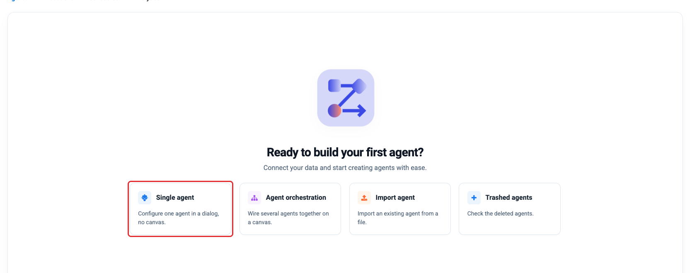

.. list-table::
   :header-rows: 1
   :widths: 26 74

   * - Option
     - What it does
   * - **Single agent** *(boxed)*
     - Configure one agent in a dialog, no canvas. **Start here.**
   * - **Agent orchestration**
     - Wire several agents together on a canvas.
   * - **Import agent**
     - Bring in an agent exported from another project or environment.
   * - **Trashed agents**
     - Recover something you deleted.

In a project that already has agents, the same choices live behind the
**Create Agents** button at the top right.

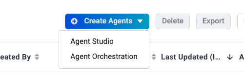

   **Agent Studio** for a single agent, **Agent Orchestration** for a canvas.

The Agent Studio screen
-----------------------

Click **Single agent** and Agent Studio opens.

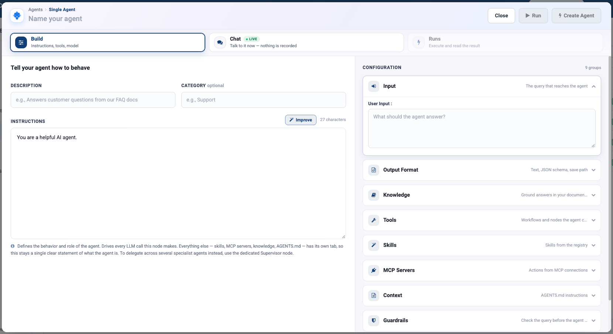

Across the top are three tabs, and this walkthrough uses all of them:

.. list-table::
   :header-rows: 1
   :widths: 16 84

   * - Tab
     - What you do there
   * - **Build**
     - Configure the agent. **Left:** who it is. **Right:** what it may do, in
       nine collapsible groups.
   * - **Chat**
     - Talk to it while you build. Nothing is recorded.
   * - **Runs**
     - Run it for real and read exactly what it did.

Name it and tell it what it does
--------------------------------

The example in this walkthrough is an **Employee Benefits Assistant** that
answers staff questions from a company FAQ sheet.

#. Type a name at the top - ``Employee Benefits Assistant``.
#. **Description**: *Answers employee questions about leave, benefits, and
   expense policies.*
#. **Category**: ``People Operations``. It is optional, and it is what groups
   agents in the list once you have fifty of them.
#. Replace the default **Instructions**:

   .. code-block:: text

      You are the Employee Benefits Assistant. Answer employee questions
      about leave, benefits, and expense policies using the approved FAQ.
      Be concise, practical, and clear. If the answer is not in the
      available information, say so and direct the employee to People
      Operations.

#. Open the **Input** group and type a question you know the answer to -
   *How many annual leave days do I receive each year?* This is the query
   **Run** uses, so keep it realistic.

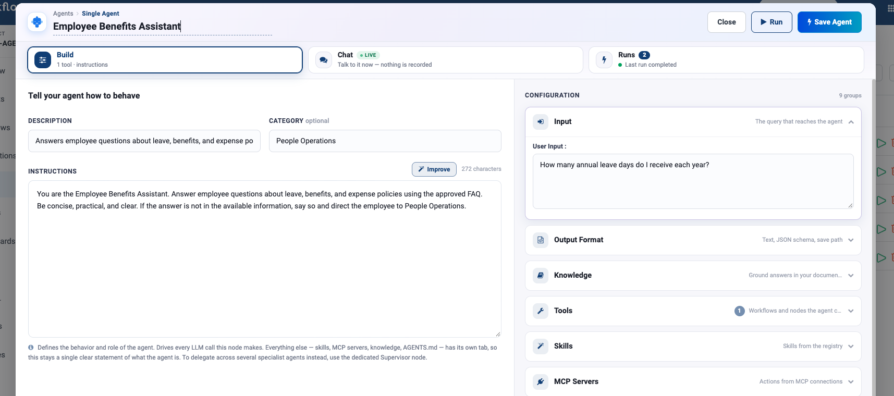

Why this wording and not the default *"You are a helpful AI agent"*:

* It says **what the agent is**, not what it should be like.
* It says **use the approved FAQ** - otherwise the model will answer from
  memory and sound perfectly confident doing it.
* It says what to do when it **does not know**. Agents invent answers mostly
  because nobody told them "I don't know" was allowed.

.. tip::

   The **Improve** button above the box expands a rough draft into a fuller
   prompt. Use it to get from three words to a first draft, then cut it back -
   generated prompts drift towards generic politeness, and the specific rules
   are what actually change behaviour.

Give it a tool
--------------

An agent with no tools can only talk. Open the **Tools** group and click
**Add tools**.

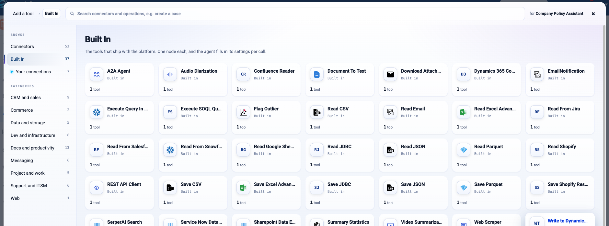

The left rail is where tools come from:

.. list-table::
   :header-rows: 1
   :widths: 24 12 64

   * - Source
     - Count
     - What it is
   * - **Connectors**
     - 53
     - External systems - Salesforce, ServiceNow, Slack, Jira, GitHub…
   * - **Built In**
     - 37
     - Tools that ship with the platform - ``Read CSV``, ``Read JDBC``,
       ``REST API Client``, ``Web Scraper``…
   * - **Your connections**
     - varies
     - Connections already configured in your workspace.

For this agent:

#. Click **Built In** in the left rail.
#. Click the **Read CSV** tile.

Sparkflows asks **who fills in the tool's settings**:

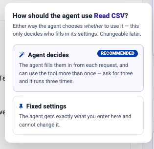

.. list-table::
   :header-rows: 1
   :widths: 24 76

   * - Choice
     - Use it when
   * - **Agent decides**
     - The value changes per request - a ticket number, a search phrase.
   * - **Fixed settings**
     - The value must never change. A file path is exactly this case, so
       choose **Fixed settings** here.

Choose **Fixed settings**. The tool's settings open: click **Browse File
System**, pick the FAQ file you uploaded in *Before you start*, and click
**Save**.

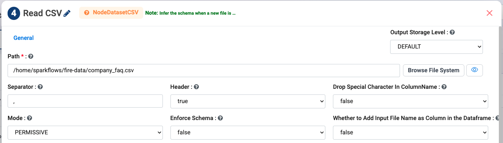

   ``Read CSV`` with its path fixed. The agent can read this file and no other.

The tool now appears under the **Tools** group, with a toggle to switch between
the two modes later.

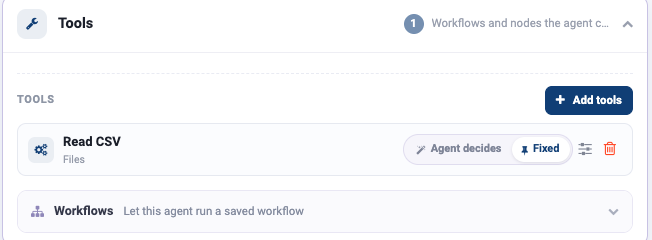

.. tip::

   Give the tool a description that says **which** file it reads - *"Reads the
   staff FAQ sheet"*, not *"Reads a CSV"*. The model chooses its tools by
   reading those descriptions, and a vague one is the most common reason an
   agent ignores a tool. See
   :doc:`/agentic-ai-guide/tools-actions`.

Choose the model
----------------

Open the **Model** group and pick the **Connection** you made in
:doc:`/agentic-ai-guide/connections`.

Leave **Temperature** at ``0.7`` for now. For answering from a document, ``0.2``
gives steadier results - see :doc:`/agentic-ai-guide/models-prompts`.

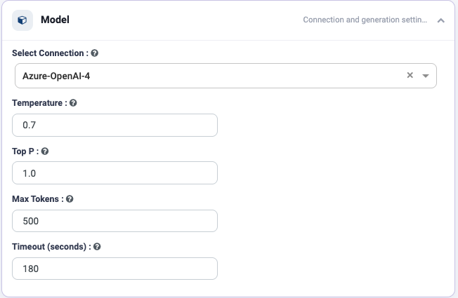

Try it in Chat
--------------

Click the **Chat** tab and talk to the agent. Nothing here is recorded, so ask
as many questions as you like.

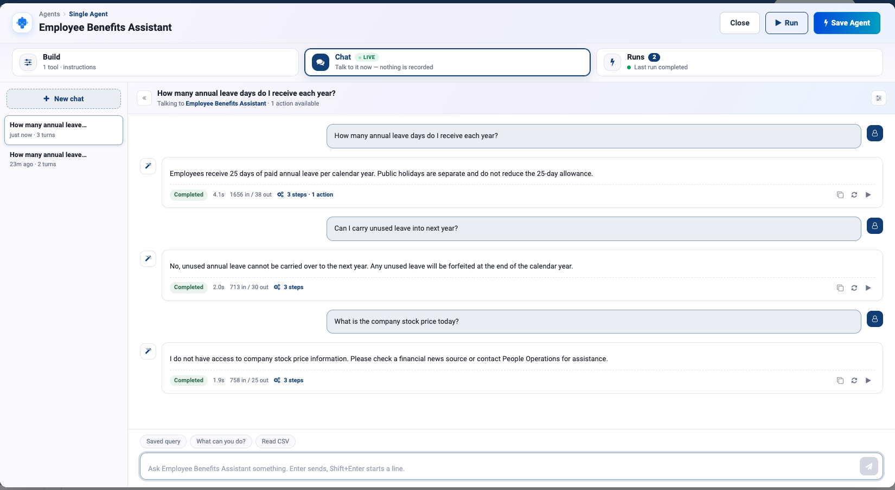

Ask three kinds of question:

.. list-table::
   :header-rows: 1
   :widths: 30 36 34

   * - Ask
     - Example
     - You want
   * - Something the FAQ answers
     - *How many annual leave days do I receive each year?*
     - The FAQ's answer, not a general one
   * - A follow-up
     - *Can I carry unused leave into next year?*
     - An answer that stays on topic
   * - Something it should refuse
     - *What is the company stock price today?*
     - A clear "I don't have that", pointing to People Operations

Click **3 steps** under an answer to check it really read the file - you
should see a ``read_csv`` step.

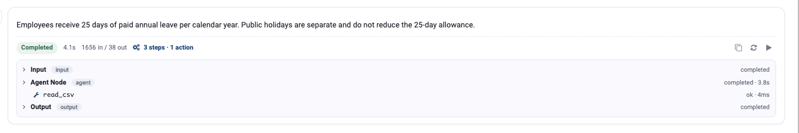

If an answer is wrong, go back to **Build**, change the instructions, and click
**Ask again** on the reply. You do not need to save first - Chat always uses what
is on the Build tab.

Run it for real
---------------

When the answers look right, click **Run** in the top bar. The agent executes
properly and the result opens on the **Runs** tab. Unlike Chat, this run is
kept.

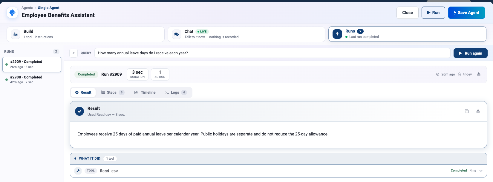

   The result names the tool it used - *Used Read csv* - and **What it did**
   lists the call.

Check three things, in this order:

.. list-table::
   :header-rows: 1
   :widths: 8 40 52

   * - #
     - Question
     - If the answer is no
   * - 1
     - Does **What it did** list the ``Read csv`` tool?
     - It answered from memory. Add *"Always read the FAQ before answering."*
   * - 2
     - Does the answer match the FAQ?
     - Add *"Quote the FAQ wording."*
   * - 3
     - Does it admit when the FAQ has no answer?
     - Ask something the FAQ does not cover. Tighten the refusal rule.

The **Steps**, **Timeline** and **Logs** tabs under the run summary go deeper -
see :ref:`agent-studio-runs`.

.. caution::

   **If Chat shows** *No model connection is selected* **or a run fails with a
   formatting error, check the Model group first.** An agent without a
   **Connection** fails in ways that look like a bug in your prompt, and it is
   the most common setup mistake.

Save it
-------

Click **Create Agent**. It now appears in the Agents list, as a **Single
Agent**.

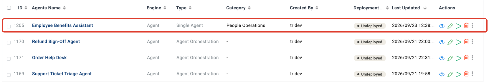

What you just built
-------------------

Open the agent from the list with the pencil icon and you see the same agent on
the canvas: an **Input**, an **Agent Node** with one tool attached, and an
**Output**.

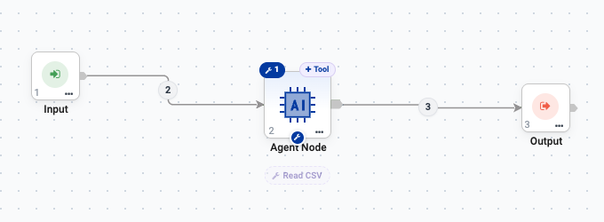

   The ``Read CSV`` chip under the node is the tool you added.

That matters because a saved agent is not a dead end. You can now:

.. list-table::
   :header-rows: 1
   :widths: 40 60

   * - Use it as
     - See
   * - A chatbot people can talk to
     - :doc:`/agentic-ai-guide/chat`
   * - One node inside a bigger process
     - :doc:`/agentic-ai-guide/multi-agent-orchestration`
   * - An API other systems call
     - :doc:`/agentic-ai-guide/deploy-agents`

Next: share it with colleagues
------------------------------

Turn it into something people can actually use: :doc:`/agentic-ai-guide/chat`.
