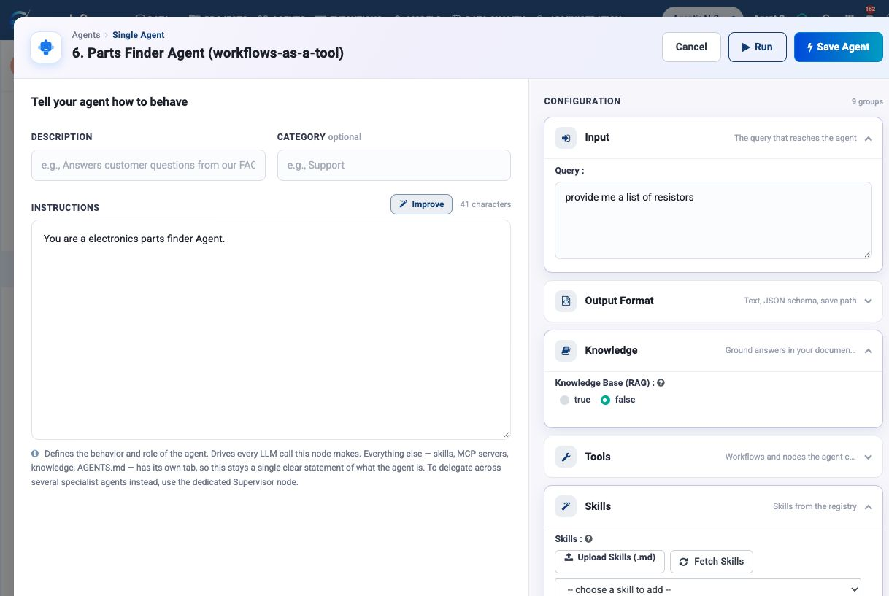
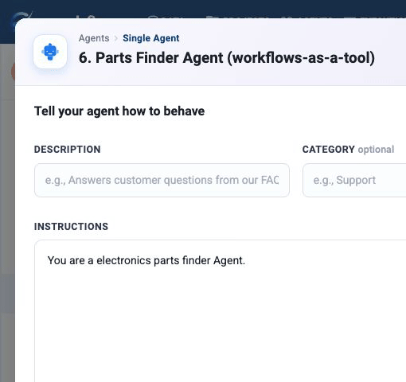
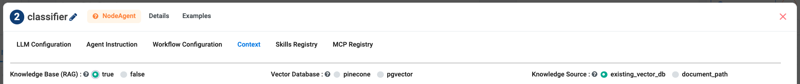
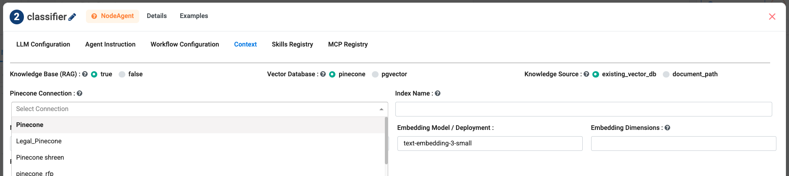
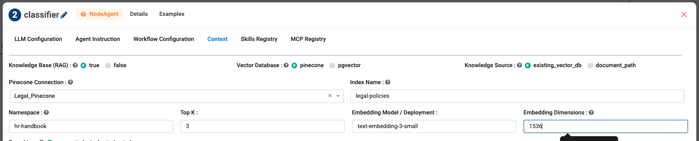
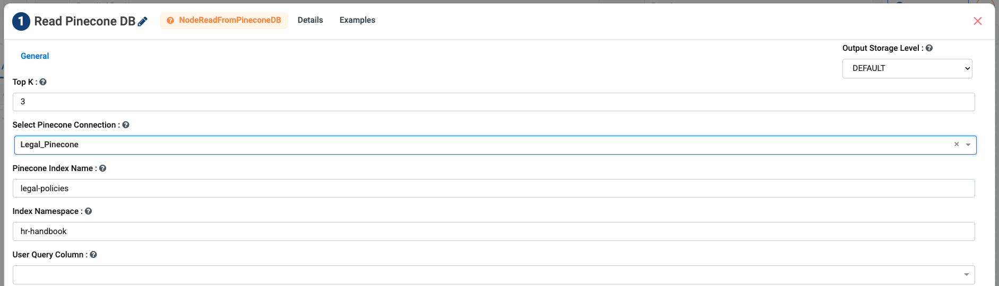

Knowledge & RAG
===============

Knowledge grounds an agent in **your** documents. Without it, an agent answers
from whatever the model absorbed during training — which is generic, undated, and
knows nothing about your business. With it, the agent reads your material before
it answers.

The mechanism is retrieval-augmented generation (RAG): find the passages most
relevant to the question, put them in front of the model, then let it answer
using only what it was given.

.. contents:: On this page
   :local:
   :depth: 1

When to use Knowledge
---------------------

.. list-table::
   :header-rows: 1
   :widths: 45 55

   * - Use Knowledge when
     - Use something else when
   * - The answer lives in documents — policies, manuals, contracts
     - The answer lives in a system of record → use a **tool**
   * - The corpus is too large to paste into a prompt
     - It is a page of standing facts → use :doc:`AGENTS.md
       </agentic-ai-guide/context-agents-md>`
   * - Users ask open questions across many documents
     - You always read the same one document → pass it directly

.. important::

   Knowledge is for *documents*. If the question is "what is this customer's
   balance?", that is a database or an API — give the agent a tool. Agents that
   retrieve stale document copies of live data are a common and avoidable
   mistake.

Where to turn it on
-------------------

The same settings live in two places, depending on how you built the agent:

.. list-table::
   :header-rows: 1
   :widths: 34 66

   * - Building in
     - Look under
   * - **Agent Studio**
     - the **Knowledge** group
   * - **Agent Orchestration** (an Agent Node)
     - the **Context** tab

Both start with **Knowledge Base (RAG)** set to ``false`` and nothing else
showing. Switch it to ``true`` and the retrieval settings appear.

   Switching **Knowledge Base (RAG)** from ``false`` to ``true``.

   The same thing on an Agent Node's **Context** tab.

Use an existing Pinecone knowledge base
---------------------------------------

This is the common case: somebody has already indexed the documents, and you
want your agent to search that index. You need four things from whoever built
it — the **connection**, the **index name**, the **namespace**, and the
**embedding model and dimension** they used.

**Step 1 — Switch retrieval on.** Open the **Context** tab on an Agent Node (or
the **Knowledge** group in Agent Studio) and set **Knowledge Base (RAG)** to
``true``. Choose **Vector Database** ``pinecone`` and **Knowledge Source**
``existing_vector_db``.

**Step 2 — Pick the connection.** The **Pinecone Connection** dropdown lists
every Pinecone connection configured in your workspace. Choose the one that
holds the index you want.

.. note::

   No Pinecone connections in the list? Somebody has to create one first — see
   :doc:`/agentic-ai-guide/connections`. The API key lives in the connection and
   nowhere else; never put it in an agent field or a Markdown file.

**Step 3 — Point it at the right index.** Fill in the index name, the namespace,
and the embedding settings that were used when the documents were stored.

.. list-table::
   :header-rows: 1
   :widths: 30 70

   * - Field
     - What to enter
   * - **Index Name**
     - The Pinecone index holding the chunks.
   * - **Namespace**
     - The partition inside that index. A wrong namespace returns nothing at
       all, which looks exactly like an agent that cannot find the answer.
   * - **Top K**
     - How many chunks to retrieve. Start at ``3``; raise it to ``5`` only if
       answers are missing detail.
   * - **Embedding Model / Deployment**
     - Must be the same model the documents were indexed with.
   * - **Embedding Dimensions**
     - Must match the index's dimension, for example ``1536`` for
       ``text-embedding-3-small``.
   * - **Reranking**
     - ``none`` to start. ``lexical`` and ``hosted`` re-order the retrieved
       chunks before the agent sees them.

**Step 4 — Save and ask a question you know the answer to.** If the agent
answers from general knowledge instead of your documents, the retrieval returned
nothing — check the namespace first, then the index name.

.. important::

   Index, namespace, embedding model and dimension must all match the workflow
   that stored the documents. A wrong namespace returns no documents; a
   mismatched embedding model returns poor matches. Neither one produces an
   error — both produce a vague answer.

The settings
------------

.. list-table::
   :header-rows: 1
   :widths: 30 70

   * - Field
     - What to choose
   * - **Knowledge Base (RAG)**
     - ``true`` to turn retrieval on for this agent.
   * - **Vector Database**
     - ``pinecone`` or ``pgvector``. Needs a matching
       :doc:`connection </agentic-ai-guide/connections>`.
   * - **Knowledge Source**
     - ``existing_vector_db`` to search an index someone already built, or
       ``document_path`` to point at documents and have them indexed.
   * - **Namespace**
     - The partition inside the index. The clean way to keep departments or
       tenants apart in one database.
   * - **Top K**
     - How many chunks to retrieve. Defaults to ``3``. Start low — irrelevant
       chunks crowd out the relevant one and cost tokens.
   * - **Embedding Model / Deployment**
     - Must be the **same model the index was built with**, e.g.
       ``text-embedding-3-small``. Changing it without re-indexing silently
       degrades every result.
   * - **Embedding Dimensions**
     - Must match the index. A mismatch fails loudly, which is better than
       failing quietly.
   * - **Reranking**
     - ``none``, ``lexical`` or ``hosted``. Re-scores retrieved chunks before
       the model sees them. Worth turning on when Top K is higher, or when the
       corpus has many near-duplicate passages.

Reading the same index from a workflow
--------------------------------------

The same index can be read from a data workflow, with the **Read Pinecone DB**
node. The fields are the ones you have just seen.

Use this when the retrieval is a step in a pipeline rather than something the
agent does for itself. The retrieval path is the same either way:

.. code-block:: text

   question -> embed the question -> search the index -> matching chunks -> agent

The index must already contain document chunks and their original text. If it
does not, index them first with ``Document To Text`` -> ``Text Embedder`` ->
``Save to Pinecone``. The full workflow walkthrough is at
:doc:`/user-guide/generative-ai/rag`.

Making retrieval answer correctly
---------------------------------

Retrieval finding the right passage is only half the job. The agent also has to
use it. Add this to the instructions:

.. code-block:: text

   Answer only from the retrieved passages. If the passages do not
   contain the answer, say that you could not find it. Do not answer
   from general knowledge. Quote the source for each claim.

Without that, a model given weak passages will fall back on training data and
produce a confident, plausible, unsourced answer — the single most damaging
failure mode in enterprise RAG.

Troubleshooting
---------------

.. list-table::
   :header-rows: 1
   :widths: 35 65

   * - Symptom
     - Check
   * - Answers ignore your documents
     - Knowledge Base (RAG) is off, the index/namespace is empty, or the
       instructions never told the agent to use retrieved passages.
   * - Answers cite the wrong document
     - Too many chunks are being retrieved. Lower ``topK`` in the Pinecone
       retrieval workflow first.
   * - Known content is never found
     - Check index name, namespace, and matching embedding model, then re-index
       and test the same question again.
   * - Results got worse after a change
     - The embedding model or vector dimension no longer matches the index.

Next: standing context
----------------------

:doc:`/agentic-ai-guide/models-prompts` covers the model settings that sit
alongside these.
