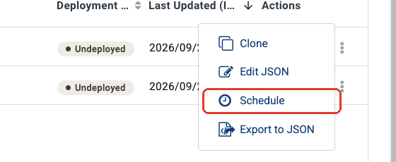
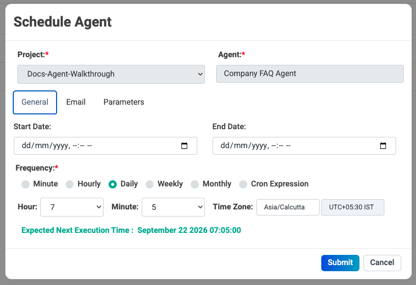
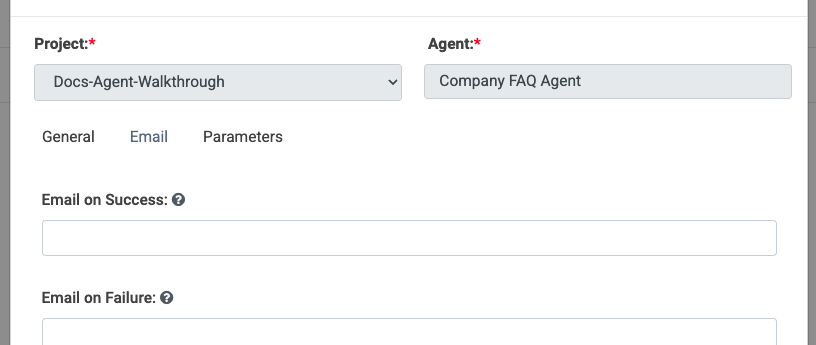
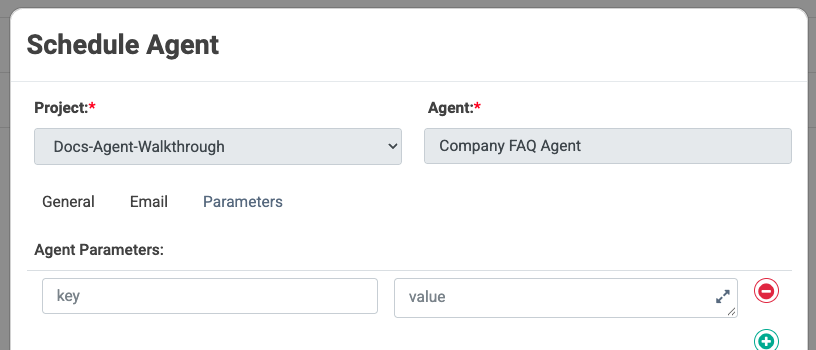
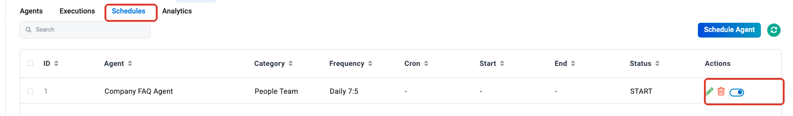

Schedule Agents
===============

A scheduled agent runs on a timetable with nobody watching it — a morning triage
pass, a nightly reconciliation, a weekly report. Everything else about the agent
stays the same; you are only deciding *when* it runs and *who hears about it*.

.. contents:: On this page
   :local:
   :depth: 1

Before you schedule anything
----------------------------

.. list-table::
   :header-rows: 1
   :widths: 26 74

   * - Check
     - Why it matters
   * - **Run it by hand first**
     - A schedule is not the place to discover that a connection is wrong.
   * - **Every input has a value**
     - There is no user to ask at 02:00. Anything the agent expects must have a
       value on the schedule or a default on the node.
   * - **Somebody owns the failures**
     - Fill in the failure email. A job nobody watches is a job nobody fixes.
   * - **Writes are safe to repeat**
     - A scheduled agent that writes to another system repeats that write on
       every run.

Steps
-----

Scheduling runs an agent on a timetable with nobody watching — a morning triage
pass, a nightly reconciliation, a weekly report.

**Step 1 — Open the Schedule dialog.** On the **Agents** page, click the **⋮**
menu at the end of the agent's row and choose **Schedule**.

**Step 2 — Set the timetable.** The **General** tab is where the schedule
itself lives.

.. list-table::
   :header-rows: 1
   :widths: 26 74

   * - Field
     - What to enter
   * - **Project** / **Agent**
     - Already filled in from the row you clicked.
   * - **Start Date** / **End Date**
     - Optional. Leave both empty to run from now until you stop it.
   * - **Frequency**
     - ``Minute``, ``Hourly``, ``Daily``, ``Weekly``, ``Monthly`` or
       ``Cron Expression``. Picking one reveals the fields it needs — ``Daily``
       asks for an hour, a minute and a time zone.
   * - **Time Zone**
     - The zone the time is read in. Check this; it is the most common reason a
       job runs at the wrong hour.

Sparkflows shows the **Expected Next Execution Time** as you change the
settings. Read it before you submit — it is the quickest way to catch a
timezone or frequency mistake.

**Step 3 — Say who hears about it.** The **Email** tab takes an address for
successful runs and an address for failures.

.. important::

   Always fill in **Email on Failure**. A scheduled run has no user watching it,
   and a nightly job that has been failing quietly for three weeks is worse than
   no job at all.

**Step 4 — Supply any inputs.** The **Parameters** tab takes the key/value pairs
the agent needs. A scheduled run has nobody to ask, so every parameter the agent
expects must have a value here or a default on the node.

**Step 5 — Submit.** Click **Submit**. The schedule appears on the
**Schedules** tab, where you can edit it, delete it, or switch it on and off
with the toggle in **Actions**.

.. caution::

   Be careful scheduling agents that write to other systems. A mistake that you
   would spot immediately in an interactive run can repeat unattended every
   night. Schedule the read-only version first and watch it for a week.

Next: read the runs
-------------------

Scheduled runs appear in the same place as every other run. Use
:doc:`/agentic-ai-guide/monitor-govern` to read what happened, and
:doc:`/agentic-ai-guide/deploy-agents` for the other ways an agent can be
invoked.
