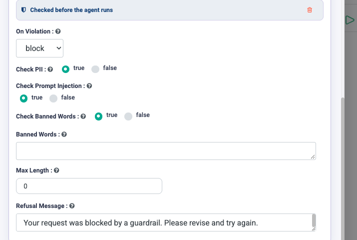

Security & Guardrails
=====================

An agent is a system that can act. Everything here is about making sure it can
only act within limits you chose deliberately.

The layers
----------

Four controls, from cheapest and most effective downwards. Use them in this
order.

.. list-table::
   :header-rows: 1
   :widths: 8 26 66

   * - #
     - Layer
     - What it stops
   * - 1
     - **Tool selection**
     - The agent cannot take an action you never ticked.
   * - 2
     - **Connection scope**
     - The agent cannot reach a system whose credentials it was not given.
   * - 3
     - **Guardrails**
     - A query that should not be answered never reaches the model.
   * - 4
     - **Human approval**
     - A consequential action does not happen without a person agreeing.

.. important::

   Layer 1 is the one people underuse and the one that works best. Guardrails
   are text checks and can be argued with; an operation that was never ticked
   cannot be invoked at all. Start by removing capability, not by adding rules.

Layer 1: Tool selection
-----------------------

When you add a connector, tick only the operations the agent needs. See
:doc:`/agentic-ai-guide/tools-actions`.

A simple test for any agent: **list every ticked operation and ask what the
worst outcome of each is, if the model is confused.** If an answer is
unacceptable, untick it or put an approval gate in front of it.

Layer 2: Connection scope
-------------------------

Connections exist at Global, Group and Project scope. A project-scoped
credential for a production system means only agents in that project can reach
it. See :doc:`/agentic-ai-guide/connections`.

Never put credentials in prompt text - not in Instructions, not in a skill, not
in ``AGENTS.md``.

Layer 3: Guardrails
-------------------

Guardrails check the query **before the agent sees it**. A blocked request
never reaches the model; the refusal goes back instead. The checks are
deterministic rules, so they cost nothing and add no latency worth measuring.

Setting them up
~~~~~~~~~~~~~~~

#. Open the **Guardrails** group in Agent Studio.

   .. figure:: ../_assets/agentic-ai-guide/guardrails/add-guardrails.png
      :alt: The collapsed Guardrails group with the Add guardrails button
      :width: 680px

#. Click **Add guardrails**.
#. Set the checks you want.

   The guardrail block, headed *Checked before the agent runs*.

.. list-table::
   :header-rows: 1
   :widths: 28 72

   * - Setting
     - What it does
   * - **On Violation**
     - What happens when a check trips: ``block`` stops the request,
       ``redact`` removes the offending content and continues, ``flag`` lets it
       through but marks it. Default ``block``.
   * - **Check PII**
     - Looks for personally identifiable information in the query.
   * - **Check Prompt Injection**
     - Looks for attempts to override the agent's instructions.
   * - **Check Banned Words**
     - Turns on matching against your own list.
   * - **Banned Words**
     - The list itself. Only used when the check above is ``true``.
   * - **Max Length**
     - Rejects queries longer than this. ``0`` means no limit.
   * - **Refusal Message**
     - What the user sees when a request is blocked.

Choosing the violation mode
~~~~~~~~~~~~~~~~~~~~~~~~~~~

.. list-table::
   :header-rows: 1
   :widths: 16 84

   * - Mode
     - Use it when
   * - ``block``
     - The request should not proceed at all. The safe default.
   * - ``redact``
     - The request is legitimate but contains something that must not reach the
       model - a customer's phone number in a support question, for instance.
   * - ``flag``
     - You are still learning what trips. Run in ``flag`` for a week, read what
       it caught, then switch to ``block`` once you trust the rules.

.. note::

   ``redact`` can only apply to things that can be masked - **PII** and
   **banned words**. A prompt-injection attempt or an over-length query has
   nothing to redact, so those still block even in ``redact`` mode. Only
   ``flag`` lets everything through.

Write a refusal message a person can act on. *"Your request was blocked by a
guardrail. Please revise and try again"* is the default; *"This assistant
cannot accept customer account numbers - describe the issue without them"*
tells the user what to do differently.

.. note::

   Guardrails are a filter, not a guarantee. They reduce the rate of bad
   requests reaching the model. They do not make an over-permissioned agent
   safe - only layers 1, 2 and 4 do that.

On the canvas
~~~~~~~~~~~~~

The **Guardrails** node applies the same checks partway through a flow, with
**Allowed (A)** and **Blocked (B)** anchors. Use it when the thing being
checked is produced mid-run - a drafted reply that must not contain customer
data, say. Wiring **B** back to a **Human Input** node gives the person a
chance to revise rather than simply being refused. See
:doc:`/agentic-ai-guide/control-flow`.

Layer 4: Human approval
-----------------------

For anything that spends money, changes a record of account, or reaches a
customer, put a :doc:`Human Approval </agentic-ai-guide/human-in-the-loop>` gate
in front of it - gated by a Condition so it fires on the cases that warrant it
rather than on every run.

Data handling
-------------

.. list-table::
   :header-rows: 1
   :widths: 35 65

   * - Concern
     - What to do
   * - Sensitive data in prompts
     - Anything in Instructions, skills or AGENTS.md is sent to the model
       provider on every call. Keep it out.
   * - Sensitive data in retrieval
     - Knowledge indexes inherit the sensitivity of what you ingest. Use
       separate namespaces per tenant or department.
   * - Sensitive data in traces
     - Run traces record inputs, tool calls and outputs. Treat the Executions
       view as carrying the same classification as the data the agent handles.
   * - Data leaving the region
     - Governed by the model connection your administrator configured. Check
       which provider a connection points at before using it for regulated data.

Reviewing an agent before production
------------------------------------

.. list-table::
   :header-rows: 1
   :widths: 8 92

   * - ✓
     - Check
   * - ☐
     - Every ticked operation is needed. Write-and-delete operations are
       justified individually.
   * - ☐
     - No credential appears in Instructions, skills or AGENTS.md.
   * - ☐
     - Connections are scoped no more widely than necessary.
   * - ☐
     - Consequential actions sit behind an approval gate.
   * - ☐
     - The instructions say what to do when the agent does not know.
   * - ☐
     - Someone other than the author has run it on real inputs.

Next: watch it in production
----------------------------

:doc:`/agentic-ai-guide/monitor-govern` covers what to watch once it is live.
