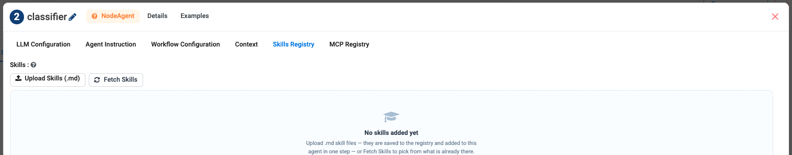
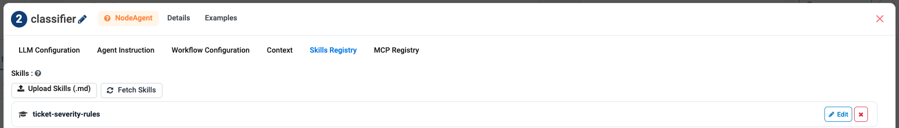
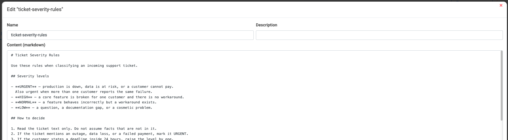
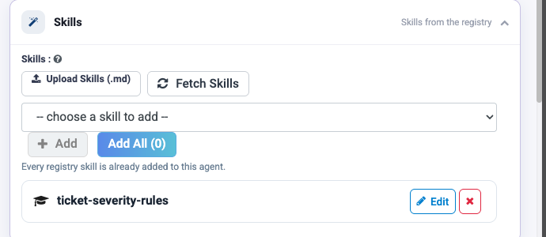
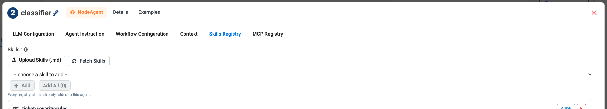

Skills
======

A skill is a Markdown file of reusable instructions, stored in a registry and
attached to any agent that needs it. Skills exist so that a rule your
organisation cares about is written **once** and used everywhere, instead of
being copy-pasted into forty Instructions boxes and drifting apart.

What belongs in a skill
-----------------------

.. list-table::
   :header-rows: 1
   :widths: 50 50

   * - Good skill
     - Belongs in Instructions instead
   * - How dates must be calculated
     - What this particular agent is for
   * - The house writing style for customer replies
     - This agent's specific output format
   * - How to read a statement document
     - This agent's single task
   * - Which rounding convention finance uses
     - This agent's tools

The test: **would a second agent need this same rule?** If yes, it is a skill. If
it is only true of one agent, it belongs in that agent's Instructions.

Skills are scoped to a project
------------------------------

.. important::

   The skill registry belongs to the **project**, not the workspace. Skills
   uploaded in one project are available to every agent **in that project**,
   and are not visible from any other project.

That has three practical consequences:

.. list-table::
   :header-rows: 1
   :widths: 34 66

   * - What you do
     - What happens
   * - Upload a ``.md`` skill
     - It is saved to **this project's** registry and can be attached to any
       agent here.
   * - Click **Fetch Skills**
     - You see only the skills in **this project**. An empty list means none
       have been uploaded here yet — not that none exist anywhere.
   * - Need the same rule in another project
     - Upload the file there as well. There is no cross-project registry.

.. caution::

   Because each project holds its own copy, the same skill can drift apart
   across projects. Keep the canonical ``.md`` file somewhere you control —
   a Git repository is ideal — and re-upload from there when it changes,
   rather than editing copies project by project.

.. tip::

   Deciding where a rule belongs:

   * True for **one agent** → that agent's Instructions.
   * True for **several agents in this project** → a **skill**.
   * True for **everything in the workspace** → :doc:`AGENTS.md
     </agentic-ai-guide/context-agents-md>` referenced by ``path``, which is
     read from the file system and so is not limited to one project.

Adding skills to an agent
-------------------------

Skills work the same way wherever you are building: the **Skills** group in
Agent Studio, and the **Skills Registry** tab on an Agent Node. Both have the
same two buttons.

.. list-table::
   :header-rows: 1
   :widths: 30 70

   * - Button
     - What it does
   * - **Upload Skills (.md)**
     - Uploads a Markdown file. It is saved to the project registry **and**
       attached to this agent in one step.
   * - **Fetch Skills**
     - Picks from the skills already in the project registry.

Upload a new skill
~~~~~~~~~~~~~~~~~~

#. Click **Upload Skills (.md)** and choose one short Markdown file.
#. The file appears in the list, attached to this agent.

Click **Edit** to see exactly what the agent will read, give it a description,
and click **Save to Registry** so other agents in the project can use it too.

.. tip::

   The **Name** is what you will pick from later, so make it say what the skill
   decides — ``ticket-severity-rules`` rather than ``rules-v2``.

Fetch a skill that already exists
~~~~~~~~~~~~~~~~~~~~~~~~~~~~~~~~~

#. Click **Fetch Skills**.
#. Choose an item from **-- choose a skill to add --** and click **Add**, or
   click **Add All** to take everything in the registry.

Fetching reuses the registry item — it does not make a second copy, so editing
the skill once updates it for every agent that uses it.

When the picker says **Every registry skill is already added to this agent**,
there is nothing left to fetch. If it says the registry is empty, upload the
first ``.md`` file — and remember the registry belongs to *this* project.

Writing a skill file
--------------------

A skill is plain Markdown. Keep it short, imperative, and about one topic.

.. code-block:: markdown

   # Calculation rules

   - Never calculate a value yourself if a tool can calculate it.
   - Use the `calculate` tool for all arithmetic, including dates.
   - For day counts, use the day-number formula, not month arithmetic.
   - Round only at the final step, to 2 decimal places.
   - If a required input is missing, say so. Do not assume a default.

What makes a skill work:

* **One topic per file.** "Calculation rules" and "Document reading rules" are
  two skills, not one.
* **Imperative sentences.** "Use the calculate tool" beats "the calculate tool is
  available."
* **State the failure behaviour.** Say what to do when something is missing.
* **No agent-specific detail.** The moment a skill mentions one agent's tool
  names, it stops being reusable.

.. tip::

   Skills work best when they are rules the model would otherwise get subtly
   wrong — rounding, date handling, tone, when to refuse. General advice the
   model already follows adds tokens without changing behaviour.

Skills, Context and Instructions
--------------------------------

Three places can carry instructions. They are not interchangeable.

.. list-table::
   :header-rows: 1
   :widths: 22 33 45

   * - Layer
     - Scope
     - Put here
   * - **Instructions**
     - This agent only
     - What this agent is and does
   * - **Skills**
     - Any agent **in the same project**
     - Reusable rules of practice
   * - **Context** (``AGENTS.md``)
     - Everything sharing the file
     - Standing organisational context

See :doc:`/agentic-ai-guide/context-agents-md` for the third.

Next: standing facts
--------------------

:doc:`/agentic-ai-guide/context-agents-md`.
