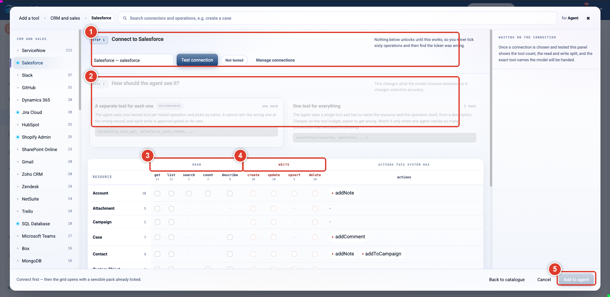
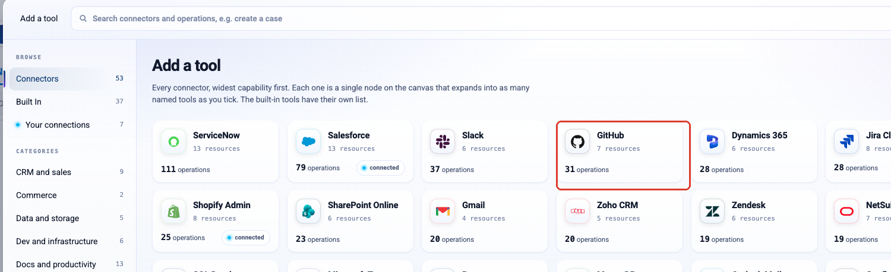
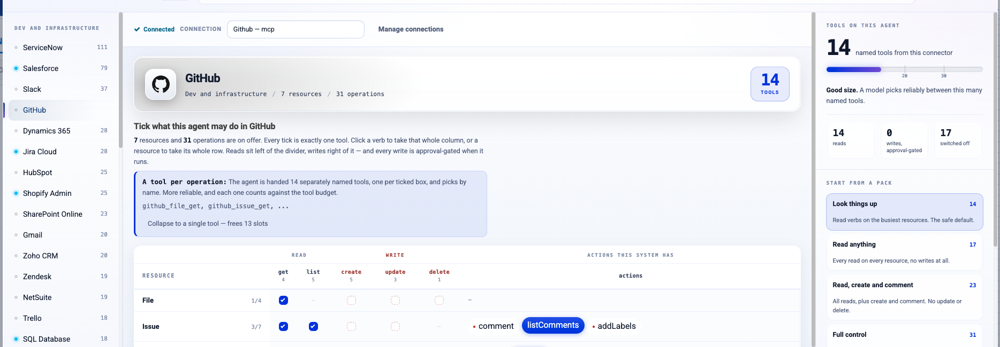
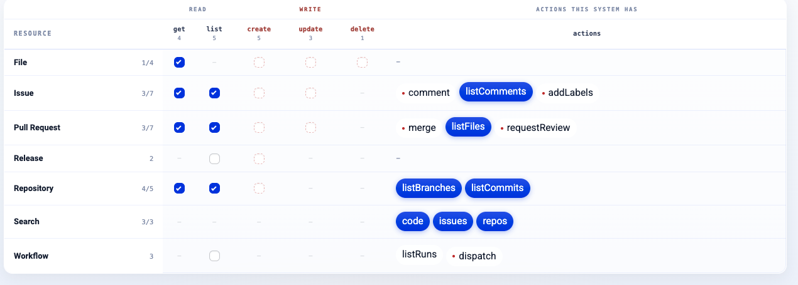
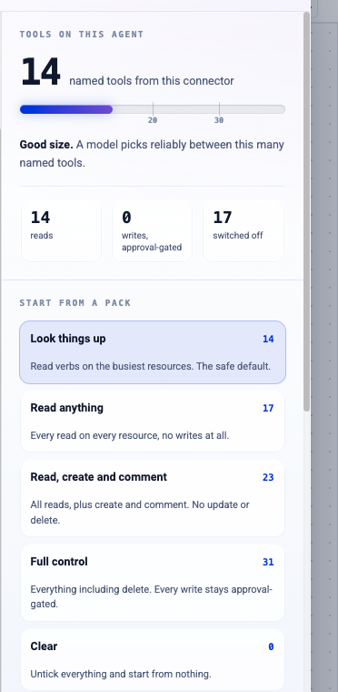
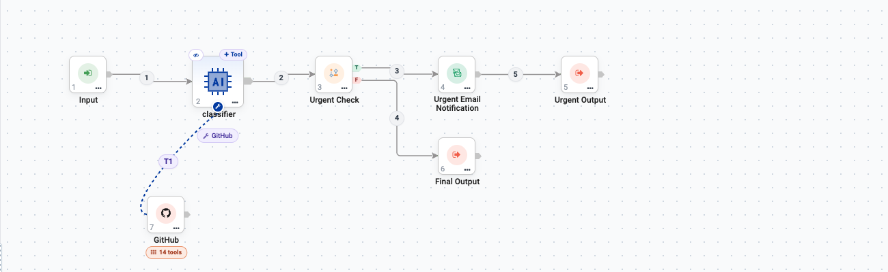
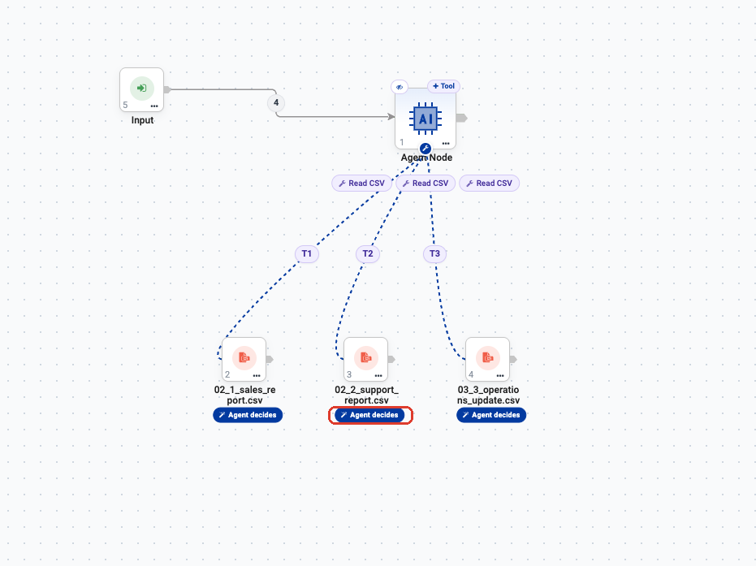
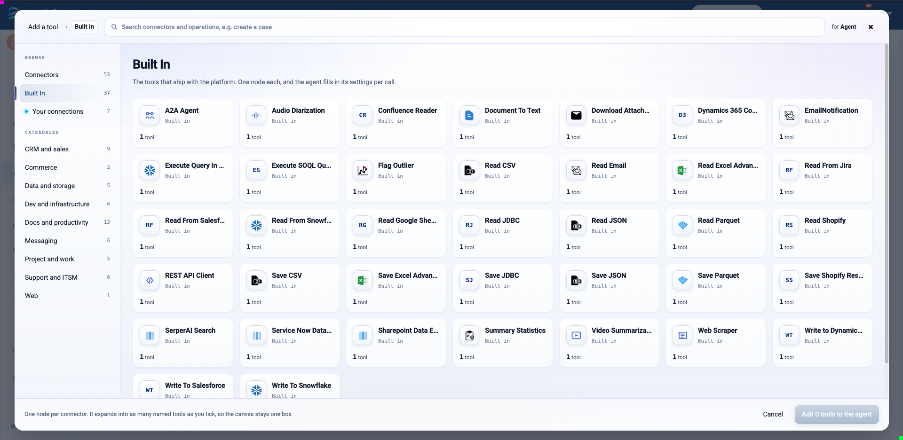

Tools & Connectors
==================

Tools are what separate an agent that talks from an agent that works. This page
covers the tool picker, the three places tools come from, and how to choose
operations without handing an agent more power than it needs.

.. contents:: On this page
   :local:
   :depth: 1

Where tools come from
---------------------

Click **Add tools** in the Tools group of Agent Studio — or on any Agent Node on
the canvas — and the picker opens with three sources in the left rail.

.. figure:: ../_assets/agentic-ai-guide/tools/picker.png
   :alt: The Add a tool picker with the three sources and the category list
   :width: 90%

.. list-table::
   :header-rows: 1
   :widths: 22 12 66

   * - Source
     - Count
     - What it is
   * - **Connectors**
     - 53
     - External systems — Salesforce, ServiceNow, Slack, Jira, GitHub and more.
       Each one is a single node that expands into named operations.
   * - **Built In**
     - 37
     - Tools that ship with the platform: read and write CSV/JSON/Parquet/JDBC,
       REST API Client, Web Scraper, document conversion, search.
   * - **Your connections**
     - varies
     - The connections already configured in your workspace, ready to use.

Below them, the **Categories** list filters the same catalogue by domain: CRM and
sales, Commerce, Data and storage, Dev and infrastructure, Docs and productivity,
Messaging, Project and work, Support and ITSM, Web.

Connectors
----------

Each connector tile shows three numbers that are worth reading before you click.

* **Resources** — the object types the connector exposes. ServiceNow has 13
  (incidents, changes, users, and so on).
* **Operations** — the individual calls available across those resources.
  ServiceNow has 111.
* **connected** — a green badge meaning a credential already exists for it. No
  badge means you can still add the tool, but it will not run until someone
  creates the connection. See :doc:`/agentic-ai-guide/connections`.

Adding a connector tool
~~~~~~~~~~~~~~~~~~~~~~~

Click a connector tile — or search for an operation directly, since the search
box matches operations as well as connector names, so typing ``create a case``
finds it wherever it lives.

The connector opens on a two-step screen.

**Step 1 — Connect.** Choose the connection holding the credentials, then click
**Test connection**. Nothing below unlocks until the test passes, which is
deliberate: it stops you ticking sixty operations and only then discovering the
token was wrong. **Manage connections** takes you to where credentials are
created — see :doc:`/agentic-ai-guide/connections`.

**Step 2 — How should the agent see it?** This decides the *shape* of what the
model is handed, and it matters more than it looks.

.. list-table::
   :header-rows: 1
   :widths: 28 72

   * - Option
     - What the agent sees
   * - **A separate tool for each one** *(recommended)*
     - One named tool per ticked operation. The agent picks by name, so it
       cannot aim the wrong operation at the wrong record, and each write is
       approval-gated on its own.
   * - **One tool for everything**
     - A single tool; the agent has to name the resource and the operation
       itself from a description. Cheaper on the tool budget, easier to get
       wrong. Worth it only when one agent carries so many operations that the
       count is climbing.

.. tip::

   Start with **a separate tool for each one**. Switch to the single-tool shape
   only if you actually hit a tool-count problem — the failure mode it
   introduces (the model naming the wrong resource or operation) is much harder
   to spot than a long tool list.

**Step 3 — Tick the operations.** The grid has one row per resource and groups
the columns by what they do:

.. list-table::
   :header-rows: 1
   :widths: 22 78

   * - Column group
     - Contains
   * - **READ**
     - ``get``, ``list``, ``search``, ``count``, ``describe``
   * - **WRITE**
     - ``create``, ``update``, ``upsert``, ``delete``
   * - **Actions this system has**
     - Operations peculiar to that system — ``addNote``, ``addComment``,
       ``addToCampaign`` for Salesforce.

Connecting opens the grid with a sensible pack already ticked. Review it rather
than accepting it: the default is a reasonable starting point, not a decision
about what your agent should be allowed to do.

Finally, click **Add to agent**. Everything you ticked from one connector
collapses into **one node** on the canvas — ticking twelve Salesforce operations
does not give you twelve boxes.

Worked example: giving an agent GitHub
--------------------------------------

Here is the whole thing end to end on one real connector.

**1. Find it.** Open **Add tools** and pick the **GitHub** tile — or type
``github`` in the search box. The tile tells you what you are getting before you
click: **7 resources**, **31 operations**.

**2. Connect and test.** Choose the connection that holds the GitHub credentials
and click **Test connection**. Nothing below unlocks until the tick turns green,
so a wrong token is caught here rather than at run time.

.. note::

   Some systems have no dedicated connection type yet. When that is the case the
   dropdown lists every connection in the project and tells you so — pick the one
   that actually holds that system's credentials.

**3. Tick what the agent may do.** One tick is exactly one tool. Reads sit left
of the divider, writes right of it, and each system's own actions — ``comment``,
``addLabels``, ``merge``, ``listBranches`` — sit on the right.

You do not have to tick them one by one. **Start from a pack** on the right
applies a sensible set in one click, and the counter above it tells you whether
the agent is still a size a model can choose from reliably.

.. list-table::
   :header-rows: 1
   :widths: 30 14 56

   * - Pack
     - Tools
     - What it allows
   * - **Look things up**
     - 14
     - Read verbs on the busiest resources. The safe default.
   * - **Read anything**
     - 17
     - Every read on every resource, no writes at all.
   * - **Read, create and comment**
     - 23
     - All reads, plus create and comment. No update or delete.
   * - **Full control**
     - 31
     - Everything including delete. Every write stays approval-gated.
   * - **Clear**
     - 0
     - Untick everything and start from nothing.

.. tip::

   Start at **Look things up** and add only what the agent turns out to need.
   It is far easier to grant one more operation later than to work out which of
   thirty-one caused a surprise.

**4. Add it.** Click **Add to agent**. All fourteen tools arrive as **one node**
on the canvas, joined to the Agent node by a dashed tool link — the badge shows
how many tools it carries.

Click that node at any time to change what the agent may do; the grid reopens
exactly as you left it.

Choosing operations: the rule that matters
------------------------------------------

.. important::

   **Tick the fewest operations that let the agent finish its job.**

   Every ticked operation is a real action on a real system. An agent that can
   only ``Get Incident`` cannot close the wrong ticket, no matter how confused it
   gets. An agent given all 111 ServiceNow operations can.

A practical way to decide:

.. list-table::
   :header-rows: 1
   :widths: 30 70

   * - Ask
     - Then
   * - Does the agent need to *read* this?
     - Tick the read operation.
   * - Does it need to *write*?
     - Tick it only if a person cannot reasonably do that step, and consider
       putting a :doc:`Human Approval </agentic-ai-guide/human-in-the-loop>` gate
       in front of it.
   * - Does it need *delete*?
     - Almost never. Leave it unticked.

How the agent knows what its tools are
--------------------------------------

This is the part that is easy to miss, and it explains most "why didn't it use
the tool?" problems.

The model never sees your canvas. At run time it is handed a **list of tool
names with a one-line description each**, and it picks by reading those
descriptions. Nothing else about the tool is visible to it.

   The shipped **Document Summarization Agent**. One Agent Node, three
   ``Read CSV`` tools — a sales report, a support report and an operations
   update — joined by the dashed tool edges ``T1``, ``T2`` and ``T3``.

Three tools of the *same type* is exactly the case that goes wrong. To the
model they are three entries called "Read CSV", and it has no way to tell which
is which unless the descriptions say so. So:

.. list-table::
   :header-rows: 1
   :widths: 46 54

   * - Write a description like
     - Not
   * - ``Reads the monthly sales report CSV``
     - ``Read CSV``
   * - ``Reads the support ticket export``
     - ``Reads a CSV file``
   * - ``Reads the weekly operations update``
     - ``CSV reader tool``

Then name the tools in the agent's Instructions so the intent is unambiguous:

.. code-block:: text

   You produce a weekly digest from three reports.
   Read all three before writing anything:
   - the sales report
   - the support report
   - the operations update
   Summarise each in two lines, then give one combined outlook.

.. tip::

   If an agent keeps picking the wrong tool, fix the **description** before you
   touch the prompt. The description is what the model is choosing from; the
   prompt only nudges it.

Who fills in each argument
--------------------------

When you add a tool, Sparkflows asks one question — and it is worth
understanding, because it is the difference between an agent that adapts and
an agent that cannot go off-script.

.. figure:: ../_assets/agentic-ai-guide/tools/agent-decides.png
   :alt: Prompt asking whether the agent decides the tool's settings or you fix them
   :width: 320px

.. list-table::
   :header-rows: 1
   :widths: 24 76

   * - Choice
     - What it means
   * - **Agent decides** *(recommended)*
     - The agent fills the settings in from each request, and can use the tool
       **more than once** — ask for three and it runs three times.
   * - **Fixed settings**
     - The agent gets exactly what you enter and cannot change it.

Either way the agent still chooses **whether** to use the tool; this only
decides who fills in its settings. You can change it later — the tool shows
both options as a toggle once it is attached.

.. figure:: ../_assets/agentic-ai-guide/quickstart/06-tool-added.png
   :alt: The Tools group with a tool attached and the Agent decides / Fixed toggle
   :width: 675px

   An attached tool. The toggle on the right switches between the two modes.

.. list-table::
   :header-rows: 1
   :widths: 45 55

   * - Use **Fixed settings** for
     - Use **Agent decides** for
   * - The repository, account or tenant to act on
     - The record being worked on
   * - A fixed label, queue, folder or reviewer
     - The text of a message or comment
   * - Anything that must never vary
     - Anything that depends on the request

.. important::

   Fixing a value is a real safety control. An agent that can only comment on
   **one** repository — because you fixed the owner and repo — cannot wander
   into another, however confused it gets. Combine that with ticking few
   operations and most of your risk is gone before you write a single
   guardrail.

Built-in tools
--------------

The built-in list is the platform's own toolbox — no external credential needed
beyond whatever the tool itself reads.

.. list-table::
   :header-rows: 1
   :widths: 25 75

   * - Group
     - Tools
   * - Reading data
     - Read CSV, Read JSON, Read Parquet, Read JDBC, Read Excel Advanced, Read
       Google Sheets, Read Email
   * - Writing data
     - Save CSV, Save JSON, Save Parquet, Save JDBC, Save Excel Advanced
   * - System-specific
     - Read From Jira, Read From Salesforce, Read From Snowflake, Read Shopify,
       Write To Salesforce, Write to Dynamics, Service Now Data, Sharepoint Data,
       Confluence Reader
   * - Web and search
     - REST API Client, Web Scraper, SerperAI Search
   * - Documents and media
     - Document To Text, Download Attachments, Audio Diarization, Video
       Summarization
   * - Analysis
     - Summary Statistics, Flag Outlier, Execute Query, Execute SOQL Query
   * - Agents
     - A2A Agent, EmailNotification

``REST API Client`` is the general-purpose escape hatch: if a system has an HTTP
API and no connector, the agent can still call it.

Workflows as tools
------------------

The **Workflows** section inside the Tools group lets an agent run a saved
workflow. This is the right move whenever the logic is easier to draw as a
pipeline than to describe in a prompt — joins, aggregations, model scoring,
multi-step transformations.

It has its own page: :doc:`/agentic-ai-guide/workflows-as-tools`.

MCP tools
---------

Tools can also come from a Model Context Protocol server, configured in the **MCP
Servers** group. See :doc:`/agentic-ai-guide/mcp-servers`.

Making tools reliable
---------------------

Three failure modes account for most tool problems.

**The agent does not call the tool.**
   Usually the instructions never told it to. Add an explicit line: *"Always
   fetch the record before answering. Never answer from memory."*

**The agent calls it with missing arguments.**
   Name the required arguments in the instructions, and add a retry rule:
   *"If a tool call fails because an argument is missing, call it again with all
   required arguments."*

**The agent calls the wrong tool.**
   Two ticked operations sound alike. Untick the one it should not use — the
   cheapest fix available.

.. tip::

   Test each tool on its own before wiring several together. Give the agent one
   tool, run it, confirm the call happens and the result comes back. Add the next
   one only then. Debugging one new tool at a time is far quicker than debugging
   six at once.

Next: credentials for tools
---------------------------

Tools need credentials. :doc:`/agentic-ai-guide/connections` covers how those are
created and shared.
