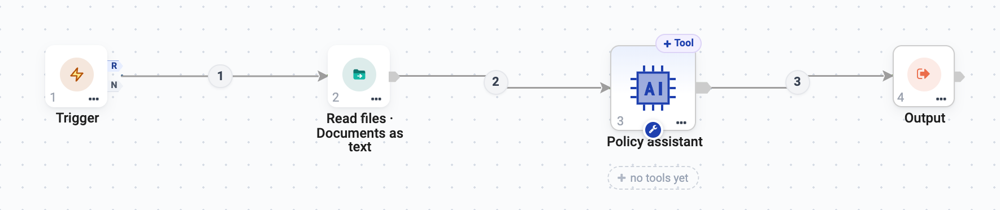
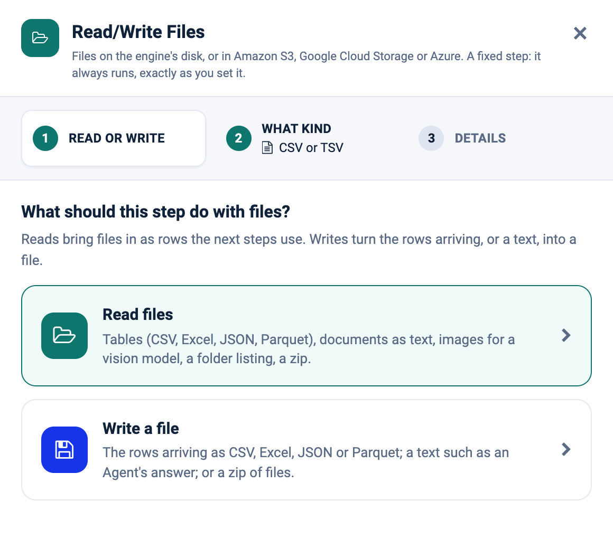
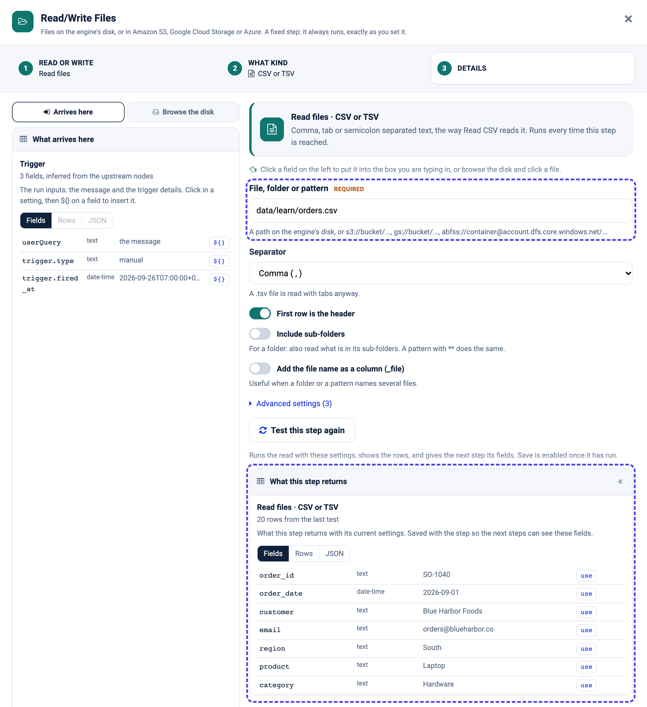
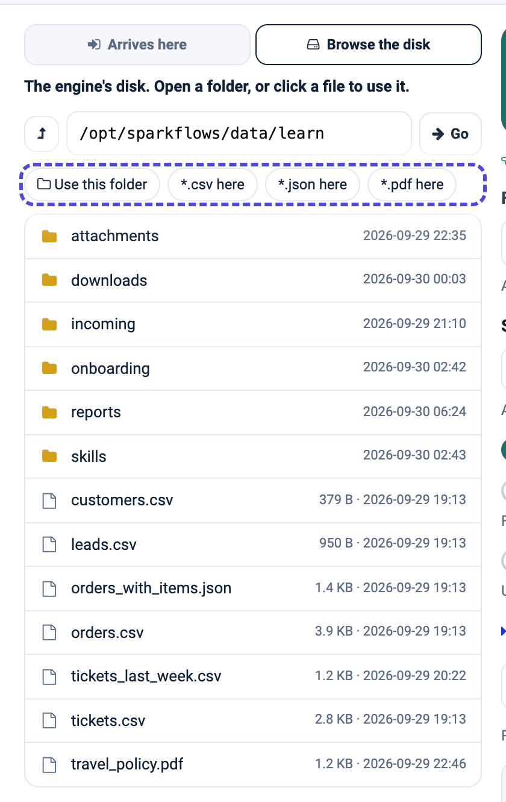
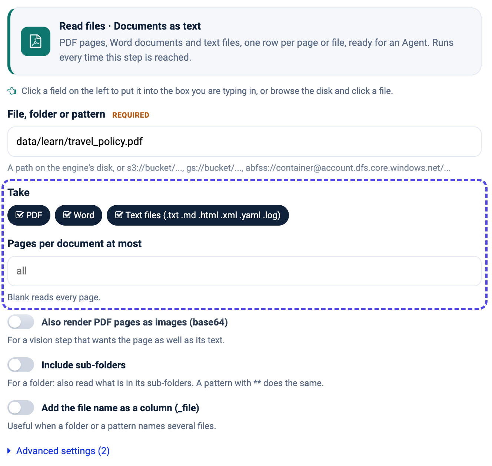
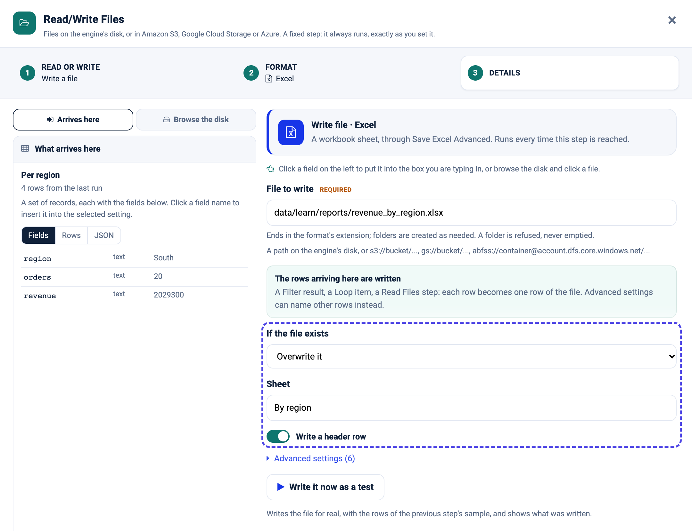

Read/Write Files
================

The **Read/Write Files** step reads files into records, or writes records into a
file - CSV, Excel, JSON, Parquet, PDFs and Word documents, images, zip archives.
Files can be on the machine the engine runs on, or in Amazon S3, Google Cloud
Storage or Azure. Like an App Action, it is a fixed step: it always runs,
exactly as you set it.

   Read a travel policy PDF as text, then let an Agent Node answer questions from it.

.. contents:: On this page
   :local:
   :depth: 1

Three steps
-----------

Drop **Read/Write Files** onto the canvas (it is under **Commonly used**). The
drawer asks three things.

**1. Read or write.**

**2. What kind.** Each kind is read or written by the workflow node that already
knows it, with its options.

.. list-table::
   :widths: 50 50

   * - .. figure:: ../../_assets/agentic-ai-guide/files/read-kinds.png
          :alt: The kinds a read offers - Tables, CSV or TSV, Excel, JSON, Parquet, Documents as text, Images for a vision model, Folder listing, Zip archive, Anything by file type
          :width: 100%

          Reading

     - .. figure:: ../../_assets/agentic-ai-guide/files/write-formats.png
          :alt: The formats a write offers - CSV, TSV, Excel, JSON, JSON Lines, Parquet, Text, Zip archive
          :width: 100%

          Writing

.. list-table::
   :header-rows: 1
   :widths: 30 70

   * - Read kind
     - Gives you
   * - **Tables**
     - CSV, TSV, Excel, JSON and Parquet, each by its extension, as one set of
       rows.
   * - **CSV or TSV**, **Excel**, **JSON**, **Parquet**
     - One format, with all its options - separator, header, sheets, cell range,
       password, JSON layout.
   * - **Documents as text**
     - PDF pages, Word documents and text files, one row per page or file,
       ready for an Agent Node.
   * - **Images for a vision model**
     - Pictures as base64, and PDF pages rendered as images.
   * - **Folder listing**
     - One row per file: path, name, extension, size, modified time.
   * - **Zip archive**
     - Extracts a zip and lists what came out, ready for a second step.
   * - **Anything by file type**
     - Tables as rows, documents as text and images as base64, all together.

**3. Details.** The path and the kind's own settings.

Reading
-------

**File, folder or pattern** takes a single file (``data/learn/orders.csv``), a
folder (``data/incoming/``) or a pattern (``data/incoming/*.csv``,
``data/**/*.pdf``). Then press **Test this step**: it reads the file and shows
what the step returns, which is what tells the next steps their fields. Save is
enabled once the test has run.

**Add the file name as a column (_file)** is worth switching on when a folder or
a pattern names several files - each row then says which file it came from.

Don't know the path? Open **Browse the disk** on the left. Click a folder to open
it, a file to use it, or one of the chips - **Use this folder**, ``*.csv here``
- to fill the path for you.

Documents for an agent
~~~~~~~~~~~~~~~~~~~~~~

**Documents as text** turns PDFs, Word files and text files into rows of text
an Agent Node can read. Choose which types to **Take**, cap the **Pages per
document**, and switch on **Also render PDF pages as images** for a step that
should see the page as well as read it.

Writing
-------

Give **File to write** a path that ends in the format's extension
(``data/learn/reports/revenue_by_region.xlsx``); missing folders are created.
With nothing else set, the rows arriving here are written - a Filter result, a
Summarize, a Loop's collected rounds.

**If the file exists** chooses between overwriting, appending and - for Excel -
replacing only this sheet. **Write it now as a test** writes the file for real
with the previous step's sample rows, so you can open it and check.

Every write hands on one record - ``status``, ``path``, ``format``, ``rows`` and
``bytes`` - so a later step can attach or upload the file with ``${4.path}``.

.. note::

   A write always names one file. A folder is refused as the target, so an
   overwrite can never empty a folder.

Files in the cloud
------------------

Every kind, read and write, also takes ``s3://bucket/...``, ``gs://bucket/...``
and ``abfss://container@account.dfs.core.windows.net/...`` paths, and **Browse
the disk** lists buckets one folder at a time. Under **Advanced settings**
choose where the cloud credentials come from: Sparkflows' cloud configuration
(the default), one of the project's storage connections, or the engine host's
own credentials.

Start when a file arrives
-------------------------

A Trigger can watch a folder and start the agent for every new file - see
:doc:`/agentic-ai-guide/triggers-automation/triggers`. Follow it with a Loop Over Items and a Read
step whose path is the current file's - ``${2.path}`` when the loop is step 2 -
to process each file as it arrives. With one file per check, ``${event.path}``
works straight after the Trigger.
