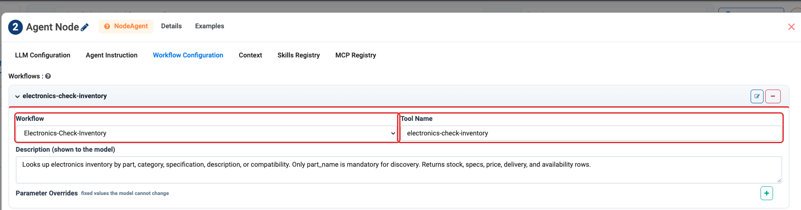

Using Workflows as Agent Tools
==============================

A workflow is a visual data pipeline — read, join, filter, aggregate, score,
write. Any workflow you have already built can be handed to an agent as a tool it
can call.

This is one of the most useful things in the product, because it lets you put
each kind of logic where it belongs:

.. list-table::
   :header-rows: 1
   :widths: 50 50

   * - Put it in a **workflow** when
     - Put it in the **prompt** when
   * - The logic is exact and repeatable
     - The task needs judgement or language
   * - It involves joins, aggregations or scoring
     - It involves summarising, drafting or classifying
   * - It must produce the same answer every time
     - Some variation is acceptable
   * - You already built it
     - It is genuinely new

An agent that calculates totals by calling a workflow will get the same total
every time. An agent asked to add the numbers itself will not.

.. contents:: On this page
   :local:
   :depth: 1

Step 1: Build the workflow
--------------------------

#. In the project sidebar, click **Workflows**.
#. Create the workflow and test it on its own until it is correct.

   .. figure:: ../_assets/agentic-ai-guide/workflows-as-tools/workflow-canvas.png
      :alt: The Electronics-Check-Inventory workflow: a CSV read, a SQL step and Print N Rows
      :width: 85%

      The shipped **Electronics-Check-Inventory** workflow — read the parts
      CSV, filter it with SQL, return the rows. Three nodes, exact and
      repeatable. This is the workflow the *Parts Finder* agent calls as a
      tool.

#. Note the **parameters** it expects. These become the arguments the agent has
   to supply, so give them names an agent can guess correctly — ``customer_id``
   and ``month``, not ``p1`` and ``p2``.

.. important::

   Test the workflow by itself first. If it is wrong, an agent calling it will be
   wrong in a way that is much harder to diagnose, because you will be reading
   the agent's reasoning instead of the pipeline's output.

Step 2: Attach it to the agent
------------------------------

In Agent Studio
~~~~~~~~~~~~~~~

#. Open the **Tools** group.
#. Expand **Workflows** — *"Let this agent run a saved workflow."*
#. Select the workflow.
#. Map its parameters.

On the orchestration canvas
~~~~~~~~~~~~~~~~~~~~~~~~~~~

You have two options:

* **Agent Node → Tasks tab.** Choose the workflow and supply its parameter names
  and values. The agent decides when to call it.
* **Workflow Execution node** (Integrations group). The workflow runs at a fixed
  point in the flow, whatever the agent thinks.

.. list-table::
   :header-rows: 1
   :widths: 30 70

   * - Choose
     - When
   * - Agent Node → **Tasks**
     - The agent should decide *whether* the workflow is needed.
   * - **Workflow Execution** node
     - The workflow must run every time, in a known position.

.. important::

   The **Workflow Execution** node runs the workflow **without involving an
   LLM**. If a step's only job is to call one workflow once and surface its
   result, use this node — wrapping that in an Agent Node spends a model call
   to do nothing.

   It also takes **Timeout** and **Retry attempts**, which an Agent Node
   calling the same workflow does not give you.

What the node publishes
~~~~~~~~~~~~~~~~~~~~~~~

The workflow's **first output row** is published in two forms:

.. list-table::
   :header-rows: 1
   :widths: 20 80

   * - Name
     - Shape
   * - ``analysis``
     - The row as ``key=value`` lines.
   * - ``fields``
     - The row as a dictionary.

This is the same contract an Agent Node publishes, which is why a downstream
:doc:`Condition </agentic-ai-guide/control-flow>` reads them identically:

.. code-block:: python

   fields['status'] == 'approved'
   'OVERDUE' in analysis

So a workflow can drive a branch directly, with no agent in between — the
cheapest and most predictable way to route on a computed value.

.. caution::

   Only the **first output row** is published. If your workflow returns many
   rows and the branch depends on an aggregate, aggregate inside the workflow
   so the answer arrives in row one.

Step 3: Tell the agent when to use it
-------------------------------------

Attaching a workflow is not enough. The agent needs to know what it is for, in
the Instructions:

.. code-block:: text

   To calculate a customer's outstanding balance, always call the
   Balance Calculation workflow with customer_id and month. Never
   calculate a balance yourself, even if the numbers appear in the
   context you already have.

That last sentence matters more than it looks. Models are willing to do
arithmetic themselves when they can see the numbers, and they will quietly do it
wrong. Saying *never calculate it yourself* is what actually routes the work to
the workflow.

Passing parameters reliably
---------------------------

Agents give up on a tool when a call fails with missing arguments. Two lines in
the instructions prevent most of that:

.. code-block:: text

   When calling a workflow, always supply every required parameter.
   If a call fails because a parameter is missing, call it again with
   all parameters filled in.

Returning results the agent can use
-----------------------------------

A workflow that returns a wide table of raw rows is hard for an agent to use and
expensive to feed through a model. Prefer:

* **One row per answer** where possible.
* **Named columns**, not positional ones.
* **Aggregated results** rather than everything the agent might conceivably want.

If a workflow can return either one page or a whole document, prefer one call
that returns exactly what was asked for over many calls that each return a
fragment.

When not to use a workflow
--------------------------

* **For a single REST call** — use the ``REST API Client`` built-in tool.
* **For reading one table** — use ``Read JDBC``.
* **For something the connector already does** — check the 53 connectors first;
  ServiceNow alone exposes 111 operations.

Next: control the flow
----------------------

:doc:`/agentic-ai-guide/mcp-servers` covers the other way to extend what an agent
can do.
