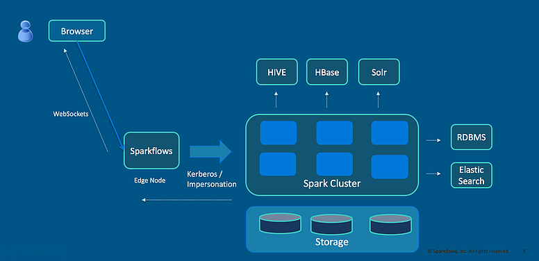
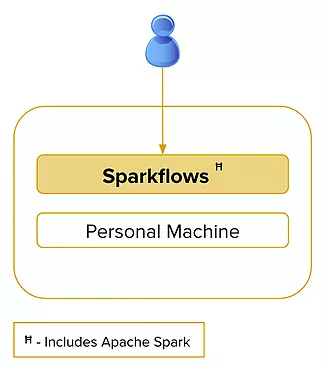

Fire Deployment Options
=======================

Sparkflows Fire can easily be deployed:

* On a Hadoop/Spark Cluster or
* On a standalone machine

Deployment on a Hadoop/Spark Cluster
-------------------------------------

The clusters could be based on the Apache Hadoop distribution from Cloudera, Hortonworks, MapR or any other Hadoop Cluster distributors.

The cluster can be on-premise or on the cloud.

Deployment on a Standalone Machine
----------------------------------

In this mode, Fire is installed on a mac/windows/linux machine. All the executions happen on that machine, in the web server.

This mode can be used for:

* Designing Workflows to be finally deployed on a larger Apache Spark Cluster
* For analysing smaller sets of data

   
