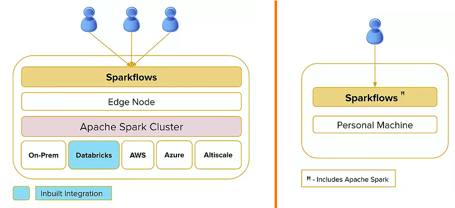

Fire Deployment Options
-----------------------

Sparkflows Fire can easily be deployed on a personal machine or your company's on-premise or cloud based Hadoop clusters including Apache Spark. The clusters could be based on the Apache Hadoop distribution from Cloudera, Hortonworks, MapR or any other Hadoop Cluster distributors, Sparkflows can also be installed on a Databricks cluster.

