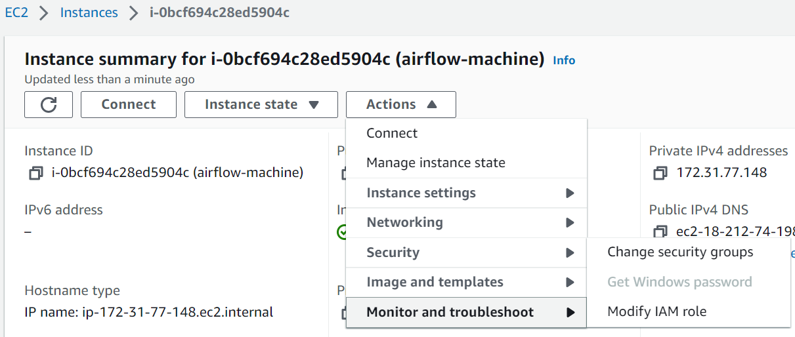

AWS S3 Configurations
==================

Fire Insights is integrated with S3 which is running on ec2 instance.

Following steps are required to create a role for S3 bucket access and attach the role to ec2 instance on which Fire is running.

1. Create a Role:

Login to AWS Console which has sufficient privilege to create a role with name ''assume-role-bucket1''.

2. Create Inline Policy:

"Create an ''inline policy'' which has access to S3 policy which in turn has access to the different buckets e.g. ''assume-role-bucket1'' & ''assume-role-bucket2'' and then attach it to the role."

::

    {
    "Version": "2012-10-17",
    "Statement": [
        {
            "Action": [
                "s3:GetBucketLocation",
                "s3:ListAllMyBuckets"
            ],
            "Resource": "*",
            "Effect": "Allow"
        },
        {
            "Action": [
                "s3:List*",
                "s3:GetObject*",
                "s3:PutObject*",
                "s3:GetBucketAcl"
            ],
            "Resource": [
                "arn:aws:s3:::assume-role-bucket1",
                "arn:aws:s3:::assume-role-bucket1/*",
                "arn:aws:s3:::assume-role-bucket2",
                "arn:aws:s3:::assume-role-bucket2/*"
            ],
            "Effect": "Allow"
        },
        {
            "Action": [
                "s3:CreateBucket",
                "s3:DeleteBucket",
                "s3:DeleteBucketPolicy",
                "s3:DeleteBucketWebsite",
                "s3:PutAccelerateConfiguration",
                "s3:PutBucketAcl",
                "s3:PutBucketCORS",
                "s3:PutBucketLogging",
                "s3:PutBucketPolicy",
                "s3:PutBucketRequestPayment",
                "s3:PutBucketTagging",
                "s3:PutBucketVersioning",
                "s3:PutBucketWebsite",
                "s3:PutReplicationConfiguration"
            ],
            "Resource": "*",
            "Effect": "Deny"
        }
    ]
  }

3. Now, the policy ''assume_role_bucket1'' needs to be attached to the ec2 instance where Fire is running.

Inorder to attach above role to ec2 instance, you need to Login to AWS Console and Go to ``EC2 Dashboard`` and select the ec2 instnace where Fire is running and choose ``Security``, from ``Actions`` dropdown and Click on ``Modify IAM role``

