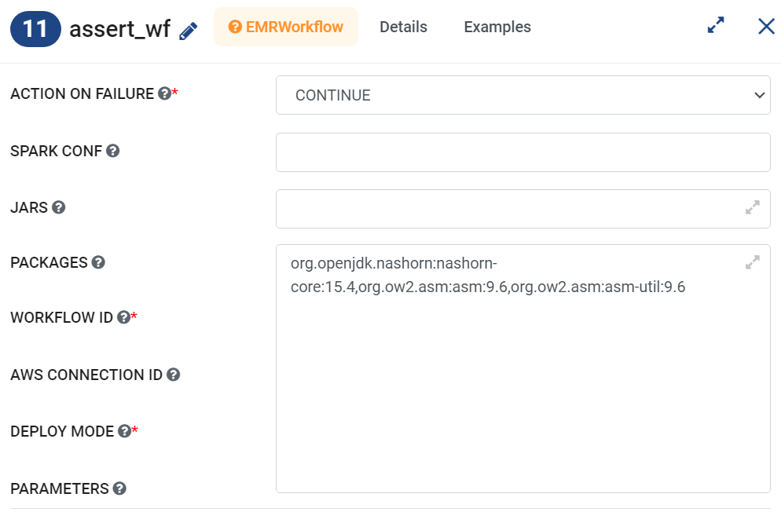

AWS EMR Spark Delta Version Compatibility
==========

To use Delta Lake with Apache Spark on AWS EMR, you need to configure your Spark session appropriately. Here's how you can set up Delta in Spark on EMR:

EMR Versions
-----------

The below page lists the version of Apache Spark used with various versions of AWS EMR:

`AWS EMR Spark Release History <https://docs.aws.amazon.com/emr/latest/ReleaseGuide/Spark-release-history.html>`_

It also lists the compatability matrix of Spark version and Delta lake version:

`Spark and Delta Lake Compatibility Matrix <https://docs.delta.io/latest/releases.html>`_

Delta Support
------------

For delta support, in Spark workflow/Pipeline include the below Compatible JARs in ``Livy connection`` or use ``bootstrap script`` to copy appropriate compatible Version :

 * For **emr-6.2.1** include the JAR with the exact version: **delta-core_2.12-0.8.0.jar**

 * For **emr-6.6.0** include the two JARs with the exact version: **delta-core_2.12-2.0.1.jar** and **delta-storage-2.0.1.jar**

 * For **emr-6.9.0** include the two JARs with the exact version: **delta-core_2.12-2.1.0.jar** and **delta-storage-2.1.0.jar**

 
For delta support, in the Pyspark workflow include the below in the EMR Bootstrap script:

	::

  		aws s3 cp s3://sparkflows-release/fire/delta/delta-core_2.12-2.1.0.jar /usr/lib/spark/jars/
                aws s3 cp s3://sparkflows-release/fire/delta/delta-storage-2.1.0.jar /usr/lib/spark/jars/
 
.. Note:: Make sure to copy Compatible delta version on EMR you want to use.

`EMR and Delta Lake Compatibility Matrix <https://docs.aws.amazon.com/emr/latest/ReleaseGuide/emr-delta.html>`_

Delta Support on EMR 6.9
----------

For Configuring delta on EMR 6.9, please follow below:

#. Copy the Compatible Delta JAR **delta-core_2.12-2.1.0.jar** and **delta-storage-2.1.0.jar**  which is Compatible to EMR 6.9: If you're using a bootstrap script to install the necessary Delta Lake JARs on your EMR cluster, ensure that you have the Delta JAR in the cluster and it's available for Spark jobs.

   ::

  		aws s3 cp s3://sparkflows-release/fire/delta/delta-core_2.12-2.1.0.jar /usr/lib/spark/jars/
                aws s3 cp s3://sparkflows-release/fire/delta/delta-storage-2.1.0.jar /usr/lib/spark/jars/

Delta Support on EMR 6.15
----------

EMR 6.15 by default comes with Delta support, so you can use default delta package by default available to AWS EMR in Sparkflows in Pipeline.

#. By updating the EMR configuration with CLASSIFICATION: delta-defaults and DELTA_PROPERTIES_KEY_VALUE: "delta.enabled" -> "true" in ``Create EMR JobFlow Node`` from ``Advanced`` tab.

   .. figure:: ../../_assets/aws/create_emr_delta.png
      :alt: delta
      :width: 60%

#. Pass Parameters for Delta Lake in Spark Conf: you need to pass the relevant parameters to the ``SPARK CONF`` in EMR workflow with Delta workflow as below

   ::

        spark.sql.extensions=io.delta.sql.DeltaSparkSessionExtension,spark.sql.catalog.spark_catalog=org.apache.spark.sql.delta.catalog.DeltaCatalog

   .. figure:: ../../_assets/aws/emr_spark_conf.png
      :alt: delta
      :width: 60%

Delta Support on EMR 7.4
----------

EMR 7.4 by default comes with Delta support, so you can use default delta package by default available to AWS EMR in Sparkflows in Pipeline.

#. By updating the EMR configuration with CLASSIFICATION: delta-defaults and DELTA_PROPERTIES_KEY_VALUE: "delta.enabled" -> "true" in ``Create EMR JobFlow Node`` from ``Advanced`` tab.

   .. figure:: ../../_assets/aws/create_emr_delta.png
      :alt: delta
      :width: 60%

#. Pass Parameters for Delta Lake in Spark Conf: you need to pass the relevant parameters to the ``SPARK CONF`` in EMR workflow with Delta workflow as below

   ::

        spark.sql.extensions=io.delta.sql.DeltaSparkSessionExtension,spark.sql.catalog.spark_catalog=org.apache.spark.sql.delta.catalog.DeltaCatalog

   .. figure:: ../../_assets/aws/emr_spark_conf.png
      :alt: delta
      :width: 60%

Assert Node Support on EMR 7.4
----------

EMR 7.4 by default comes with Java 17 for spark, so inorder to work this node on emr7.4, you need to pass below configuration in PACKAGE in emr workflow selected for assert Node.

::

    org.openjdk.nashorn:nashorn-core:15.4,org.ow2.asm:asm:9.6,org.ow2.asm:asm-util:9.6

