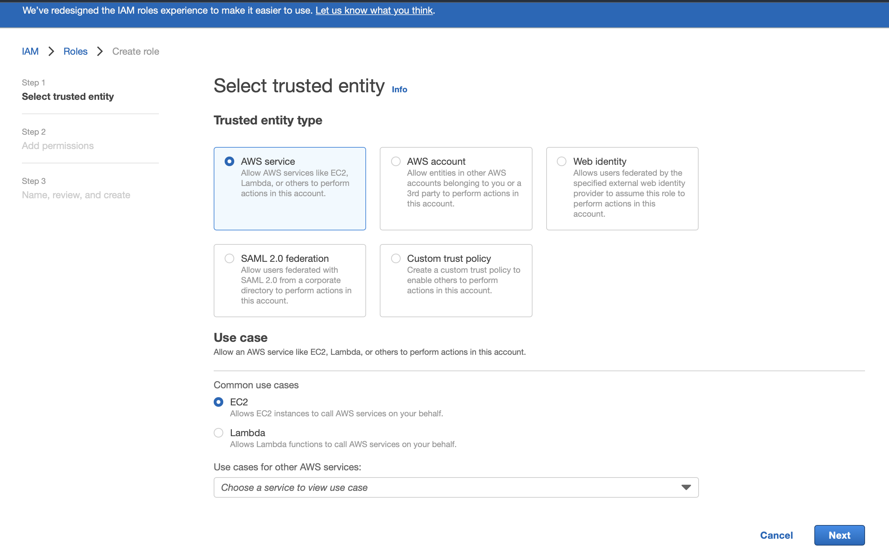
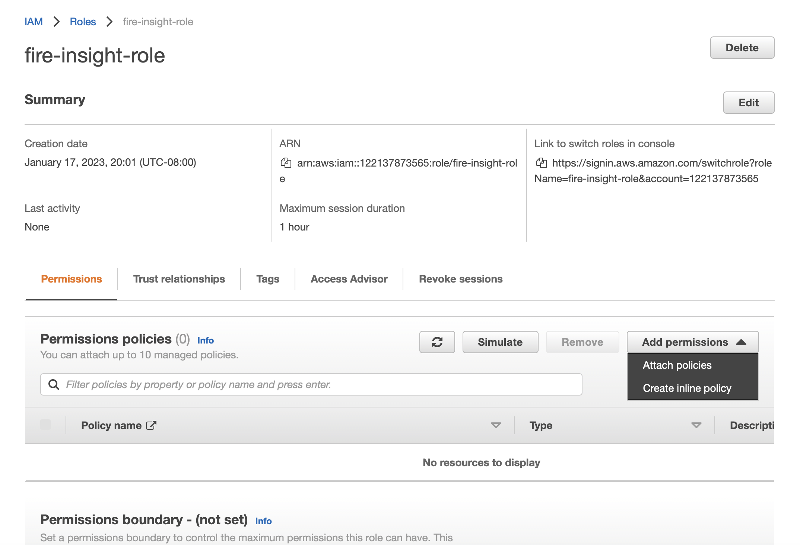
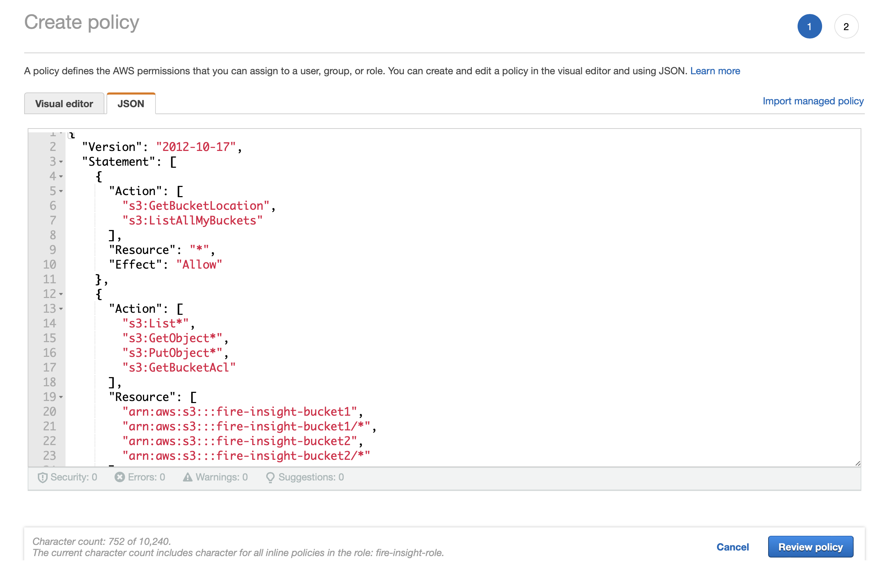
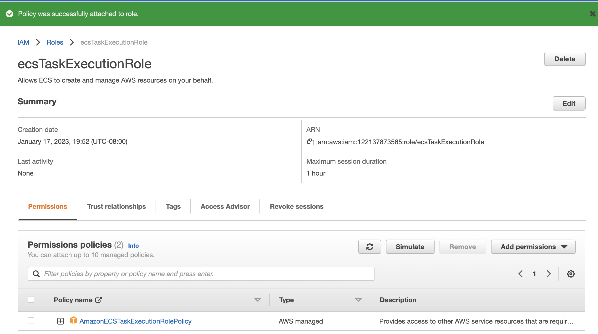
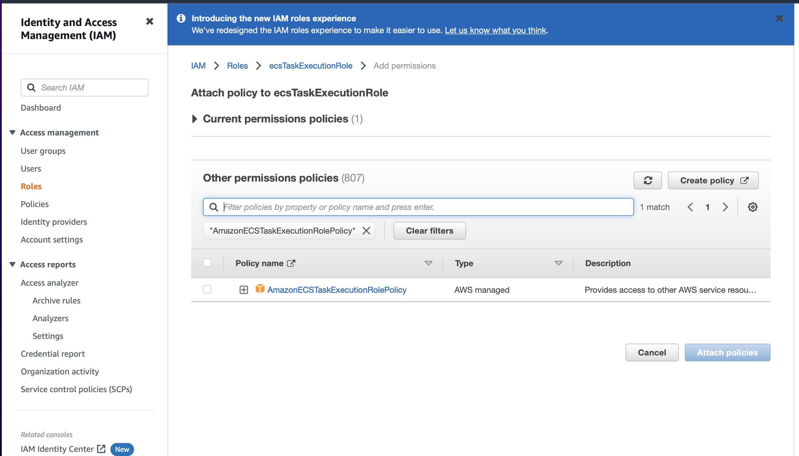

Assume Role Configurations
=======

With IAM roles, one can establish trust relationships between the trusting account and other AWS trusted accounts.
However, it is possible for another account to own a resource in this account. For example, the trusting account might allow the trusted account to create new resources, such as creating new objects in an Amazon S3 bucket. In that case, the account that creates the resource owns the resource and controls who can access that resource.

After the trust relationship is created, an IAM user or an application from the trusted account can use the AWS Security Token Service (AWS STS) *AssumeRole* API operation. This operation provides temporary security credentials that enable access to AWS resources in your account from an AWS-hosted Service like Fire-Insight.

Following steps are required to create a role for S3 bucket access and assume the Role from Sparkflows.

Step 1 : Create IAM Role
---------------------

Create an IAM role named **fire-insight-role**.

Step 2 : Create Inline Policy
-----------------

Create an inline policy named **fire-insight-policy** which has access to S3 Policy which in turn has access to the different buckets e.g. 'fire-insight-bucket1' & 'fire-insight-bucket2' and then attach it to the role.

::

    {
    "Version": "2012-10-17",
    "Statement": [
        {
            "Action": [
                "s3:GetBucketLocation",
                "s3:ListAllMyBuckets"
            ],
            "Resource": "*",
            "Effect": "Allow"
        },
        {
            "Action": [
                "s3:List*",
                "s3:GetObject*",
                "s3:PutObject*",
                "s3:GetBucketAcl"
            ],
            "Resource": [
                "arn:aws:s3:::fire-insight-bucket1",
                "arn:aws:s3:::fire-insight-bucket1/*",
                "arn:aws:s3:::fire-insight-bucket2",
                "arn:aws:s3:::fire-insight-bucket2/*"
            ],
            "Effect": "Allow"
        },
        {
            "Action": [
                "s3:CreateBucket",
                "s3:DeleteBucket",
                "s3:DeleteBucketPolicy",
                "s3:DeleteBucketWebsite",
                "s3:PutAccelerateConfiguration",
                "s3:PutBucketAcl",
                "s3:PutBucketCORS",
                "s3:PutBucketLogging",
                "s3:PutBucketPolicy",
                "s3:PutBucketRequestPayment",
                "s3:PutBucketTagging",
                "s3:PutBucketVersioning",
                "s3:PutBucketWebsite",
                "s3:PutReplicationConfiguration"
            ],
            "Resource": "*",
            "Effect": "Deny"
        }
    ]
  }

**Summary of Policy**:

- Allow Listing and Viewing Bucket Information

  - The first statement allows the user to list all S3 buckets in the account and retrieve the location (region) of any bucket.

- Allow Access to Specific Buckets (Read/Write)

  - The second statement grants the user permissions to list objects, download objects, upload objects, and view the ACLs for two specific buckets: fire-insight-bucket1 and fire-insight-bucket2. These permissions apply both to the bucket itself and all objects within these buckets.

- Deny Management of Buckets

  - The third statement denies the user the ability to perform any bucket management actions (e.g., create, delete, or modify bucket settings) for any bucket. This effectively prevents the user from making changes to the bucket's configuration or structure.

To create an inline IAM policy that grants the necessary permissions to list the contents of an S3 bucket, refresh schema and read sample data from S3, you can structure the policy as follows:

::

    {
    "Version": "2012-10-17",
    "Statement": [
        {
            "Effect": "Allow",
            "Action": "s3:ListAllMyBuckets",
            "Resource": "arn:aws:s3:::*"
        },
        {
            "Effect": "Allow",
            "Action": [
                "s3:ListBucket",
                "s3:GetObject*",
                "s3:GetBucketAcl"
            ],
            "Resource": [
                "arn:aws:s3:::fire-insight-bucket1",
                "arn:aws:s3:::fire-insight-bucket1/*"
            ]
        }
      ]
    }

.. note:: Above inline policy list objects, refresh schema from S3 and Read sample data from s3

**Summary of Policy**:

- List All Buckets

  - The user can list all S3 buckets in the account with the s3:ListAllMyBuckets action.

- Access to fire-insight-bucket1

  The user has the following permissions specifically for fire-insight-bucket1:
   - List objects in the bucket (s3:ListBucket).
   - Refresh schema and Read sample data from the bucket (s3:GetObject*).
   - View the bucket's ACL (s3:GetBucketAcl).

Step 3 : Create Task Execution Role
-------------------
Ensure that the Role is attached with a policy to access ECS resources. You can use IAM roles to delegate access to your AWS resources. For more details read `AWS Documentation. <https://docs.aws.amazon.com/AmazonECS/latest/developerguide/task_execution_IAM_role.html#create-task-execution-role>`_

`Login <https://us-east-1.console.aws.amazon.com/iamv2/home#/policies>`_ to AWS Console which has sufficient privilege to create a role with name **fire-insight-role**. 

Step 4 : Attach Policy to ECS Task Execution Role
------------------------------
Attach the necessary policy to the 'ecsTaskExecutionRole' to grant it the required permissions for accessing ECS resources.

   
Step 5 : Assign ECS Trust Relationship to 'fire-insight-role'
------------------------------
We need to allow the AWS Resources role (ecsTaskExecutionRole) to assume the policy in the “fire-insight-role” role:

::

  {
   "Version": "2012-10-17",
   "Statement": [
    {
      "Effect": "Allow",
      "Principal": {
        "AWS": [
          "arn:aws:iam::<ACCOUNT_NO>:role/ecsTaskExecutionRole"
        ]
      },
      "Action": "sts:AssumeRole"
      }
    ]
  }

Step 6 : Attach 'fire-insight-policy' to 'EMR_EC2_DefaultRole'
--------------------
Now, the policy 'fire-insight-policy' needs to be attached to the 'EMR_EC2_DefaultRole'' role'. It can be added for EMR resources, so that it gets access to the above role while submitting the job on EMR Cluster or EMR Livy.

.. note:: Make sure to change ARN value to an exact value.

.. note:: After any changes to the AWS AssumeRole policy, users must log out and log back in to obtain an updated token with the new permissions.

