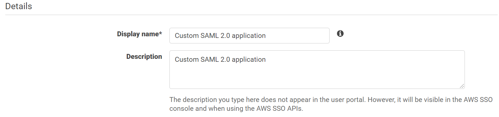
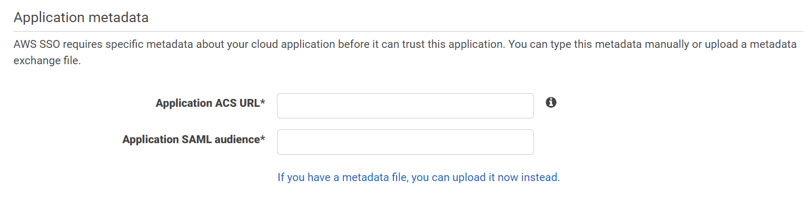

Application
=======

Now both AWS SSO/Okta Configured successfully.

you can Configure single sign-on (SSO) access to Fire Insights applications as it support identity federation with SAML 2.0.

Below are steps involved in it:

1. Login to Aws Console.
2. Open AWS Single Sign-On service and click on Applications.

.. figure:: ../../../_assets/configuration/aws-sso/aws_sso_app.PNG
   :alt: aws sso
   :width: 60%

3. Add a custom SAML 2.0 application

Configure Custom SAML 2.0 application with some details:

Details:
::

    Display name : Custom SAML 2.0 application Name
    Description : Any Specific description

AWS SSO metadata:

cloud application may require the following certificate and metadata details to recognize AWS SSO as the identity provider.

.. figure:: ../../_assets/configuration/aws-sso/aws_metdata.PNG
   :alt: aws sso
   :width: 60%

Application metadata:

AWS SSO requires specific metadata about your cloud application before it can trust this application. You can type this metadata manually or upload a metadata exchange file.

::

    Application ACS URL : The Assertion Consumer Service (ACS) URL is used to identify where the service provider accepts SAML assertions.
    Application SAML audience: Application SAML url

