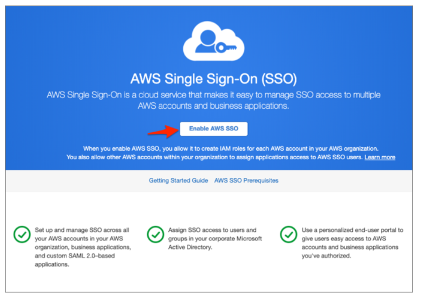
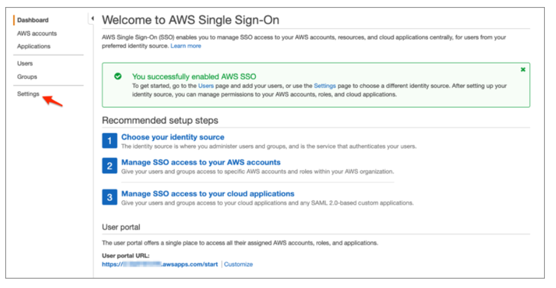
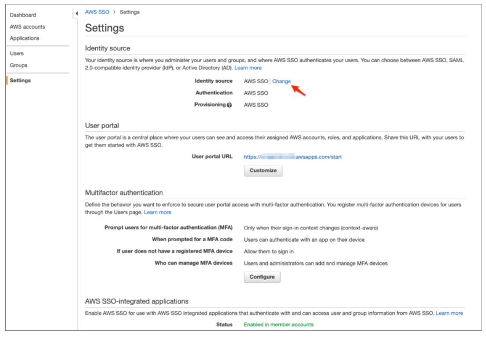
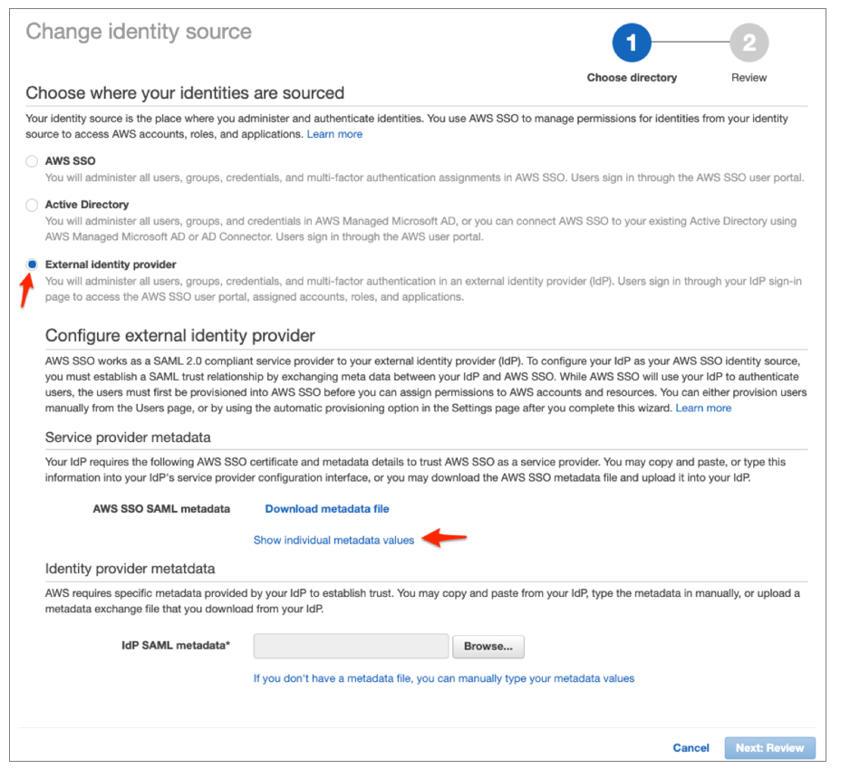
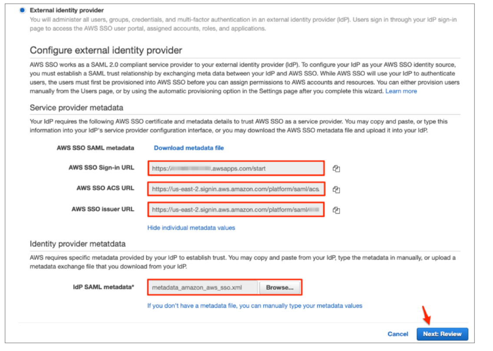

Configuration Steps
===========

Below are the configuration steps to configure AWS SSO:

1. Log in to the AWS Management Console.
2. Navigate to Security, Identity, & Compliance > AWS Single Sign-On.

.. figure:: ../../../_assets/configuration/aws-sso/service_aws.PNG
   :alt: aws sso
   :width: 60%
   
   
3. Click Enable AWS SSO:

4. Select Settings:

5. Under Identity source, select Change:

6. Follow the below steps to proceed further:
::

    Select External identity provider.
    Click Show individual metadata values.
    

::

    Make a copy of the AWS SSO Sign-in URL, AWS SSO ACS URL, and AWS SSO issuer URL values. These values will be used at a later stage.
    IdP SAML metadata: Save the following file as metadata.xml, then upload it into AWS.
    Click Next: Review.

7. Review the list of changes. Once you are ready to proceed, type CONFIRM and then click on Change identity source.    

.. figure:: ../../../_assets/configuration/aws-sso/aws_change_identity.PNG
   :alt: aws sso
   :width: 60%
