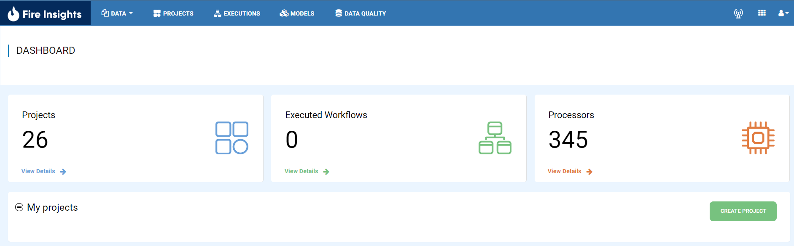

AWS SSO Configuration
====================

Fire Insights can be configured with AWS SSO. This document provides a step-by-step guide to configuring Fire Insights with AWS Single Sign-On (SSO). 

Below are the steps for it:

Step 1 : Enable SSO in Fire Insights
--------------------------
To initiate AWS SSO integration, set the configuration parameter for SSO in Fire Insights:
::

    sparkflows.sp.sso.enable=true 
    

Step 2.  Automatically Create Users
-----------------------
Create the user automatically in application if user doesn’t exist in Fire Insights. Otherwise app will throw the error on page complaining ‘User not found’. 

::

    sparkflows.sp.auto.user.create=true 

Step 3 : Disable Database Login for Superuser
---------------
Disable the database login for superuser. Otherwise a login will be allowed with superuser authentication.

::

    sparkflows.sp.db.login.enable=true

Step 4 : Enable/Disable Global Logout
-----------------------
Specify whether global logout is enabled or disabled.

::

    saml2.global.logout=true
    
Step 5 : Copy AWS SSO Configuration Info
----------------------------------
Copy the AWS SSO configuration information, including metadata URL, SP and IdP entity identifiers.
::

    #Metadata URL of identity provider.
    saml2.idp.metadata-url=./conf/fire_custom.xml

    #  Identifier of the SP entity  (must be a URI) Audience URI.
    saml2.sp.entityid=https://localhost:8443/saml/metadata

   # Identifier of the IdP entity  (must be a URI).
   saml2.idp.entityid=https://portal.sso.us-east-1.amazonaws.com/saml/assertion/xxxxxxxxxxxxxxxxxxx

Step 6 : Set Algorithm for Sign-in Process
-------------------------------
Algorithm that the toolkit will use in signing-in process.

::

    saml2.security.signature_algorithm=http://www.w3.org/2001/04/xmldsig-more#rsa-sha25    

Step 7 : Set Application Base URL
---------------------------
Define application base URL.

::

  saml.sso.metadata-generator.entity-base-url=https://localhost:8443
  
Step 8 : Set ACS URL
-----------------
Define ACS URL.

::

    saml.sso.acs-url=https://localhost:8443/saml/SSO  
  
Step 9 : Configure Server Name
---------------------
Set the server name, scheme, and context path for the AWS SSO configuration.
::

  saml.context.lb.server-name=localhost:8443
  saml.context.lb.scheme=https
  saml.context.lb.contextPath=/  

Step 10 : Login through Fire Insights
-----------------------
Once the above configuration is added and the Fire Server is started you will able to login through Fire Insights page.

  
.. note::  Make sure to change the localhost to your domain name or your IP.
